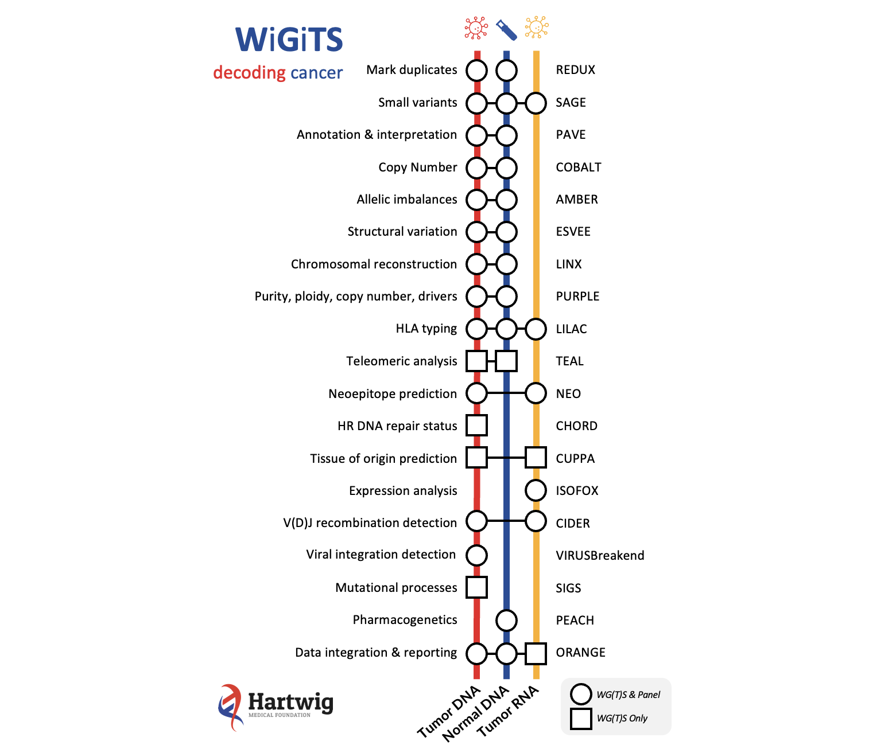
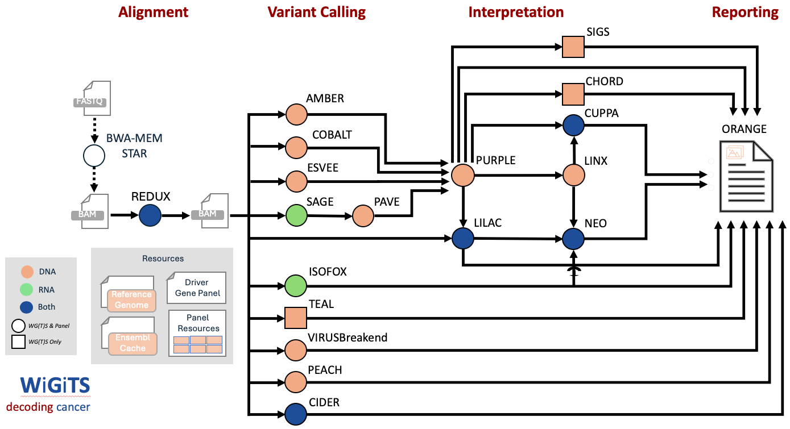

# WiGiTS

WiGiTS is a universal open source suite of genome and transcriptome analysis tools for cancer research and diagnostics



The current release of the WiGiTs pipeline is v2.0. Release notes are [here](./pipeline/docs/v2_0/WiGiTs_v2.0_ReleaseNotes.pdf).

We recommend to run WiGiTS using the NextFlow implementation called [OncoAnalyser](./pipeline/README_ONCOANALYSER.md). It will be available on nfCore April 2025.

A detailed list of the resource files used to run the WiGiTs pipeline is [here](./pipeline/README_RESOURCES.md).
The files themselves are available for download [here](https://console.cloud.google.com/storage/browser/hmf-public/HMFtools-Resources/pipeline/oncoanalyser/).

The pipeline can be run on a targeted panel eg TSO500 - see detailed information [here](./pipeline/README_TARGETED.md).

## Pipeline overview
Here is a schematic showing how the interactions between the core molecular components of the tool suite:



## Latest Pipeline Version

The next planned release of the WiGiTs pipeline is v2.0, expected to be available on nfCore during April.
Release notes are [here](./pipeline/docs/v2_0/WiGiTs_v2.0_ReleaseNotes.pdf):

The table below has links for each tool used in this release.

### DNA Tools

| Component                         | Description                                                            | Current Version                                                                    |
|-----------------------------------|------------------------------------------------------------------------|------------------------------------------------------------------------------------|
| [Amber](./amber/README.md)        | Generate a tumor BAF file for Purple's copy number fit                 | [4.1](https://github.com/hartwigmedical/hmftools/releases/tag/amber-v4.1.1)     |
| [BamTools](./bam-tools/README.md) | BAM metrics and slicing                                                | [1.3](https://github.com/hartwigmedical/hmftools/releases/tag/bam-tools-v1.3) |
| [Chord](https://github.com/UMCUGenetics/CHORD)          | Homologous Recombination Deficiency detection | [2.0](https://github.com/hartwigmedical/hmftools/releases/tag/chord-v2.1.0)     |
| [Cider](./cider/README.md)        | TCR/BCR V(D)J recombination sequence detection                         | [1.0.3](https://github.com/hartwigmedical/hmftools/releases/tag/cider-v1.0.3)      |
| [Cobalt](./cobalt/README.md)      | Determines the read depth ratios for Purple's copy number fit          | [2.0](https://github.com/hartwigmedical/hmftools/releases/tag/cobalt-v2.0)    |
| [Cuppa](./cuppa/README.md)        | Tissue of origin prediction from WGS/WTS                               | [2.3](https://github.com/hartwigmedical/hmftools/releases/tag/cuppa-v2.3.0)        |
| [Esvee](./esvee/README.md)        | SV calling                                                             | [1.0](https://github.com/hartwigmedical/hmftools/releases/tag/esvee-v1.0)     |
| [Lilac](./lilac/README.md)        | HLA typing                                                             | [1.6](https://github.com/hartwigmedical/hmftools/releases/tag/lilac-v1.6)          |
| [Linx](./linx/README.md)          | SV annotation, clustering & chaining, fusion and disruption calling    | [2.0](https://github.com/hartwigmedical/hmftools/releases/tag/linx-v2.0)      |
| [Pave](./pave/README.md)          | Point mutation annotation and gene impact                              | [1.7](https://github.com/hartwigmedical/hmftools/releases/tag/pave-v1.7)      |
| [Purple](./purple/README.md)      | Estimates copy number, purity and ploidy, and identifies driver events | [4.1](https://github.com/hartwigmedical/hmftools/releases/tag/purple-v4.1)    |
| [Redux](./redux/README.md)        | Duplicate marking, consensus reads, UMIs and read unmapping            | [1.1](https://github.com/hartwigmedical/hmftools/releases/tag/redux-v1.1)     |
| [Sage](./sage/README.md)          | Point mutation variant calling and filtering                           | [4.0](https://github.com/hartwigmedical/hmftools/releases/tag/sage-v4.0)      |
| [Teal](./teal/README.md)          | Measures telomere content and estimates telomeric length               | [1.3](https://github.com/hartwigmedical/hmftools/releases/tag/teal-v1.3.2)       |

The following external tools are also used in the pipeline:

| Component                                               | Description                                   | Current Version                                                       |
|---------------------------------------------------------|-----------------------------------------------|-----------------------------------------------------------------------|
| [VirusBreakend](https://github.com/PapenfussLab/gridss) | Viral integration detection                   | [2.13.2](https://github.com/PapenfussLab/gridss/releases/tag/v2.13.2) |

### RNA Tools

| Component                    | Description                                                | Current Version                                                              |
|------------------------------|------------------------------------------------------------|------------------------------------------------------------------------------|
| [Isofox](./isofox/README.md) | WTS Transcript Abundance, Fusions & Novel Splice Junctions | [1.7](https://github.com/hartwigmedical/hmftools/releases/tag/isofox-v1.7.1) |

### Actionability and Clinical Reporting Tools

| Component                                                                          | Description                                                          | Current Version                                                                       |
|------------------------------------------------------------------------------------|----------------------------------------------------------------------|---------------------------------------------------------------------------------------|
| [Protect](https://github.com/hartwigmedical/oncoact/tree/master/protect/README.md) | Matching of molecular results to treatments and clinical trials      | [2.3](https://github.com/hartwigmedical/hmftools/releases/tag/protect-v2.3)           |
| [Rose](https://github.com/hartwigmedical/oncoact/tree/master/rose/README.md)       | Actionability of clinically relevant molecular findings              | [1.3](https://github.com/hartwigmedical/hmftools/releases/tag/rose-v1.3)              |
| [Virus Interpreter](./virus-interpreter/README.md)                                 | Filtering, annotation and interpretation of virus breakend data      | [1.3](https://github.com/hartwigmedical/hmftools/releases/tag/virus-interpreter-v1.3) |
| [Orange](./orange/README.md)                                                       | PDF summary report and JSON file of all WGS output                   | [3.7.1](https://github.com/hartwigmedical/hmftools/releases/tag/orange-v3.7.1-rc.1)        |
| Patient-reporter                                                                   | PDF summary report and JSON file of all clinical relevant WGS output | 7.25.1                                                                                |

### Building locally

Developers can build all the tools locally via the `hmftools-build.py` script, providing a semver-compliant release tag and arguments, i.e:

```sh
$ git clone https://github.com/hartwigmedical/hmftools/
$ python3 -mvenv ./venv && source ./venv/bin/activate
(.venv) $ pip install requests jwt
(.venv) $ ./hmftools-build.py lilac-v1.0.0 no_github_key no_github_client_id no_github_installation_id --no-deploy --no-docker
(...)
2025-04-15 05:34:06 [ INFO] - Skipping Github release creation as 1.0.0 is an internal-only version
2025-04-15 05:34:06 [ INFO] - Complete build and release
```
