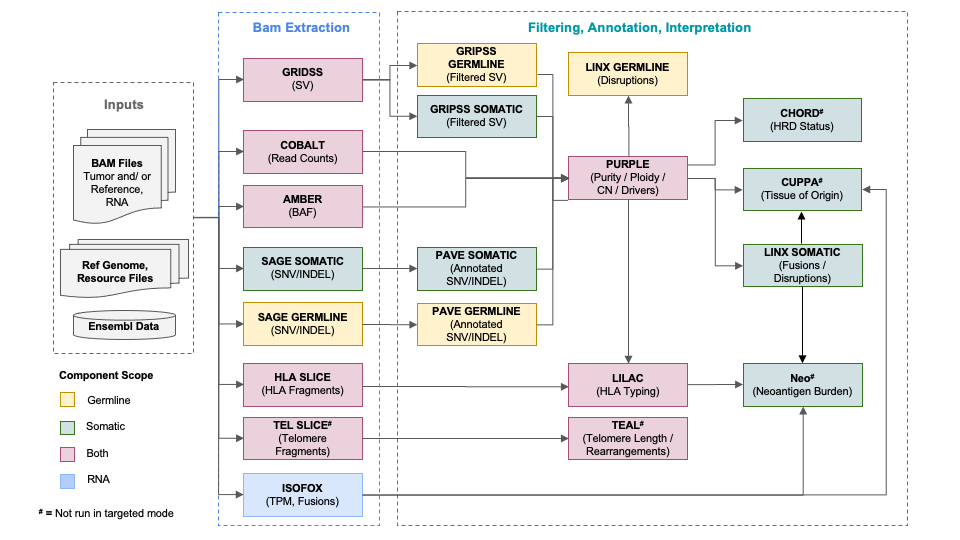

# WiGiTS

WiGiTS is a universal open source suite of genome and transcriptome analysis tools for cancer research and diagnostics

We recommend to run WiGiTS using the NextFlow implmentation called [OncoAnalyser](https://nf-co.re/oncoanalyser/dev).

Alternatively, an example WGS pipeline which runs each of these components in turn is detailed [here](./pipeline/README_WGS.md).

An example targeted-panel pipeline, including support for the HMF and TSO-500 panels, is detailed [here](./pipeline/README_TARGETED.md).

## Pipeline overview
Here is a schematic showing how the interactions between the core molecular DNA components of the tool suite:

## Latest Pipeline Version

The latest HMF pipeline is v5.34. Release notes
are [here](https://github.com/hartwigmedical/hmftools/blob/master/pipeline/docs/PipelineReleaseNotes.v5.34.pdf).

The table below has links for the each tool used in this release.

### DNA Tools

| Component                         | Description                                                            | Current Version                                                                   |
|-----------------------------------|------------------------------------------------------------------------|-----------------------------------------------------------------------------------|
| [Amber](./amber/README.md)        | Generate a tumor BAF file for Purple's copy number fit                 | [4.0.1](https://github.com/hartwigmedical/hmftools/releases/tag/amber-v4.0.1)     |
| [BamTools](./bam-tools/README.md) | BAM metrics and slicing                                                | [1.2](https://github.com/hartwigmedical/hmftools/releases/tag/bam-tools-v1.2)     |
| [Cider](./cider/README.md)        | TCR/BCR V(D)J recombination sequence detection                         | [1.0.3](https://github.com/hartwigmedical/hmftools/releases/tag/cider-v1.0.3)     |
| [Cobalt](./cobalt/README.md)      | Determines the read depth ratios for Purple's copy number fit          | [1.16](https://github.com/hartwigmedical/hmftools/releases/tag/cobalt-v1.16)      |
| [Cuppa](./cuppa/README.md)        | Tissue of origin prediction from WGS/WTS                               | [2.1.1](https://github.com/hartwigmedical/hmftools/releases/tag/cuppa-v2.1.1)     |
| [Gripss](./gripss/README.md)      | SV filtering                                                           | [2.4](https://github.com/hartwigmedical/hmftools/releases/tag/gripss-v2.4)        |
| [Lilac](./lilac/README.md)        | HLA typing                                                             | [1.6](https://github.com/hartwigmedical/hmftools/releases/tag/lilac-v1.6)         |
| [Linx](./linx/README.md)          | SV annotation, clustering & chaining, fusion and disruption calling    | [1.25](https://github.com/hartwigmedical/hmftools/releases/tag/linx-v1.25)        |
| [Pave](./pave/README.md)          | Point mutation annotation and gene impact                              | [1.6](https://github.com/hartwigmedical/hmftools/releases/tag/pave-v1.6)          |
| [Purple](./purple/README.md)      | Estimates copy number, purity and ploidy, and identifies driver events | [4.0](https://github.com/hartwigmedical/hmftools/releases/tag/purple-v4.0)        |
| [Redux](./redux/README.md)        | Duplicate marking, consensus reads, UMIs and read unmapping            | [1.1.7](https://github.com/hartwigmedical/hmftools/releases/tag/mark-dups-v1.1.7) |
| [Sage](./sage/README.md)          | Point mutation variant calling and filtering                           | [3.4](https://github.com/hartwigmedical/hmftools/releases/tag/sage-v3.4)          |
| [Teal](./teal/README.md)          | Measures telomere content and estimates telomeric length               | [1.3.0](https://github.com/hartwigmedical/hmftools/releases/tag/teal-v1.3.0)      |
| [SvPrep](./esvee/README.md)       | Pre-GRIDSS BAM filtering                                               | [1.2.3](https://github.com/hartwigmedical/hmftools/releases/tag/sv-prep-v1.2.3)   |

The following external tools are also used in the pipeline:

| Component                                        | Description                                   | Current Version                                                       |
|--------------------------------------------------|-----------------------------------------------|-----------------------------------------------------------------------|
| [GRIDSS](https://github.com/PapenfussLab/gridss) | Structural variant calling                    | [2.13.2](https://github.com/PapenfussLab/gridss/releases/tag/v2.13.2) |
| [Chord](https://github.com/UMCUGenetics/CHORD)   | Homologous Recombination Deficiency detection | [2.0](https://github.com/UMCUGenetics/CHORD/releases/tag/2.00)        |

### RNA Tools

| Component                    | Description                                                | Current Version                                                              |
|------------------------------|------------------------------------------------------------|------------------------------------------------------------------------------|
| [Isofox](./isofox/README.md) | WTS Transcript Abundance, Fusions & Novel Splice Junctions | [1.7](https://github.com/hartwigmedical/hmftools/releases/tag/isofox-v1.7.1) |

### Actionability and Clinical Reporting Tools

| Component                                                                          | Description                                                          | Current Version                                                                       |
|------------------------------------------------------------------------------------|----------------------------------------------------------------------|---------------------------------------------------------------------------------------|
| [Protect](https://github.com/hartwigmedical/oncoact/tree/master/protect/README.md) | Matching of molecular results to treatments and clinical trials      | [2.3](https://github.com/hartwigmedical/hmftools/releases/tag/protect-v2.3)           |
| [Rose](https://github.com/hartwigmedical/oncoact/tree/master/rose/README.md)       | Actionability of clinically relevant molecular findings              | [1.3](https://github.com/hartwigmedical/hmftools/releases/tag/rose-v1.3)              |
| [Virus Interpreter](./virus-interpreter/README.md)                                 | Filtering, annotation and interpretation of virus breakend data      | [1.3](https://github.com/hartwigmedical/hmftools/releases/tag/virus-interpreter-v1.3) |
| [Orange](./orange/README.md)                                                       | PDF summary report and JSON file of all WGS output                   | [3.5.0](https://github.com/hartwigmedical/hmftools/releases/tag/orange-v3.5.0)        |
| Patient-reporter                                                                   | PDF summary report and JSON file of all clinical relevant WGS output | 7.25.1                                                                                |

### Resource files

Resource files for each component (GRCh37 and GRCh38) are available to download
from [HMFTools-Resources > DNA-Resources](https://console.cloud.google.com/storage/browser/hmf-public/HMFtools-Resources/dna_pipeline/).

