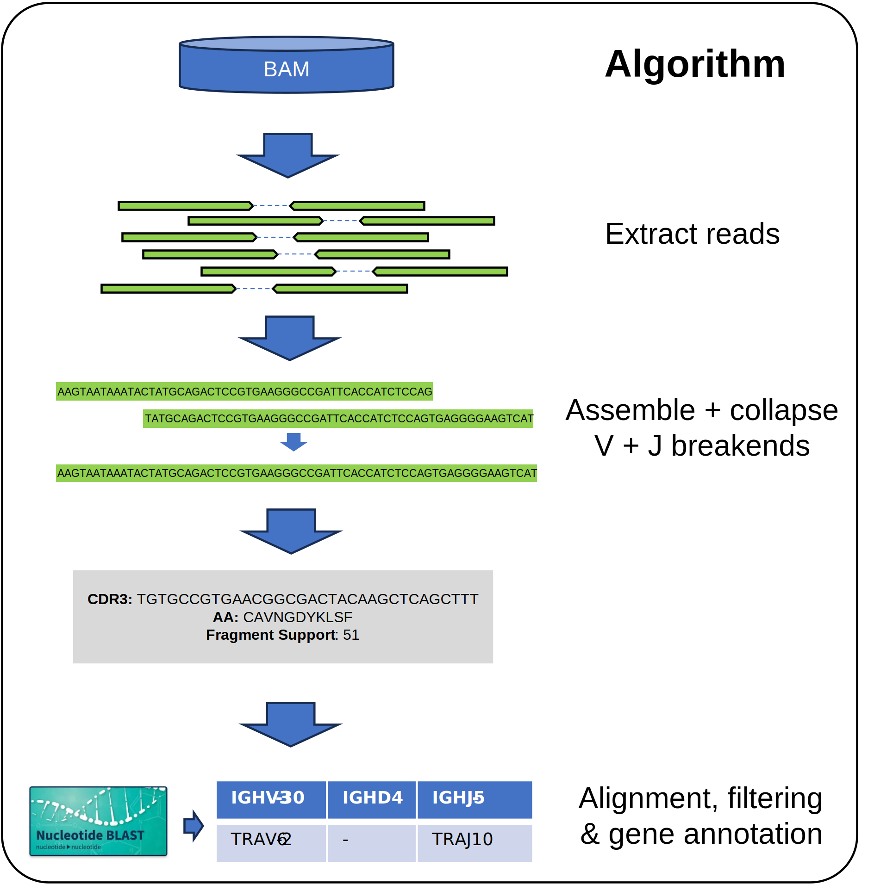

# CIDER
Using WTS/WGS or targeted data, we determine a comprehensive list of CDR3 sequences for each of the IG and TCR loci including an abundance estimate.  Notably this includes incomplete rearrangements and IGK-KDE deletions.

The intended purposes of this are the following: 
- For B cell & T cell tumors, clonal CDR3 sequence can be used for MRD detection.  
- For other tumors, the abundance estimate can be used to estimate immune infiltration and may give insight into diversity, and/or recurrent and cancer specific T-cell clones. 
- With very deep targeted sequencing CIDER could determine the full IG/TCR receptor repertoire (eg. TCR beta diversity is estimated at 1-3M distinct sequences per individual). Diversity and evenness are also proposed as important characteristics 

## Usage

```
java -Xmx16G -cp cider.jar com.hartwig.hmftools.cider.CiderApplication \
   -sample COLO829T \
   -bam COLO829T.bam \
   -output_dir /path/to/COLO829/cider \
   -ref_genome_version 37 \
   -write_cider_bam \
   -blast /tools/ncbi-blast/ncbi-blast-2.13.0+ \
   -blast_db /data/blastdb \
   -threads 8
```
### Mandatory Arguments

| Argument           | Description                                                                                |
|--------------------|--------------------------------------------------------------------------------------------|
| sample             | Name of the sample                                                                         |
| bam                | Path to indexed BAM file                                                                   |
| output_dir         | Path to the output directory. This directory will be created if it does not already exist. |
| ref_genome_version | One of "37" or "38".                                                                       |

### Optional Arguments

| Argument                   | Default | Description                                                                                             |
|----------------------------|---------|---------------------------------------------------------------------------------------------------------|
| write_cider_bam            | Off     | If specified, write a small bam file of all the extracted reads.                                        |
| threads                    | 1       | Number of threads to use, defaults to 1                                                                 |
| max_fragment_length        | 1000    | Approximate length of the longest fragment. Defaults to 1000                                            |
| threads                    | 1       | Number of threads to use, defaults to 1                                                                 |
| min_base_quality           | 25      | Minimum base quality for a base to be considered a "support" base, defaults to 25                       |
| report_match_ref_seq       | Off     | When specified, reports VDJ sequences that match reference genome                                       |
| num_trim_bases             | 0       | Number of bases to trim on each side of reads. Defaults to 0                                            |
| max_low_qual_base_fraction | 0.1     | Maximum fraction of bases in a read that can be low quality. Reads that exceed this limit are discarded |
| max_reads_per_gene         | 600,000 | Maximum number of reads per gene. If number of reads exceed this limit, they are downsampled.           |
| blast                      |         | Path to the ncbi-blast installation                                                                     |
| blast_db                   |         | Path to the ncbi-blast database                                                                         |
| primer_csv                 |         | Path to csv file containing primers                                                                     |
| primer_mismatch_max        | 0       | Maximum number of mismatch bases for matching primer sequence                                           |

## Algorithm



The CIDEr algorithm consist of the following steps:
 1. Extract reads.
 2. Assembly and collapse V + J breakends.
 3. CDR3 identification and support.
 4. Alignment, filtering and gene annotation

### Extract reads from BAM 

From the bam retrieve all reads and their mates which overlap the anchor coordinates. We also
obtain reads that overlap the first base of each gene in the constant region with a J anchor blosum62 match in soft clipping region (10 AA), 
along with any unmapped reads with read pairs mapped within 1kb upstream of V gene  or 1KB downstream of J gene or which map to a constant 
region and have a blossum62 match to a J or V anchor (10AA) of the same gene locus.

### Assembly and collapse V + J breakends

Separately for V and J aligned / anchored reads, determine the 30 base anchor sequence + any candidate CDR3 sequence starting from the bases
immediately following the conserved V-CYS r J-PHE/J-TRP location. Determine a minimal set of consensus sequences separately for each of the
V and J side by collapsing sequences which match (trimmed for bases with qual < 25) into a single consensus sequence. Note that TRA and TRD
sequences may also match together. PolyG tails of 2 or more consecutive Gs (and the prior 5 bases) are stripped from the sequence before making
the consensus sequence. Additionally num_trim_bases is set to > 0 then the specified number of bases is always trimmed from every read prior
to creating the candidate sequences. Afterwards, reads with more than 10% (configurable) low quality bases after trimming are discarded.

If a sequence can be collapsed to multiple longer sequences, then greedily allocate it to the most supported sequence. The total base qual
supporting each base is retained for later matching). 

### CDR3 identification and support  

For merged sequences, find a V and J anchor simply read out the CDR3 sequence between the V-CYS and J-PHE/J-TRP anchors.  

For each V anchored only consensus sequence we search for candidate anchor sequences. To do this we compare each complete 10 amino acid kmer downstream of the V-CYS sequence to the set of known 10 amino acid J anchor sequences by summing the log likelihoods from the BLOSUM62 substitution matrix. Truncated partial anchor sequences of 1 or more amino acids are also checked for the final 1-9 amino acids of the consensus sequence. A similarity score is calculated for each anchor sequence as follows: 

$$ similarity Score = 3 \times amino Acid length -6 - \sum_{aminoAcid}{BLOSUM62(refAA_{i}, refAA_{i})} + \sum_{aminoAcid}{BLOSUM62(refAA_{i}, queryAA_{i})} $$

If the max similarity score to any anchor sequence is greater than 0 we deem it to be a CDR3 sequence. If 2 candidate anchors share the same score, then rank first by inframe and then by whichever CDR3 sequence is closest to 13 amino acids in length. For each J anchored only read/fragment we similarly search for candidate V-CYS anchor sequences in the consensus sequence 

### Collapse consensus sequences 

A sequence is collapsed into another sequence if it is identical at all bases with high quality support across both anchors and candidate CDR3 sequence. Sequences may also be collapsed where they have a single base difference with up to 1 read of high quality support.  

Each V only anchored read is also checked for partial overlap with each J only anchored read. If they exactly match with more than 20 nucleotides of exact match (allowing for low quality bases) then they are also collapsed into a single sequence. 

### Alignment, filtering and gene annotation 
Each collapsed sequence is either marked as PASS or one or more of the following filters 
- **PARTIAL** - Only has V or J
- **NO_VDJ_ALIGNMENT** - Sequence is not aligned to any V/D/J gene
- **NO_V_ANCHOR** - No candidate V anchor found. Only applied if BLASTN is not used. 
- **NO_J_ANCHOR** - No candidate J anchor found. Only applied if BLASTN is not used.
- **POOR_V_ANCHOR** - V anchor is found by BLOSUM match with negative similarity score. Only applied if BLASTN is not used.
- **POOR_J_ANCHOR** - J anchor is found by BLOSUM match with negative similarity score. Only applied if BLASTN is not used.
- **DUPLICATE** - CDR3 nt sequence is identical to another sequence with more support (different anchors) 
- **CDR3_DELETED** - A V and J anchor are found, but the CDR3 portion of the sequence (including conserved C,W,F) is fully deleted
- **MAX_LENGTH** - CDR3 nt sequence must be less than 40 AA in length 
- **MIN_LENGTH** - CDR3 nt sequence must be at least 5 AA in length (including anchor C & W/F)
- **MATCHES_REF** - (NonSplitRead+vNonSplitReads >=2 AND either vAlignedReads or jAlignedReads=0) OR BLASTN matches to reference contig.
- **NO_HIGH_QUAL_SUPPORT** - Some base in the CDR3 is not supported by any high base quality base in any read. 

Note that sequences with "no anchor" may represent partial rearrangements.

CIDER hard filters variants with filter='MATCHES_REF' or if filter contains both MIN_LENGTH and either NO_V_ANCHOR or NO_J_ANCHOR.
 
The full set of fields output are:

| Field                                 | Explanation                                                                                                                                         | 
|---------------------------------------|-----------------------------------------------------------------------------------------------------------------------------------------------------|
| cdr3Seq                               | CDR3 nucleotide sequence. If either the V or J anchor is missing only the first 63 bases of sequence are shown                                      | 
| cdr3AA                                | CDR3 aa sequence. If either the V or J anchor is missing only the first 63 bases of sequence are shown                                              | 
| locus                                 | Ig/TCR locus of the sequence                                                                                                                        |
| Filter                                | PASS if viable CDR3 sequence or one or more filter reasons  (see above)                                                                             |
| blastnStatus                          | SKIPPED_BLASTN, V_D_J, V_J, V_D, D_J, V_ONLY, D_ONLY, J_ONLY, NO_REARRANGEMENT, NO_VDJ_ALIGNMENT                                                    |
| minHighQualBaseReads                  | number of reads in the least supported base in the CDR3 region or for the first 63 bases of the candidate CDR3 sequence if only one anchor is found |
| assignedReads                         | Total reads assigned to candidate sequence.                                                                                                         | 
| vAlignedReads                         | # of reads initially aligned to V gene                                                                                                              | 
| jAlignedReads                         | # of reads initially aligned to J gene                                                                                                              | 
| inFrame                               | CDR3 sequence is inframe {T/F}                                                                                                                      | 
| containsStop                          | CDR3 contains stop codon {T/F}                                                                                                                      | 
| vType                                 | {IGKV;IGLV;IGHV;TRAV;TRBV;TRDV;TRGV}                                                                                                                | 
| vAnchorStart                          | Position of V anchor start in nt sequence                                                                                                           |
| vAnchorEnd                            | Position of V anchor end in nt sequence                                                                                                             | 
| vAnchorSeq                            | V anchor sequence in nt                                                                                                                             | 
| vAnchorTemplateSeq                    | Best scoring V template anchor in nt (or null if read aligned to V anchor)                                                                          | 
| vAnchorAA                             | V anchor sequence in AA                                                                                                                             | 
| vAnchorTemplateAA                     | Best scoring V template Anchor in AA (or null if read aligned to V anchor)                                                                          | 
| vSimilarityScore                      | Blosum similarity score for template anchor (or null if read aligned to V anchor)                                                                   | 
| vNonSplitReads                        | Count of reads supporting sequence with at least 30 aligned bases either side of last base of conserved C                                           | 
| jType                                 | {IGHJ;IGKJ;IGK-KDE,IGLJ;TRAJ;TRBJ;TRDJ;TRGJ}                                                                                                        | 
| jAnchorStart                          | Position of J anchor start in nt sequence                                                                                                           |
| jAnchorEnd                            | Position of J anchor end in nt sequence                                                                                                             | 
| jAnchorSeq                            | J anchor sequence in nt                                                                                                                             | 
| jAnchorTemplateSeq                    | Best scoring J template anchor in nt (or null if read aligned to J anchor)                                                                          | 
| jAnchorAA                             | J anchor sequence in AA                                                                                                                             | 
| jAnchorTemplateAA                     | Best scoring J template Anchor in AA (or null if read aligned to J anchor)                                                                          | 
| jSimilarityScore                      | Blosum62 similarity score for template anchor (or null if read aligned to J anchor)                                                                 | 
| jNonSplitReads                        | Count of reads supporting sequence with at least 30 aligned bases either side of first base of conserved W/F                                        | 
| vGene, dGene, jGene                   | The V, D or J gene alleles that this sequence is aligned to                                                                                         | 
| vPIdent, dPIdent, jPIdent             | The align sequence % identity with the V, D or J gene                                                                                               | 
| vAlignStart, dAlignStart, jAlignStart | Start of the alignment with the V, D or J gene                                                                                                      | 
| vAlignEnd, dAlignEnd, jAlignEnd       | End of the alignment with the V, D or J gene                                                                                                        |
| fullSeq                               | Full consensus sequence in nucleotides                                                                                                              | 
| support                               | Counts of high quality base support at each nucleotide (radix-36 ASCII encoded)                                                                     |

blastnStatus are
- **SKIPPED_BLASTN** - cider did not query this sequence through BLASTN, it could be blastn is not configured to run, or this sequence matches reference.
- **V_D_J, V_J** - fully rearranged sequence
- **V_D, D_J, V_ONLY, D_ONLY, J_ONLY** - partially rearranged sequence
- **NO_REARRANGEMENT** - no rearrangement. This sequence matches a sequence in the reference genome.
- **NO_VDJ_ALIGNMENT** - blastn cannot align this sequence to any V/D/J gene.

### Locus summary output
In addition, CIDER writes a locus summary output file `<sample_id>.cider.locus_stats.tsv` with the following columns

| Field         | Explanation                                                                                                       | 
|---------------|-------------------------------------------------------------------------------------------------------------------|
| locus         | IG/TCR locus                                                                                                      | 
| readsUsed     | Number of reads used to build the VDJ sequences. Differs from the readsTotal by quality filtering and downsample. | 
| readsTotal    | Number of reads found mapped to the locus.                                                                        | 
| downSampled   | `true` if downSampled.                                                                                            |
| sequences     | Number of sequences found.                                                                                        | 
| passSequences | Number of PASS sequences found.                                                                                   | 

### BLASTN annotation logic

When the command line arguments `-blast` and `-blast_db` are supplied, CIDER uses [BLAST+](https://www.ncbi.nlm.nih.gov/books/NBK62051/def-item/blast/)
to query each sequence found against the human genome (GCF_000001405.39_top_level). It uses this information to assign V, D, J alleles and also
weed out false positives. This requires BLASTN to be set up. See [Setting up BLASTN](#setting-up-blastn)

Following briefly describe the annotation logic:
1. CIDER would run blastn locally and query the sequences against the human genome database. We use match/mismatch/gapopen/gapextend scores of
   1/-4/-5/-2 and word size of 9.
2. For each VDJ sequence, filter alignments to find the V, D, J gene matches. The rules to choose the alignment is follows:
   + If there is one alignment with >= 95% identity that can encompass the whole sequence we will select it
     as it indicates that this sequence matches the reference genome.
   + Then for each aligned section we choose the one that is aligned V, D, J, IGK-Intron or IGK-Del
     genes. If there are more than one, we choose the highest scoring alignment. V and J alignments must have at least 90%
     sequence identity.
3. If there is a V gene, the D, and J gene loci must match the V locus, otherwise the D and J alignments are filtered out. One
    exception is we allow TRA and TRD to match each other.
4. If there is a V or J gene, the D gene locus must match either the V or the J locus. Otherwise the D alignment is removed. We also
  allow TRA and TRD to match one another.
5. Finally the V, D, J gene alignment information are combined and added as annotation into the output file.

## Setting up BLASTN
To set up BLASTN, do the following:
1. Follow the instruction in https://www.ncbi.nlm.nih.gov/books/NBK1762/ to install BLAST+
2. Set up the `human_genome` blast DB:
    ```
    $ cd $BLASTDB
    $ perl $BLAST_INSTALL/bin/update_blastdb.pl --passive --decompress human_genome
    ```
   Make sure the `BLASTDB` environment variable is defined.

## Ig/TCR gene reference data curation
To create reference data, following steps:
1. queried from IMGT (https://www.imgt.org/genedb/) to get all sequences for species Homo Sapiens and (separately) for Molecular Component: IG 
and TR. Then we select all query results choosing “F+ORF+in-frame P nucleotide sequences with IMGT gaps”.
2. Use both blast and ensembl to determine the V38 genomic location of each gene.
3. For V and J genes, find their anchor regions.
4. The V38 genomic positions are converted to V37.

## Idenfitification of clonal rearrangements in WGS samples

Clonal IG/TCR rearrangements may be useful biomarkers to monitor tumor presence and progression via liquid biopsy.   For WGS tumor saples, the number of fragments in a clonal sequence will depend on the depth of coverage as well as the purity and ploidy of a sample.    For a 100x tumor sample we recommend using a threshold of approximately 8-10 high quality read support to identify clonal sequences.  For lower depth samples this number may need to be scaled downwards somewhat.  In lower purity & higher ploidy tumor samples, clonal sequences may have less than 10 reads support, but lowering the threshold may risk identifying non clonal sequences as clonal.   

## Known issues and future improvements

### Bam extraction:
- **Reads mapped to other locations** - We only use reads where the alignment overlaps a known V/D/J/C gene coordinate which means the program is fast. We could also look for more reads with sequences that precisely or partially match known anchors but which have not been mapped to the expected locations.    
- **Mate overlap** - Where fragment lengths are short the reads may overlap (particularly relevant for RNA). For each extracted read pair test for overlap by searching for an exact match for the innermost 10 bases of each read (allowing for differences if base quality < 25). If a match is found then check that the full overlapped region is identical (again allowing for base quality trimming). Create a consensus sequence for the 2 reads, using the highest base quality where the sequences differ.  
- **Fragments with both reads unmapped reads** - these are not queried and extracted.
- **Extrapolation of anchor location inside soft clipped part of read** - needs more thought.

### CDR3 calling:
- **Full receptor sequence** - We could assemble outwards from the CDR3 to predict the full receptor sequence.  We should also search for rearrangements that delete both anchor sequeneces 
- **Error tolerance in collapsing** - We collapse sequences with up to 1 high quality sequencing difference across the anchors + CDR3 sequence. We still see a small number of artefacts from very highly supported sequences which could be cleaned up further.  
- **Multiple CDR3s in consensus sequence** - A single consensus sequence may have 2 anchor locations that lead to plausible high scoring CDR3 sequences. Currently we choose the highest scoring, but both could be functional.
- **Longer CDR3 sequences artefacts with indels sometimes reported where indel sequencing errors occur in anchor** - we observe this when we have >>100 reads support for a CDR3 sequence, we sometimes get a handful of reads with a longer CDR3 sequence containing the main sequence, but cannot find the anchror due to indel in the base sequence.

### Other:
- Downsampling may cause bias between locus.
- Support AIRR format output.
- BLASTN annotation would ideally point to IMGT instead of the 38 reference genome as there is a more complete set of alleles / alts
- BLASTN annotation for D gene requires more lenient BLAST parameters.

## Performance Characteristics
These are indicative performance characteristics on a 12 core machines running with 4 threads.
Running with `-xmx32G`.

| Max reads per gene | Elapsed time (minutes) |
|--------------------|------------------------|
| 200k               | 81                     |
| 400k               | 192                    |
| 600k               | 292                    |
| 800k               | 518                    |

"Max reads per gene" is the maximum number of reads we found in each of the IG/TCR gene segment, i.e. IGHV, TRBJ etc. 

# Version History and Download Links
- [1.0.3](https://github.com/hartwigmedical/hmftools/releases/tag/cider-v1.0.3)
  - Handle unpaired reads
- [1.0.2](https://github.com/hartwigmedical/hmftools/releases/tag/cider-v1.0.2)
  - Fix bug where blastn failure is ignored.
  - Fix bug where a blastn match to mitochondrion DNA causes an exception
- [1.0.1](https://github.com/hartwigmedical/hmftools/releases/tag/cider-v1.0.1)
  - Fix errors in the genomic locations of anchors.
- [1.0.0](https://github.com/hartwigmedical/hmftools/releases/tag/cider-v1.0.0)
  - Improve the curation and annotation of the Ig/TCR genes. Fix the classification of IGHD gene.
  - Fix bug in the locus stats
- [0.10.1](https://github.com/hartwigmedical/hmftools/releases/tag/cider-v0.10.1)
  - Filter out V or J only sequences that are too short. 
- [0.10.0](https://github.com/hartwigmedical/hmftools/releases/tag/cider-v0.10.0)
  - Incorporate BLASTN annotation into CIDER.
  - Change output columns to include BLASTN annotations.
  - Add `cider.blastn_match.tsv.gz` output
  - Colourise layout file.
- [0.9.0](https://github.com/hartwigmedical/hmftools/releases/tag/cider-v0.9.0)
  - Fix an issue in 0.8.0 where layout can get into infinite loop.
  - Add cider.locus_stats.tsv output
- [0.8.0](https://github.com/hartwigmedical/hmftools/releases/tag/cider-v0.8.0)
  - Add `NO_HIGH_QUAL_SUPPORT` soft filter.
  - New command line argument: `max_low_qual_base_fraction`.
  - New command line argument: `max_reads_per_gene`.
  - By default, any read with more than 10% bases with low base quality are discarded.
  - By default, downsample reads if number of reads exceed 600k for a gene.
  - Change poly G trimming threshold from 6 or more consecutive Gs to 2.
  - Remove reads where > 10% of the bases are low quality.
  - Use multiple threads when building layouts.
  - Implementing progressive sealing of nodes in the tree layout.
  - Improve performance of VJ layout joining. First use common read IDs, then use 8 base word hash to find candidates. The word hashes were generated from the base after V anchor, and up to the base before J anchor.
- [0.7.0](https://github.com/hartwigmedical/hmftools/releases/tag/cider-v0.7.0)
  - Fix an issue where some reads are not collapsed into larger read layouts.
  - Fix an issue where reads can be added to wrong positions in layout.
- [0.6](https://github.com/hartwigmedical/hmftools/releases/tag/cider-v0.6)
  - Fix issue where some sequences that matches reference genome are not marked as MATCHES_REF.
  - Fix bug in the cider_blastn.py script, do not allow D segment to match with genes not within the same chromosome as V or J.
  - Fix the vAlignStart / vAlignEnd / dAlignStart / dAlignEnd / jAlignStart / jAlignEnd columns.
- [0.5](https://github.com/hartwigmedical/hmftools/releases/tag/cider-v0.5)
  - By default do not report VDJ sequences that match reference genome. 
  - Add command line argument `report_match_ref_seq`.
- [0.4](https://github.com/hartwigmedical/hmftools/releases/tag/cider-v0.4)
  - Use a layout tree to construct layouts. This ensures that reads are assigned correctly. 
  - When constructing VDJ by overlapping V aligned and J aligned layouts, only the high confidence sequence have to match. 
  - Fixed crashes in the building of VDJ sequences.
  - Changed vdj_seq.tsv output file extension to vdj.tsv.gz
- [0.3](https://github.com/hartwigmedical/hmftools/releases/tag/cider-v0.3)
  - First public release 
