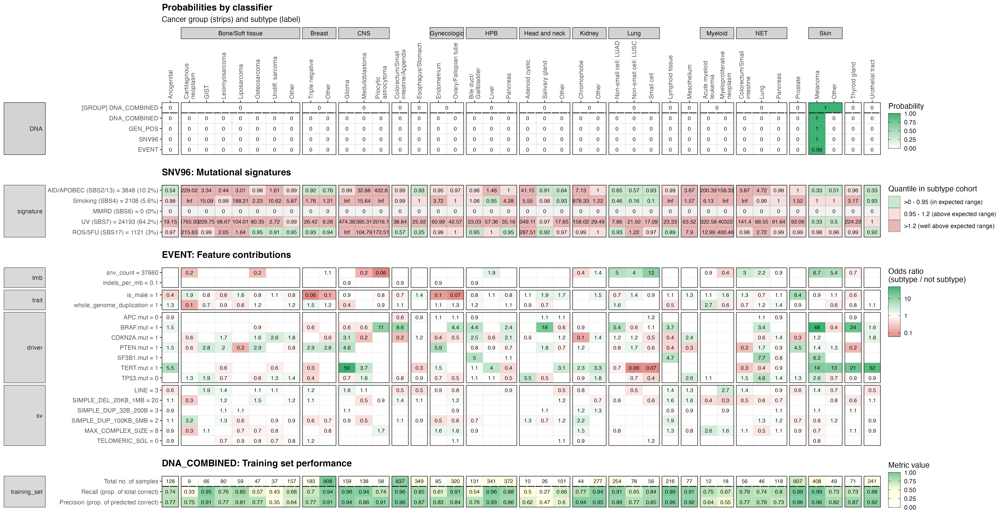
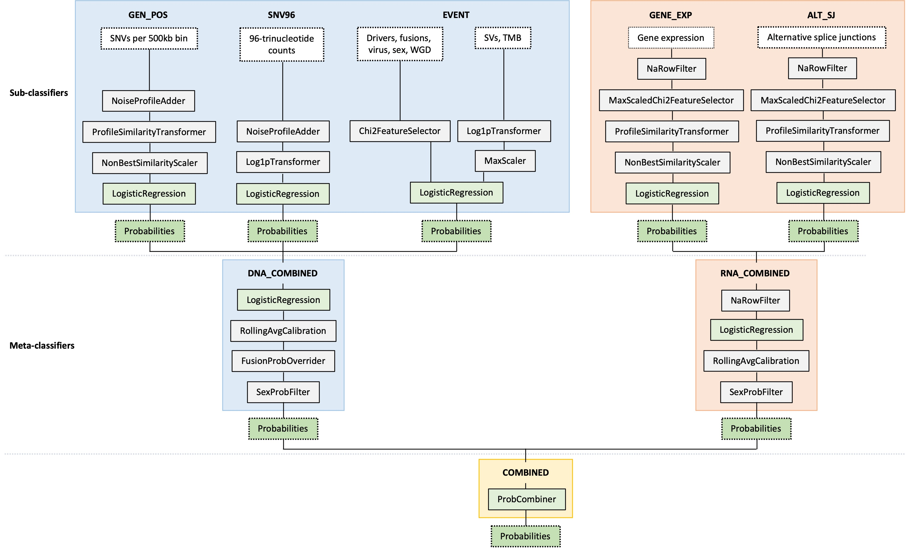
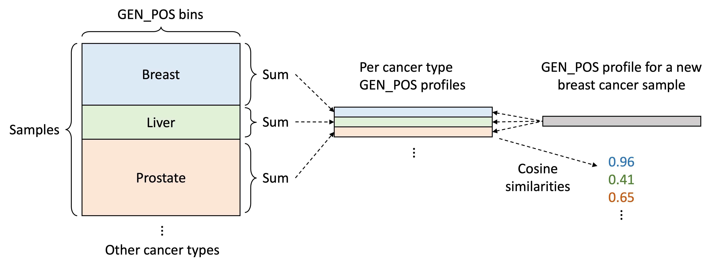
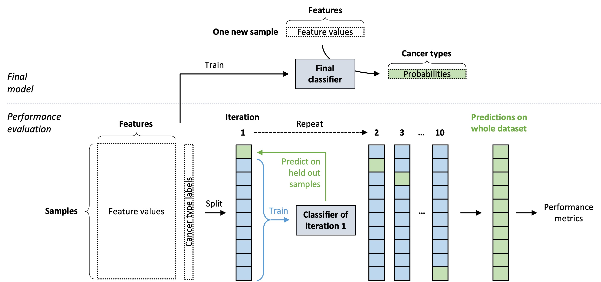

# CUPPA: Cancer of Unknown Primary Prediction Algorithm

# Introduction

CUPPA is a tissue of origin classifier that uses features derived from whole genome sequencing (WGS; DNA) and/or whole 
transcriptome sequencing data (WTS; RNA). The Python classifier component of CUPPA is built off the 
[scikit-learn](https://scikit-learn.org/) library and is based on multiple logistic regressions chained together. Please 
see the section [Classifier structure](#classifier-structure) for more information.

CUPPA is intended to provide:
1) Molecular tumor type prediction to verify histopathological classification
2) Support for specific tumor type classification in case of inconclusive histopathological outcome (differential diagnosis)
3) Predictions of primary tumor location for Cancer of Unknown Primary (CUP)

# Contents
<!-- TOC -->
* [Usage](#usage)
    * [Feature extraction (Java component)](#feature-extraction-java-component)
    * [Classifier (Python component)](#classifier-python-component)
* [Classifier output](#classifier-output)
* [Features](#features)
    * [GEN_POS](#gen_pos)
    * [SNV96](#snv_96)
    * [EVENT](#event)
    * [GENE_EXP](#gene_exp)
    * [ALT_SJ](#alt_sj)
* [Classifier structure](#classifier-structure)
    * [CuppaClassifier](#cuppaclassifier)
    * [LogisticRegression](#logisticregression)
    * [Components](#components)
      * [ProfileSimilarityTransformer](#profilesimilaritytransformer)
      * [NoiseProfileAdder](#noiseprofileadder)
      * [NonBestSimilarityScaler](#nonbestsimilarityscaler)
      * [Log1pTransformer](#log1ptransformer)
      * [MaxScaler](#maxscaler)
      * [Chi2FeatureSelector (drivers, fusions, virus, sex, whole genome duplication)](#chi2featureselector)
      * [NaRowFilter](#narowfilter)
      * [ProbCombiner](#probcombiner)
    * [Adjustment of probabilities](#adjustment-of-probabilities)
      * [RollingAvgCalibration](#rollingavgcalibration)
      * [FusionProbOverrider](#fusionproboverrider)
      * [SexProbFilter](#sexprobfilter)
* [Training set](#training-set)
<!-- TOC -->

# Usage
The latest version of CUPPA can be downloaded from the HMFTools [releases page](https://github.com/hartwigmedical/hmftools/releases/).

## Feature extraction (Java component)
The `CuppaDataPrep` java class can be used to extract the features required for CUPPA. `CuppaDataPrep` can be run for a single sample or 
multiple samples.

### Single sample example
The below command will extract the DNA and RNA features for one sample:
```shell
java -cp cuppa.jar com.hartwig.hmftools.cup.prep.CuppaDataPrep \
  -sample COLO829v003T \
  -categories ALL \
  -ref_genome_version V37 \
  -sample_data_dir /dir/with/all/input/files/ \
  -output_dir path/to/output/dir/ \
  -ref_alt_sj_sites /path/to/alt_sj.selected_loci.tsv.gz
```

This will produce a TSV file with the following format:
```
Source  Category       Key  Value
   DNA     snv96   C>A_ACA    131
   DNA   gen_pos  1_500000      2
   ...       ...       ...    ...
```

### Multi sample example
In the single sample example, we have all input files in the path provided to `-sample_data_dir`. However, for multiple samples, the input
files are likely located in separate dirs. 

We can instead provide input paths to `-purple_dir`, `-linx_dir`, `-virus_dir`, and `-isofox_dir` 
using with wildcards (`*`) which are converted to sample ids as specified in the `-sample_id_file`. **NOTE: Paths containing wildcards must 
be surrounded by double quotes (`"`)!**

The below command will extract the DNA and RNA features for multiple samples:

```shell
java -cp cuppa.jar com.hartwig.hmftools.cup.prep.CuppaDataPrep \
  -sample_id_file /path/to/sample_ids.tsv \
  -categories ALL \
  -ref_genome_version V37 \
  -purple_dir "/data/datasets/*/purple/" \
  -linx_dir "/data/datasets/*/linx/" \
  -virus_dir "/data/datasets/*/virus_interpreter/" \
  -isofox_dir "/data/rna/*/" \
  -output_dir /path/to/output/dir/ \
  -ref_alt_sj_sites /path/to/alt_sj.selected_loci.tsv.gz \
  -write_by_category \
  -threads 8
```

Because `-write_by_category` was specified, this will produce multi TSV files:
* `cuppa_data.cohort.snv.tsv.gz`
* `cuppa_data.cohort.sv.tsv.gz`
* `cuppa_data.cohort.driver.tsv.gz`
* `cuppa_data.cohort.sample_trait.tsv.gz`
* `cuppa_data.cohort.alt_sj.tsv.gz`
* `cuppa_data.cohort.gene_exp.tsv.gz`

Using `-write_by_category` is handy to prevent the output files from becoming too big (i.e. when running `CuppaDataPrep` on thousands of 
samples). Alternatively, if `-write_by_category` is not specified, one output file is produced:
* `cuppa_data.cohort.tsv.gz`

These 'cohort' TSV files have the following format:
```
Source  Category       Key  SAMPLE_1  SAMPLE_2
   DNA     snv96   C>A_ACA       131         5
   DNA   gen_pos  1_500000         2         2
   ...       ...       ...       ...       ...
```

### Inputs and arguments

Below is a description of the required input files:

| Tool              | Filename suffix          | File details                                     |
|-------------------|--------------------------|--------------------------------------------------|
| PURPLE            | .purple.somatic.vcf.gz   | SNVs; used for the GEN_POS and SNV96 features    |
| PURPLE            | .purple.sv.vcf.gz        | Structural variants                              |
| PURPLE            | .purple.purity.tsv       | Sample sex and WGD presence (amongst other data) |
| PURPLE            | .purple.qc               | WGS quality control stats                        |
| LINX              | .linx.clusters.tsv       | Structural variant clusters                      |
| LINX              | .linx.driver.catalog.tsv | Driver mutations                                 |
| LINX              | .linx.fusion.tsv         | Gene fusions                                     |
| Virus Interpreter | .virus.annotated.tsv     | Viral sequence insertions                        |


Below are all arguments that can be passed to `CuppaDataPrep`. Superscript numbers mark conditionally required arguments.

| Argument              | Example                               | Description                                                                                                                                   |
|-----------------------|---------------------------------------|-----------------------------------------------------------------------------------------------------------------------------------------------|
| `-sample`             | COLO829v003T                          | [Required <sup>1</sup>] Sample name                                                                                                           |
| `-sample_id_file`     | sample_ids.tsv                        | [Required <sup>1</sup>] One column text file with "SampleId" as the header, and where each row is a sample name                               |
| `-sample_data_dir`    |                                       | [Required <sup>2</sup>] Directory containing all input files                                                                                  |
| `-purple_dir`         | "/data/datasets/*/purple/"            | [Required <sup>2</sup>] Directory containing the PURPLE files                                                                                 |
| `-linx_dir`           | "/data/datasets/*/linx/"              | [Required <sup>2</sup>] Directory containing the LINX files                                                                                   |
| `-virus_dir`          | "/data/datasets/*/virus_interpreter/" | [Required <sup>2</sup>] Directory containing the VirusInterpreter files                                                                       |
| `-isofox_dir`         | "/data/rna/*/"                        | [Required <sup>2</sup>] Directory containing the ISOFOX files                                                                                 |
| `-ref_alt_sj_sites`   | alt_sj.selected_loci.tsv.gz           | [Required <sup>3</sup>] TSV file containing the required alternative splice junctions. Required columns: GeneId, Chromosome, PosStart, PosEnd |
| `-categories`         | DNA                                   | [Required] One of: ALL, DNA, RNA; or one/many of: SNV, SV, DRIVER, SAMPLE_TRAIT, GENE_EXP, ALT_SJ                                             |
| `-output_dir`         |                                       | [Required] Directory to write the output files                                                                                                |
| `-ref_genome_version` | V37                                   | Valid values: V37 (default), V38                                                                                                              |
| `-threads`            | 8                                     | Number of threads to use. Each thread processes one sample at a time                                                                          |
| `-write_by_category`  |                                       | Flag. Split output of `CuppaDataPrep` over multiple files                                                                                     |
| `-progress_interval`  | 100                                   | Print progress per this number of samples in multi-sample mode                                                                                |
| `-log_level`          | DEBUG                                 | Set log level to one of: ERROR, WARN, INFO, DEBUG or TRACE                                                                                    |
| `-log_debug`          |                                       | Flag. Set log level to DEBUG                                                                                                                  |

Conditional requirements:
1. Either `sample` or `sample_id_file` is required
2. One or many of `-sample_data_dir`, `-purple_dir`, `-linx_dir`, `-virus_dir`, or `-isofox_dir` are provided such that the combination of directories covers all input files. Wildcards (`*`) are replaced with sample names 
3. `-ref_alt_sj_sites` is required when running in RNA mode (i.e. `-categories` is RNA or ALL). `alt_sj.selected_loci.tsv.gz` files for hg37 and hg38 can be downloaded from the [common-resources-public](https://source.cloud.google.com/hmf-pipeline-development/common-resources-public/+/master:cuppa/) repo

## Classifier (Python component)

### Installation
The core classification component of CUPPA is a python package (`pycuppa`). You may skip to step 3 if you have Python correctly set up.
However, it is recommended to install Python via `pyenv` (step 1 and 2). This ensures that the correct Python version is installed, as well 
as ensuring no dependency collisions with the system pre-installed Python.

1. Install `pyenv` (for details see: https://github.com/pyenv/pyenv):
```shell
## Download and run the auto-install script
curl https://pyenv.run | bash

## Set up the shell environment
echo '
export PYENV_ROOT="$HOME/.pyenv"
command -v pyenv > /dev/null || export PATH="$PYENV_ROOT/bin:$PATH"
eval "$(pyenv init -)"
' >> ~/.bashrc ## On MacOS, change this to ~/.zshrc
```

2. Install Python and create a virtual environment:
```shell
## `pycuppa` requires Python 3.9 or higher 
pyenv install 3.9.4

## Create a virtual environment with Python 3.9.4 as the base
pyenv virtualenv 3.9.4 pycuppa_venv

## Activate the virtual environment
pyenv activate pycuppa_venv
```

3a. Install `pycuppa` from the `hmftools` repo:
```shell
## Clone the hmftools repository
git clone https://github.com/hartwigmedical/hmftools/

## Upgrade python package manager
pip install --upgrade pip

## Install `pycuppa`. This will also install required python packages
pip install hmftools/cuppa/src/main/python/pycuppa
```

3b. Alternatively, install `pycuppa` from a CUPPA jar file (see [releases](https://github.com/hartwigmedical/hmftools/releases/) for available versions):
```shell
## Download a cuppa jar. Replace the URL with the desired version
wget https://github.com/hartwigmedical/hmftools/releases/download/cuppa-v2.2.1/cuppa_v2.2.1.jar

## Extract the contents of the jar. Jars are just zip files!
mkdir cuppa_jar/
tar -xvzf cuppa_v2.2.1.jar -C cuppa_jar/

## Upgrade python package manager
pip install --upgrade pip

## Install the `pycuppa` python package embedded in the jar
pip install cuppa_jar/pycuppa/
```

### Predicting
Pre-trained classifiers (`cuppa_classifier.pickle.gz` files) for hg37 and hg38 can be downloaded from the 
[common-resources-public](https://source.cloud.google.com/hmf-pipeline-development/common-resources-public/+/master:cuppa/) repo.

To predict on a single sample, the below example commands can be used. This produces the outputs as specified in section: [Classifier output](#classifier-output).

```shell
## Activate the previously created virtual environment
pyenv activate pycuppa_venv

## Call the module `pycuppa/cuppa/predict.py`
python -m cuppa.predict \
--sample_id TUMOR_SAMPLE \
--classifier_path /path/to/cuppa_classifier.pickle.gz \
--features_path /path/to/features/ \
--output_dir /path/to/output/dir/
```

### Training

To train a new model, the following example command can be used:
```shell
## Activate the previously created virtual environment
pyenv activate pycuppa_venv

## Call the module `pycuppa/cuppa/train.py`
python -m cuppa.train \
--features_path /path/to/features/ \
--metadata_path /path/to/metadata/ \
--output_dir /path/to/output/dir/ \
--n_jobs 5 \
--log_to_file
```

The below table lists all possible arguments for training and/or predicting.

| Argument                  | Task    | Description                                                                                                                                                                                   |
|---------------------------|---------|-----------------------------------------------------------------------------------------------------------------------------------------------------------------------------------------------|
| `--features_path`         | Both    | [Required] **Single sample mode**: Path to the \*.cuppa_data.tsv.gz file. <br/>**Multi-sample mode**: Path to the directory with the cuppa_data.cohort.*.tsv.gz files                         |
| `--output_dir`            | Both    | [Required] Output directory                                                                                                                                                                   |
| `--classifier_path`       | Predict | [Required] Path to the pickle file containing a CuppaClassifier python object                                                                                                                 |
| `--sample_id`             | Predict | [Required in single sample mode] Adds `sample_id` within output files and to the output filenames                                                                                             |
| `--metadata_path`         | Train   | [Required] Path to the metadata file with cancer type labels per sample                                                                                                                       |
| `--cv_predictions_path`   | Predict | Path to a CuppaPrediction tsv file containing the cross-validation predictions. Samples found in <br/>this file will have their predictions returned from this file instead of being computed |
| `--compress_tsv_files`    | Predict | Compress tsv files with gzip? (will add .gz to the file extension)                                                                                                                            |
| `--excl_classes`          | Train   | Comma separated list of cancer subtypes to exclude from training. E.g. 'Breast' or 'Breast,Lung'. Default: '_Other,_Unknown'                                                                  |
| `--min_samples_with_rna`  | Train   | Minimum number of samples with RNA in each cancer subtype. If the cancer subtype has fewer samples with RNA than this value, the cancer subtype will be excluded from training. Default: 5    |
| `--fusion_overrides_path` | Train   | Path to the fusion overrides tsv file. See section [FusionProbOverrider](#fusionproboverrider) for how this file should be formatted                                                          |
| `--cv_folds`              | Train   | Number of cross-validation folds. Default: 10                                                                                                                                                 |
| `--skip_cv`               | Train   | Skip cross-validation?                                                                                                                                                                        |
| `--no_cache_training`     | Train   | Don't cache models during cross-validation and training of final model?                                                                                                                       |
| `--n_jobs`                | Train   | Number of threads to use for cross-validation. If -1, all threads are used. Default = 1                                                                                                       |
| `--log_to_file`           | Train   | Output logs to a file?                                                                                                                                                                        |
| `--log_path`              | Train   | Path to log file. Default: `${output_dir}/run.log`                                                                                                                                            |

### Additional input files for training CUPPA

#### Metadata

This file specifies the cancer type labels for each sample. Internally, `CancerSubtype` is used as the label for each
sample, and corresponds to the cancer types that CUPPA classifies. 

`RnaReadLength` together with `CancerSubtype` is used to create 
[stratified](https://scikit-learn.org/stable/modules/generated/sklearn.model_selection.StratifiedKFold.html) 
cross-validation splits so that `RnaReadLength` and `CancerSubtype` is evenly distributed across the cross-validation 
folds. `RnaReadLength` is also used when the `min_samples_with_rna` argument is specified (see above table).

```
SampleId CancerType   CancerSubtype  RnaReadLength
sample_1   Prostate        Prostate            151
sample_2       Skin  Skin: Melanoma              0
     ...        ...             ...            ...
```

#### Fusion overrides file (optional)

For more details about this file, see section: [FusionProbOverrider](#fusionproboverrider).

```
  feat_prefix  feat_basename                     target_class
event.fusion.     CBFB_MYH11  Myeloid: Acute myeloid leukemia
event.fusion.   CTNNB1_PLAG1    Head and neck: Salivary gland
event.fusion.      FUS_DDIT3    Bone/Soft tissue: Liposarcoma
          ...            ...                              ...
```

### Running CUPPA within python
Training of CUPPA and making predictions can be done interactively in Python. Please refer to these jupyter notebooks
for example code at [doc/notebooks/](src/main/python/pycuppa/doc/notebooks/). This below links:
- [predict_example.ipynb](src/main/python/pycuppa/doc/notebooks/predict_example.ipynb): view on [nbviewer.org](https://nbviewer.org/github/hartwigmedical/hmftools/blob/master/cuppa/src/main/python/pycuppa/doc/notebooks/predict_example.ipynb)
- [train_example.ipynb](src/main/python/pycuppa/doc/notebooks/train_example.ipynb): view on [nbviewer.org](https://nbviewer.org/github/hartwigmedical/hmftools/blob/master/cuppa/src/main/python/pycuppa/doc/notebooks/train_example.ipynb)

# Classifier output
For each sample CUPPA outputs a visualization of the predictions (PNG file), as well as the raw visualization data as a 
TSV file. Please see later sections for more info on the [features](#features) and [classifiers](#classifier-structure) 
shown in the visualization.



### Probabilities by classifier
The CUPPA visualization is split into 4 panels. The first panel shows the probabilities for each cancer subtype 
(columns) for each classifier (rows). The grey tabs indicate cancer type groupings based on molecular/histological
supertypes (e.g. Lung cancer) but also by organ type (Bone/Soft tissue cancers). Group probabilities are shown for the 
COMBINED, DNA_COMBINED and RNA_COMBINED classifiers, where these probabilities are simply the sum of probabilities 
within the cancer type grouping and classifier (merged cells).

### SNV96: Mutational signatures
This panel shows the presence of certain [mutational signatures](https://cancer.sanger.ac.uk/signatures/sbs/) relative
to their presence in each cancer type in the training set. Each heatmap cell shows the where a given sample lies in the 
cancer type cohort distribution for a particular signature (quantile).

**NOTE: CUPPA does not use signatures as features internally**. These are only displayed for informational 
purposes to confirm or reject CUPPA's predictions, such as in the following scenario:
- A pathologist determines that a tumor is a breast cancer
- CUPPA predicts the tumor to be a lung cancer
- This tumor has over 10,000 SBS4 (smoking) mutations, which falls within the typical range for lung cancers
- This tumor is therefore more likely to be a lung cancer

### EVENT: Feature contributions
This panel shows which [EVENT features](#event) (driver mutations, fusions, viral insertions, and various other 
features) were most important for the resulting prediction (from the EVENT classifier). Each heatmap cell shows an odds ratio which are 
calculated from [SHAP values](https://shap.readthedocs.io/en/latest/example_notebooks/overviews/An%20introduction%20to%20explainable%20AI%20with%20Shapley%20values.html) 
as follows:
```
shap_value = coef * (x – X_mean) ## SHAP values are in log(odds) space
odds_ratio = e ** shap_value ## Exponentiate by e (=2.718) to get to odds space
```

Odds ratios impacts probabilities as follows:
- Odds ratio >1: _increases_ the eventual probability for a given cancer type
- Odds ratio <1: _decreases_ the eventual probability for a given cancer type
- Odds ratio == 1: no effect on probabilities

Odds ratios can be interpreted as follows. The sample in the example visualization has a BRAF mutation which has the following odds 
ratios:
- Breast: Triple negative = 0.6
- Lung: Non-small cell: LUAD = 5.4
- Skin: Melanoma = 48

This means that this sample is:
- 8.9x more likely to be 'Skin: Melanoma' than 'Lung: Non-small cell: LUAD' (48 / 5.4)
- 80x more likely to be 'Skin: Melanoma' than 'Breast: Triple negative' (48 / 0.6)

### DNA_COMBINED: Training set performance
For each cancer type, the number of training samples, as well recall and precision (as determined by 
[cross-validation](#training-procedure)) are shown to give an idea about how reliably each cancer type can be predicted. 

- Number of training samples: Cancer types with more training samples are usually more reliably predicted
- Recall: A recall of e.g. 0.95 for prostate cancer means that CUPPA expects to miss 5% of prostate cancer cases
- Precision: A precision of e.g. 0.95 for prostate cancer means that of 100 samples CUPPA predicts as prostate cancer,
5% of those predictions are wrong

### TSV file
The visualization data TSV is a [long form table](https://tavareshugo.github.io/r-intro-tidyverse-gapminder/09-reshaping/index.html).
The first and last few rows of the table are shown below.

```
    sample_id     data_type clf_group  clf_name         feat_name  feat_value                               cancer_type  data_value  rank  rank_group
0    SAMPLE_X          prob  combined  combined               NaN         NaN                                Anogenital    0.000218     6           0
1    SAMPLE_X          prob  combined  combined               NaN         NaN  Bone/Soft tissue: Cartilaginous neoplasm         NaN    34           0
2    SAMPLE_X          prob  combined  combined               NaN         NaN                    Bone/Soft tissue: GIST    0.000218     7           0
3    SAMPLE_X          prob  combined  combined               NaN         NaN          Bone/Soft tissue: Leiomyosarcoma    0.000218     8           0
4    SAMPLE_X          prob  combined  combined               NaN         NaN             Bone/Soft tissue: Liposarcoma    0.000218     9           0
          ...           ...       ...       ...               ...         ...                                       ...         ...   ...         ...
635  SAMPLE_X  feat_contrib       dna     event  sv.TELOMERIC_SGL         1.0                                  Prostate    1.000000    30          28
636  SAMPLE_X  feat_contrib       dna     event  sv.TELOMERIC_SGL         1.0                            Skin: Melanoma    1.306432     4          28
637  SAMPLE_X  feat_contrib       dna     event  sv.TELOMERIC_SGL         1.0                               Skin: Other    1.000000    31          28
638  SAMPLE_X  feat_contrib       dna     event  sv.TELOMERIC_SGL         1.0                             Thyroid gland    1.000000    32          28
639  SAMPLE_X  feat_contrib       dna     event  sv.TELOMERIC_SGL         1.0                          Urothelial tract    1.000000    33          28
```

Below is a description of the columns:

| Column name  | Column description                                                               | Data type | Valid values / Value description                                                                                                                                                       |
|--------------|----------------------------------------------------------------------------------|-----------|----------------------------------------------------------------------------------------------------------------------------------------------------------------------------------------|
| `sample_id`  | Sample ID                                                                        | String    |                                                                                                                                                                                        |
| `data_type`  | Data type                                                                        | String    | prob: probabilities <br> feat_contrib: feature contributions <br> sig_quantiles: mutational signature quantiles <br> cv_performance: training set cross-validation performance metrics |
| `clf_group`  | Classifier group                                                                 | String    | combined, dna, rna                                                                                                                                                                     |
| `clf_name`   | Classifier name                                                                  | String    | combined, dna_combined, gen_pos, snv96, event, rna_combined, gene_exp, alt_sj                                                                                                          |
| `feat_name`  | EVENT feature name                                                               | String    | e.g. tmb.snv_count. Only when `data_type` is "feat_contrib" or "cv_performance", otherwise empty                                                                                       |
| `feat_value` | EVENT feature value                                                              | Float     | e.g. 20000.0. Only when `data_type` is "feat_contrib", otherwise empty                                                                                                                 |
| `data_value` | Value of `data_type`                                                             | Float     | e.g. if `data_type` is "prob", `data_value` represents probabilities                                                                                                                   |
| `rank`       | Rank of `data_value`                                                             | Integer   |                                                                                                                                                                                        |
| `rank_group` | Grouping of [`data_type`, `clf_name`, `feat_name`] by which data_value is ranked | Integer   |                                                                                                                                                                                        |


# Features

The features used by CUPPA are derived from DNA and RNA sequencing. These features are provided to CUPPA as a single 
dataframe containing the features (columns) for each sample (rows).

| Source | Feature type | Feature description                                           | No. of features |
|--------|--------------|---------------------------------------------------------------|-----------------|
| DNA    | GEN_POS      | No. of SNVs per 500kb bin across the genome                   | 6,101           |
| DNA    | SNV96        | No. of SNVs per 96-trinucleotide context                      | 96              |
| DNA    | EVENT        | Mutations in genes (driver likelihood)                        | 620             |
| DNA    | EVENT        | Gene fusions (presence)                                       | 143             |
| DNA    | EVENT        | Viral insertions (presence) of HBV, HPV, HSV or MCPyV         | 4               |
| DNA    | EVENT        | Structural variant (SV) types                                 | 6               |
| DNA    | EVENT        | Tumor mutational burden (TMB; no. of SNVs and indels)         | 2               |
| DNA    | EVENT        | Whole genome duplication (presence)                           | 1               |
| DNA    | EVENT        | Sample sex (male/female)                                      | 1               |
| RNA    | GENE_EXP     | log(transcripts per million + 1) for each gene                | 37,985          |
| RNA    | ALT_SJ       | log(number of reads + 1) for each alternative splice junction | 236,328         |

### GEN_POS
The genomic position of somatic SNVs, also known as regional mutational density (RMD). These have been 
previously associated with tissue type-specific chromatin states [[Lehner et al. 2012, Nature](https://www.nature.com/articles/nature11273)] 
and were shown to have strong predictive power for tissue of origin [[Jiao et al. 2020, NatComm](https://www.nature.com/articles/s41467-019-13825-8)].

For CUPPA, we count the number of SNVs in each 500kb bin across the genome for each sample. Chromosome Y is excluded to 
avoid sex-related effects. We also exclude the mutations characteristic of AID-APOBEC hypermutation (T[C>T]N and 
T[C>G]N) as we observe them to have a distinct genomic position profile which does not generally match the cancer 
specific profile (predominantly affecting Lung, Breast and Urothelial cancers).

### SNV96
The SNV counts in the 96-trinucleotide contexts reflects specific mutagenic effects such as UV radiation, smoking, and 
background mutational processes. While these trinucleotide contexts are often used for the COSMIC single base 
substitution (SBS) [signatures](https://cancer.sanger.ac.uk/signatures/sbs/), CUPPA does not use the COSMIC signatures 
directly. However, the SNV96 sub-classifier is designed to capture the obvious similarities that can also be observed 
via signatures.

### EVENT
The EVENT group of features contains various driver and passenger mutational features that are specific to certain 
cancer types.

#### Driver mutations
Driver (or driver like) features used include all driver point mutation, high amplification, homozygous deletion and 
homozygous disruptions in the driver catalog. Homozygous deletions, disruptions and mutations drivers are considered 
together, but amplifications are treated as a separate feature as some oncogenes tend to be amplified in specific cancer
types and mutated in others (notable examples are KRAS, EGFR, SPOP & FOXA1).

Indels in repeat contexts of 6 or fewer bases in 3 lineage defining genes: ALB (highly specific to Liver cancer) and 
SFTPB & SLC34A2 (highly specific to Lung cancer) are also treated as additional features (note though that they are 
ignored for MSI samples). A set of Lung cancer specific EGFR hotspots (including T790M, L858R and exon 19 and 20 inframe
deletions) are also treated as a single feature.

#### Fusions
Known pathogenic fusion pairs, immunoglobulin (IG) rearrangement pairs and exon deletions/duplications configured in the
HMF fusion knowledge base are all considered as features, as are fusions with highly promiscuous exons such as ALK exon 
20-21.

#### Viral insertions
Some viruses can integrate their DNA into the host genome and are thus carcinogenic [[Zapatka et al. 2020, NatGen](https://www.nature.com/articles/s41588-019-0558-9)]. 
Some of these are also cancer type specific and have been included as features, including human papillomavirus (HPV; 
cervical and head & neck cancers), merkel cell polyomavirus (MCPyV; skin carcinomas), hepatitis B virus (HBV; liver 
cancer), and herpes simplex virus (HSV; various cancer types).

#### Structural variants (SVs)
CUPPA uses various cancer type specific SV types as features:
- LINE: Long interspersed nuclear elements. Often found in esophageal, head & neck, and colorectal cancers [[Roderiguez-Martin et al. 2020, NatGen](https://www.nature.com/articles/s41588-019-0562-0)]
- SIMPLE_DEL_20KB_1MB: Simple structural deletions, 10kb to 1Mb in size
- SIMPLE_DUP_32B_200B: Simple structural duplications, 30bp to 200bp in size
- SIMPLE_DUP_100KB_5MB: Simple structural duplications, 100kb to 5Mb in size
- MAX_COMPLEX_SIZE: Size of the largest complex structural event (number of chained SVs), a proxy measure for the presence of chromothripsis
- TELOMERIC_SGL: Telomeric single breakends. Associated with telomere lengthening in Leiomyosarcomas [[Chudasama et al. 2018, NatComm](https://www.nature.com/articles/s41467-017-02602-0)]

#### Tumor mutational burden (TMB)
Certain cancer types have an extremely high number of mutations, such as skin and lung cancers (due to UV radiation and 
smoking respectively), while other have very few mutations, such as medulloblastomas and pilocytic astrocytomas (due to 
typically being pediatric cancers). CUPPA thus uses the total number of SNVs and indels as features.

#### Whole genome duplication (WGD)
The rate of WGD varies by cancer type [[Priestley et al. 2019, Nature](https://www.nature.com/articles/s41586-019-1689-y)].

#### Sex
Cancers of the reproductive organs are exclusively male (e.g. prostate cancer) or female (e.g. ovarian, uterine, 
cervical cancers). Sex (male/female) is determined using the copy number of the sex chromosomes and is used as a feature 
in CUPPA.

### GENE_EXP
Genes are differentially expressed across tissue types and can thus be used for CUP classification. Normalized 
transcript counts for each gene in `log(transcripts per million + 1)` are used as input for CUPPA.

### ALT_SJ
A novel splice junction is defined in this context as any splice junction that is not annotated in ENSEMBL. A set of 
recurring novel splice junctions sites were identified within each cancer cohort – i.e. those with 3 or more fragments 
supporting a novel site in 2 or more samples. Intronic splice sites were excluded from the analysis. A reference file 
was then formed by calculating the average fragment count per cancer cohort at each of these novel sites.

# Classifier structure
This section provides details on each component of the CUPPA classifier. CamelCase headings refer to the class name of 
the respective component.

### CuppaClassifier
CUPPA is composed of 2 main layers of multinomial logistic regressions, and a final post-processing layer:
- **Sub-classifier layer**: Each of the 5 feature types (GEN_POS, SNV96, EVENT, GENE_EXP, ALT_SJ) is passed 
as input to a sub-classifier for the corresponding feature type. Each sub-classifier performs some feature 
transformations, after which a logistic regression weighs the importance of each transformed feature.
- **Meta-classifier layer**: This layer uses 2 logistic regressions to weigh the importance of the DNA and RNA sub-classifiers, 
followed by some post-processing steps.
- **Combined layer**: Combines the probabilities from the meta-classifiers by multiplying them together.



### LogisticRegression
The [logistic regressions](https://scikit-learn.org/stable/modules/generated/sklearn.linear_model.LogisticRegression.html)
in all CUPPA classifiers share the following arguments:

- `multi_class="multinomial"`: A multinomial regression is used as our task is to classify multiple cancer types ('classes')
- `solver="saga"`: The SAGA (Stochastic Average Gradient Accelerated) solver is used as it is the only one that 
supports multinomial LASSO logistic regression in scikit-learn. SAGA is an optimized variant of stochastic gradient 
descent (SGD).
- `class_weight="balanced"`: Some cancer types in the training set have more samples than others. The "balanced" 
argument forces the logistic regression to optimize equally every cancer type cohort by weighing cohorts by the inverse 
of their sample size: `cancer_type_weight = n_samples_total x (1 / n_samples_in_cancer_type)`.
- `random_state=0`: Set the random seed so that re-running the training produces the same model.

The GEN_POS, SNV96, and EVENT logistic regressions use the following non-default arguments:
- `penalty="l1"`: LASSO (aka L1) regularization is used to remove irrelevant features during training by setting their weights to 0
- `max_iter=1000`: Number of gradient descent iterations

The GENE_EXP and ALT_SJ logistic regressions use the following non-default arguments:
- `penalty="l1"`: See above
- `max_iter=10000`: See above

The DNA_COMBINED and RNA_COMBINED logistic regressions use the following non-default arguments:
- `penalty='l2'`: Ridge regularization reduces the weights of less relevant features. Ridge is used instead of LASSO 
here as all output probabilities from sub-classifiers are relevant albeit to different extents.
- `C=4`: Increased C from 1 (default) to 4 to reduce the strength of ridge regularization
- `max_iter=1000`: See above

### Components

Below are details of the components responsible for transforming the features before being fed into the logistic regressions, and 
post-processing of the probabilities outputted by the logistic regressions.

#### ProfileSimilarityTransformer
For the GEN_POS classifier, consensus GEN_POS profiles are calculated per cancer type at training time. At prediction 
time, the cosine similarity of a sample's profile to each per cancer type profile is then calculated.

The consensus profile is the sum (`agg_func="sum"`) of each 500k bin in samples of a particular cancer 
type. Sum is used instead of mean as we want samples with low TMB (which have a noisier GEN_POS profile) to contribute 
less to the consensus profile.

Conversely, we want hypermutator samples to contribute less to the consensus profile as to not dominate the profile. 
Thus, if a sample has more than 10,000 SNVs (`count_ceiling=10000`), the GEN_POS profile of that sample will be scaled 
down such that the TMB sums to 10,000.



For the GENE_EXP and ALT_SJ classifiers, no `count_ceiling` is used and the mean (`agg_func="mean"`) to generate the 
consensus profiles. This is because the (log transformed) GENE_EXP and ALT_SJ features are not skewed by outliers. 

#### NoiseProfileAdder
For cancer types cohorts with few samples, the addition of one hypothetical new sample would result in a drastic change 
in the consensus profile. Small cancer type cohorts therefore tend to have highly variable consensus GEN_POS profiles.

To counteract this, we add a background 'noise' GEN_POS profile totalling 500 mutations (`noise_counts=500`) to every 
sample before generating the consensus profiles. The noise GEN_POS profile is the median of the per-cancer type 
profiles as generated by `ProfileSimilarityTransformer`, and is calculated at training time.

The GEN_POS consensus profiles of small cohorts will therefore tend towards the noise profile, thereby diminishing the 
importance of GEN_POS for these cohorts (and increasing the relative importance of other feature types).

#### NonBestSimilarityScaler
A major problem with cosine similarities is that they tend towards 1.0 with higher the numbers of dimensions (i.e. 
features). With 6101 GEN_POS bins, the (sorted) cosine similarities are often squished towards 1.0 like this: 

`cos_sims = [0.95, 0.92, 0.87, 0.86, 0.75, …]`

However, we want larger differences between consecutive cosine similarities as this improves the performance of the 
downstream logistic regression. To achieve this, we perform the following computations:

```python
exponent = 5
max_value = max(cos_sims) ## 0.95
scale_factors = cos_sims - max_value + 1 ## [1.00, 0.97, 0.92, 0.91, 0.80, ...]
scale_factors = scale_factors ** exponent ## [1.00, 0.86, 0.67, 0.62, 0.32, ...]
cos_sims_scaled = scale_factors * cos_sims ## [0.95, 0.79, 0.57, 0.54, 0.23, ...]
```

Larger `exponent` values push the bottom values closer to zero. `exponent` values were empirically chosen based on the
one that yield the best performance:
- GEN_POS: `exponent=5`
- GENE_EXP: `exponent=5`
- ALT_SJ: `exponent=2`

#### Log1pTransformer
Log transformation is performed to eliminate the effect of outliers (e.g. samples with exceptional high number of SNVs).
The "+1" pseudocount is to prevent calculating log(0) which is undefined.

#### MaxScaler
Max scaling is performed to scale (non-negative) features to range from 0 to 1. This is because the downstream logistic 
regression expects features to be (roughly) in the same scale and range. This is performed for the SV and TMB features
as well as for the GENE_EXP and ALT_SJ features.

#### Chi2FeatureSelector
The [chi2 test](https://scikit-learn.org/stable/modules/generated/sklearn.feature_selection.chi2.html) is used to as a 
preliminary feature selection step remove irrelevant features (applies to drivers mutations, gene fusions, viral integrations, sex, and 
whole genome duplication). This test quantifies how much each feature varies across every cancer type in the training set compared to an 
expected (background) value for that feature. The below pseudo-code describes the feature selection procedure:

```python
## Inputs
X ## Feature values per sample. Matrix of shape [n_samples, n_features]
y ## Cancer type labels per sample. Array of length n_samples

## Sum of the values of each feature across all samples. Array of length n_features
feature_counts = X.sum(axis="columns") 

## Proportions of each cancer type in `y`. Array of length n_cancer_types
cancer_type_freq = count_samples_per_cancer_type(y) / len(y)

## Calculate expected counts per feature per cancer type. Matrix of shape [n_cancer_types, n_features]
expected_counts = dot_product(cancer_type_freq, feature_counts)

## Calculate observed feature counts per cancer type
X_split = split_rows_by_cancer_type(X)
observed_counts = [X_i.sum(axis="columns") for X_i in X_split] ## List of length n_cancer_types
observed_counts = as_matrix(observed_counts) ## Matrix of shape [n_cancer_types, n_features]

## Calculate chi2 statistic. Array of length n_features
chi2_stat = (observed_counts – expected_counts)**2

## Calculate pvalue = area under the right-hand tail of the chi2 probability density function
## Array of length n_features
pvalue = chi2_pdf(chi2_stat)

## Calculate false discovery rate and select features
## Array of length n_features
fdr = benjamini_hochberg(pvalue) 
selected_feature_names = X.columns[fdr<0.001]
```

For the GENE_EXP and ALT_SJ classifiers, MaxScaledChi2FeatureSelector combines the MaxScaler and Chi2FeatureSelector
steps.

#### NaRowFilter
Samples with no RNA data will bypass the RNA classifiers (GENE_EXP, ALT_SJ, RNA_COMBINED).

#### ProbCombiner
This component combines the probabilities of the DNA_COMBINED and RNA_COMBINED meta-classifiers by multiplying them together.
It is however possible that the probability for a cancer type is 0.99 for DNA_COMBINED but 0.00 for RNA_COMBINED, which
when multiplied together equals 0.00. To avoid this issue, all probabilities <0.01 are set to 0.01 (`prob_floor=0.01`)
prior to multiplication. After multiplying the probabilities, they are normalized to sum to 1.

### Adjustment of probabilities
#### RollingAvgCalibration
[Probability calibration](https://scikit-learn.org/stable/modules/calibration.html) is performed to ensure that a 
probability of 0.8 means that: of 100 samples predicted as e.g. breast cancer, 80 of these are actually breast cancer. Logistic regressions 
generally output under-confident probabilities, e.g. a probability of 0.75 in practice means a probability of 0.85. 

Calibration can be performed using [isotonic regressions](https://en.wikipedia.org/wiki/Isotonic_regression), but these require lots of
samples from target cancer type to train. "Rolling average calibration" is an adaptation of isotonic regression that allows training on
cancer type cohorts with too few samples (<10; e.g. acute myeloid leukemia, AML) and is performed as follows (using AML as an example):

Given:
- `x`: float array, probability of AML for each sample
- `y`: boolean array, 1 = AML and 0 = not AML

Do:
- Order both arrays by the probabilities (i.e. `x`)
- Slide a window along `y` and take the mean of the values in the window at each step. This produces more granular `y` values (boolean array 
converted to float array).
- Fit the isotonic regression on `x` and `y`
- At prediction time, calibrated probabilities are normalized to sum to 1

Calibration also increases the number of high confidence probabilities (>0.8, the threshold for a diagnosis), allowing for more CUP 
patients to be diagnosed.

#### FusionProbOverrider
Certain gene fusions are highly characteristic of certain cancer types, e.g. RUNX1-RUNX1T1 for acute myeloid leukemia 
(AML), but were not prevalent enough in the training set (i.e. too few training samples) to be picked up as dominant 
feature for that cancer type. If a RUNX1-RUNX1T1 fusion were found in a sample for example, we would force a high 
probability of AML. This 'fusion override' for this example sample is done using the below pseudo-code:

```python
## Raw probabilities for sample with RUNX1-RUNX1T1 fusion
## Acute myeloid leukemia (AML) is often misclassified as myeloproliferative neoplasm (MPN)
classes = ["AML", "MPN", "Liver", "Prostate", ...]
probs = [0.26, 0.31, 0.02, 0.01, ...]

## Make 'mask' array
## 1.00 for target cancer type(s). Can be multiple cancer types
## 0.01 for other cancer types. Value specified with the `mask_base_value` argument
mask = [1.00, 0.01, 0.01, 0.01, ...]

## Apply mask
probs = probs * mask ## [0.26, 0.03, 0.00, 0.00, ...]

## Normalize probabilities to sum to 1
probs = probs / sum(probs)
```

In total, there are 64 pathognomic fusion-cancer type mappings for which we apply a fusion override. These mappings are 
provided to the `overrides` argument of FusionProbFilter as a dataframe in the format shown in section
[Fusion overrides file](#fusion-overrides-file)

#### SexProbFilter
It is possible for e.g. a genetically female sample to have a non-zero probability of Prostate, since the logistic regressions do 
not treat female and male cancer types differently. We therefore force the probability of male cancer types to be 0 in 
female cancer types, and vice versa.

Keywords for male and female cancer types are specified to the `keywords_male_classes` and `keywords_female_classes` 
SexProbFilter arguments. SexProbFilter will be applied to any cancer types containing these keywords (case insensitive). 
By default, the keywords are:

```python
_DEFAULT_KEYWORDS_MALE_CLASSES = [
    "prostate",
    "penis","penile",
    "testis","testicular"
]

_DEFAULT_KEYWORDS_FEMALE_CLASSES = [
    "ovary","fallopian","ovarian",
    "uterus","uterine","endometrium","endometrial",
    "cervix","cervical"
] ## We do not override "breast" as breast cancers are also found in male patients
```

After overriding the probabilities, they are normalized to sum to 1.

# Training set
### Sample selection
Samples were included in the training set if they passed the following criteria:

- From the `purity` SQL table:
  - qcStatus == "PASS"
  - purity > 0.195
  - fitMethod != "NO_TUMOR"
- From LAMA (patient consent database):
  - intUse == TRUE
  - storeData == TRUE

As multiple samples can originate from the same patient, we de-duplicate samples by prioritizing samples with 151bp read 
length RNA data, followed by highest tumor purity.

### Cancer subtype definitions
The below table summarizes the cancer subtype mappings based on clinical annotations in the HMF database as well as in 
the PCAWG metadata. The definitions are specified in following format:

- `primaryTumorLocation`/`pcawgCancerType`: `primaryTumorSublocation`
- (`primaryTumorType`: `primaryTumorSubType`)
- <`histology`>

Additionally, two special operators are used:
- `[ ]`: list/grouping
- `not`: excludes the proceeding cancer types

| Cancer subtype                           | Rules                                                                                                 | Samples | Samples w/ RNA |
|------------------------------------------|-------------------------------------------------------------------------------------------------------|---------|----------------|
| Anogenital                               | Anus, Penis, Vulva, Vagina, Uterus: Cervix, Cervix-AdenoCA, Cervix-SCC                                | 128     | 46             |
| Bone/Soft tissue: Cartilaginous neoplasm | Bone-Cart                                                                                             | 9       | 0              |
| Bone/Soft tissue: GIST                   | Bone/Soft tissue (Gastrointestinal stromal tumor)                                                     | 66      | 27             |
| Bone/Soft tissue: Leiomyosarcoma         | Bone/Soft tissue (Leiomyosarcoma), SoftTissue-Leiomyo                                                 | 80      | 19             |
| Bone/Soft tissue: Liposarcoma            | Bone/Soft tissue (Liposarcoma), SoftTissue-Liposarc                                                   | 59      | 5              |
| Bone/Soft tissue: Osteosarcoma           | Bone/Soft tissue (Osteosarcoma), Bone-Osteosarc                                                       | 47      | 0              |
| Bone/Soft tissue: Undiff. sarcoma        | Bone/Soft tissue (Undifferentiated sarcoma), Bone/Soft tissue (Fibrous histiocytoma)                  | 37      | 6              |
| Bone/Soft tissue: Other                  | Bone/Soft tissue ([not Skin, unspecified]), Bone-Epith, Bone-Osteoblast                               | 157     | 49             |
| Breast: Other                            | Breast (unspecified: not Triple negative), [Breast-AdenoCA, Breast-DCIS, Breast-LobularCA] <not TNBC> | 908     | 412            |
| Breast: Triple negative                  | Breast (unspecified: Triple negative), [Breast-AdenoCA, Breast-DCIS, Breast-LobularCA] <TNBC>         | 183     | 59             |
| CNS: Glioma                              | Nervous system (Glioma), CNS-GBM, CNS-Oligo                                                           | 159     | 63             |
| CNS: Medulloblastoma                     | Nervous system (unspecified: Medulloblastoma), CNS-Medullo                                            | 138     | 0              |
| CNS: Pilocytic astrocytoma               | CNS-PiloAstro                                                                                         | 58      | 0              |
| Colorectum/Small intestine/Appendix      | [Colorectum, Appendix, Small intestine] (not Neuroendocrine tumor), ColoRect-AdenoCA                  | 837     | 336            |
| Esophagus/Stomach                        | [Esophagus, Stomach, Gastroesophageal] (not Neuroendocrine tumor), Stomach-AdenoCA, Eso-AdenoCA       | 349     | 130            |
| Gynecologic: Endometrium                 | Uterus: Endometrium (not Neuroendocrine tumor)                                                        | 85      | 24             |
| Gynecologic: Ovary/Fallopian tube        | [Ovary, Fallopian tube, Ovary-AdenoCA] (not Neuroendocrine tumor)                                     | 320     | 112            |
| Head and neck: Adenoid cystic            | (Carcinoma: Adenoid cystic carcinoma)                                                                 | 10      | 5              |
| Head and neck: Salivary gland            | Salivary gland, Trachea, Head and neck: [Salivary gland, Parotid gland, Sublingual gland]             | 26      | 15             |
| Head and neck: Other                     | Head and neck: unspecified                                                                            | 101     | 28             |
| HPB: Bile duct/Gallbladder               | Bile duct, Hepatobiliary system, Gallbladder, Biliary-AdenoCA                                         | 131     | 78             |
| HPB: Liver                               | Liver, Liver-HCC                                                                                      | 341     | 35             |
| HPB: Pancreas                            | Pancreas (not Neuroendocrine tumor), Panc-AdenoCA                                                     | 372     | 65             |
| Kidney: Chromophobe                      | Kidney (unspecified: Chromophobe renal cell carcinoma), Kidney-ChRCC                                  | 44      | 0              |
| Kidney: Other                            | Kidney (unspecified), Kidney-RCC                                                                      | 277     | 76             |
| Lung: Non-small cell: LUAD               | Lung [(Carcinoma: Adenocarcinoma), <Adenocarcinoma>], Lung-AdenoCA                                    | 254     | 107            |
| Lung: Non-small cell: LUSC               | Lung [(Carcinoma: Squamous cell carcinoma), <Squamous cell carcinoma>], Lung-SCC                      | 78      | 12             |
| Lung: Small cell                         | Lung (Carcinoma: [Small cell carcinoma, Small cell carcinoma combined type])                          | 56      | 35             |
| Lymphoid tissue                          | Lymphoid tissue, Lymph-BNHL, Lymph-CLL                                                                | 216     | 20             |
| Mesothelium                              | Mesothelium                                                                                           | 77      | 23             |
| Myeloid: Acute myeloid leukemia          | Myeloid-AML                                                                                           | 12      | 0              |
| Myeloid: Myeloproliferative neoplasm     | Myeloid-MPN                                                                                           | 18      | 0              |
| NET: Colorectum/Small intestine          | [Colorectum, Small intestine] (Neuroendocrine tumor)                                                  | 56      | 34             |
| NET: Lung                                | Lung (Neuroendocrine tumor)                                                                           | 46      | 5              |
| NET: Pancreas                            | Pancreas (Neuroendocrine tumor), Panc-Endocrine                                                       | 118     | 21             |
| Prostate                                 | Prostate (not Neuroendocrine tumor), Prost-AdenoCA                                                    | 607     | 161            |
| Skin: Melanoma                           | Skin (Melanoma), Skin-Melanoma                                                                        | 408     | 133            |
| Skin: Other                              | Skin (unspecified), Bone/Soft tissue: Skin                                                            | 49      | 19             |
| Thyroid gland                            | Thyroid gland, Thy-AdenoCA                                                                            | 71      | 16             |
| Urothelial tract                         | Urothelial tract, Bladder-TCC                                                                         | 241     | 45             |

### Cancer subtype groups
Grouping of subtypes are made based on molecular/histological supertypes (e.g. Lung cancer) but also by organ type 
(Bone/Soft tissue cancers) for the visualization of CUPPA.

The cancer subtype group is simply the prefix before the first colon (":"). For example, 
"Bone/Soft tissue: GIST" maps to the "Bone/Soft tissue" group. Subtypes with no prefix (i.e. no ":") belong to their own 
standalone group. For example, "Anogenital" maps to the "Anogenital" supertype.

CUPPA internally predicts subtype probabilities. Group probabilities are simply the sum of the subtype probabilities 
of a particular group.

### Training procedure
The training data for CUPPA includes: i) a dataframe containing the features (columns) per sample (rows), and ii) an 
array of known cancer type labels for each sample. All samples from the training set are used to train the final CUPPA 
classifier.

10-fold cross-validation was used to assess the performance of CUPPA. Here, the training data was split into 10 parts, 
training was performed on 90% of samples, and tested on the remaining 10% of samples. This was repeated for the 10 
different 'folds', each yielding cancer type probabilities for a different 10% subset of samples, and ultimately for 
every sample in the training set. These probabilities were then used to calculate various performance metrics (e.g. 
number of samples correctly predicted per cancer type).


