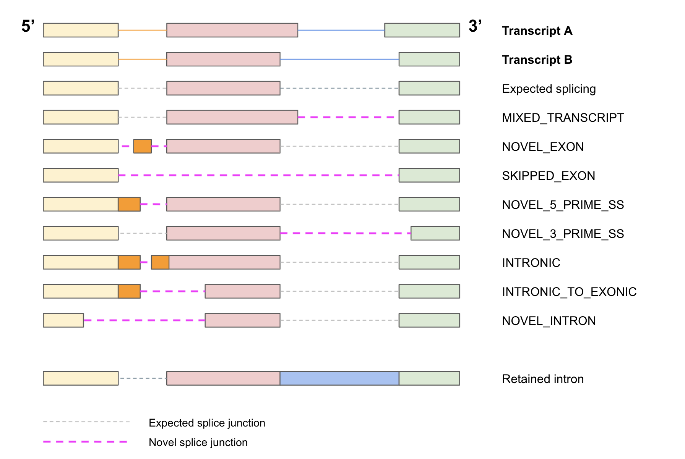

# <ISOFOX>

## Overview
Isofox is a tool for counting fragment support for identifying and counting gene and transcript features using genome aligned RNASeq data in tumor samples. In particular, Isofox:
* estimates transcript abundance (including unspliced transcripts) 
* detects novel splice junctions (including circularised RNA) and retained introns within genes  
* detects intergenic fusion events

For transcript abundance, Isofox uses a similar methodology to several previous transcript abundance estimation tools, but may offer several advantages by using a genome based mapping:
* Explicit estimates of the abundance of unspliced transcripts in each gene
* Avoids overfitting of 'retained intron' transcripts which may simply be intronic reads 
* Individual or combinations of splice junctions which are unique to a transcript will be weighed strongly. Does not overfit variability of coverage within exons

The input for Isofox is mapped paired end reads (we use STAR for our aligner).


### A note on duplicates, highly expressed genes, raw and adjusted TPM
We recommend to mark duplicates in your pipeline. They are included in gene and transcript expression data (to avoid bias against highly expressed genes) but excluded from novel splice junction analysis.  

We find that 6 genes in particular (RN7SL2,RN7SL1,RN7SL3,RN7SL4P,RN7SL5P & RN7SK) and are highly expressed across our cohort and at variable rates - in extreme samples these can account for >75% of all transcripts. Isofox excludes these genes from our GC bias calculations and to determine a normalisation factor for "adjusted TPM" so that they don't dominate expression differences.  For any given sample, AdjustedTPM = rawTPM x constant with the constant determined by the normalisation (which excludes the 6 genes and also limits all other genes to 1% contribution). The adjusted TPMs no longer sum to 1M transcripts, but should be more comparable across samples.  We suggest to use the adjusted TPM for expression analysis.

In addition, any junction which maps in the Poly-G region of LINC00486 is filtered from all analyses (v38: chr2:32,916,190-32,916,630; v37: 2:33,141,260-33,141,700) as they are likely the result of Poly-G sequencer artefacts.

### A note on alignment and multi-mapping
We use STAR as our aligner. ISOFOX expects BAM output with chimeric reads in the BAm itself, so it is essential when using STAR to set the outSAMtype to 'BAM Unsorted' and the chimOutType to 'WithinBAM'

The full list of non default parameters we use internally is:

```
--outSAMtype BAM Unsorted --outSAMunmapped Within --outBAMcompression 0 --outSAMattributes All --outFilterMultimapNmax 10 
--outFilterMismatchNmax 3 limitOutSJcollapsed 3000000 -chimSegmentMin 10 --chimOutType WithinBAM SoftClip 
--chimJunctionOverhangMin 10 --chimSegmentReadGapMax 3 --chimScoreMin 1 --chimScoreDropMax 30 --chimScoreJunctionNonGTAG 0 
--chimScoreSeparation 1 --outFilterScoreMinOverLread 0.33 --outFilterMatchNminOverLread 0.33 --outFilterMatchNmin 35 
--alignSplicedMateMapLminOverLmate 0.33 --alignSplicedMateMapLmin 35 --alignSJstitchMismatchNmax 5 -1 5 5
```

STAR allows setting of the '—outFilterMultimapNmax ‘ parameter to specify the maximum number of multimaps to allow for an alignment and we use the default value (10).   STAR will mark one of the multi-mappable reads as primary and the remainder as secondary reads. MAPQ by default in STAR for mappable reads to 255, whereas multi-mappable reads will have qual scores of 3 or less. For transcript abundance only, Isofox counts both primary and secondary reads at all locations, but reduces the weight of the reads to reflect the multi-mapping  (MAPQ 3 = 50%,  MAPQ 2 = 33%, MAPQ 1 = 20%, MAPQ 0 => 10%).    Reads with MAPQ of <10 are excluded from novel splice junction and chimeric analysis

## Configuration
The 3 core functions of Isofox are controlled by the 'functions' argument:
- TRANSCRIPT_COUNTS: calculate gene and transcript expression
- NOVEL_LOCATIONS: annotate alternate splice junctions and retained introns
- FUSIONS: identify fusions

These can be run concurrently or independently depending on the values set for this argument. By default they are all run.

### Mandatory
Argument | Description
---|---
sample | Name of sample, used to name output files
output_dir | Directory for Isofox output files
bam_file | Input BAM file - must be sorted, preferably with duplicates marked and requires a corresponding index file
ref_genome | Reference genome fasta file
ref_genome_version | 37 (default) or 38
ensembl_data_dir | Directory for Ensembl reference files - see instructions for generation or access below.
functions | List separated by ';', default is 'TRANSCRIPT_COUNTS;NOVEL_LOCATIONS;FUSIONS'. Other values: EXPECTED_GC_COUNTS, EXPECTED_TRANS_COUNTS, STATISTICS and READ_COUNTS.

### Optional
Argument | Description
---|---
ref_genome_version | HG37 (default), HG19 or HG38. Requires Ensembl reference files, BAM and ref genome to have the same version.
gene_id_file | Restrict analysis to genes in file, format EnsemblGeneId,GeneName
excluded_gene_id_file | Exclude genes in file, format EnsemblGeneId,GeneName
enriched_gene_ids | List of EnsemblGeneIds separated by ';', see Enriched Genes information below
drop_dups | Default is false. By default duplicate fragments will be counted towards transcript expression.

### Reference Files
Reference files are available for HG19 and HG38 [HMFTools-Resources](https://resources.hartwigmedicalfoundation.nl/):
- Isofox: expected transcript expression and GC Bias
- KnownFusions: HMF known fusion data
- Ensembl: cached Ensembl files.  Instructions for how to generate can be found [here](https://github.com/hartwigmedical/hmftools/tree/master/gene-utils#generating-cached-ensembl-data-files)

Note that the Ensembl gene cache currently generates for standard autosomes and sex chromosomes only (alt contigs and MT chromosomes are excluded).

### Transcript Expression
The expression function in Isofox depends on the calculation of expected rates for each gene and transcript given a set of fragment lengths. These can be computed from scratch each time a sample is run, or pre-computed independently once and then loaded from file for subsequent sample runs. Using the pre-computed expected counts file reduces the processing time by around 95%. 

Each release of Isofox will be accompanied by a set of pre-computed cache files (see HMF Resource link above). 

Likewise if GC bias adjustments are to be applied (config: apply_gc_bias_adjust), a pre-computed file of GC ratios per transcript is available for download.


The output file is approximately 120MB.

Argument | Description
---|---
apply_calc_frag_lengths | Use the actual fragment length distribution to adjust  
frag_length_min_count | Minimum number of fragments to observe for length distributon calcs, default = 1M 
apply_exp_rates | Calculate TPM using expectation maximisation routine
exp_rate_frag_lengths | Discrete buckets for fragment lengths, either with frequency specified or left as zero if to be calculated (ie with -apply_calc_frag_lengths). eg '50-0;75-0;100-0;125-0;150-0;200-0;250-0;300-0;400-0;550-0' 
exp_counts_file | Pre-computed expected counts per transcript and gene
apply_gc_bias_adjust | Adjusted transcript counts by actual vs expected GC ratio distribution
exp_gc_ratios_file | Pre-computed expected GC ratio counts per transcript
read_length | Expected RNA read length (eg 76 or 151), will be computed if not provided
long_frag_limit | Default 550 bases, fragments longer than this without a splice junction are not considered to support a gene for the purposes of expression
single_map_qual | Default 255, discard reads with map quality below this unless using the config 'apply_map_qual_adjust'
apply_map_qual_adjust | Include multi-mapped fragments in transcript counting, weighted by inverse of # multi-mapped locations
enriched_gene_ids | By default includes: ENSG00000265150;ENSG00000258486;ENSG00000202198;ENSG00000266037;ENSG00000263740;ENSG00000265735
gc_ratio_bucket | Default 0.01 ie percentiles. Ratio unit for GC distribution.

### Optional output files:
By default the following files are not generated.

Argument | Description
---|---
write_gc_data | Generates file 'sample_id.isf.gc_ratio_data.csv' with distribution of fragments per GC ratio percentile
write_frag_lengths | Generates file 'sample_id.isf.frag_length.csv' with distribution of fragment lengths
frag_length_by_gene | Generates file 'sample_id.isf.frag_length_by_gene.csv' with distribution of fragment lengths per gene
write_trans_combo_data | Generates file 'sample.isf.category_counts.csv' with fragment counts per transcript & gene grouping
write_exp_rates | Generates file 'sample_id.isf.exp_rates.csv' with expected counts per transcript and gene

### Logging and Debug
Argument | Description
---|---
specific_chr | Restricted List of chromosomes to process separated by ';'
gene_read_limit | Default 0, not applied. Per-gene cap on number of reads processed.
threads | Default 0, single-threaded.
log_debug | Log verbose
log_level | Override logging with ERROR, WARN, INFO, DEBUG or TRACE
write_read_data | Write data on each BAM read, only recommended with restricted genes file
write_exon_data | Write data on transcript exon covered by a supporting fragment, only recommended with restricted genes file

### Memory Usage and Threading
ISOFOX takes ~10 mins to process a 7GB BAM with 120M reads / 60M fragments using 10 cores, with maximum memory usage of 10GB, and ~30 mins to process a 35GB BAM with 440M reads / 200M fragments using 10 cores, with maximum memory usage of 12GB. 

### Example Usage
Running all functions:

```
java -jar isofox.jar 
    -sample SAMPLE_ID 
    -functions "TRANSCRIPT_COUNTS;NOVEL_LOCATIONS;FUSIONS"
    -bam_file /path_to_bam/sample.bam 
    -ref_genome /path_to_ref_files/ref-genome.fasta 
    -ensembl_data_dir /path_ensembl_data_cache_files/ 
    -apply_calc_frag_lengths 
    -apply_exp_rates 
    -read_length 151
    -exp_counts_file /path_to_ref_files/read_151_exp_counts.csv 
    -apply_gc_bias_adjust 
    -exp_gc_ratios_file /path_to_ref_files/read_100_exp_gc_ratios.csv 
    -long_frag_limit 550 
    -apply_map_qual_adjust 
    -output_dir /path_to_output_data/ 
    -threads 10 
```

Fusions only:

```
java -jar isofox.jar 
    -sample SAMPLE_ID 
    -functions FUSIONS
    -bam_file /path_to_bam/sample.bam 
    -ref_genome /path_to_ref_files/ref-genome.fasta 
    -ensembl_data_dir /path_ensembl_data_cache_files/ 
    -output_dir /path_to_output_data/ 
    -read_length 151 
    -long_frag_limit 550 
    -known_fusion_file /path_to_fusion_ref_files/known_fusion_data.csv
    -threads 10 
```

To produce a filtered (passing) fusion file, additionally pass a cohort PON file:

```
-fusion_cohort_file /path_to_fusion_ref_files/hmf_isofox_fusion_cohort.csv
```

A cohort file generated from ~2500 HMF samples is available from the HMF Resources page (see link above).

### Generating Transcript Expression and GC Ratio Cached Files
To generate the cached transcript expression file, use the function EXPECTED_TRANS_COUNTS, passing in the same fragment length values used for normal transcript expression.

```
java -jar isofox.jar 
    -functions EXPECTED_TRANS_COUNTS
    -output_dir /path_to_output_data/ 
    -ensembl_data_dir /path_ensembl_data_cache_files/ 
    -read_length 151 
    -long_frag_limit 550 
    -exp_rate_frag_lengths "50-0;75-0;100-0;125-0;150-0;200-0;250-0;300-0;400-0;550-0" 
    -threads 10 
```

The output file is approximately 100MB.

To generate the expected GCrRatio counts file, use the EXPECTED_GC_COUNTS function with the call:

```
java -jar isofox.jar 
    -functions EXPECTED_GC_COUNTS
    -output_dir /path_to_output_data/ 
    -ref_genome /path_to_ref_files/ref-genome.fasta 
    -ensembl_data_dir /path_ensembl_data_cache_files/ 
    -read_length 151 
    -threads 10 
```

The output file is approximately 120MB.
 
## Algorithm

### 1. Modelling and grouping of spliced and unspliced transcripts

For determining transcript abundance, we consider all transcripts in Ensembl, grouped by gene. Each gene may have 1 to N transcripts. Since we use ribosomal depletion to collect RNA we need to  explicitly consider that each gene will have unspliced reads. Hence, we consider an additional ‘unspliced transcript’ per gene which includes all exonic and intronic segments. Any fragment that overlaps a region which is intronic on all transcripts is assumed to be unspliced.

Genes that overlap each other on the same chromosome (either sense, anti-sense or shared exons) are considered together as a group so that each fragment which could potentially relate to one of multiple genes is only counted once.   

### 2. Modelling sample specific fragment distribution

The fragment length distribution of the sample is measured by sampling the insert size of up to 1 million genic intronic fragments. Any fragment with an N in the cigar or which overlaps an exon is excluded from the fragment distribution.  A maximum of 5000 fragments is permitted to be sampled per gene collection so no individual gene can dominate the sample distribution. 

### 3. Expected rates per 'category' and expected GC distribution per transcript

#### A. Expected rates per category

For each transcript in a group of overlapping genes, Isofox measures the expected proportion of fragments that have been randomly sampled from that transcript with lengths matching the length distribution of the sample that match a specific subset of transcripts (termed a 'category' in Isofox, but generally referred to as an equivalence class in other tools such as Salmon). For any gene, that contains at least 1 transcript with more than 1 exon an 'UNSPLICED' transcript of that gene is also considered as a independent transcript that could be expressed.  

The proportion is calculated by determining which category or set of transcripts that fragments of length {50,75,100,125,150,200,250,300,400,550} bases starting at each possible base in the transcript in question could be a part of.  This is then weighted by the empirically observed fragment length distribution.

For example a gene with 2 transcripts (A & B) and an UNSPLICED transcript might have the following expected rates:

Category | 'A' Transcript | 'B' Transcript |'UNSPLICED' Transcript 
---|---|---|---
A Only|0.5|0|0
B only|0|0.2|0
Both A & B|0.1|0.2|0
A & UNSPLICED|0.1|0|0.05
B & UNSPLICED|0|0|0
Both A & B & UNSPLICED|0.3|0.6|0.15
UNSPLICED|0|0|0.8
TOTAL|1.0|1.0|1.0

In this example, 50% of all fragments from transcript A are expected to be uniquely mapped to the A transcript, 30% may be mapped to A,B or UNSPLICED (likely fragments matching a long exon), 10% are expected to be mapped to either A or B but with splicing and the final 10% are expected to be mapped to a region which is either exonic in A or unspliced.   These rates are compared to the observed abundance of each category in subsequent steps to estimate the actual abundance of each transcript.

#### B. Expected GC distribution

For each of the sampled fragments in each transcript (including unspliced transcripts), the GC content (rounded to nearest 1%) is also measured.  This is used subsequently to estimate GC bias.

### 4. Counting abundance per unique group of shared transcripts

Similarly to the estimated rate calculation above we also use the same grouping of transcripts together across all genes which overlap each other to determine actual counts. We assume that any fragment that overlaps this region must belong either to one of these transcripts or to an unspliced version of one of the genes.

Each fragment is assigned to a 'category' based on the set of transcripts that it may belong to. We allow a fragment to belong to a transcript if:
* Every mapped base of the fragment is exonic in that transcript (allowing for homology with reads that marginally overlap exon boundaries) AND
* Every splice junction called exists in that transcript AND
* the distance between the paired reads in that transcript is not > maximum insert size distribution (currently fixed at 550 bases) AND
* neither read is soft clipped except at a known exon boundary (except where fragment length < unclipped read length indicating likely adapter sequence)

Any fragment which does not contain a splice junction, is wholly contained within the bounds of a gene, and with fragment size <= maximum insert size distribution is also allowed to map to an ‘UNSPLICED’ transcript of that gene.

Note that reads which are partially exonic, but marginally overhang an exon boundary or are soft clipped at or beyond an exon boundary have special treatment. This is particularly relevant for reads that have an overhang of 1 or 2 bases which will not be mapped by STAR with default parameters. If the overhanging section can be uniquely mapped either to the reference or to the other side of only a single known spliced junction, then the fragment is deemed to be supporting that splice junction or in the case of supporting just the reference is deemed to be supporting the UNSPLICED transcript.  If multiple mappings are possible or the fragment length < unclipped read length (indicating likely adapter sequence) it is truncated at the exon boundary.  If no mapping is possible then the fragment is treated as not supporting any known transcript.

### 5. Fit abundance estimate per transcript

For each group of transcripts considered together we aim to fit the relative abundance. Like many previous tools (RSEM, Salmon, Kallisto, etc), we use an expectation maximisation algorithm to find the allocation of fragments to each transcript which give the least residuals compared to the expected rates for each transcript.

<TO DO: Add a step which improves on this by removing or limiting allocation to transcripts where fitted fragments are greater than observed fragments for private allocations >

### 6. Bias Estimation and Correction

#### A. GC Bias estimate

Expected GC distribution for sample is calculated as the sum of the estimated distribution for each transcript (as calculated above) multiplied by the proportion of fragments in the sample which have been estimated (nb - this is similar to the methodology implemented in Salmon).  We also count the actual distribution across all genes per 1% GC content bucket. The GC bias for each percentile is the ratio of the actual to the estimated.

<TO DO: decide on min max GC range and also max ratio change for GC Bias>

<TO DO: Add Fragment Length Bias, Sequence Start Specific Bias & 5' CAP bias >

#### B. Adjust expected rates for biases and re-estimate abundances per transcript

The calculated biases are applied as a weighting to each raw fragment based on it's GC, positional and fragment length characteristics.  Steps 4 and 5 are then repeated.


### 7. Counting and characterisation of novel splice junctions

A novel splice junction in Isofox is considered to be a novel splicing event which is not part of any annotated gene in ensembl. To be treated as a novel splicing event in a particular gene, at least 1 of the splicing ends must fall within the gene, the other splice end must be within 500k bases upstream or downstream of the gene.   The splice junction must not link 2 annotated splice sites that are not both present in a single ensembl gene and must not link a known fusion pair (GOPC_ROS1) or else it will be counted a chimeric junction (see section below).  

For each novel splice junction we count the number of fragments supporting the event as well as the total coverage at each end of the splicing junction.  Each novel splice junction is classified as one of the following types of events

* SKIPPED_EXON - both splice sites are splice sites on a single existing transcript but the interim exon(s) are skipped.
* MIXED_TRANSCRIPT - both splice sites are splice sites on different existing transcripts but not the same one
* NOVEL_EXON - One end of the splice junction is cis phased with another novel splice junction to form a novel exon that does not exist on any transcript.
* NOVEL_3_PRIME_SS - 5' end matches a known splice site, but 3' end does not.  3' end may be intronic or exonic
* NOVEL_5_PRIME_SS - 3' end matches a known splice site, but 5' end does not.  5' end may be intronic or exonic
* NOVEL_INTRON -  Neither end matches a known splice site.  Both 5' and 3' ends are wholly contained within a single exon on all transcripts
* INTRONIC -  Neither end matches a known splice site.  Both 5' and 3' ends are intronic
* INTRONIC_TO_EXONIC - Neither end matches a known splice site.  One end is intronic and 1 end is exonic
* CIRCULAR - Circular RNAs (typically formed by backsplicing) are also treated as novel splice junctions when they fall wholly within a gene and are marked as orientation "CIRCULAR".  Inversion oriented events are not considered to be novel splice junctions and are instead treated as chimeric.

Below figure shows examples of the novel splice junction event types (and of retained intron, see section below).



In the case of overlapping genes, we assign the novel splice junction to one of the genes using the following priority rules in order
* Genes with matching splice site at a least one end
* Genes on strand such that splice motif matches canonical splice motif (GT-AG)
* Gene with most transcripts

For each novel splice junction, we also record the distance to the nearest splice junction for each novel site, the motif of the splice site and the transcripts compatible with either end of the alternative splicing.


### 8. Counting and characterisation of retained introns

We also search explicitly for evidence of retained introns, ie where reads overlap exon boundaries. We may find many such reads as any unspliced transcripts can have such fragments.  To reduce false positives, we only consider exon boundaries which do not have exons on other transcripts overlapping them, and we hard filter any evidence where we don't see at least 3 reads overlapping the exon boundary or at least 1 read from a fragment that contains another splice junction.

<TO DO - Add filtering that the read count must signiificantly exceed the unspliced coverage of all gene overlapping that base>

<TO DO - Combine intron retention and novel splice site information>
 
### 9. Counting and characterisation of chimeric junctions and gene fusions

#### A. Identify candidate chimeric junctions

Any junction supported by at least one read with either a supplementary alignment or a spliced alignment which either links 2 known splice sites which are not present in any single ensemble gene OR links 2 known splice sites that are not spliced in a known ensembl transcript but create a known fusion pair (eg. GOPC_ROS1) OR extends at least 500kb beyond the range of a single gene is treated as a candidate chimeric junction. For a list of known pathogenic fusions only, Isofox also searches for candidate locations without split alignments supported only by discordant read pairs.

The chimeric junction is oriented by the splice site type of the 2 breakends:  a location matching a donor splice site is set to be the 'up' breakend and a location matching the acceptor site is set to be the down breakend. If no splice site exists at either breakend, then the direction is infered by looking for canonical donor and acceptor sequences.

If either end of the chimeric junction overlaps more than 1 gene, then select one gene candidate according to the following priority rules:
* Genes with matching splice site / orientation 
* Genes which are marked in the HMF fusion knowledgebase as known or promiscuous partners
* Longest protein coding gene 

#### B. Count support

Isofox counts 3 categories all fragments supporting the break junction broken into 3 categories:
* Split - any fragment with a supplementary alignment or splice juction at the exact break junction
* Realigned - any fragment that has both reads mapped on one end of the chimeric junction, without a supplementary but exactly matches the reference at the other side of the candidate junction and overlaps the breakpoint by at least 3 bases but not more than 10 bases.  If the overlapping bases are consistent with multiple candidate junctions they may be double counted.						
* Discordant pairs:  any fragment with 1 read mapped at either end of the chimeric junction in the appropriate orientation which cannot be classified as split or realigned and which with the chimeric junction implies a fragment length of <550 bases either unspliced or on a known transcript. If the discordant pairs are consistent with multiple junctions they may be double counted	

Isofox also determines the coverage at both breakends and the max anchor length on either side of the break junction (ie. the maximum number of distinct matched bases by any 1 junction supporting fragment on that side of the chimeric junction).  An allelic frequency at each breakend is calculated as (split + realigned) / coverage.

#### C. Filtering

4 filters are applied in Isofox to remove likely artefacts from our chimeric junctions output.  The filters are tiered such that we achieve maximum senstivity for fusions with highest prior likelihood whilst still containing. Known pathogenic fusion partners are given the highest sensitivity followed by known splice site to known splice site, follow by canonical splice pairings (GT-AG) and lastly any other non-canoncial splice pairing.

The filters and thresholds per tier are as follows:

Filter | definition | Known pathogenic fusions* | Splice Site-Splice Site** | Splice Site-Canonical | Canonical-Canonical | Other
---|---|---|---|---|---|---
min_fragment_support | total fragments supporting fusion | Splice Site-Splice Site or Splice Site-Canonical: 2; Other: 4  | 2 | 3 | 4 | 10
min_af | min(AFUp, AFDown) | 0 | 0.002 | 0.005 | 0.005 | 0.05
min_anchor | min(maxAnchorLengthUp, maxAnchorLengthDown) | 0 | 20 | 20 | 20 | 20 
max_cohort_frequency*** | count of observations in cohort | NA if known;  5 if either gene known | 2 | 2 | 2 | 2

'* For known pair fusions (excluding DEL / DUP <1M bases) supporting fragments are cumulative aross all novel junctions

'** 'unspliced' junctions that are asscoicated with a passing Splice Site - Splice Site junction get the same filter cutoffs (excluding DEL / DUP <1M bases). 

'*** see below for cohort frequency calculation

### 10. Cohort frequency

We have determined a cohort frequency for each chimeric junction, novel splice junctions and novel retained introns across a cohort of 2030 samples.  The purpose of this is created to estimate population level frequencies of each of the 'novel' features. 

For each chimeric junction and novel splice junction  we count
* Number of unique samples with 2 or more supporting fragments at that novel splice junction
* Total # of fragments supporting novel splice junction across all the unique samples

For intron retention cases we count
* Number of unique samples with at least 3 fragments supporting intron retention
* Total # of fragments supporting intron retention from those unique samples
* Total # of fragments supporting intron retention from those unique samples which also have splicing.

Each chimeric junction, novel splice junction and retained intron for each sample is annotated with the population level frequencies

## Outputs

### Summary

Generated file: sample_id.isf.summary.csv

Field | Description 
---|---
TotalFragments | Count of total fragments (currently Isofox only counts genic fragments)
DuplicateFragments | Count of fragments marked as duplicates
SplicedFragmentPerc | % of total fragments supporting 1 or more known transcripts
UnsplicedFragmentPerc | % of total fragments not containing a splice junction and not supporting any known transcript 
AltFragmentPerc | % of total fragments supporting an alternate splice junction within a gene
ChimericFragmentPerc | % of total fragments supporting a chimeric junction
ReadLength | Raw read length of fragments
FragLength5th | 5th percentile of genic intronic fragment lengths (from 1M fragments sampled with a max of 1000 per gene)
FragLength50th | 50th percentile of genic intronic fragment lengths (from 1M fragments sampled with a max of 1000 per gene)
FragLength95th | 95th percentile of genic intronic fragment lengths (from 1M fragments sampled with a max of 1000 per gene)
EnrichedGenePercent | % of fragments supporting one of the following 6 genes: (RN7SL2, RN7SL1,RN7SL3,RN7SL4P,RN7SL5P & RN7SK)
MedianGCRatio | Median GC ratio excluding the 6 highly enriched genes

### Gene Level Data

Generated file: sample_id.isf.gene_data.csv

Field | Description 
---|---
GeneId | Ensembl gene id
GeneName | Gene
Chromosome | Chromosome of gene
GeneLength | Length of gene
IntronicLength | total bases which are intronic across all transcripts
TranscriptCount | Count of transcripts in gene
GeneSet | Identifier shared by all genes in overlapping group
SplicedFragments | Count of fitted fragments assigned to spliced transcripts in the gene
UnsplicedFragments | Count of fitted fragments assigned to the 'unspliced' gene transcript
TPM | TPM for gene excluding unspliced fragments

### Transcript Level Data

Generated file: sample_id.isf.trans_data.csv

Field | Description 
---|---
GeneId | Ensembl id for gene
GeneName | Gene
TranscriptId | Ensembl id for transcript
TranscriptName | Ensembl transcript name eg. TP53-001
Canonical | Is canonical transcript (T/F)
ExonCount | Count of exons in transcript
UniqueSJCount | Number of unique splice junctions in transcript
TranscriptLength | Total length of transcript
EffectiveLength | Effective length of transcript (adjusted for fragment size)
FittedFragments | Count of fragments assigned to transcript
RawFittedFragments |  Count of fragments assigned to transcript prior to bias adjustments (ie. GC adjustment, etc)
TPM | Transcripts per million
TranscriptBasesCovered | Number of bases in transcript with at least 1 supporting fragment
SJSupported | Count of splice junctions in transcript with at least 1 supporting fragment
UniqueSJSupported | Count of unique splice junctions in transcript with at least 1 supporting fragment
UniqueSJFragments | Count of fragments supporting a splice junction unique to the transcript
UniqueNonSJFragments | Count of fragments uniquely supporting transcript but without a unique splice junction

### Fragment length distribution

Generated file: sample_id.isf.frag_length.csv

Field | Description 
---|---
FragmentLength | Fragment length
Count | Count of fragments with specified fragment length

### Alternate Splice Junctions

Generated file: sample_id.isf.alt_splice_junc.csv

Field | Description 
---|---
GeneId | Ensembl id for gene
GeneName | Gene
Chromosome | Chromosome of gene
Strand | Strand of gene
SJStart | Start position of novel splice junction
SJEnd | End position of novel splice junction
Fragments | Count of fragments supporting novel splice junction
StartDepth | Total depth at SJStart position
EndDepth | Total depth at SJEnd position
Type | Type of novel splice junction.  One of:  'SKIPPED_EXON','NOVEL_EXON','NOVEL_3_PRIME_SS','NOVEL_5_PRIME_SS','NOVEL_INTRON','MIXED_TRANSCRIPT','INTRONIC', 'INTRONIC_TO_EXONIC' or 'CIRICULAR'
SJStartContext| Gene context at SJStart position.  One of 'SPLICE_JUNC','EXONIC' or 'INTRONIC'
SJEndContext |  Gene context at SJEnd position.  One of 'SPLICE_JUNC','EXONIC' or 'INTRONIC'
SJStartDistance | Distance of SJStart position from nearest splice site (0 if splice junction, >0 if intronic and <0 if exonic)
SJEndDistance | Distance of SJEnd position from nearest splice site (0 if splice junction, >0 if intronic and <0 if exonic)
SJStartBases | 2 previous and 10 next ref genome bases from SJStart position
SJEndBases | 10 previous and 2 next ref genome bases from SJStart position
SJStartTranscripts | Transcript ids which contain a splice junction which includes the SJStart splice site
SJEndTranscripts | Transcript ids which contain a splice junction which includes the SJEnd splice site
OverlappingGenes | List of all genes which overlap the novel splice junction

### Retained Introns

Generated file: sample_id.isf.retained_intron.csv

Field | Description 
---|---
GeneId | Ensembl Id for gene
GeneName | Gene
Chromosome | Chromosome of gene
Strand | Strand of gene
Position | Chromosomal base position of exon boundary with overlapping fragments suggesting retained intron
Type | 'DONOR' or 'ACCEPTOR' splice site
FragmentCount | Count of all fragments which overlap splice site boundary
SplicedFragmentCount | Count of fragments which overlap splice site boundary which contain another splice site (ie. evidence of being part of a spliced transcript)
TotalDepth | Depth at splice boundary
TranscriptInfo | Transcript id and exon rank of all transcripts that match splice site boundary

### Fusions

Isofox generates 2 fusion output files - one for passing fusions and one for all fusions

Field | Description 
---|---
FusionId | Unique id for fusion
Valid | Both up and down gene strands match breakpoint orientation to make a potentially viable orientaiton
GeneIdUp | Ensembl Id for gene at up breakend
GeneNameUp | Gene at up breakend
ChrUp | Chromosome of up breakend
PosUp | Position of up breakend
OrientUp | Orientation of up breakend
StrandUp | Strand of gene at up breakend (0 if no gene annotated)
JuncTypeUp | Either 'KNOWN' (matches an ensembl splice site), 'CANONICAL' (GT on forward stand or AC on reverse strand) or 'UNKNOWN'
GeneIdDown | Ensembl Id for gene at down breakend
GeneNameDown | Gene at down breakend
ChrDown | Chromosome of down breakend
PosDown | Position of down breakend
OrientDown | Orientation of down breakend
StrandDown | Strand of gene at down breakend (0 if no gene annotated)
JuncTypeDown |  Either 'KNOWN' (matches an ensembl splice site), 'CANONICAL' (AG on forward stand or CT on reverse strand) or 'UNKNOWN'
TotalFragments | # of fragments supporting the transcript = spliced + realigned + discordant
SplitFragments | # of fragments with supplementary or spliced alignments that match the chimeric junction
RealignedFragments | # of fragments which overlap the breakpoint at either end by at least 3 bases and exactly match the reference sequence at the other breakend but do are not split or spliced at the break junction by the aligner
DiscordantPairs | Number of fragments supporting the break junction with a read at either side of the breakjunction but without 
CoverageUp | # of fragments overlapping the last base prior to the up breakend
CoverageDown | # of fragments overlapping the last base prior to the down breakend
MaxAnchorLengthUp | maximum number of distinct matched bases by any 1 junction supporting fragment at the up breakend
MaxAnchorLengthDown | maximum number of distinct matched bases by any 1 junction supporting fragment at the down breakend
TransDataUp | Transcript ids which contain a splice junction which includes matches the up breakend
TransDataDown | Transcript ids which contain a splice junction which includes matches the down breakend
OtherGenesUp | Other genes which match the up breakpoint
OtherGenesDown | Other genes which match the down breakpoint
RelatedFusions | Ids of other fusions in the same gene which may be caused by the same structural variant

## Version History and Download Links
- [1.0](https://github.com/hartwigmedical/hmftools/releases/tag/isofox-v1.0)
- [1.1](https://github.com/hartwigmedical/hmftools/releases/tag/isofox-v1.1)
- [1.2](https://github.com/hartwigmedical/hmftools/releases/tag/isofox-v1.2)

