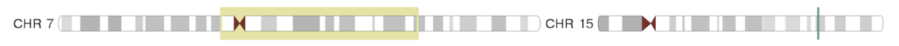
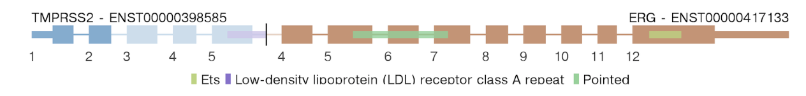
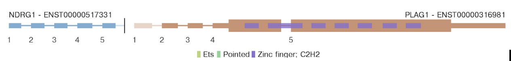
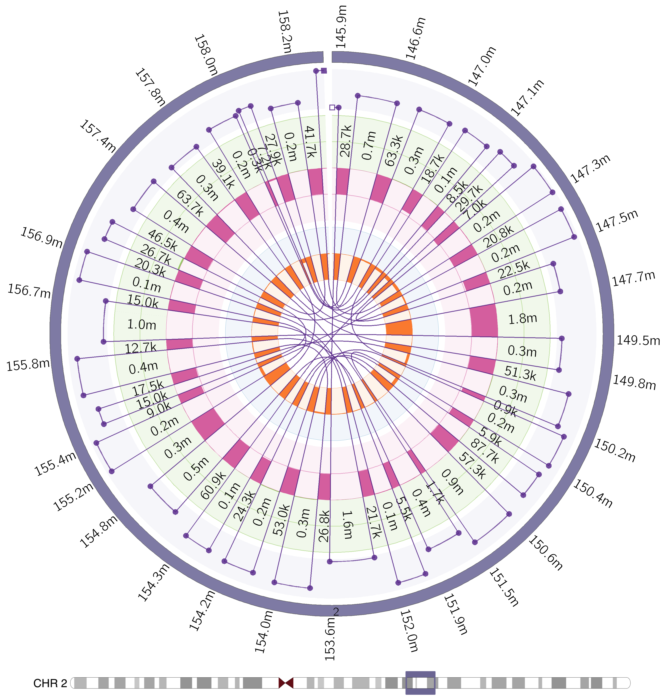
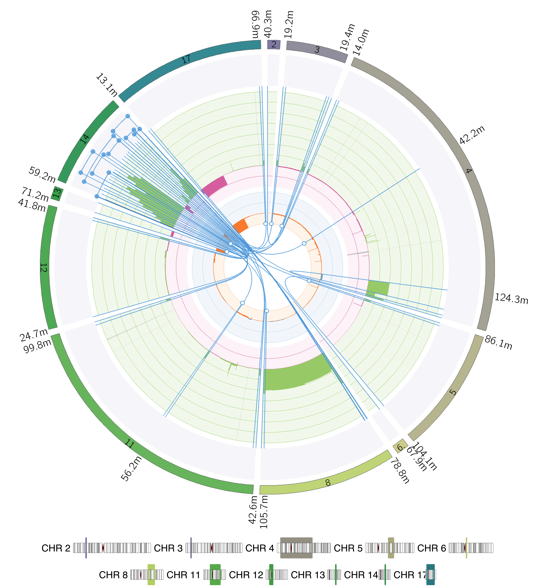

# Linx Visualisation
Linx provides functionality to present detailed visualisation of genomic rearrangements including genic impact.

# Contents

* [Dependencies](#dependencies)
* [Visualisation](#visualisation)
  + [Circos Panel](#circos-panel)
  + [Fusion Panel](#fusion-panel)
  + [Chromosome Range Panel](#chromosome-range-panel)
* [Usage](#usage)
  + [Required Arguments](#required-arguments)
  + [Radial Arguments](#radial-arguments)
  + [Relative Track Size](#relative-track-size)
  + [Font Size](#font-size)
  + [Line Size](#line-size)
  + [Interpolate Positions](#interpolate-positions)
  + [Chromosome Panel](#chromosome-panel)
  + [Fusion Panel](#fusion-panel)
  + [Other Arguments](#other-arguments)
  + [Example Usage](#example-usage)
* [Example Configurations](#example-configurations)
  + [Default](#default)  
  + [Reduced Footprint](#reduced-footprint)  
  + [Line Event](#line-event)  
  + [TMPRSS2-ERG Fusion](#tmprss2-erg-fusion)  
* [Breakage Fusion Bridge Demonstration](#breakage-fusion-bridge-demonstration)

# Dependencies
Linx visualisation uses tab separated data generated by Linx:
```SAMPLE_ID.linx.vis_copy_number.tsv
SAMPLE_ID.linx.vis_fusion.tsv
SAMPLE_ID.linx.vis_gene_exon.tsv
SAMPLE_ID.linx.vis_protein_domain.tsv
SAMPLE_ID.linx.vis_segments.tsv
SAMPLE_ID.linx.vis_sv_data.tsv
```

In principle any tool could provide SV & CNA data in this format.

It also requires [CIRCOS](http://circos.ca/) to be installed as well as a number of R dependencies that can be installed with the following commands:
```
    install.packages("tidyr")
    install.packages("dplyr")
    install.packages("ggplot2")
    install.packages("cowplot")
    install.packages("magick") 
    
    library(BiocManager)
    BiocManager::install("Gviz")   
```

# Visualisation

There are 3 panels in the output of the Linx visualisation:
1. [Circos Panel](#circos-panel)
2. [Fusion Panel](#fusion-panel)
3. [Chromosome Range Panel](#chromosome-range-panel)

## Circos Panel

The CIRCOS panel shows either the complete set of rearrangements in a cluster or set of clusters if 1 or more cluster ids are specified 
(‘cluster mode’) or all clusters that touch a chromosome if a chromosome is specified (‘chromosome mode’). 

A visualisation guide is shown below:

<p align="center">
    
</p>

There are 6 tracks showing from innermost to outermost:
1. Break junctions
2. Minor allele copy number profile
3. Copy number profile
4. Derivative chromosomes
5. Impacted genes (if any)
6. Affected chromosomes

The scaling of both distances and copy numbers in the figure has been modified to make the figure readable. Specifically, the distances between each feature in the chart (either breakend or gene exon start or end) are modified to a log based scale, so that the entire genomic rearrangement spanning millions of bases and multiple chromosomes can be viewed, but that local topology of regions with high densities of breakpoints can be introspected. JCN is set with a linear scale but is scaled down if the maximum cluster JCN exceeds 6 or if the total density of events exceeds a certain maximum to ensure that even the most complex clusters can be introspected. Additionally, if the total number of breakends displayed exceeds 9 then the junctions become increasingly transparent such that other features on the plot don’t become obscured.

Another key feature of the CIRCOS plot is the ability to trace the derivative chromosome(s). Each segment in the 4th track represents a segment of the derivative chromosome and is linked on both ends either to a centromeric or telomeric end (marked with an open or closed square respective) or a breakend (marked with a track or triangle in the case of foldbacks). Each derivative chromosome can be traced continuously from one telomeric / centromeric end to another (or to a single breakend if one is reached) by following a continuous series of segments and breakends. To make this easier to follow, each time a new segment is connected on a chromosome the segment is offset outwards slightly. Hence the derivative chromosomes can be traced from the inside to the outside of the 4th track of the diagram. A cluster may contain 1 or more derivative chromosomes. In cluster mode each derivative chromosome will be shown in a different colour for ease of viewing (with a maximum of 10 colours after which all derivative chromosomes are shown in black). In chromosome mode, derivative chromosomes will be shown in the same colours, but each cluster is shown in a different colour. Red and green are reserved for simple deletions and tandem duplications respectively. Since there may be many of these on a single chromosome, telomeric and centromeric connectors are not shown for these simple variant types. Light blue is also reserved for LINE clusters which can also be frequent in samples with highly deregulated LINE machinery. 

Most of the possible annotations are shown in the Linx visualisation guide. Additionally, 2 types of genomic regions which are frequently disrupted in tumor genomes are indicated using light grey shading on the copy number regions in the 3rd track. For known LINE source elements the green copy number section is shaded and for known fragile sites the red copy number section is shaded light grey. 

## Chromosome View

Since the CIRCOS only represents a part of the genome, the chromosome panel is provided to indicate which parts of the genome is shown. 
Each of the chromosomes included in the cluster(s) shown is displayed. 
The part of the chromosome that is included in the figure is highlighted in the colour matching the colour used in the outer ring of the CIRCOS. 
The banding and location of the centromere on each chromosome is also shown.

An example of the chromosome view is shown below indicating the cluster includes a large section of chromosome 7 including the centromere 
and a small slither of chromosome 15 on the Q arm:

<p align="center">
    
</p>

## Fusion Panel

The fusion view is added only for reportable fusions. It’s purpose is to show the predicted structure of the fused gene. 
The fusion includes the fused segments of both the 5’ and 3’ partner in blue and red and always reads from left to right. 
The gene representation for each genes and follows the standard conventions of thick bands for coding regions, 
thinner bands for 5’ UTR and 3’ UTR exonic regions and thin lines to represent the intronic sections. 
Protein domains are shown in coloured bands across the exons which they include and are labeled in the accompanying legend. 
As with the CIRCOS panel the lengths of exonic gene segments in the fusion panel are scaled by a log scale to improve readability. 
The intronic segments are set to a fixed segment length regardless of the length. 

The fused gene is shown up to and including the breakend on either side that is connected either directly in the case of a simple fusion 
or via a chain in a chained fusion. If Linx predicts that one or more exons are skipped, then the skipped exonic segments and 
protein domain sections are faded. 

For example in the following TMPRSS2-ERG fusion, exons 3, 4 & 5 are faded and the LDL domain is also faded, indicating that Linx predicts 
these exons are skipped in order to make a viable in frame protein, despite the break end occurring after the 5th exon:

<p align="center">
    
</p>


A similar case can be seen in this example where the 5’UTR region of NDRG1 is fused upstream of the 1st exon in PLAG1. 
Since the 1st exon of a gene has no splice acceptor, Linx predicts the 1st exon is skipped and it is faded on the chart with the fusion 
connecting to the start of exon 2 which also begins in the 5’UTR region of PLAG1:

<p align="center">
    
</p>

Even when no exons are skipped, a protein domain may be partially disrupted if it extends to an exon the other side of the breakpoint. 
In the below example, you can see the SH2 protein domain extends before exon 16 and is faded and disrupted:

<p align="center">
    
</p>

Whilst fusions are normally intronic, rare exonic to exonic fusions do occur. The below figure shows a CIC-FOX04 example where the 2 exons
are directly fused:

<p align="center">
    
</p>


# Usage

## Required Arguments

The following mandatory arguments must always be provided to the application.

Argument |  Description 
---|---
sample| Sample name
vis_file_dir | Path to Linx output directory, see below for expected files
plot_out | Plot output directory
data_out | Data output directory
circos |Path to circos binary
ensembl_data_dir | Ensembl data cache directory as used by Linx
ref_genome_version | Defaults to version 37, valid values are 37 or 38

## Other Arguments

Argument |  Description 
---|---
clusterId | Only generate image for specified comma-separated cluster IDs
chromosome | Only generate images for specified comma-separated chromosomes, or 'All' to show full genome
chainId | Only generate image for specified comma-separated chain IDs (requires cluster IDs to also be specified)
include_line_elements | Include line elements in chromosome visualisations (excluded by default) 
gene | Add canonical transcriptions of supplied genes separated by ',' to image. Requires config 'ensembl_data_dir' to be set as well.
plot_reportable | Plot any cluster with reported fusion, disruption, or driver
plot_cluster_genes | Plot all genes in breakends for a cluster, uses Linx file SAMPLE_ID.linx.svs.txv
restrict_cluster_by_gene | Only plot clusters with a breakend in one of the genes specified in the 'gene' config argument
specific_regions | Only plot SVs with a breakend in the regions specified: format chromosome:positionStart:positionEnd, separated by ';'
load_cohort_files | Load Linx cohort VIS files when plotting from a collection of samples
threads | Number of threads to use

If neither `chromosome` nor `clusterId` are included, separate visualisations of all chromosomes and clusterIds in the provided files will be created.

## Radial Arguments

The following arguments are all relative to the total radius of the CIRCOS panel and must be between 0 and 1. 

Argument | Default | Description 
---|---|---
inner_radius| 0.20| Innermost starting radius of minor-allele ploidy track
outer_radius | 0.88 | Outermost ending radius of chromosome track
gap_radius| 0.025 | Radial gap between tracks
exon_rank_radius | 0.025 | Radial gap left for exon rank labels

If you significantly increase the [font size](#font-size) it is likely that you will need to reduce the `outer_radius` and increase the
`exon_rank_radius` otherwise labels may get clipped or removed entirely. This is demonstrated in the [reduced footprint](#Reduced-Footprint)
examples.

## Relative Track Size

It is possible to adjust the relative sizes of the gene, segment (derivative chromosome), and copy number (and major/minor allele) tracks 
in the CIRCOS panel with the following parameters:

Argument | Default | Description 
---|---|---
gene_relative_size| 0.3 | Size of gene track relative to segments and copy number alterations
segment_relative_size | 1 | Size of segment (derivative chromosome) track relative to copy number alterations and genes
cna_relative_size | 2 | Size of gene copy number alterations (including major/minor allele) relative to genes and segments

The gene track will not be displayed if `gene_relative` is 0 or if there are no genes to be displayed on the visualisation.

## Font Size

The following parameters control the font size. 

Argument | Default | Description 
---|---|---
min_label_size| 35 | Minimum size of labels in pixels
max_label_size | 40 | Maximum size of labels in pixels
max_gene_characters | 5 | Maximum allowed gene length before applying scaling them
max_distance_labels | 100 | Maximum number of distance labels before removing them
max_position_labels | 60 | Maximum number of position labels before increasing distance between labels
exact_position | NA | Display exact positions at all break ends

The label size scales linearly from the min to the max label size as an inverse function of the number of distance labels to be plotted. 
If the number of distance labels exceeds `max_distance_labels`, no distance labels will be shown and all labels will be sized with `min_label_size`.

The same label size will be applied genes unless there is a gene which exceeds `max_gene_characters` in length. In this case, all genes
will be scaled down to prevent the gene labels from going outside the gene track. Adjusting this parameter is best done in conjunction with
the `gene_relative_size` parameter.

By default, position labels will be shown every 100k bases. However, if the number of labels exceeds `max_position_labels` then this will be reduced
to every 1M or 10M bases. This setting is ignored if the `exact_position` flag in included and every break end to the base will be displayed.

## Line Size

The following parameters control the line and glyph sizes. The glyphs are used to represent the segment breaks, ie centromere, telomere, foldback etc.

Argument | Default | Description 
---|---|---
min_line_size| 1 | Minimum size of lines in pixels
max_line_size | 12 | Maximum size of lines in pixels
glyph_size | 20 | Size of glyphs in pixels

## Interpolate Positions

By default, copy number alteration transitions and exons will be emphasised on the CIRCOS panel according to the log scale described above.
This functionality can be disabled with the following flags:  

Argument |  Description 
---|---
interpolate_cna_positions| Interpolate copy number positions rather than adjust scale
interpolate_exon_positions | Interpolate exon positions rather than adjust scale

Impact of the `interpolate_cna_positions` flag is illustrated in the [line event](#line-event) example. 

## Chromosome Panel

Chromosomes on the chromosome range panel are ordered and then scaled for size. As a single chromosome cannot be less than 10% of the row 
(otherwise it becomes un-viewable) their may be fewer columns and more rows than might be expected for a given `chr_range_columns`. 

Argument | Default | Description 
---|---|---
chr_range_height| 150 | Chromosome range height in pixels per row
chr_range_columns| 6 | Maximum chromosomes per row

Note the CIRCOS panel is 3000 pixels in height and width.

## Fusion Panel

Argument | Default | Description 
---|---|---
fusion_height| 250 | Height of each fusion in pixels
fusion_legend_rows| 1 | Number of rows in protein domain legend
fusion_legend_height_per_row| 35 | Height of each row in protein domain legend 


## Example Usage

```
java -cp sv-linx.jar com.hartwig.hmftools.linx.visualiser.SvVisualiser \
    -sample COLO829T \
    -ensembl_data_dir \path_to_ensembl_cache_files\ \
    -ref_genome_version 37 \
    -plot_out ~/linx_sample_output/plot \
    -data_out ~/linx_sample_output/data \
    -vis_file_dir ~/linx_sample_output/ \
    -circos ~tools/circos-0.69-6/bin/circos \
    -threads 8
```

# Example Configurations

## Default

The default parameters are configured to produce an image that is suitable for display on a single page as shown in this SS18-SSX1 fusion example:

<p align="center">
    
</p>

## Reduced Footprint

In order to keep the image clear at smaller sizes, we can increase the size of the font and the thickness of the lines. To make room, 
for the larger font, we reduce the relative size of the segment track and increase the space allowed for the exons as shown:

```
-fusion_legend_height_per_row 70
-segment_relative_size 0.5
-outer_radius 0.85
-min_line_size 4 -max_line_size 18
-min_label_size 45 -max_label_size 50
-glyph_size 25
-exon_rank_radius 0.04

```

<p align="center">
    
    
    
    
</p>

Starting at the top-left corner and going clockwise, the figures shows 
a) a double minute with a significantly amplified AR gene, 
b) a chromothripsis event,
c) a pseudo-gene insertion, and
d) a bi-allelic disruption of TP53

## Line Event

The following examples have similar configurations to the smaller images above but the second has an additional flag:

```
-interpolate_cna_positions
```
<p align="center">
    
    
</p>

In the second picture, we have reduced the emphasis on the copy number alternation by interpolating their positions rather than including 
them in the log scale. This frees up more room for the area of interest on chromosome 14.

## TMPRSS2-ERG Fusion

To accommodate the extra room required for the TMPRSS2 gene label, this configuration increases the relative size of the gene 
track, decreases the relative size of the segment track and increases the max number of characters in a gene before scaling: 

```
-gene_relative_size 0.6 -segment_relative_size 0.7 -cna_relative_size 2
-max_gene_characters 7
-min_line_size 3
```

<p align="center">
    
</p>

# Breakage Fusion Bridge Demonstration
The following animation demonstrates the cycle of breaks, replications, fusions and deletes that can lead to a breakage fusion bridge.

 <p align="center">
     
 </p>
