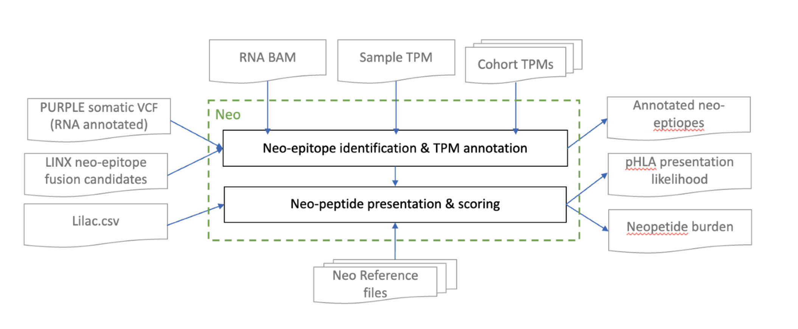
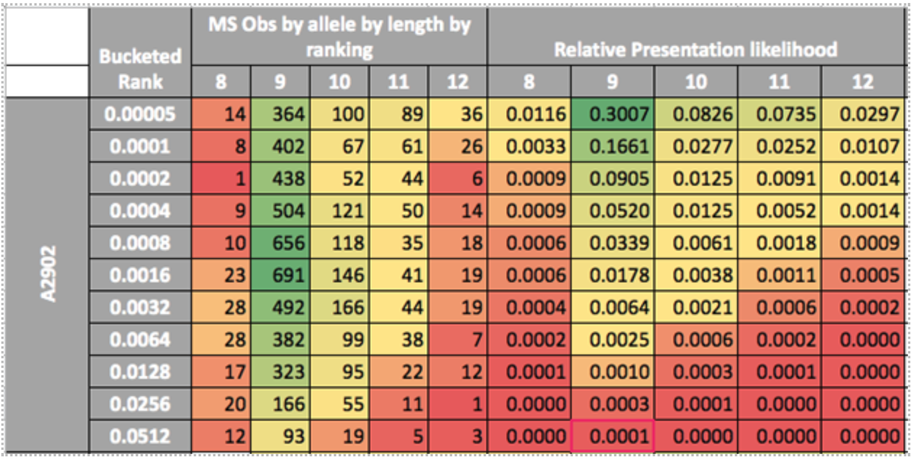
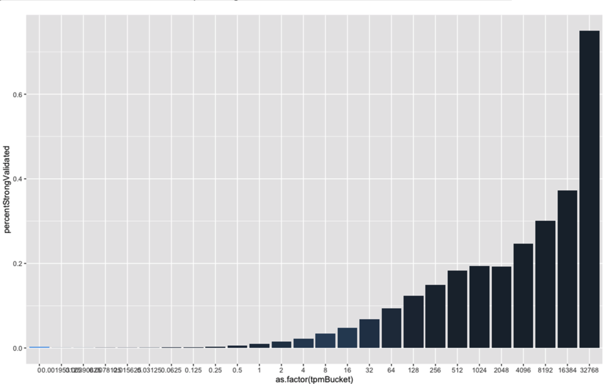

# NEO

The neoepitope pipeline (Neo) works in 2 main steps to form a comprehensive set of neoepitope predictions from our DNA pipeline output: 
- Identification of neoepitopes from all point mutations, small indels and gene fusions.  
- Calculation of allele specific neoepitope binding and  presentation likelihood 
<p align="center">
  
</p>
Although Neo annotates with expression information from RNA (where available), the neoepitope predictions are currently based solely on mutations found in DNA. Hence we specifically ignore RNA events such as circular RNA, RNA editing, endogenous retroviruses and alternative splicing as we are unable to determine if these are tumor specific. High confidence fusions detected in RNA but not found in DNA are also currently ignored (see future improvements). Neo also misses protein level events including non-canonical reading frames, post translational amino acid modifications & proteasomal peptide splicing.

## Commands

For an example neoepitope pipeline covering the commands below see:
https://github.com/hartwigmedical/hmftools/blob/master/pipeline/scripts/run_neo_pipeline

### Linx fusion neoepitopes

Add the config option 'write_neo_epitopes' to the Linx command, eg:

```
java -jar linx.jar 
    -sample SAMPLE_ID 
    -ref_genome_version 37
    -ensembl_data_dir /path_to_ensembl_data_cache/ 
    -purple_dir /path_to_purple_data_files/
    -known_fusion_file known_fusion_data.csv
    -driver_gene_panel DriverGenePanel.tsv
    -output_dir /path_to_linx_output/ 
    -write_neo_epitopes 
```

This will additional write a file of the gene fusion neoepitopes:
SAMPLE_ID.linx.neoepitope.tsv

### Neo neoepitope candidates

Call Neo to process the Purple somatic VCF and Linx fusion neoepitopes file

```
java -cp neo.jar com.hartwig.hmftools.neo.cohort.NeoEpitopeAnnotator
    -sample SAMPLE_ID 
    -ref_genome_version 37 
    -ref_genome /ref_genome_fasta/
    -ensembl_data_dir /path_to_ensembl_data_cache/ 
    -linx_dir /path_to_linx_output/
    -somatic_vcf /path_to_purple_somatic_vcf/
    -output_dir /path_to_neo_output/ 
```

Argument | Description 
---|--- 
req_amino_acids | Number of amino acids up and downstream of the variant to include in the neoepitope (default: 15)

Output file:
SAMPLE_ID.neo.neo_data.tsv

### Isofox fusion neoepitope RNA annotation

If RNA is available, find evidence supporting the fusion neoepitopes:

```
java -java isofox.jar
    -sample SAMPLE_ID 
    -ref_genome_version 37 
    -ref_genome /ref_genome_fasta/
    -ensembl_data_dir /path_to_ensembl_data_cache/ 
    -functions NEO_EPITOPES
    -neo_dir /path_to_neo_output/
    -bam_file /path_to_rna_bam/
    -output_dir /path_to_isofox_output/ 
```

Output file:
SAMPLE_ID.isf.neoepitope.tsv

### Sage somatic variant RNA annotation

If RNA is available, find evidence supporting the somatic variants. Run SageAppend on the Purple somatic VCF.

### Neo neoepitope scoring

Call Neo to evaluate the neoepitope allele peptides. This requires all previous steps plus Lilac allele coverage.
(See https://github.com/hartwigmedical/hmftools/tree/master/lilac)

All resource files for this tool and the WiGiTs pipeline are available for download via the [HMF Resource page](./pipeline/README_RESOURCES.md).

```
java -cp neo.jar com.hartwig.hmftools.neo.scorer.NeoScorer
    -sample SAMPLE_ID
    -cancer_type Lung
    -ref_genome_version 37 
    -ref_genome /ref_genome_fasta/
    -ensembl_data_dir /path_to_ensembl_data_cache/ 
    -score_file_dir /path_to_neo_bind_ref_data/
    -score_file_id cmb_02
    -cancer_tpm_medians_file /path_to_rna_cohort_transcript_medians.csv/
    -neo_dir /path_to_neo_output/
    -isofox_dir /path_to_isofox_output/
    -lilac_dir /path_to_lilac_output/
    -purple_dir /path_to_purple_output/
    -rna_somatic_vcf /path_to_purple_rna_somatic_vcf/
    -output_dir /path_to_neo_output/ 
```

Argument | Description 
---|--- 
score_file_dir | Directory containing scoring reference data (see HMF public resources 'neo_pipeline')
score_file_id | An indicator of the version of the binding reference data
cancer_tpm_medians_file | HMF RNA cohort transcript median TPM file
cancer_type | Cancer type for sample, matching those in cohort TPM medians file, if omitted the pan-cancer medium TPMs will be used
write_types | Values from ALLELE_PEPTIDE (all allele+peptide combinations), NEOEPITOPE (neoepitopes from which peptides are derived)
rank_threshold | A likelihood threshold to write allele+peptide, set as zero or omit to write all to file
rna_sample_suffix | The sample ID suffix for the RNA sample in the Sage Append somatic VCF, default expected RNA sample ID is 'SAMPLE_ID_RNA'

Output file:
SAMPLE_ID.neo.neoepitope.tsv
SAMPLE_ID.neo.peptide_scores.tsv


 
## Algorithm
### Inputs

Neo use the following inputs from the Hartwig WGS pipeline 
- **Somatic variants**: We use the PURPLE somatic.vcf annotated with DP and AD from RNA if available (using SAGE append) 
- **Structural variants**: LINX candidate fusion neoepitopes (optionally produced by LINX). 
- **HLA typing**: LILAC output.  

Where Hartwig WTS pipeline output is available additional annotations are added, an effective TPM and TPM adjusted likelihood is estimated for each neo-epitope. The RNA inputs used are: 
- **Sample WTS BAM**:  Used to assess direct fragment support per neo-epitope 
- **Sample transcript expression (TPM)**: From isofox output  
- **Cohort median expression (TPM)**: Available from HMF resources 

For presentation and immunogenicity predictions, Neo also uses a number of resource files, that are pre-calculated from external resources (including IEDB1, the HLAthena2 publication and the IPD-IMGT/HLA3 database), specifically: 

File Name | Purpose | Allele specific generation 
---|---|---
isofox.transcript_medians.csv | Median TPM per gene per cancer type and pan-cancer | No 
IEDB_known_immungoenic_peptides.csv | IEDB known immunogenic peptides | No 
neo_TPM_likelihood_disribution.csv | Mean pan-allele presentation likelihood by decile and TPM bucket, precalculated from HLAthena data | No 
neo_train_flank_pos_weight.csv | Pre-calculated pan-allele flank position counts and weight matrix | No 
neo_train_pos_weight.csv | Pre-calculated allele specific position counts and weight matrix | Yes 
neo_train_length_specific_score_rand_dist.csv | Pre-calculated percentile ranks of length presentation likelihood for random peptides | Yes 
neo_train_length_specific_rank_to_likelihood.csv | Pre-calculated conversion from length specific likelihood rank to likelihood | Yes 
neo_train_likelihood_rand_dist.csv | Pre-calculated percentile ranks of presentation likelihood for random peptides | Yes
neo_train_exp_likelihood_rand_dist.csv | Pre-calculated percentile ranks of expression presentation likelihood for random peptides | Yes 

### Detailed Algorithm
There are  2  key steps in the Neo pipeline 
- Neoepitope identification & TPM annotation
- Neoepitope presentation & scoring

#### Neo-epitope identification & TPM annotation
We search for potential neoepitopes for point mutations and structural variants which meet the following criteria:

Type | Criteria 
---|---
Point mutations | Filter = ‘PASS’;  Coding effect in (Missense, Frameshift, Inframe, Stop Lost); Ensembl biotype not in  {TR_J,TR_V,TR_D,IG_J,IG_D,IG_J} 
Fusions (intergenic or intragenic) | Rules as per LINX fusion calls with the following exceptions: The 5’ partner breakend for neo-epitopes MUST be in the coding region (exonic or intronic); No restriction applies on the coding context for the 3’ breakend for neoepitopes; Fusions that are predicted to be terminated in the 5’ or 3’are not considered for neo-epitopes; The 3’ transcript biotype for neo-epitope must not be ‘nonsense mediated decay’ 

Subject to the criteria above, all transcripts (or combination of transcripts in the case of fusions) are considered as candidate neoepitopes. Where 2 transcripts (or transcript combinations) lead to either the same amino acid sequence or the amino acid sequence of one transcript forms a subset of another, the transcripts are merged to form a single neoepitope. For each unique neoepitope, Neo outputs the neoepitope amino acid (AA) string broken up into ‘upstream’, ‘novel’ and ‘downstream’ segments as follows: 


Field | Description 
---|---
NeId | Unique Id for neoepitope 
Variant type | One of: {MISSENSE, INFRAME, OUT_OF_FRAME_FUSION, INFRAME_FUSION, FRAMESHIFT} 
VariantInfo | Unique identifier for variant.  For point mutations = [chr]:[position]:[ref]:[alt] ; For SV =  [chrUp]:[posUp]:[orientUp]-[chrDown]:[posDown]:[orientDown]
GeneName | Gene name or fusion name for fusions 
UpAminoAcids | Section of the neoepitope that matches the upstream transcript  
DownAminoAcids | Section of the neoepitope that matches the downstream transcript (if any) 
NovelAminoAcids | Novel section of the neoepitope (if any) 
PeptideCount | # of novel peptides between 8 and 12 bases that form part of neoepitope 
TranscriptsUp | List of transcripts in the up gene that support the neoepitope 
TranscriptsDown | All unique transcripts on the up gene that support the neoepitope 

Note that the precise definition of the novel segment and upstream and downstream AA depend on the type of event. The exact rules are outlined in the table below: 
  

Variant Type | Novel Segment | Upstream flank | Downstream flank
---|---|---|---
Missense SNV/MNV (1) | Ref->Alt AA(s) | Up to 16 AA limited by start codon | Up to 16 AA limited by stop codon 
Inframe (1) | If conservative inframe, inserted AA only else also use flanking disrupted AA on each end | Up to 16 AA limited by start codon | Up to 16 AA limited by stop codon 
Stop_lost / frameshift (1) | All downstream AA until new stop codon reached | Up to 15 AA limited by start codon | NA 
Inframe fusion (Phase=0) (3) | NA (4) | Up to 16 AA limited by start codon | Up to 16 AA limited by stop codon 
Inframe fusion (3)  | (Phase = {1,2}) | Mixed transcript AA (4) | Up to 16 AA limited by start codon | Up to 16 AA limited by stop codon 
Out of frame coding to coding or coding to non-coding fusion | Possible mixed transcript AA + all downstream AA until new stop codon reached (2) | Up to 16 AA limited by start codon | NA (2)

Notes
(1) Where multiple somatic variants are phased within 17 AA, include entire intermediate section as novel AA  
(2) For coding to 5’UTR fusions, if a start codon is reached prior to a novel stop codon and is ‘inframe’, the novel segment should be limited to the region up to the new stop codon with the downstream flank set as the first 17 AA of the 3’ partner. 
(3) For exon deletions, a neo-epitope should only be called if the deleted exon is not skipped in any transcript 
(4) For exonic-exonic fusions, include any inserted sequence.  If novel AA sequence matches next AA of 5’ end, AA should be moved to upstream flank. 

Neo further annotates each of the candidate neoepitopes with TPM and direct RNA fragment support for the novel amino acid sequence. TPM per transcript is sourced from Isofox if RNA is available or if not available is estimated as the median of the cancer type (or full cohort where cancer type is not known).  An ‘expectedTPM’ for each neoepitope is calculated from the TPMUp, and where neo-epitopes share transcripts, the TPMUp is allocated according to the relative proportion of TPMDown expression across all neo-epitopes.    The expectedTPM is also modified by the variant copy number giving: 
```
  ExpectedTpmNeoepitope = AllocatedTPMUp * VariantCopyNumber / CopyNumber* 
```
Note - If expression is inferred from cancer type or cohort, then sample ploidy should be used instead of copy number since samples specific copy number gains or losses will not already be included in the TPM estimates. 
  
The direct fragment count support for each point mutation in the RNA bam is imported from the SAGE VCF. For SV, neo re-analyses the RNA BAM to count the RNA depth at the location of the variant that caused the neoepitope and determine the direct RNA fragment support for the neoepitope (defined as matching precisely the 1st novel AA and 5 bases either side).    
``` 
  Expected TPM of peptide = Sum(neoeptiopes containing peptide) [ExpectedTPMNeoeptiope] 
```
Using these inputs an effectiveTPM for each peptide is calculated as: 
```
  rawEffectiveTPM = FragmentCount * TPMNormalisationFactor 
```
where TPMNormalisationFactor is a sample specific constant used to convert raw fragment counts into an equivalent TPM value.  It is calculated as: 
```
  TPMNormalisationFactor = sum(all missense variants)[ExpectedTPM] / sum(all missense variants)[RNADepth] 
```
Since fragmentCount supports for many variants may be 0 or low integer values, we smooth these values based on the observed TPM for the transcript by blending with the more continuous TPM Up for the transcript using the formula 
```
  effectiveTPM = 0.8 * rawEffectiveTPM + 0.2 * max[inv_poisson75%(FragmentCount)* TPMNormalisationFactor, min[inv_poisson25%(FragmentCount)* TPMNormalisationFactor, expectedTPM]] 
```  
Finally, we adjust for subclonality: 
```
  EffectiveTPM = effectiveTPM * [1 – subClonalLikelihood*(1-(max(0,min(1,variantCN))] 
```
For fusions, we just set subclonal likelihood to 1 so the multiplier is simply min(1,junctionCN). 

Where RNA is not available or if there are no missense variants (and hence not TPMNormalisationFactor), effectiveTPM is set to expectedTPM. 
 
The following table shows all the inputs and outputs of the TPM model which are annotated on each candidate neoepitope: 

Field | Description 
---|---
TPMSource | One of:  ‘Sample’,’CancerType’,’Cohort’ 
TPMUp | Sum of estimated TPM across all transcripts that support the predicted upstream AA sequence 
TPMDown | Sum of estimated TPM across all transcripts that support the predicted downstream AA sequence 
TpmCancerUp | SUM Median TPM for up transcripts for cancer type 
TpmCancerDown | SUM Median TPM for down transcripts for cancer type 
TpmPanCancerUp | SUM Median TPM for down transcripts pan-cancer 
TpmPanCancerDown | SUM Median TPM for up transcripts pan-cancer 
ExpectedTPM | Estimated TPM of the neo-epitope 
RawEffectiveTPM | TPM estimate from direct fragment count 
EffectiveTPM | CombinedTPM estimate from direct fragment count and transcript expression 
RNAFrags | # of fragments supporting the novel RNA sequence 
RNADepth | Total RNA coverage at the last base of the upstream AA sequence 
VariantCopyNumber | Allele copies of the point mutation or structural variant 
CopyNumber | Total chromosomal copies at variant location 
SubclonalLikelihood | Subclonal likelihood of variant (for point mutations only) 
NmdMin | Smallest # of coding bases from stop codon to exon splice junction across all downstream transcripts 
NmdMax | Largest # of coding bases from stop codon to exon splice junction across all downstream transcripts 
CodingBasesMinLength | # of coding bases for shortest fused transcript combination (not presently used) 
CodingBasesMaxLength | # of coding bases for longest fused transcript combination (not presently used) 
FusedIntronLength | Length of fused Intron (not presently used) 
SkippedAcceptorsDonors | # of splice acceptors & donors skipped in transcripts other than those in the fusion transcripts 

#### Neoepitope presentation & scoring

Using the neoepitope predictions, we determine all candidate pHLA ({peptide,allele}) combinations that may be presented by the cell. For each candidate neoepitope, we consider all peptides between 8 and 12 length which either overlap the novel amino acid sequence or overlap BOTH the upstream and downstream amino acid sequence.   

For each pHLA we determine a presentation likelihood (see ADDENDUM 1), a and a  number of immunogenic features.  

The presentation likelihood is also adjusted based on the observed or expected expression per neoepitope to make an expression likelihood (see ADDENDUM 2).   

The outputs are as follows:
Field | Description 
---|---
NeIds | Identifiers of neoepitope from which peptide was obtained (Can be 1 or more) 
VariantType | See neoepitope 
VariantInfo | See neoepitope 
Gene | See neoepitope 
Allele | MHC class 1 allele for which presentation likelihood  have been calculated 
AlleleCN | Copy number of HLA Allele 
AlleleDisrupted | Disruption status of HLA allele ''LOH','SOMATIC' or 'NONE' 
Peptide | Amino acid sequence of peptide 
FlankUp | 5’ flanking amino acid sequence (up to 3 AA) 
FlankDown | 3’ flanking amino acid sequence (up to 3 AA) 
EffectiveTPM | CombinedTPM estimate from direct fragment count and transcript expression 
Score | HMF raw score for {peptide,allele} pairing 
Rank | HMF presentation percentile by length and allele 
Likelihood | Relative likelihood of presentation by allele 
LikelihoodRank | HMF presentation percentile by allele 
ExpLikelihood | Expression adjusted likelihood of presentation by allele  
ExpLikelihoodRank | Expression adjusted presentation percentile by allele 
RecogSim | TO DO
OtherAlleleRecogSim | TO DO

### ADDENDUM 1: pHLA presentation likelihood algorithm 
General assumptions and conventions regarding positions, peptide lengths and HLA allele binding motifs 

#### Position Independence 
Our model assumes that the peptides at each position each have an independent impact on binding and that no correlated effects apply (an assumption held almost universally across tools) 

#### Peptide length mappings 
We support 8-12 length kmers. Our model assumes that anchor (2nd and last peptide position) positions and their surrounding positions have high similarity across peptide length with central peptides variable and relatively less important for binding. We therefore convert all peptides to a 12mer, with the following padding conventions for shorter peptides. 
<p align="center">
  
</p>
  
#### Flanking sequences 
The flanking amino acids upstream and downstream are known to impact cleavage and processing. To capture these impacts we include 3 upstream amino acids (U3,U2,U1) and 3 downstream amino acids (D1,D2,D3) in the model. The enrichment/depletion of amino acids at these positions globally (including ‘X’ where the flanking sequences are beyond the start or end of an allele) is included in the peptide score.  

#### Binding Motifs  
We utilize the same assumptions as netMHCPan (Nielsen et al, 2007) which is that only proximate (within 4 angstroms across a representative set of HLA-A/ HLA-B structures) polymorphic residues may affect binding, which yields 34 distinct positions with the following specificities. 

Position | Proximate Polymorphic Amino Acid Residues 
---|---
0 | 31,83,86,87,90,183,187,191,195 
1 | 31,33,48,69,86,87,90,91,94,123,183 
2 | 94,121,123,138,180,183 
3 | 90,182,183,187 
4 | 93,94,182 
5 | 93,94,97,98,121,180 
6 | 93,97,121,138,171,174,176,180 
7 | 97,100,101,171 
8 | 98,101,104,105,108,119,121,140,142,167,171 

In general we observe that positions with identical binding motifs observe highly similar amino acid weight distributions in mass spectrometry observations.  

#### Binding Motif similarity 
We assume that binding motifs with similarity tend to have similar bindings. We estimate binding motif similarity by summing the log likelihoods from the BLOSUM62 substitution matrix across all binding positions.  

#### Training & Validation Data 
We have curated IEDB and the literature for high quality unbiased monoallelic mass spectrometry results including validating that the datasets were monoallelic and also assessing whether the study did not appear to contain an empirically high rate of likely false positive results (ie. many (full details here). Binding affinity results are not used in the training data due to their inherent experimental selection bias. Overall we identified 20 studies (all included in IEDB) with 413k MS (mass spectrometry) observations across 103 alleles to be used in our training set.   For 8 specific alleles which had no mono-allelic results, but where there was sufficient high quality multi-allelic data (specifically A*69:01, B*35:08, B*41:01, A*26:08, C*15:05, B*44:09,B*44:27 & B*44:28) we included the results from 4 additional studies.     The data is sourced from IEDB

Finally, we also included monoallelic data from the recent Pyke et al publication (Sherpa[https://www.ncbi.nlm.nih.gov/pmc/articles/PMC8318994])
]) which has results from 25 monoallelic cell lines including 6 additional cell lines not represented in the IEDB data.   To eliminate potential experimental artefacts, the Sherpa data was also filtered to include only peptides that were found to be bound to 2 or less distinct alleles.   

Any {peptide;allele} observations found in more than 1 dataset may be counted multiple times towards position matrices. We also have determined the 3 bases flanking both upstream and downstream for each peptide where possible by matching the peptides to the reference proteome.  10% of the full data is held back as a validation dataset.   

#### Construction of Position Weight Matrix (PWM) 
A position weight matrix is constructed per allele per peptide length. To deal with sparsity of data for specific alleles and peptide lengths, we use the following principles to learn from other peptide lengths and alleles: 
- Peptide lengths may learn from other lengths when they lack sufficient allele and length specific data. The more similar the peptide length, the higher the weighting 
- Alleles may learn from other alleles with identical or similar binding motifs for that position when they lack sufficient allele specific data. The more similar the binding motif, the higher the weighting 

This is implemented in a 2 step process. First we consolidate all specific length counts into a single length weighted count (LWCount) for the tested peptide length for each allele using the following formula: 
```
 LWCount(A,L,P,AA) = Count(A,L,P,AA) + LWF * SUM(l<>L) [Count(A,l,P,AA) /abs(L-l)] * maxLW / max( LWF * SUM(l<>L)[Count(A,I,P) /abs(L-l)],maxLW) 
```
Then, using the motif m of the tested allele, we consolidate all matching and similar binding motif observations from other alleles to obtain a total weighted count (WCount) using the following formula: 
```
WCount(A,L,P,AA) = LWCount(A,L,P,AA) + MWF* SUM(a<>A) [ LWCount(a,L,P,AA) * (2^(LogSim(m,M)) / MAX(i=all motifs)[2^(LogSim(i,M))]] * maxMW / max(MWF * SUM(a<>A) [ LWCount(a,L,P) * (2^(LogSim(m,M)) / MAX(i=all motifs)[2^(LogSim(i,M))]],maxMW)  
```
 where:  
```
A=allele  
L= length  
P= Peptide position  
AA = amino acid  
M = binding motif of allele A at position P 
LWF = length weight factor (<=1; default = 0.25) 
MWF = motif weight factor (<=1; default = 0.25) 
maxLW = max length weight (default = 200) 
maxMW = motif weight factor (default = 200) 
Obs(a,l) = observations of peptides of binding allele a and peptide length l 
LogSim(a,b) = Blosum62 log similarity of motifs a and b summed over all motif positions 
```
The output of this is a final weighted position weight matrix for each allele and length.  

#### Scoring and ranking per allele per peptide length 
Each peptide is scored based on the positional amino acid frequencies relative to the amino acid frequency in the proteome: 
```
PeptideScore = Sum[Log2(max(P(x,i),0.005)/Q(x))]  
```
where 
```
P(x,i) = % weight of amino acid = x at position = i (note for C we use 3*weight to correct for MS bias) 
Q(x) = frequency of amino acid = x in the proteome 
```
An additional flank score based on a pan allele flanking PWM is calculated as follows: 
```
 FlankScore = Sum(i=U3-U1,D1-D3)[Log2(P(x,i)/Q(x))] 
```
As has been noted previously by other groups, we do observe enrichment when U1 = ‘M*’ i.e. the first base of a transcript or D1 = ‘X’ the stop codon of a transcript, but not for the other bases in the flanks. Hence for the U1 and D1 base we set the PWM score to be the observed enrichment for ‘M*’ (approximately 2x) and ‘X’ (approximately 4x) respectively. For the other 2 flanking bases on either side we observe no further enrichment in ‘M*’ or ‘X’ and hence set the PWM score simply to 0 (no enrichment or depletion) if they overlap the start or end of the transcript.  

The total score is then set to: 
```
 TotalScore = PeptideScore + FlankScore 
```
The score is converted to a binding rank percentile (per allele per peptide length) by comparing to the percentile scores compared to scores for 100k peptides of the same length randomly from the proteome (note that random peptides are excluded if they are found to be binders already in the MS results). Where flanks are available the rank is given relative to the total score distribution and where not available relative to just the peptide score distribution. 

##### Relative presentation likelihood and ranking per allele (pan peptide length) 
To assess the relative likelihood of presenting peptides of different lengths for a particular allele given the binding ranks, we determine the relative density of mass spectrometry observations in our training set per peptide length per binding rank percentile bucket. The relative likelihood is calculated as: 
```
RelPresentationLikelihood = MSobs(A,Rb,L)/Size(Rb)/SUM(Rb,L)[MSobs(A,Rb,L)/ Size(Rb)] 
```
Where 
```
A = Allele 
L = Peptide Length 
Rb = Rank Bucket. Exponential buckets in powers of 2 are used to reflect the relative importance of the very low binding ranks: {0.00005,0.0001,0.0002,0.0004,...,0.8192} 
```
To deal with sparse MS data, particularly for non-9mers, the density of a given ranking bucket is set to be at least as high as any lower ranked bucket.   Furthermore, so that we can always rank the higher buckets regardless of the number of observations, any bucket with 0 observations is padded with observations of min(totalObservationsPerAllele/1000,0.25) for bucketed rank < 1%, or half the observations of the preceding ranked bucket where the bucketed rank > 1% 
 
The output of this algorithm is a set of weights per bucket per peptide length reflecting the relative likelihood of an observation from that bucket being presented on the surface in that cell. For individual peptides we can predict an exact relative likelihood by interpolating the rank between the bucketed values 

An example of the output for A2902 is shown below indicating that a 9mer with 0.00005 rank is ~28x (ie 0.3007/0.0116) more likely to be presented than an 8mer with the same rank and ~6x (ie 0.3007/0.0520) more likely to be presented as a 9mer with a rank of 0.0004. 
<p align="center">
  
</p>
  
The relative presentation likelihood is calculated for each 4 digit and 2 digit allele with more than 200 MS observations in the training data as well globally for HLA-A, HLA-B and HLA-C. Any 4 digit allele which does not have sufficient MS observations is assigned the likelihoods of the 2 digit allele if available or if not the likelihoods for the HLA gene as a whole. 

A presentation percentile rank is calculated for each allele across all lengths by comparing the relative likelihood of the peptide compared to that of all negative decoy peptides (equal weighted across 8,9,10 and 11mers to give best compatibility to other tool rankings). 

#### Presentation performance Assessment & Optimisation 
For performance assessment compared to mass spectrometry experiments, we assume that the 100k random peptides (after filtering any {peptide,allele} combinations included in the training data) are not binders. This is a conservative assumption as some of the highest ranked random peptides would certainly be expected to bind. Since only the top ~0.1% of peptides are expected to strongly bind, we need a performance metric which focuses on these binders rather than an AUC measurement which may be dominated by the relative performance of very weak predictions. Hence we choose a TPR metric based on a strict binding rank cutoff. To capture the shape of the curve we use a mean across 5 different thresholds: 
```
 meanTPR = mean(TPR0.025%,TPR0.05%,TPR0.1%,TPR0.2%,TPR0.4%) 
```

A detailed comparison of perfrormance to other tools is presented in supplementary note 2 of Martínez-Jiménez, F., Priestley, P., Shale, C. et al. Genetic immune escape landscape in primary and metastatic cancer. Nat Genet 55, 820–831 (2023)[https://www.nature.com/articles/s41588-023-01367-1#Sec29]
 
### ADDENDUM 2: Expression adjusted presentation likelihood algorithm 
#### Training and validation data 
For training the impact of expression on presentation likelihood we use the subset of the mass spectrometry training dataset included with the HLAthena publication (pubmed: 31844290 & 28228285) together with the TPM estimates provided with this publication for the B.721.221 cell line.   For the purpose of the training the TPM of the gene is assumed to be the TPM of the transcript containing the epitope. 

#### TPM adjusted likelihood rank 
To determine the impact TPM expression has on presentation we compared the TPM of the MS identified peptides of strong predicted binders (LRank<0.1%) found to be presented in the HLAthena training data to all predicted strong binders from the proteome for the same alleles. For each log2 TPM bucket we calculate the proportion of pHLA combinations that are found to be presented.   We find this to be a very strong relationship, ranging from a <<1% chance of presentation where TPM < 1 up to higher than 20% chance where TPM > 1000:  

<p align="center">
  
</p>

Using this observed rate of TPM we can calculate: 
```
 ExpAdjLikelihood = PresentationLikelihood * TPMLikelihood / [PresentationLikelihood * TPMLikelihood + (1-PresentationLikelihood) * (1-TPMLikelihood)] 
```
We then calculate a new overall rank globally across all pHLA using the expression adjusted likelihood compared to the same randomly selected peptides. 
  
### Known issues & future improvements  

Model improvements and functional extensions
- **Fusion support count** - Counting of fragments currently ignores partially overlapping core (requires 10 bases up and down) 
- **EffectiveTPM model for samples without RNA** - Frameshift:  F(NMD) ; Fusions: F(NMD model, skippedDonors/Acceptors, intronicLength) )
- **Locally phased variants** - somatic and germline phasing is annotated by SAGE but not yet used in neoantigen predictions
- **Gene characteristics** - Gene Length and # of exons are both meant to be positively correlated with presentation likelihood, and could imrve
- **Gene propensity** - in the HLAthena data we see that some transcripts are strongly underrepresented (eg. TTN) and some are over-represented (eg FASN) in pHLA compared to expectation.  Other tools (eg. Sherpa) have found using a gene specific score to improve presentation predictions, however these observations are largely restricted to the observations of a single cell line, so unclear if this is over fitting
- **Neoantigen burden score** - more investigation required to come up with a robust score
- **Consolidated immunotherapy response likelihood score** - neoantigen burden would ideally be combined with immune infiltration measure + immune escape observations to produce an overall ICI response score
- **Vacine vector design** - Design personalised vaccine vector based on prioritised neoepitopes
- **Immunogenicity metrics** - Various metrics may help to predict recognition (eg. DistanceToProteome; DistanceToNearestBinder; DistanceToKnownImmunogenic; Agretopicity; AA weighting at non binding position), but there is little validation data currently available

Additional neoepitope sources
- **DNA** - IG rearrangements / hypermutation in B-Cell tumors;  integrated viral antigens (particularly HPV);  Bacterial antigens
- **RNA** -  Alternate splicing (novel exon, intron retention,etc); circular RNA; endogenous retroviruses; RNA editing; Non canonical reading frames; high confidence RNA fusions or chimeric splicing not found in DNA 
- **Protein** - Non-canonical reading frames; post translational AA modificatons; proteasomal peptide splicing

## Version History and Download Links
