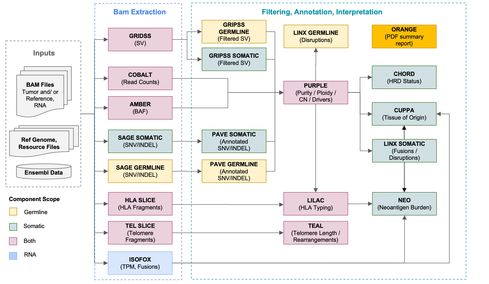

# Running the HMF pipeline with oncoanalyser

## Table of contents

* [Overview](#overview)
* [Supported workflows](#supported-workflows)
* [Usage](#usage)
* [Outputs](#outputs)
* [Future improvements](#future-improvements)
* [Acknowledgements](#acknowledgements)

## Overview

The recommended way to run **hartwigmedical/hmftools** workflows or components is with
[oncoanalyser](https://github.com/nf-core/oncoanalyser), a Nextflow implementation of the HMF pipeline.

A principal aim of oncoanalyser is provide the HMF pipeline in a highly accessible form that is usable with a minimal
set of inputs. This is achieved through flexible predefined configuration for individual tools, prebuilt Docker images
retrieved at runtime for each process, and automated on-demand staging of reference genomes and resource files. The
only required input to run an analysis with oncoanalyser is a sample CSV sheet listing the sample inputs.

Both the WGS/WTS and targeted sequencing workflows are available in oncoanalyser. The targeted sequencing workflow has
built-in support for the TSO500 panel and supports custom targered panels.

As oncoanalyser is written using Nextflow, it supports a range of compute environments including AWS, Azure, GCP, and
HPC. Other features include continuous checkpointing with run resuming and the ability to integrate with [Seqera
Platform](https://seqera.io/platform/), a user-friendly monitoring and management service for Nextflow pipelines.

Further information on Nextflow can be found [here](https://www.nextflow.io/) and generic configuration options are well
described in the [Nextflow documentation](https://www.nextflow.io/docs/latest/index.html).

## Supported workflows

### Workflow inputs

The starting input for oncoanalyser are either FASTQ or BAM files.

If BAMs are used then the following aligners are recommended:

| Sequence Type | Aligner                           | Requirements                                                                                                                                                                                                                              |
| --- |-----------------------------------|-------------------------------------------------------------------------------------------------------------------------------------------------------------------------------------------------------------------------------------------|
| DNA | BWA-MEM,BWA-MEM2 or DRAGEN | • Supplementary alignment soft-clipping (`-Y`)<br />• Duplicate marking with HMF's [MarkDups](https://github.com/hartwigmedical/hmftools/tree/master/mark-dups) tool                                                                      |
| RNA | STAR | • Several **essential** [STAR settings](../isofox#a-note-on-alignment-and-multi-mapping) for WGTS<br />• Duplicate marking with the Picard algorithm<br />• Ensembl v74 annotations for GRCh37<br />• Ensembl v105 annotations for GRCh38 |

> [!WARNING]
> BAMs are expected to have been generated by aligning to the Hartwig-distributed
[GRCh37](https://console.cloud.google.com/storage/browser/hmf-public/HMFtools-Resources/ref_genome/37) or
[GRCh38](https://console.cloud.google.com/storage/browser/hmf-public/HMFtools-Resources/ref_genome/38) reference
genomes.

#### Duplicate marking and UMIs
HMF's MarkDups tool is an alternative to the Picard and Sambamba mark duplicate routines and handles UMIs. 
It highly recommended that BAMs with high rates of duplicates and/or UMIs are re-run through MarkDups - see instructions below.

### WGTS workflow



#### Available analysis types

Require inputs shown as :white_check_mark: for available analyses

| Analysis name | Tumor DNA Fastq or BAM | Normal DNA Fastq or BAM | Tumor RNA Fastq or BAM |
| ---               | :-:                | :-:                | :-:                |
| Tumor/normal WGTS | :white_check_mark: | :white_check_mark: | :white_check_mark: |
| Tumor/normal WGS  | :white_check_mark: | :white_check_mark: | -                  |
| Tumor only WGS    | :white_check_mark: | -                  | -                  |
| Tumor only WTS    | -                  | -                  | :white_check_mark: |

### Targeted sequencing workflow


#### Available analysis types

Require inputs shown as :white_check_mark: for available analyses

| Analysis name | Tumor DNA Fastq or BAM | Tumor RNA Fastq or BAM |
| ---           | :-:                | :-:           |
| Tumor only    | :white_check_mark: | *optional*    |

## Usage

### Software requirements

* Nextflow >=22.10.5 ([instructions](https://www.nextflow.io/index.html#GetStarted))
* Docker ([instructions](https://docs.docker.com/engine/install/#server))

> [!NOTE]
> Docker on Windows and macOS can perform poorly, so only running oncoanalyser on Linux is currently recommended.

> [!WARNING]
> Older versions of Docker may not work with Oncoanalyser. We recommend Docker version 25 or later. If you are
> running an older version of your operating system, you may need to upgrade it in order to use an up to date
> version of Docker.

### Input samplesheet

Running an analysis with oncoanalyser requires a samplesheet describing input files and samples. The samplesheet
contains information that allows oncoanalyser to appropriately group samples (e.g. tumor/normal pairs), locate input
files, and select relevant tools to run.

Each entry in the samplesheet represents a single input file (or, in the case of paired fastq, the forward and reverse fastq files)
and is connected with metadata such as sample/group
identifers, sample type (tumor/normal), sequence type (DNA/RNA), filetype, and info. All entries with the same `group_id`
value will be grouped together for processing, and the composition of a group determines the type of analysis run.

An example samplesheet for the WGTS workflow is shown:

```
group_id,subject_id,sample_id,sample_type,sequence_type,filetype,info,filepath
COLO829_example,COLO829,COLO829T,tumor,dna,bam,,/path/to/COLO829T.dna.bam
COLO829_example,COLO829,COLO829T_RNA,tumor,rna,bam,,/path/to/COLO829T.rna.bam
COLO829_example,COLO829,COLO829R,normal,dna,bam,,/path/to/COLO829R.dna.bam
```

In this example, there is a single group (`COLO829_example`) that contains paired tumor/normal DNA BAMs and an RNA BAM,
so a full tumor/normal WGTS analysis will be run. For futher details on workflow inputs and impact on exection, you can
refer to the [WGTS workflow inputs](#available-analysis-types) and [targeted sequencing workflow
inputs](#available-analysis-types-1) sections.

Multiple groups can also be provided in a single sample sheet:

```
group_id,subject_id,sample_id,sample_type,sequence_type,filetype,info,filepath
COLO829_example,COLO829,COLO829T,tumor,dna,bam,,/path/to/COLO829T.dna.bam
COLO829_example,COLO829,COLO829T_RNA,tumor,rna,bam,,/path/to/COLO829T.rna.bam
COLO829_example,COLO829,COLO829R,normal,dna,bam,,/path/to/COLO829R.dna.bam
SEQC_example,SEQC,SEQCT,tumor,dna,bam,,/path/to/SEQCT.dna.bam
```

Here the `SEQC_example` has been added to the previous example. Since only a tumor DNA BAM is provided for this
additional group, just a tumor-only WGS analysis is run for the SEQC sample.

> [!NOTE]
> Input filepaths can be absolute local paths, URLs, or S3 URIs

> [!WARNING]
> BAM indexes are expected to exist along side the respective input BAM

Although we strongly recommend running MarkDups as part of the pipeline, if you need to run the pipeline skipping
MarkDups, then you can use `bam_markdups`, as opposed to `bam`, in the `filetype` field.
Continuing with the previous example, the following sample sheet would run MarkDups on the `COLO829_example` DNA bams, but
would skip MarkDups on the `SEQC_example` DNA bam:

```
group_id,subject_id,sample_id,sample_type,sequence_type,filetype,info,filepath
COLO829_example,COLO829,COLO829T,tumor,dna,bam,,/path/to/COLO829T.dna.bam
COLO829_example,COLO829,COLO829T_RNA,tumor,rna,bam,,/path/to/COLO829T.rna.bam
COLO829_example,COLO829,COLO829R,normal,dna,bam,,/path/to/COLO829R.dna.bam
SEQC_example,SEQC,SEQCT,tumor,dna,bam_markdups,,/path/to/SEQCT.dna.bam
```

Instead of providing a bam, fastq files can be provided and the pipeline will do align these against the selected
reference genome.
Continuing with the previous example, the following sample sheet would produce the COLO829T DNA bam from fastq files:

```
group_id,subject_id,sample_id,sample_type,sequence_type,filetype,info,filepath
COLO829_example,COLO829,COLO829T,tumor,dna,fastq,lane:001;library_id:COLO829T_library,/path/to/lane001_COLO829T_first_of_pair.fastq.gz;/path/to/lane001_COLO829T_second_of_pair.fastq.gz
COLO829_example,COLO829,COLO829T,tumor,dna,fastq,lane:002;library_id:COLO829T_library,/path/to/lane002_COLO829T_first_of_pair.fastq.gz;/path/to/lane002_COLO829T_second_of_pair.fastq.gz
COLO829_example,COLO829,COLO829T,tumor,dna,fastq,lane:003;library_id:COLO829T_library,/path/to/lane003_COLO829T_first_of_pair.fastq.gz;/path/to/lane003_COLO829T_second_of_pair.fastq.gz
COLO829_example,COLO829,COLO829T,tumor,dna,fastq,lane:004;library_id:COLO829T_library,/path/to/lane003_COLO829T_first_of_pair.fastq.gz;/path/to/lane004_COLO829T_second_of_pair.fastq.gz
COLO829_example,COLO829,COLO829T_RNA,tumor,rna,bam,,/path/to/COLO829T.rna.bam
COLO829_example,COLO829,COLO829R,normal,dna,bam,,/path/to/COLO829R.dna.bam
SEQC_example,SEQC,SEQCT,tumor,dna,bam_markdups,,/path/to/SEQCT.dna.bam
```
> [!NOTE]
> There is a line in the samplesheet for each lane fastq file.

> [!NOTE]
> It is not possible to skip MarkDups on a DNA bam when providing fastq files for alignment.

#### Samplesheet column descriptions

| Column        | Description                                                                                         |
| ---           | ---                                                                                                 |
| group_id      | Group ID for a set of samples and inputs                                                            |
| subject_id    | Subject/patient ID                                                                                  |
| sample_id     | Sample ID                                                                                           |
| sample_type   | Sample type: `tumor`, `normal`                                                                      |
| sequence_type | Sequence type: `dna`, `rna`                                                                         |
| filetype      | File type: `bam`, 'bam_markdups', 'fastq'                                                           |
| info          | For `fastq` file types, specify *lane* and *library id*, e.g. `lane:004;library_id:COLO829_library` |
| filepath      | Absolute filepath to input file (can be local filepath, URL, S3 URI)                                | 

The identifiers provided in the samplesheet are used to set output file paths:

* `group_id`: top-level output directory for analysis files e.g. `output/COLO829_example/`
* tumor `sample_id`: output prefix for most filenames e.g. `COLO829T.purple.sv.vcf.gz`
* normal `sample_id`: output prefix for some filenames e.g. `COLO829R.cobalt.ratio.pcf`

### Example command

To launch oncoanalyser you must provide at least the input samplesheet, the reference genome used for read alignment,
and the desired workflow. When running the targeted sequencing workflow the applicable panel name is also required.

> [!NOTE]
> Setting `-revision` to use a specific version of oncoanalyser is strongly recommended to improve reproducibility and
> stability.

> [!WARNING]
> It is recommended to only run oncoanalyser with Docker, which is done by with `-profile docker`.

#### WGTS workflow command

```
nextflow run nf-core/oncoanalyser \
  -profile docker \
  -revision v0.3.0 \
  --mode wgts \
  --genome GRCh38_hmf \
  --input samplesheet.csv \
  --outdir output/
```

#### Targeted sequencing workflow command

```
nextflow run nf-core/oncoanalyser \
  -profile docker \
  -revision v0.3.0 \
  --mode targeted \
  --panel tso500 \
  --genome GRCh38_hmf \
  --input samplesheet.csv \
  --outdir output/
```

#### Argument descriptions

| Argument       | Group        | Description                                                       |
| ---            | ---          | ---                                                               |
| `-profile`     | Nextflow     | Profile name: `docker` (no other profiles supported at this time) |
| `-revision`    | Nextflow     | Specific oncoanalyser version to run                              |
| `-resume`      | Nextflow     | Use cache from existing run to resume                             |
| `--input`      | oncoanalyser | Samplesheet filepath                                              |
| `--outdir`     | oncoanalyser | Output directory path                                             |
| `--mode`       | oncoanalyser | Workflow name: `wgts`, `targeted`                                 |
| `--panel`      | oncoanalyser | Panel name (only applicable with `--mode targeted`): `tso500`     |
| `--genome`     | oncoanalyser | Reference genome: `GRCh37_hmf`, `GRCh38_hmf`                      |
| `--max_cpus`   | oncoanalyser | Enforce an upper limit of CPUs each process can use               |
| `--max_memory` | oncoanalyser | Enforce an upper limit of memory available to each process        |

## Outputs

The selected results files are written to the output directory and arranged into their corresponding groups by
directories named with the respective `group_id` value from the input samplesheet. Within each group directory, outputs
are further organised by tool.

All intermediate files used by each process are kept in the Nextflow work directory (default: `work/`). Once an analysis
has completed this directory can be removed.

### Sample reports

| Report | Path                                             | Description                                           |
| ---    | ---                                              | ---                                                   |
| ORANGE | `<group_id>/orange/<tumor_sample_id>.orange.pdf` | PDF summary report of key finding of the HMF pipeline |
| LINX   | `<group_id>/linx/MDX210176_linx.html`            | Interactive HMTL report of all SV plots               |

### Pipeline reports

| Report    | Path | Description                                                                                             |
| ---       | ---  | ---                                                                                                     |
| Execution | `pipeline_info/execution_report_*.html`   | HTML report of execution metrics and details                       |
| Timeline  | `pipeline_info/execution_timeline_*.html` | Timeline diagram showing process execution (start/duration/finish) |

## Future Improvements

The following improvements are planned for the next few releases:
* longitudinal analysis of patient samples including ctDNA samples
* cloud-specific instructions and optimisations (ie for AWS, Azure and GCP)

## Acknowledgements

The oncoanalyser pipeline was written by Stephen Watts at the [University of Melbourne Centre for Cancer
Research](https://mdhs.unimelb.edu.au/centre-for-cancer-research) with the support of Oliver Hofmann and the Hartwig
Medical Foundation Australia.
