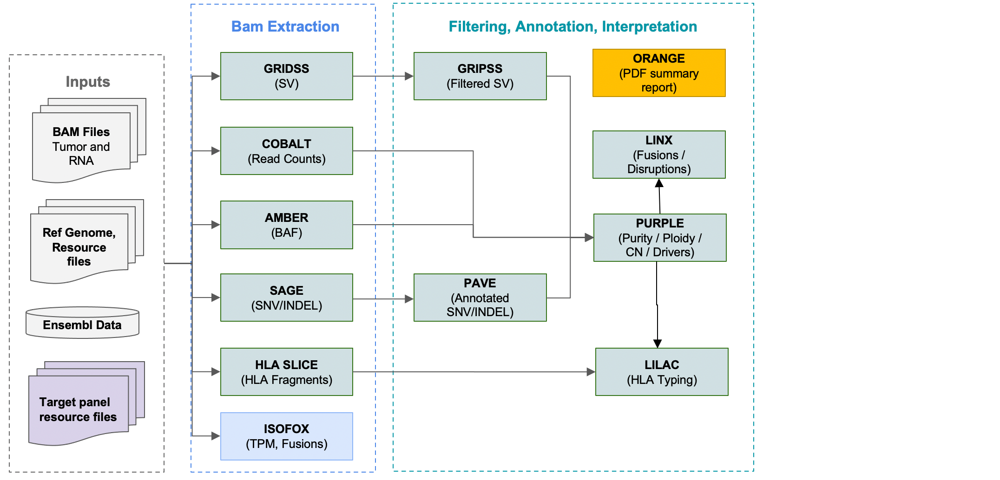

# OncoAnalyser - running the HMF pipeline with NextFlow

## Overview

The recommended method for running the HMF pipeline is to use OncoAnalyser, built with the NextFlow workflow engine.

Nextflow is a free and open-source software distributed under the Apache 2.0 licence, developed by Seqera Labs.
For more information see:
[NextFlow](http://www.nextflow.io)

OncoAnalyser provides a configurable options for running 1 or many samples in parallel on Azure, AWS or a local server cluster.

## Supported modes

### Inputs
OncoAnalyser runs from BAM:
* DNA - recommend bwa-mem / bwa-mem2 or Dragen
* RNA - STAR with settings described [here](https://github.com/hartwigmedical/hmftools/tree/master/isofox): 
* Duplicates marked

The BAMs must be aligned to hg19/GRCh37 or GRCh38.

### WTS / WGS


[TO BE COMPLETED - add RNA components, ie Isofox]

OncoAnalysers uses the same HMF pipeline resource files available here:
[HMFTools-Resources > DNA-Resources](https://console.cloud.google.com/storage/browser/hmf-public/HMFtools-Resources/dna_pipeline/).

### TSO500



[TO BE COMPLETED - add RNA components, ie Isofox]

This pipeline uses standard HMF pipeline resource files plus those required to support TSO500:
[HMFTools-Resources > DNA-Resources](https://console.cloud.google.com/storage/browser/hmf-public/HMFtools-Resources/tso500_pipeline/).


## Installation and Set-up

### Prerequisites

To run OncoAnalyser, please ensure you meet the following software requirements:
* Conda
* Nextflow >=22.10.5
* Docker

### Installation
[TO BE COMPLETED]
conda create -c bioconda -c conda-forge -c defaults -y -n oncoanalyser nextflow 'openjdk >=20.0.0'


## Sample Input File

Example
```
group_id,subject_id,sample_id,sample_type,sequence_type,filetype,filepath
BATCH_01,COLO829,COLO829T,tumor,dna,bam,https://storage.googleapis.com/hmf-public/HMFtools-Resources/dna_pipeline/test_data/COLO_MINI/38/COLO829T.bam
BATCH_01,COLO829,COLO829R,normal,dna,bam,https://storage.googleapis.com/hmf-public/HMFtools-Resources/dna_pipeline/test_data/COLO_MINI/38/COLO829R.bam
BATCH_01,COLO829,COLO829R,rna,rna,bam,https://storage.googleapis.com/hmf-public/HMFtools-Resources/dna_pipeline/test_data/COLO_MINI/38/COLO829T_RNA.bam
```

### Field Explanation 
[TO BE COMPLETED]

Field | Description
---|---
group_id | Patient sample grouping ID
subject_id | ??
sample_id | Sample ID - the tumor will be used in output filenames
sample_type | 'tumor', 'normal' or 'rna'
sequence_type | 'dna' or 'rna'
filetype | 'bam' or ??
filepath | Local path, URL or S3 URI. Bam indees should be localised with te 


## Running the pipeline

### Arguments
[TO BE COMPLETED]

Field | Description
---|---
profile | 'docker', options?
revision | Curerent or specific release version
mode | 'wgts', 'tso500', ??
genome | Reference genome name (version and reference data collection) - options?
input | Sample sheet as described above
outdir | Path for pipeline output files
max_cpus | ..
max_memory | ..
resume | ..

[TO BE COMPLETED]


### Command

```
nextflow run scwatts/oncoanalyser \
  -profile docker \
  -revision v0.2.0 \
  --mode wgts \
  --genome GRCh38_hmf \
  --input samplesheet.csv \
  --outdir output/
```


## Output files and metrics

### HMF pipeline files
As described for each tool 

OncoAnalyser also writes these summary files:
[TO BE COMPLETED]

### HTML files
[TO BE COMPLETED]


## Cloud-specific Guidelines and Performance Tuning
[TO BE COMPLETED]

### AWS
[TO BE COMPLETED]

## Future improvements

The following extensions are planned for OncoAnalyser:
- support for custom panels (ie other than TSO500)
- running the pipeline from FASTQ instead of BAM
- support for running on GCP
