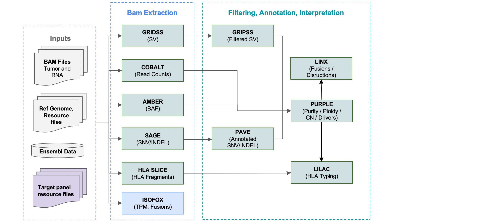

# Targeted NGS Analysis in HMF Tools

The HMF pipeline and tools fully support targeted panel sequencing as well as WGS and WTS.



The output from the pipeline largely matches that of WGS/WTS but with some modules excluded:
* germline analysis is typically disabled (unless the panel is also run for a normal sample)
* Cuppa is disabled
* Chord is disabled and instead Purple is used to estimate HRD
* TMB and MSI have custom calculations routines
* TPM is normalised to be in line with observed WGS rates 

Each panel has tailored input resource files:
* the definition of the panel - the list of genes and any other regions covered
* a set of panel-specific adjustment files - these are the result of a panel training process described below


## Panel-specific resources files

The following files define the panel and are typically compiled manually:

| File Name             | Tool(s)  | Purpose                                                                                                 |
|-----------------------|----------|---------------------------------------------------------------------------------------------------------|
| Driver Gene Panel TSV | Multiple | Defines the set of genes in the panel, and which are reported for various events (SNVs, AMPs, DELs etc) |
| Panel regions BED     | Multiple | Panel's targeted regions, often gene exonic regions, tiles introns for fusions                          |

The following files are the output of the training process described below:

| File Name                        | Tool(s) | Purpose                                                   |
|----------------------------------|--------|-----------------------------------------------------------|
| Target Regions Normalisation TSV | Cobalt | Normalise copy number regions and mask off-target regions |
| Coverage Coding Regions BED      | Sage   | Gene regions to assess coverage                           |
| Actionable Coding Regions BED    | Sage   | Gene coding regions for sensitive variant calling       |
| Additional PON                   | Pave   | Panel-specific PON to apply in addition to standard WGS PON |
| MSI Indels TSV                   | Purple | List of MSI loci to consider in MSI model                 |
| TMB/L Calculation Adjustments    | Purple | Adjustments for TMB/L estimation                          |
| TPM Normalisation                | Isofox | Normalise TPM for genes in panel                          |

These files are then used by the pipeline in panel mode to produce well-calibrated, accurate results ideally without panel-specific biases.

### Coding Regions BED files
The 2 coding region BED files are used by Sage to define panel regions for variant calling and coverage, and typically cover the set of genes' exonic regions only.
The same file can be used for both.

The file(s) can be created manually, or generated automatically from the panel Driver Gene Panel TSV using the routine in the 
[GeneUtils](https://github.com/hartwigmedical/hmftools/tree/master/gene-utils) tool and the section:
"Generating the Sage gene panel regions files"

## Training process to build panel-specific resource files

An initial set of input samples, recommended to number at least 20, are use to 'train' the pipeline. In particular this identifies variance in read depth
and variant calling compared with whole genome and transcriptome.   Note that the assumption of this training is that the _median_ relative copy number for any given gene should not deviate too systematically from the ploidy across the cohort.  In general this is a realtively safe assumption for a pan-cancer dataset, but in cancer specific training sets, there may be certain recurrentlye copy number altered genes that violate this assumption.   

Follow the steps below to produce the training files listed above:

### Cobalt normalisation

1. Run Cobalt on each sample: 

```
java -jar cobalt.jar \
    -tumor SAMPLE_ID \
    -tumor_bam /sample_data/SAMPLE_ID.bam \ 
    -output_dir /sample_data/cobalt \ 
    -gc_profile /ref_Data/GC_profile.1000bp.37.cnp \
    -tumor_only_diploid_bed DiploidRegions.37.bed.gz \
    -threads 10 \ 
```

2. Run Amber on each sample:

Note the parameter change to ensure sufficient read coverage over heterozygous points.

```
java -jar amber.jar com.hartwig.hmftools.amber.AmberApplication \
    -tumor SAMPLE_ID \
    -tumor_bam /sample_data/SAMPLE_ID.bam \
    -loci /path/to/GermlineHetPon.37.vcf.gz \ 
    -tumor_only_min_depth 2 \ 
    -output_dir /sample_data/ \
    -threads 10 \
```

3. Run the Cobalt normalisation file builder command described below.  This performs the following steps
- for each 1K region covering any target region, extract each sample's tumor read count and the GC profile mappability and GC ratio bucket
- calculate median and median read counts for each sample, and overall sample mean and median counts
- normalise each sample's tumor read counts per region
- calculate a median read count from all samples per GC ratio bucket
- write a relative enrichment for each region to the output file, with a min enrichment of 0.1
- if no WGS is available for normalisation, the tumorGCRatio is assumed to be 1 for autosomes. The gender of each sample must be provided. Female samples are excluded from Y chromosome normalisation and males use a tumorGCRatio of 0.5 for the sex chromosomes

The output of this process is a target regions normalisation file with the expected relative enrichment for each on target region.

#### Arguments

Field | Description
---|---
sample_id_file | CSV with SampleId column header
cobalt_dir | Cobalt output directory from step 1 above
amber_dir | Amber output directory from step 2 above
ref_genome_version | V37 or V38
gc_profile | As used in Cobalt and Purple
target_regions_bed | Definition of target regions
output_file | Output normalisation TSV file

#### Command

```
java -cp cobalt.jar com.hartwig.hmftools.cobalt.norm.NormalisationFileBuilder 
  -sample_id_file sample_ids.csv
  -cobalt_dir /training_sample_data/
  -amber_dir /training_sample_data/ 
  -ref_genome_version V37 
  -gc_profile /ref_data/GC_profile.1000bp.37.cnp 
  -target_regions_bed /ref_data/target_regions_definition.37.bed 
  -output_file /training_files/target_regions.cobalt_normalisation.37.tsv 
  -log_debug
```

### Panel specific Pave PONs

In addition to the WGS PON, Pave applies a panel-specific PON for reccurent variants. 
Any non-hotspot variant found 3 or more times with a qual of > 100 is added to the panel PON.

1. Run Sage across each sample

2. Call the Pave PonBuilder to make the additional PON file:

```
java -cp pave.jar com.hartwig.hmftools.pave.resources.PonBuilder \
  -sample_id_file training_sample_ids.csv \
  -vcf_path "/training_sample_data/*.sage.vcf.gz" \
  -ref_genome_version V38 \
  -min_samples 3 \
  -qual_cutoff 100 \
  -output_dir /training_files/ \
  -log_debug \
```

The following manual HOTSPOT variant was added to the PON:
* chr3:142555897:AT>A

### Isofox TPM normalisation

1. Run Isofox for each sample

2. Call the Isofox Normalisation Builder .. (TOOD)

In order to adjust for the degree of amplification in panel sequencing relative to WGS,
1. calculate the median adjusted TPM for each gene across the panel samples.
2. Repeat step 1 for the same list of genes in WGS samples. In instances where the whole genome median is zero, a replacement value of 0.01 is used instead.
3. The adjustment factor is calculated by dividing the panel median value by the corresponding whole genome value for each gene.

Note: The adjustment factors are calculated at the gene level and not at the transcript level. This means the adjusted TPMs for transcripts from panel sequencing are not reliable.


## Pipeline Tool Functional Differences

### Cobalt
Cobalt normalises copy number and masks off target regions according to the CN normalisation file

If a targetRegions file is provided, then a target enrichment rate is calculated simply as the median tumorGCRatio for the specified regions.
Any depth windows outside of the targetRegions file are masked so that they are ignored downstream by PURPLE. 
Depth windows found in the TSV file are normalised first by the overall target enrichment rate for the sample, then by the relativeEnrichment for that depth window and finally by the normal GC bias adjustment.   
The GC bias is calculated using on target regions only.

### Amber

The following filters are applied:
* min_depth (in tumor) > 25
* Tumor ref and alt support >= 2
* Min_depth_percent and max_depth_percent are not applied
* Tumor ref and alt VAF >= 0.05
* Amber loci must be within 300 bases of a target region

### Purple
To estimate MSI, a set of microsatellites with high coverage in the panel must also be defined.

#### MSI estimate

For a set of microsatellite sites defined in the MSI target bed file count the number of passing variants at MSI sites ignoring SNV, MNV and 1 base deletes and requiring a VAF cutoff of > 0.15 for 2 and 3 base deletes or 0.08 for 4+ base deletes or any length insertion.

We estimate MSI rate as:
```
MSIndelsPerMb = 220 * # of MSI variants / # of MSI sites in panel
```

#### TML & TMB estimate

A custom model is used for TMB estimated in targeted mode. The main challenges of the model is to determine variants are included in the TMB estimate. PURPLE selects variants that meet the following criteria:
- Coding effect <> NONE
- GNDFreq <0.00005
- GENE in PANEL and not in {HLA-A,HLA-B,HLA-C,PIM1,BCL2}
- Type = SNV
- !HOTSPOT
- AF < 0.9

Each variant included is classified as ‘somatic’ if somatic likelihood = HIGH.    If somatic likelihood = MEDIUM, then the variant is marked as 'unclear'.

The final somatic count estimate is set to = somatic + unclear^2 / ( CodingBases/170,000 + unclear).

This function is intended to reflect that when the number of unclear variants is less than expected germline variants then most unclear variants will be germline, whereas where the number of unclear variants is very high most will be somatic.

Using this number we then estimate the mutational burden as follows
```
TML = somatic Variant Estimate / CodingBases * RefGenomeCodingBases 
TMB = 0.05 * TML + MSIIndelPerMb
```
The 0.05 conversion from TML to TMB is the empirically observed relationship in the Hartwig database.

For driver likelihood calculations, we assume 20% of variants are biallelic for targeted sequencing samples.

#### Other differences in targeted mode

The following special rules apply to the consrtuction of the driver catalog
- **DELS**: Don’t report DELS >10Mb or if the copy number segment has less than 3 depth windows (unless supported by SV on both sides)
- **PARTIAL_AMP**: only in genes with known pathogenic exon deletions {BRAF, EGFR, CTNNB1, CBL,MET, ALK, PDGFRA}

There is also no somatic fit mode or somatic penalty and no SV recovery in PURPLE in targeted mode.


### Isofox
TPM is normalised to bring panel gene expression in-line with WGS expression rates.


### Sage
Sage is run with specialised parameters and logic to minimise false positives from higher depth. See Sage readme for details.


## Recommended parameter values
The following parameters are calibrated for panel sequencing and are set differently to WGS. These are the default panel parameter values.

Amber

```
-target_regions_bed Target Regions BED file
```

Cobalt
```
-target_region Target Regions Normalisation TSV
-pcf_gamma 50
```

Sage
```
-high_depth_mode
-map_qual_ratio_factor 2.5
-fixed_qual_penalty -15
-hard_min_tumor_vaf 0.002
```

Gripss
```
-hard_min_tumor_qual 200 
-min_qual_break_point 1000
-min_qual_break_end 1000
-filter_sgls
-qual_per_ad 30
-modified_af 0.03
-modified_af_hotspot 0.005
-target_regions_bed Target Regions BED file
```

Purple
```
-target_regions_bed Target Regions BED file
-target_regions_ratios Target Regions Ratios file
-target_regions_msi_indels Target Regions MSI Indels file
-min_diploid_tumor_ratio_count 3
-min_diploid_tumor_ratio_count_centromere 3
-ploidy_penalty_standard_derviation = 0.1
-ploid_penalty_factor = 0.4
-ploidy_penalty_min 0.2
-ploidy_penalty_min_standard_deviation_per_ploidy 1.5
-ploidy_penalty_sub_one_major_allele_multiplier 3
-deviation_penalty_gc_min_adjust 0.25
-gc_ratio_exponent 3.0
```

## Future improvements

* **Off Target normalisation and integration** - This is implemented, but not used as currently does not yield a benefit over on target alone.
MSI thresholds - We could better estimate if we had a more diverse range of samples for testing with known MSIndelsPerMb rates around and above the MSI cutoff.
* **Purity & ploidy estimates** - There are two known issues in panel's purity and ploidy estimations. Relative to the WGS truth set, Purple can at times estimate ploidy at 1/2 of whole genome and estimate purity to be 100%. A somatic readjustment to fix these issues is currently work-in-progress.
* **Exon validation** - Validation on exon sequencing to further inform parameterisation in targeted mode is expected by release 5.35.


## Example Pipeline Scripts

These scripts demonstrate how to run the HMF pipeline in targeted panel mode on a panel tumor BAM.

1. Download the latest release JAR for each tool as listed [here](https://github.com/hartwigmedical/hmftools#current-versions).
- also ensure that samtools (1.10 or higher) and bwa (0.7.17 or higher) are on the path

2. Download the resources files for either GRCh37 or GRCh38 from [HMFTools-Resources > DNA-Resources](https://console.cloud.google.com/storage/browser/hmf-public/HMFtools-Resources/dna_pipeline/).
- The latest resource files version is v5.33.
- The latest resource files for the TSO-500 panel is labeled 'hmf_tso500_pipeline_resources.38_v5.33.gz'
- The reference genome files are available separately [HMFTools-Resources > Ref-Genome](https://console.cloud.google.com/storage/browser/hmf-public/HMFtools-Resources/ref_genome/).

3. Call the pipeline with the following arguments:
- a sample tumorId (eg 'COLO829T')
- the sample data directory with an existing directory named as per the sample's tumorId
- tumor BAM and BAM index files in the sample's directory, named as tumorId.bam
- all required tools in a tools directory
- all required resource files in a resource files directory
- the reference genome version - either 'V37' or 'V38'
- panel mode 'PANEL' (instead of 'WGS')
- number of threads used for each component
- maximum memory allocated to each component (default=12GB)

```
./scripts/run_pipeline ./scripts /sample_data/ /ref_data_dir/ /tools_dir/ COLO829T V38 PANEL 10 16 \
```  
