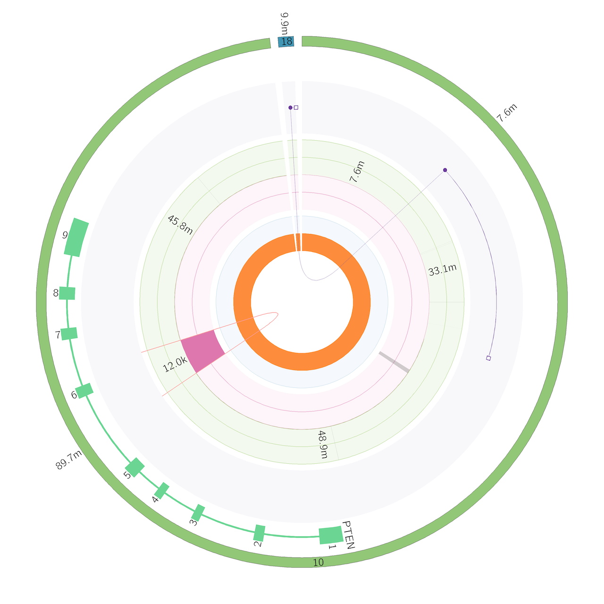

# HMF DNA WGS Example Pipeline

These scripts demonstrate how to run each HMF component in turn to produce DNA variant calling and analysis. 

They match the current tool version, configuration and resource files as used in the current HMF GCP pipeline (see [Platinum](https://github.com/hartwigmedical/platinum)). 

## Set-up

1. Download the latest release JAR for each tool as listed [here](https://github.com/hartwigmedical/hmftools#current-versions).

2. Download the resources files for either GRCh37 or GRCh38 from [HMFTools-Resources > DNA-Resources](https://resources.hartwigmedicalfoundation.nl/). The latest resource files version is v5.31. The reference genome files are available separately [HMFTools-Resources > Ref-Genome](https://resources.hartwigmedicalfoundation.nl/).

3. Call the pipeline with the following arguments:
- a sample tumorId and referenceId (eg 'COLO829T' and 'COLO829R' below)
- the sample data directory with an existing directory named as per the sample's tumorId
- tumor and reference BAM and BAM index files in the sample's directory, named as tumorId.bam and referenceId.bam
- all required tools in a tools directory
- all required resource files in a resource files directory
- the reference genome version - either 'V37' or 'V38'
- number of threads used for each component

```
./scripts/run_pipeline ./scripts \
  /sample_data/ \
  /ref_data_dir/ \
  /tools_dir/ \
  "COLO829T,COLO829R" \
  V37 \
  10 \
```  


## Test data
A trimmed-down set of GRCh37 BAM files are available for COLO829 [here](./test_data). They cover a few driver variants, a fusion and the HLA regions. 
The pipeline takes about 10 mins to run on these. 

## Output
Each component will write its output to a separate directory.
Plots for Purple and Linx are generated to './sample/purple/plots' and './sample/linx_somatic/plots'.

<p align="center">
    
</p>

