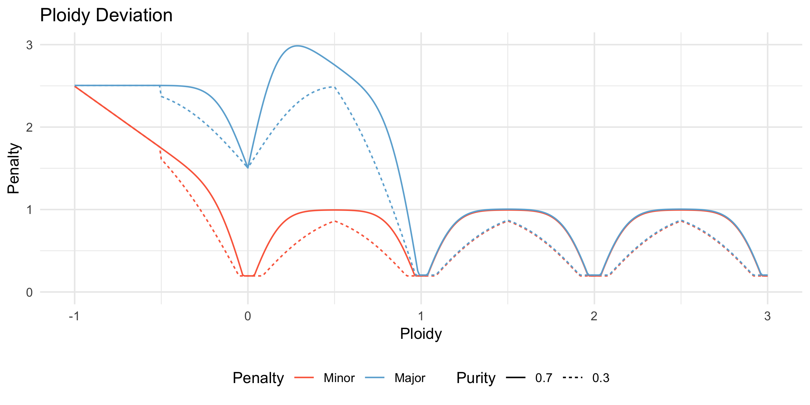
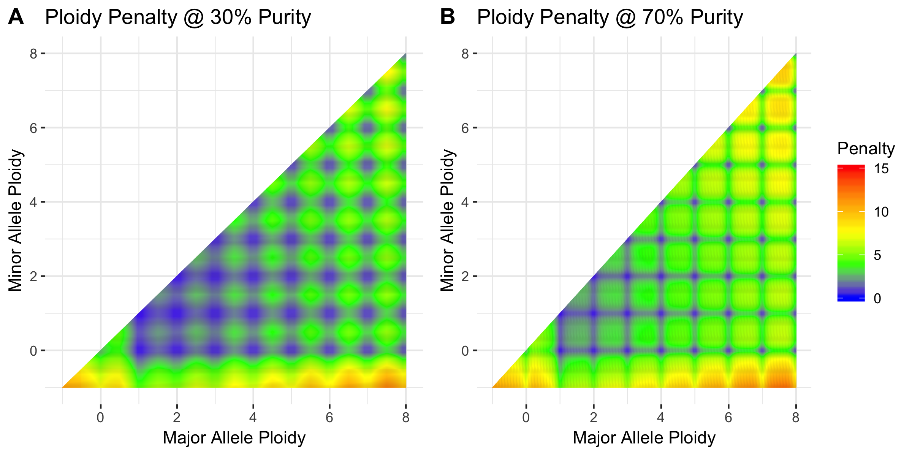
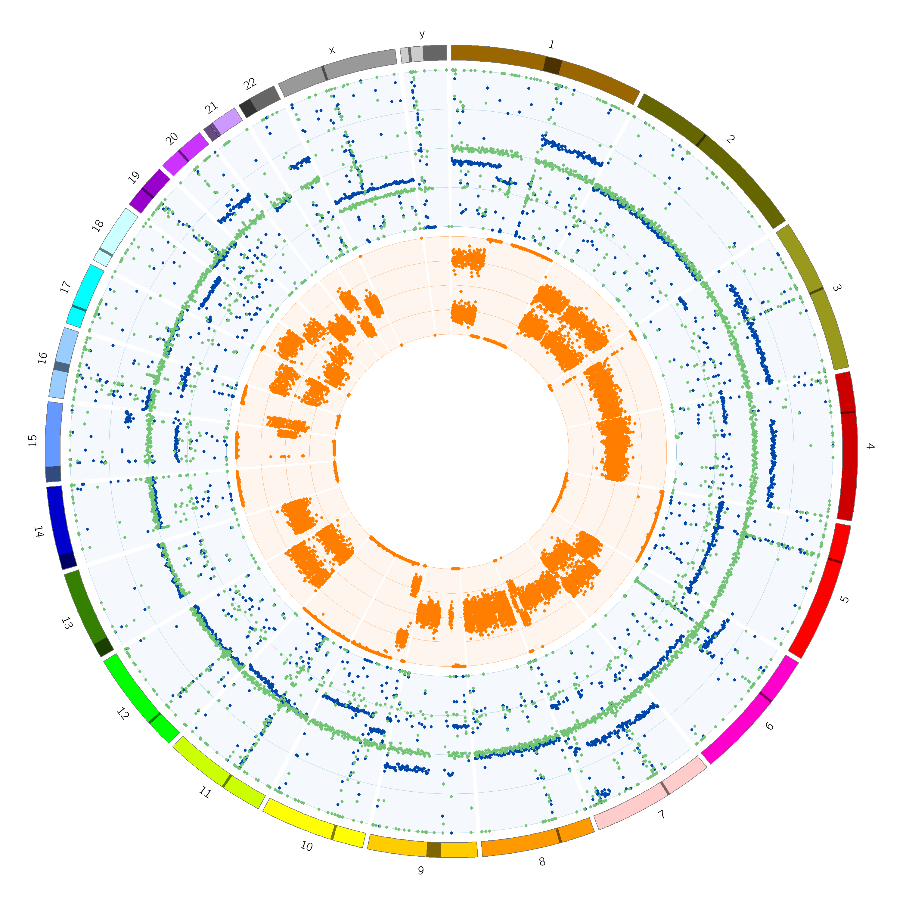
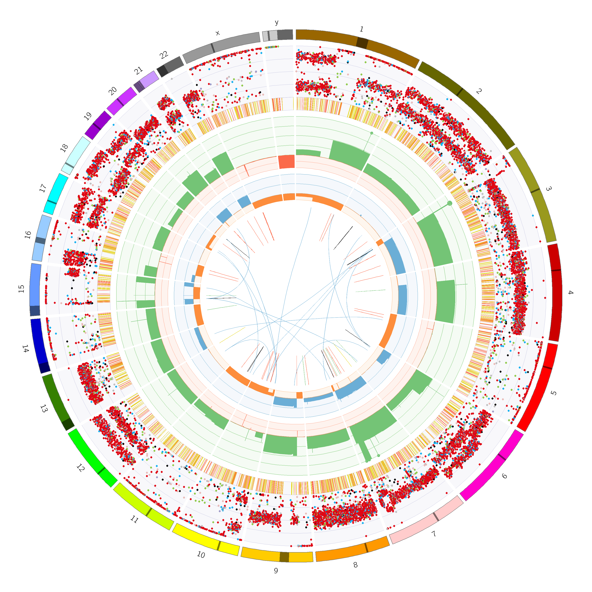

# PURPLE

PURPLE is a **pur**ity **pl**oidy **e**stimator. 
It combines B-allele frequency (BAF), read depth ratios, somatic variants and structural variants to estimate the purity and copy number profile of a tumor sample.

PURPLE supports both grch 37 and 38 reference assemblies. 

## Contents

* [Usage](#usage)
  + [Mandatory Arguments](#mandatory-arguments)
  + [Optional Arguments](#optional-arguments)
  + [Example Usage](#example-usage)
* [Input](#input)
  + [COBALT](#cobalt)
  + [AMBER](#amber)
  + [Structural Variant Input VCFs (optional)](#structural-variant-input-vcfs-optional)
  + [Somatic Variant Input VCF (optional)](#somatic-variant-input-vcf-optional)
* [Algorithm](#algorithm)
  + [1. Gender](#1-gender)
  + [2. Segmentation](#2-segmentation)
  + [3. Sample Purity and Ploidy](#3-sample-purity-and-ploidy)
  + [4. Copy Number Smoothing](#4-copy-number-smoothing)
  + [5. Inferring copy number for regions without read depth information](#5-inferring-copy-number-for-regions-without-read-depth-information)
  + [6. Allele specific ploidy inferring](#6-allele-specific-ploidy-inferring)
  + [7. Structural Variant Recovery and Single Breakend Filtering](#7-structural-variant-recovery-and-single-breakend-filtering)
  + [8. Identify germline copy number alterations that are homozygously deleted in the tumor](#8-identify-germline-copy-number-alterations-that-are-homozygously-deleted-in-the-tumor)
  + [9. Determine a QC Status for the tumor](#9-determine-a-qc-status-for-the-tumor)
* [Output](#output)
  + [Files](#file-output)
  + [CIRCOS](#circos-output)
* [Performance Characteristics](#performance-characteristics)
* [Version History](#version-history)

## Usage

### Mandatory Arguments

Argument  | Description
---|---
reference  | Name of the reference sample. This should correspond to the value used in AMBER and COBALT.
tumor  | Name of the tumor sample. This should correspond to the value used in AMBER and COBALT.
output_dir | Path to the output directory. This directory will be created if it does not already exist. 
amber | Path to AMBER output. This should correspond to the output_dir used in AMBER.
cobalt | Path to COBALT output. This should correspond to the output_dir used in COBALT.
gc_profile | Path to GC profile.

The GC Profile file used by HMF (GC_profile.hg19.1000bp.cnp) is available to download from [HMF-Pipeline-Resources](https://resources.hartwigmedicalfoundation.nl). 
A HG38 equivalent is also available.

### Optional Arguments

Argument | Default | Description 
---|---|---
run_dir | None | If provided, parameters `amber`, `cobalt` and `output_dir` are no longer mandatory and will have default values of <run_dir>/amber, <run_dir>/cobalt and <run_dir>/purple respectively unless overridden.
threads | 2 | Number of threads to use.
somatic_vcf | None | Optional location of somatic variants vcf.  Sample name must match tumor parameter. GZ files supported.
structural_vcf | None | Optional location of structural variants vcf. GZ files supported.
sv_recovery_vcf | None | Optional location of structural variants recovery vcf. GZ files supported.
circos | None | Optional path to circos binary. When supplied, circos graphs will be written to <output_dir>/plot
db_enabled | None | This parameter has no arguments. Optionally include if you wish to persist results to a database. Database initialization script can be found [here](https://github.com/hartwigmedical/hmftools/blob/master/patient-db/src/main/resources/generate_database.sql).
db_user | None | Database username. Mandatory if db_enabled.
db_pass | None | Database password. Mandatory if db_enabled.
db_url | None | Database URL. Should be of format: `mysql://localhost:3306/hmfpatients`. Mandatory if db_enabled.
ref_genome | Detect | Will attempt to detect reference genome from COBALT output but failing that must be either hg18 or hg38.

#### Optional Somatic Fit Arguments
The following arguments control the somatic fit. Changing these values without a through understanding of the system is not recommended.

Argument | Default | Description 
---|---|---
somatic_min_peak | 50 | Minimum number of somatic variants to consider a peak.
somatic_min_total | 300 | Minimum number of somatic variants required to assist highly diploid fits.
somatic_min_purity_spread | 0.15 | Minimum spread within candidate purities before somatics can be used.
somatic_min_purity | 0.17 | Somatic fit will not be used if both somatic and fitted purities are less than this value.
somatic_penalty_weight | 1 | Proportion of somatic penalty to include in fitted purity score.
highly_diploid_percentage | 0.97 | Proportion of genome that must be diploid before using somatic fit.

### Example Usage

```
java -jar purple.jar \
   -reference COLO829R \
   -tumor COLO829T \
   -output_dir /path/to/COLO829/purple \
   -amber /path/to/COLO829/amber \
   -cobalt /path/to/COLO829/cobalt \
   -gc_profile /path/to/GC_profile.hg19.1000bp.cnp \
   -somatic_vcf /path/to/COLO829/COLO829.somatic.vcf.gz \
   -structural_vcf /path/to/COLO829/COLO829.sv.vcf.gz \
   -sv_recovery_vcf /path/to/COLO829/COLO829.sv.all.vcf.gz \
   -circos /path/to/circos-0.69-5/bin/circos \
   -db_enabled -db_user build -db_pass build -db_url mysql://localhost:3306/hmfpatients?serverTimezone=UTC
```

## Input

The PURPLE algorithm relies on the BAF and read depth ratio output from [AMBER](https://github.com/hartwigmedical/hmftools/tree/master/amber) and [COBALT](https://github.com/hartwigmedical/hmftools/tree/master/count-bam-lines) respectively.
They should both be run before running PURPLE. 

It is also strongly recommended to run PURPLE with a high quality set of somatic SNV and INDEL calls and somatic structural variant calls.  

### COBALT

COBALT determines the read depth ratios of the supplied tumor and reference genomes. 

COBALT starts with the raw read counts per 1,000 base window for both normal and tumor samples by counting the number of alignment starts in the respective bam files with a mapping quality score of at least 10 that is neither unmapped, duplicated, secondary, nor supplementary. 
Windows with a GC content less than 0.2 or greater than 0.6 or with an average mappability below 0.85 are excluded from further analysis.

Next we apply a GC normalization to calculate the read ratios. 
We divide the read count of each window by the median read count of all windows sharing the same GC content then normalise further to the ratio of the median to mean read count of all windows. 

Finally, the reference sample ratios have a further ‘diploid’ normalization applied to them to remove megabase scale GC biases. 
This normalization assumes that the median ratio of each 10Mb window (minimum 1Mb readable) should be diploid for autosomes and haploid for sex chromosomes in males in the germline sample.

For more information on how to run COBALT please refer to the [readme](https://github.com/hartwigmedical/hmftools/tree/master/count-bam-lines).


### AMBER

AMBER calculates the BAF of the tumor sample by finding heterozygous locations in the reference sample from a panel of 1,344,880 common germline heterozygous SNP loci. 
The loci were chosen by running the GATK HaplotypeCaller over 1700 germline samples and then selecting all SNP sites which are heterozygous in 800 to 900 of the samples.

To ensure that we only capture heterozygous points, we filter the panel to only loci with allelic frequencies in the reference sample between 40% and 65% and with depth between 50% and 150% of the reference sample genome wide average. 
Furthermore, we filter any loci with a mapping quality < 1 or base quality < 13. 
This typically yields 500k-540k heterozygous germline variants per patient. 

As part of a contamination check, AMBER also finds sites in the tumor that are homologous in the reference sample using the same panel as above. 
A sample is considered contaminated if at least 2000 of these sites contain 3 or more reads supporting an alt in the tumor. 
In this case we model the expected number of non-homologous sites using a poisson distribution and estimate a contamination percent. 
The result of this is included in the amber QC output file.


For more information on how to run AMBER please refer to the [readme](https://github.com/hartwigmedical/hmftools/tree/master/amber).


### Structural Variant Input VCFs (optional)
Providing a high quality set of structural variant calls to PURPLE allows exact base resolution of copy number changes. 
An accurate estimation of VAF at each breakend also allows PURPLE to infer copy number changes even across very short segments of the genome where a depth based estimation is inaccurate or impractical. 
Finally, PURPLE also supports recovery of filtered structural variant calls 

For these purposes, PURPLE provides full support and integration with the structural variant caller [GRIDSS](https://github.com/PapenfussLab/gridss). 
GRIDSS can be run directly on tumor and reference BAMs. 
Alternatively a lightweight version of GRIDSS can be used to re-analyse a set of variant calls and provide additional filtering and accurate VAF estimation.


### Somatic Variant Input VCF (optional)
An high quality set of somatic SNV and INDEL calls can also improve the accuracy and utility of PURPLE. 
If provided, the variants are used for enhancing the purity and ploidy fit in 2 ways. 
Firstly, each solution receives a penalty for the proportion of somatic variants which have implied ploidies that are inconsistent with the minor and major allele ploidy. 
Secondly, for highly diploid samples, the VAFs of the somatic variants are used directly to calculate a somatic variant implied purity.

For both purposes, accurate VAF estimation is essential thus PURPLE requires the ‘AD’ (Alllelic Depth) field in the vcf.
High quality filtering of artifacts and false positive calls is also critical to achieving an accurate fit. 

#### Preparing Strelka output for PURPLE 

HMF currently uses Strelka for somatic calling. A number of transformations are required to prepare Stelka output for use in PURPLE. 
At a minimum this includes:
1. Merging SNP and INDEL output
2. Renaming samples from NORMAL and TUMOR to names consistent with AMBER/COBALT/PURPLE
3. Generating the AD field from Strelka's AU,GU,TU,CU,TIR and TAR fields. The PURPLE jar contains a tool to do (demonstrated below). 

The resultant pipeline might look something like this:

```
### Merge strelka snp and indel output
java -jar /path/to/GenomeAnalysisTK.jar \
    -T CombineVariants \
    -R /path/to/Homo_sapiens.GRCh37.GATK.illumina.fa \
    --genotypemergeoption unsorted \
    -V:snvs strelka.snvs.vcf \
    -V:indels strelka.indels.vcf \
    -o strelka.merged.vcf

### Replace NORMAL and TUMOR with actual sample names
sed -i 's/NORMAL/COLO829R/g' strelka.merged.vcf
sed -i 's/TUMOR/COLO829T/g' strelka.merged.vcf

### Add Allelic Depth field
java -Xmx4G -cp purple.jar com.hartwig.hmftools.purple.tools.AnnotateStrelkaWithAllelicDepth \ 
    -in strelka.merged.vcf -out strelka.merged.annotated.vcf.gz

``` 

At this point, file `strelka.merged.annotated.vcf.gz` is ready to be used by PURPLE. 
The actual HMF somatic pipeline includes a number of additional filtering steps including applying a panel of normals.  

While these steps are specific to Strelka, these principles can be applied to other callers. 

## Algorithm

There are 9 key steps in the PURPLE pipeline described in detail below:
1. Gender determination
2. Segmentation
3. Sample purity and ploidy fitting
4. Copy number smoothing
5. Inferring copy number for regions without read depth
6. Allele specific ploidy inferring
7. Recovery of structural variants and filtering of single breakends
8. Identification of germline copy number alterations that are homozygously deleted in the tumor
9. QC Status for the tumor

### 1. Gender
We examine both the AMBER and COBALT data to independently determine and validate the gender of the sample. 
This includes detecting the presence of Klinefelter syndrome: a chromosomal disorder resulting in 2 or more X chromosome in a male and which we have found to affect 0.2% of the male samples in our cohort. 

To determine the AMBER gender of a sample we examine the number of BAF loci outside the pseudoautosomal region of the X chromosome, anything less than 1k BAF loci is considered male. 
A typical female has 12-13k BAF loci on the X chromosome using our provided BED file. 

To determine the COBALT gender we first use the reference ratio to determine the number of copies of the X chromosome. 
A median X ratio greater than 0.65 is interpreted as 2 copies (note that nearly all female samples are very close to a ratio of 1, but a handful are significantly lower with mosaic X loss). 
If there is only one copy of the X chromosome the sample is male. 
Otherwise, we check for the presence of the Y chromosome as determined by at least 1000 data points with a median ratio > 0.05. 
If the Y chromosome is present (in addition to the 2 copies of the X chromosome), then the sample is male with Klinefelter syndrome. 
In the absence of the Y chromosome the sample is female. 

Finally we compare the AMBER and COBALT genders. 
If they are inconsistent we use the COBALT gender and flag the sample has having failed gender validation. 


### 2. Segmentation

We segment the genome into regions of uniform copy number by combining segments generated from the COBALT read ratios for both tumor and reference sample, the BAF points from AMBER, and passing structural variant breakpoints derived from GRIDSS. Read ratios and BAF points are segmented independently using the Bioconductor copynumber package which uses a piecewise constant fit (PCF) algorithm (with custom settings: gamma = 100, k =1). These segment breaks are then combined with the structural variants breaks according to the following rules:
1. Every structural variant break starts a new segment, as does chromosome starts, ends and centromeres. 
2. Ratio and BAF segment breaks are only included if they are at least one complete mappable read depth window away from an existing segment. 

If the segments identified by the PCF algorithm are not contiguous, then there remains some uncertainty about the actual start position of the segment. 
To address this, we use the PCF break as the start position but also include a min and max start position to capture the uncertainty. 
Segments with SV support are never uncertain. 

Once the segments have been established we map our observations to them. 
In each segment we take the median BAF of the tumor sample and the median read ratio of both the tumor and reference samples. 
We also record the number of BAF points within the segment as the BAFCount and the number of tumor read depth windows within the segment as the depth window count.

A reference sample copy number status is determined at this this stage based on the observed copy number ratio in the reference sample, either ‘DIPLOID’ (0.8<= read depth ratio<=1.2), ‘HETEROZYGOUS_DELETION’ (0.1<=ratio<0.8), ‘HOMOZYGOUS_DELETION’ (ratio<0.1),’AMPLIFICATION’(1.2<ratio<=2.2) or ‘NOISE’ (ratio>2.2). 
The purity fitting and smoothing steps below use only the DIPLOID germline segments.

### 3. Sample Purity and Ploidy

To estimate purity and sample ploidy, we use a model which considers a matrix of all possible sample purities and ploidies and scores each 
possible combination on a segment by segment basis, based on a set of principles which aim to choose the most parsimonious solution for the fit.      

The specific scoring principles applied are the following:
1. **Penalise sub-clonality**:   The major and minor allele of each segment should be close to an integer ploidy for clonal solutions. 
Due to sampling noise, small deviations from integer ploidies will be observed even, but larger deviations require subclonal features and are penalised.
2. **Penalise higher ploidy solutions**:  Higher ploidies have more degenerate fits but are less biologically plausible and are given an event penalty.
3. **Penalise solutions with implausible somatic SNV ploidies**: SNVs in principle occur on only one chromatid and should not be found on both alleles.   
Therefore we penalise solutions where SNV ploidies exceed the major allele ploidy.   
4. **Weigh segments by count of BAF observations**: Segments are weighted by the count of BAF observations which is treated as a proxy for confidence of BAF and read depth ratio inputs.
5. **Place more weight on segments with higher observed BAF**: segments with lower observed BAFs have more degenerate fits and are weighted less in the fit

For each [sample ploidy, purity] combination we calculate a fit score using the following formula

`Fit Score = DeviationPenalty * EventPenaltyMultiplier + SomaticDeviationPenalty`

The  [sample ploidy, purity] combination with the lowest fit score is selected by PURPLE as the final fit score.

Each of the 3 penalty terms is described in detail in the following sections.


#### Deviation Penalty
The deviation penalty aims to penalise [ploidy|purity] combinations which require extensive sub-clonality to explain the observed copy number pattern.

For each [ploidy|purity] combination tested an implied major and minor allele ploidy is calculated based on the observed BAF and depth ratio.    A deviation penalty is then calculated for each segment based on the implied ploidies.   The function used is designed to explicitly capture a set of intuitive rules relating to known biology of cancer genomes, specifically:
- For major allele plody > 1 and minor allele ploidy > 0 a fixed deviation penalty applies
  - the penalty depends only on the distance to the nearest integer ploidy and varies between a minimum of a small baseline deviation [0.2] and a max of 1.
  - For small deviations from an integer don’t occur any additional penalty, but once a certain noise level is exceeded the penalty grows rapidly to reflect the fact the increasing probability that the observed deviation requires a implied non-integer (subclonal) ploidy.
  - The deviation penalty is increased more slowly at lower purities reflecting the increased expected noise.   This is implemented by modeling the penalty as a normal distribution with the standard deviation a function of the purity. 
- An additional and increasing penalty multiplier applies for implied major allele ploidy < 1.   This is intended to capture the relative rarity of large homozygous deletions in cancer genomes, so potential solutions with significant amounts of homozygous deletion are penalised significantly. 
- An additional and increasing penalty also applies for implied minor allele ploidy < 0 to strongly penalise solutions which imply negative copy number and are biologically implausible.

The following chart illustrates the deviation penalty applied for each of minor and major allele ploidy at both 30% and 70% purity.



#### Event Penalty

An event penalty is intended to further penalise [sample ploidy,purity] combinations based on the number of alterations required to get from a normal diploid chromosome to the implied minor and major allele ploidies. 
In particular, this model penalises higher ploidy solutions that can be highly degenerate and lead to low deviation penalties, but are unlikely to be the most parsimonious or biologically plausible solution.  

The event penalty multiplier is given by:

`EventPenalty = 1 + 0.3 * min(SingleEventDistance, WholeGenomeDoublingDistance);`

`WholeGenomeDoublingDistance = 1 + abs(majorAllele - 2) + abs(minorAllele - 2);`

`SingleEventDistance = abs(majorAllele - 1) + abs(minorAllele - 1);`

Note that a diploid segment with implied minor allele ploidy = implied major allele ploidy = 1 has an event penalty of exactly 1 whilst 
all other solutions have increasingly higher multipliers as the minor and major allele deviate further from 1. 
The formula includes an explicit reduced penalty for a doubling of both major and minor allele ploidy since there is a known common 
mechanism of whole genome doubling which can occur in a single event.

The Deviation Penalty and Event Penalty are aggregated independently across all segments that are diploid in the germline and have a tumor 
depth ratio of <3x the average depth. 
An average is calculated for each value weighted by the number of BAF observations in each segment. 
The averaged numbers are multiplied by each other to form an overall ploidy penalty for the sample.

The following chart shows the combined shape of the deviation and event penalty:





#### Somatic Penalty

If somatic variants are provided, an additional somatic penalty is added to fits which lead to somatic variants with ploidies higher than 
the major allele ploidy, since these are biologically implausible. 
This feature was introduced primarily to deal with a degeneracy where in certain situations a lower purity, lower sample ploidy solutions 
may provide a plausible minor and major allele ploidy fit to the copy number data, but imply that many SNVs exceed the major allele ploidy 
which is biologically implausible.

The somatic penalty is determined for each [sample plody,purity] combination by sampling 1000 somatic SNV per tumor and comparing the 
observed ploidy with an upper bound expectation of the variant’s ploidy from the 99.9% percentile of a binomial distribution given the 
major allele at the SNV location. 
The penalty applied to a single SNV is the max(0,impled SNV ploidy - 99.9% expected bound given the major allele). 
The somatic penalty is averaged across the 1000 variants and multiplied by a somaticPenaltyWeight [0.3] constant and added to the ploidy penalty.

#### Candidates
While the lowest scoring purity becomes the fitted purity, we also examine other solutions within 10% or 0.0005 of the best solution. 
These become potential candidates if we need to resort to using the somatic purity described below. 
We also record the min and max of the purity, ploidy and diploid proportions of the candidates to give some context around the confidence in the solution.

Note that a segment is diploid only if both the major and minor allele are between 0.8 and 1.2 inclusive. 

#### Somatic Purity
If any of the candidate solutions are highly diploid (>= 0.97) and there is a wide range (>= 0.15) of valid purities in the candidate solutions we enter somatic mode. 
Once in this mode, the sample status will be changed from NORMAL to one of HIGHLY_DIPLOID, NO_TUMOR or SOMATIC according to the logic described below.  

First we calculate a somatic purity. 
To do this, we use a kernel density estimator to find significant (n >= 50) somatic variant allele frequency peaks. 
Each peak implies a tumor purity of twice the frequency. 
We select the peak that implies the largest purity within the candidate solutions as the somatic purity.

If the somatics are unable to help, either because there are none, or because the somatic purity and the fitted purity are both too low (< 0.17) then we continue to use the fitted purity but flag the solution with a status of HIGHLY_DIPLOID. 

If there are only a small number of somatics variants (< 300) with a sufficiently large (>= 0.1) allelic frequency we will flag the solution as NO_TUMOR and use the somatic purity if it exists otherwise fall back on the fitted purity. 

If we have not met the criteria for HIGHLY_DIPLOID or NO_TUMOR then we set the status to SOMATIC and use the somatic purity.


### 4. Copy Number Smoothing 

Since the initial segmentation algorithm is highly sensitive, and there is a significant amount of noise in the read depth in whole genome sequencing, many adjacent segments will have a similar copy number and BAF profile and are unlikely to represent a real somatic copy number change in the tumor. 
We therefore apply a smoothing algorithm to merge the raw segments into a final set of smoothed copy number regions. 

The following criteria apply when deciding to merge segments:

1. Never merge across a segment breakpoint with structural variant support.
2. Do not merge segments if the minimum BAF count in the segments being compared > 0 and the change in observed BAF > 0.03 and the minor allele tolerance is exceeded. The absolute minor allele tolerance is 0.3 + 0.5 * max(copy number of compared segments) / sqrt (min count of BAF points ).  For tumors with purity < 20% the absolute tolerances are increased inversely proportional to the purity to allow for greater noise in tumour copy number and BAF measurements.
3. Merge segments where the absolute or relative difference in either the copy number or ref normalised copy number is within tolerances. Absolute copy number tolerance is  0.3 + 2 / sqrt(min depth window count). Relative copy number tolerance is 10%. Ref normalised copy number uses the actual germline ratios rather than the typical (1 for autosomes, 0.5 for Y etc.).  Again for tumors with purity < 20% the absolute tolerances are increased.
4. Start from most confident germline diploid segment (highest tumor depth window count) and extend outwards in both directions until we reach a segment outside of tolerance. Then move on to next most confident unsmoothed germline diploid segment. 
5. It is possible to merge in (multiple) segments that would otherwise be outside of tolerances if:
  -  The total dubious region is sufficiently small (<30k bases or <50k bases if approaching centromere); and
  - The dubious region does not end because of a structural variant; and
  - The dubious region ends at a centromere, telomere or a segment that is within tolerances.

When merging segments, the depth window count (number of COBALT windows) of each segment is used as a proxy for confidence and is used to calculate a weighted average of the copy number. 
Similarly, the BAF count is used tom calculated the weighted average BAF. 
The min and max start of the combined region is the minimum from each segment.  

Any regions that are non-diploid in the germline are smoothed over, thus the copy number profile represents the somatic copy number without influence from the germline. 
However, PURPLE can sometimes call somatic amplification in germline amplified regions. 
This feature is supported based on the observation in several samples that double minute amplifications are sometimes detectable as amplifications even in the germline reference sample presumably due to circulating tumor cells in the blood. 
The somatic amplification is called conservatively and must be amplified in the tumor at least 5 times and with at least one extra copy than the smoothed region containing it. 
The region must also be directly adjacent to a structural variant. 


### 5. Inferring copy number for regions without read depth information

Where clusters of SVs exist which are closer together than our read depth ratio window resolution of 1,000 bases, the segments in between will not have any copy number information associated with them. 
We calculate then use ploidies of the structural variants to resolve this.

The outermost segment of any SV cluster will be associated with a structural variant whose ploidy can be determined from the adjacent copy number region and the VAF of the SV. 
Note that if we are inferring from a lower copy number region into a higher one and the VAF is > 0.75 then we use the read depth rather than the VAF to infer a ploidy. 
We use the average copy number and read depth of the sample to do this.

Given a SV ploidy, we use orientation of the structural variant to calculate the change in copy number across the SV and hence the copy number of the outermost unknown segment. 
We repeat this process iteratively and infer the copy number of all regions within a cluster.

When the entire short arm of a chromosome is lacking copy number information (generally on chromosome 13,14,15,21, or 22), the copy number of the long arm is extended to the short arm.


### 6. Allele specific ploidy inferring

Once copy number region smoothing and inference is complete, it is possible there will be regions without BAF points which will result in a unknown allele specific ploidies, since BAF coverage of the genome is limited and many copy number regions can be very small.

For these regions, we infer a BAF and allele specific ploidies of one or more consecutive regions with unknown BAF by first examining neighbouring regions with known allele specific ploidies and inferring based on the observed copy number changes to the unknown regions. 
Where possible, we assume that only one allele changes ploidy in a set of consecutive regions of unknown allele specific ploidy. 
The other allele is held constant.

Which allele ploidy to hold remain constant from the neighbouring region depends on a number of rules including on whether the allele specific ploidy is known on both sides of the unknown region or only one one side.

If only one side of the unknown region is available then we determine which of the major or minor allele of that neighbour to remain constant with the following logic:
- If the unknown region is tiny (<= 30 bases) and is greater in copy number than the neighbour, then hold the minor allele constant.
- Else, find the nearest copy number region where one allele changed by more than 0.5 ploidy and hold constant the allele that did not change.
- Failing everything else, keep the minor allele constant. 

If there is neighbouring information on both sides of the unknown region, then the following rules apply to determine which allele ploidy to hold constant:
- If both the major and minor allele of the neighbours are significantly different (> 0.5) but the minor allele of one matches the major allele of the other ( < 0.5) then choose the matching allele ploidy as the constant ploidy.
- Else, If the major allele of the neighbours is significantly different keep the minor allele constant.
- Else, If the minor allele of the neighbours is significantly different keep the major allele constant.
- Else, If the unknown region is tiny (<= 30 bases), and is greater in copy number than the neighbour with the largest number of BAF observations, then hold constant that neighbours minor allele.  
This rule is intended to deal with the very short overlap which can occur at double strand breaks particularly for LINE insertions.
- Else, If the unknown region is small (<= 1000 bases) and is flanked by large (> 1,000,000 bases) LOH regions, then hold constant the minor allele from the neighbour with the largest number of BAF observations.
This rule is intended to ensure that short templated insertions do not break regions of LOH.
- Else, Find the nearest region on each side (without crossing the centromere) with a change in minor or major allele. If found, re-apply logic from the first three steps. 
- Failing everything else, hold constant the minor allele of the neighbour with the largest number of BAF observations.

At this stage we have determined a copy number and minor allele ploidy for every base in the genome


### 7. Structural Variant Recovery and Single Breakend Filtering 
PURPLE will remove any unlinked, single breakends with very low copy number change support (< 10%). 
In regions of very high copy number an excess of single breakend calls is frequently observed, but nearly always with low VAF support. 
They are presumed to be an artefact and are hence filtered.

PURPLE also attempts to recover entries from a set of lower confidence structural variants if a recovery vcf (parameter: sv_recovery_vcf) is provided.

There are two situations where PURPLE will attempt to recover structural variants. 
The first is when a copy number segment is unsupported by an existing structural variant. 
The second is to search for an structural variant which could offset the copy number impact of an existing “unbalanced” structural variant break that has a ploidy not supported by the copy number change. 
A structural variant is considered unbalanced if the unexplained copy number change (ie. the ploidy - copy number change) is greater than 20% of the copy number at the breakpoint and > 0.5. 
An unbalanced structural variant must also have a min depth window count of 5 in the copy number segments immediately before and after the SV breakpoint.

Eligible recovery candidates must:

1. Be within 1kb of the min and max range of an unsupported copy number breakpoint or within 1kb of the unbalanced structural variant (If not a single breakend, the other breakpoint must also be within 1 kb of the min-max range of a copy number breakpoint)
2. Not be “AF” filtered in GRIDSS (ie. excluding variants with an allelic fraction of less than 0.5% in the tumour)
3. Have a minimum qual score of 1000 for single breakends and 350 for all others.
4. Have a ploidy of at least 50% of the unexplained copy number change and of at least 0.5.

Following the successful recovery or removal of any structural variants we will rerun the segmentation, copy number smoothing and minor allele ploidy smoothing with the updated structural variants to produce a final set of copy number segments and breakpoints. Note that the purity estimation does not change.

### 8. Identify germline copy number alterations that are homozygously deleted in the tumor
During the smoothing process, regions that are homozygously or heterozygously deleted from the germline are smoothed over for the purposes of producing the somatic output. 
However, as some of these regions are of specific interest we include them in a separate germline copy number output that contains the homozygous deletes from the germline as well as any deletes that are heterozygous in the germline but homozygous in the tumor. 


### 9. Determine a QC Status for the tumor
The status field reflects how we have determined the purity of the sample:
- **NORMAL** - PURPLE fit the purity using COBALT and AMBER output.
- **HIGHLY_DIPLOID** - The fitted purity solution is highly diploid (> 95%) with a large range of potential solutions, but somatic variants are unable to help either because they were not supplied or because their implied purity was too low.
- **SOMATIC** - Somatic variants have improved the otherwise highly diploid solution.
- **NO_TUMOR** - PURPLE failed to find any aneuploidy and somatic variants were supplied but there were fewer than 300 with observed VAF > 0.1.

PURPLE also provides a qc status that can fail for the following 3 reasons:
- **FAIL_SEGMENT** - We remove samples with more than 120 copy number segments unsupported at either end by SV breakpoints. This step was added to remove samples with extreme GC bias, with differences in depth of up to or in excess of 10x between high and low GC regions. GC normalisation is unreliable when the corrections are so extreme so we filter.
- **FAIL_DELETED_GENES** - We fail any sample with more than 280 deleted genes. This QC step was added after observing that in a handful of samples with high MB scale positive GC bias we sometimes systematically underestimate the copy number in high GC regions. This can lead us to incorrectly infer homozygous loss of entire chromosomes, particularly on chromosome 17 and 19.
- **FAIL_GENDER** - If the AMBER and COBALT gender are inconsistent we use the COBALT gender but fail the sample.


## Output

### File Output

PURPLE generates a number of tab separated output files as described in the following sections.

#### Purity File 

The purity file `TUMOR.purple.purity` contains a single row with a summary of the purity fit:

Column  | Example Value | Description
---|---|---
Purity  | 0.98 | Purity of tumor in the sample.
NormFactor | 0.64 | Factor to convert tumor ratio to copy number. Lower number implies higher ploidy.
Score | 0.68 | Score of fit.
Diploid Proportion | 0.02 | Proportion of copy number regions that have 1 (+- 0.2) minor and major allele.
Ploidy | 3.10 | Average ploidy of the tumor sample after adjusting for purity.
Gender | MALE | One of MALE, FEMALE or MALE_KLINEFELTER.
Status | NORMAL | One of NORMAL, HIGHLY_DIPLOID, SOMATIC or NO_TUMOR.
PolyclonalProportion | 0.09 | Proportion of copy number regions that are more than 0.25 from a whole copy number
MinPurity | 0.95 | Minimum purity with score within 10% of best. 
MaxPurity | 1.00 | Maximim purity with score within 10% of best.
MinPloidy | 3.08 | Minimum ploidy with score within 10% of best. 
MaxPloidy | 3.13 | Maximim ploidy with score within 10% of best.
Version | 2.24 | Version of PURPLE
SomaticDeviation | 0.00 | Penalty from somatic variants with implied ploidies that are inconsistent with the minor and major allele ploidy. 

#### Purity Range File

The purity range file `TUMOR.purple.purity.range` file summarises the best fit per purity sorted by score. 
Descriptions of the fields are the same as above.

Purity|NormFactor|Score|DiploidProportion|Ploidy|SomaticDeviation
---|---|---|---|---|---
0.9800|0.6400|0.6867|0.0199|3.1076|0.0000
0.9900|0.6400|0.6888|0.0199|3.0965|0.0000
1.0000|0.6300|0.6928|0.0199|3.1345|0.0000

#### Copy Number File

The copy number file `TUMOR.purple.cnv` contains the copy number for all (contiguous) segments of the tumor sample:

Column  | Example Value | Description
---|---|---
Chromosome  | 1 | Chromosome of copy number segment
Start  | 1 | Start base of copy number segment
End  | 87337011 | End base of copy number segment
CopyNumber  | 2.8189 | Fitted absolute copy number of segment adjusted for purity and ploidy
BafCount  | 4464 | Count of AMBER baf points covered by this segment
ObservedBAF  | 0.7094 | Combined reference and tumor BAF **un**adjusted for purity and ploidy
BAF  | 0.7124 | Tumor BAF after adjusted for purity and ploidy
SegmentStartSupport  | TELOMERE | Reason segment was created. Can be CENTROMERE, TELOMERE, a SV type, or NONE.
SegmentEndSupport  | BND | Reason segment ended. Will match SegmentStartSupport of following segment.
Method | BAF_WEIGHTED | Method used to determine copy number. One of BAF_WEIGHTED, STRUCTURAL_VARIANT, LONG_ARM, GERMLINE_AMPLIFICATION
DepthWindowCount | 77277 | Count of COBALT windows covered by this segment
GcContent | 0.4351 | Proportion of segment that is G or C
MinStart | 1 | Minimum start location of this segment if there is any uncertainty.
MaxStart | 1 | Maximum start location of this segment if there is any uncertainty.
MinorAllelePloidy | 0.8165 | Ploidy of minor allele adjusted for purity
MajorAllelePloidy | 2.0076 | Ploidy of major allele adjusted for purity

#### Gene Copy Number File

The gene copy number file `TUMOR.purple.gene.cnv` summarises copy number alterations of each gene in the HMF gene panel:

Column  | Example Value | Description
---|---|---
Chromosome  | 9 | Chromosome gene is on
Start  | 21968055 | Start location of gene transcript
End  | 21974865 | End location of gene transcript
Gene  | CDKN2A | Name of gene
MinCopyNumber  | 2.0098 | Minimum copy number found in the gene exons
MaxCopyNumber  | 2.0098 | Maximum copy number found in the gene exons
SomaticRegions | 1 | Count of somatic copy number regions this gene spans
GermlineHomRegions | 0 | Count of homozygous germline regions this gene spans
GermlineHet2HomRegions | 0 | Count of regions that are heterozygous in the germline but homozygous in the tumor this gene spans
GermlineHet2HomRegions | 0 | Count of regions that are heterozygous in the germline but homozygous in the tumor this gene spans
TranscriptId | ENST00000498124 | Ensembl Transcript ID
TranscriptVersion | 1 | Ensembl Transcript ID Version
ChromosomeBand | p21.3 | Chromosome Band of the gene
MinRegions | 1 | Number of somatic regions inside the gene that share the min copy number
MinRegionStart | 1 | Start base of the copy number region overlapping the gene with the minimum copy number
MinRegionEnd | 28031835 | End base of the copy number region overlapping the gene with the minimum copy number
MinRegionStartSupport | TELOMERE | Start support of the copy number region overlapping the gene with the minimum copy number
MinRegionEndSupport | INV | End support of the copy number region overlapping the gene with the minimum copy number
MinRegionMethod | BAF_WEIGHTED | Method used to determine copy number of the copy number region overlapping the gene with the minimum copy number
MinMinorAllelePloidy | 0 | Minimum allele ploidy found over the gene exons - useful for identifying LOH events  


### CIRCOS Output

When enabled, an input and output diagram will be created in the output/plot directory. 
The first figure shows the input to PURPLE from AMBER and COBALT. 
The second figure shows the output from PURPLE.

A typical input figure is shown below:



The outer circle shows the COBALT ratios of the reference and tumor samples in green and blue respectively.
Note the reference ratios are after GC and diploid normalization have been applied. 
The tumor ratios are after GC normalization has been applied.

The inner circle shows the raw AMBER BAF points in orange.

A typical output figure is shown below:



The outer first circle shows the chromosomes. The darker shaded areas represent large gaps in the human reference genome:  i.e. regions of centromeres, heterochromatin & missing short arms.

The second circle shows the somatic variants (incl. exon, intron and intergenic regions). 
Somatic variants are further divided into an outer ring of single nucleotide polymorphism (SNP) allele frequencies and an inner ring of short insertion/deletion (INDEL) locations.
SNP allele frequencies have been corrected for tumor purity and scale from 0 to 100%.
Each dot represents a single somatic variant.
SNPs are colored according to the type of base change (e.g. C>T/G>A in red) and are in concordance with the coloring used in Alexandrov et al. 2013 Nature paper that describes the use of mutational signatures.
INDELs are colored yellow and red for insertions and deletions respectively.
                                
The third circle shows all observed tumor purity adjusted copy number changes, including both focal and chromosomal somatic events. 
Copy number losses are indicated in red, green shows regions of copy number gain.
The scale ranges from 0 (complete loss) to 6 (high level gains).
If the absolute copy number is > 6 it is shown as 6 with a green dot on the diagram.

The fourth circle represents the observed 'minor allele copy numbers’ across the chromosome.
The range of the chart is from 0 to 3. The expected normal minor allele copy number is 1, and anything below 1 is shown as a loss (orange) and represents a LOH event.
Minor allele copy numbers above 1 (blue) indicate amplification events of both A and B alleles at the indicated locations.

The innermost circle displays the observed structural variants within or between the chromosomes. 
Translocations are indicated in blue, deletions in red, insertions in yellow, tandem duplications in green and inversions in black.

## Performance Characteristics
Performance numbers were taken from a 72 core machine using COLO829 data including generation of CIRCOS diagram but excluding database writing.
Elapsed time is measured in minutes. 
CPU time is minutes spent in user mode. 
Peak memory is measure in gigabytes.

PURPLE has the following characteristics:

Threads | Elapsed Time| CPU Time | Peak Mem
---|---|---|---
1 | 1.5 | 3 | 4.13
2 | 1 | 3 | 4.18
4 | 1 | 3 | 4.38


## Version History
- Upcoming
  - Removed unused columns from GeneCopyNumber output
  - Added minorAllelePloidy and majorAllelePloidy to copy number output
  - Cleaned up names of penalty fields and parameters to be more consistent
- 2.24
  - Recovered SVs were not being used for re-segmentation.
- 2.23
  - Fixed bug where SV VCF samples were being sorted into alphabetical order. Now they will be in same order as input VCF.
- 2.22
  - Added new tool to annotate SNPs and INDELS in strelka output with AD field. Will **not** override existing AD values. 
  - Example Usage: `java -Xmx4G -cp purple.jar com.hartwig.hmftools.purple.tools.AnnotateStrelkaWithAllelicDepth -in strelka.vcf -out strelka.annotated.vcf`
- 2.21
  - No functional changes.
  - Changed ref_sample and tumor_sample parameters to reference and tumor respectively to be consistent with AMBER and COBALT. 
  - Made run_dir parameter optional so long as output_dir, amber and cobalt parameters are set.
- 2.20
  - Added purity and copy number fields to structural variant VCF output
  - Fixed bug in somatic fit logic to only select from candidate purities.
  - Fixed BAF inferring bug
- 2.19
  - Improvements to SV copy number inferring.
  - Improvements to SV recovery.
- 2.18
  - Allow recovery of pon filtered SVs
- 2.17
  - Added HG38 support for gene copy numbers.
  - Look further out to infer baf if there are no amber points in a region.
  - Fixed bug where some structural variant breakpoints were off by one base.  
- 2.16
  - Added support for hg38. Purple will try to automatically detect the ref genome used from the cobalt output otherwise -ref_genome should be set to either hg19 or hg38.
  - Added feature to recover filtered structural variants. If supplied, the recovery vcf will be searched for candidates at any copy number break points that are currently unexplained by an SV.
    If suitable, they will be recovered and included in the segmentation and smoothing algorithms. 
    All passing and recovered structural variants are now written as a VCF to the purple output directory.
- 2.15
  - New ploidy penalty model adopted using minor and major allele ploidy deviation instead of baf and copy number deviation.
  - A somatic deviation penalty has been added to penalise fits which lead to somatic variants with higher ploidies than the major allele ploidy. 
    The 99.9% upper cutoff for binomial distribution from the major allele ploidy is used as a cutoff to mark variants as inconsistent. 
    1000 somatic variants are sampled per tumor, with the somatic penalty equal to the sum of the deviations over the 99.9% cutoff divided by the number of somatic variants sampled.
  - Cutoff to be classified as highly diploid tightened (minor and major allele ploidy must both be between 0.8 and 1.2).
  - If there is <300 variants (all types) with raw vaf > 10% then mark as NO_TUMOR (formerly was if there were >1000 SNP in total). 
    Purity is set to what it would have been if NO_TUMOR rule had not been applied (ie the somatic peak or highly diploid)
- 2.14
  - Added check for excessive deleted genes.
  - Added C11orf95 to gene panel.    