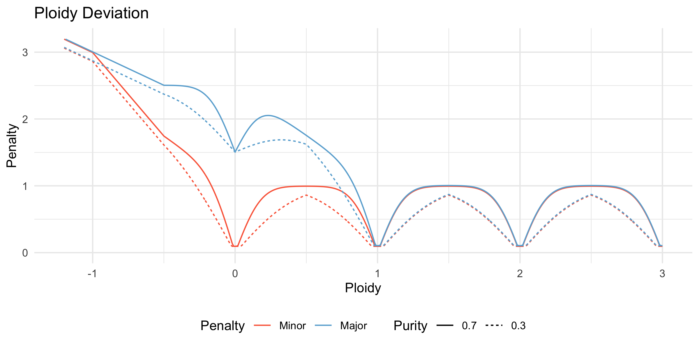
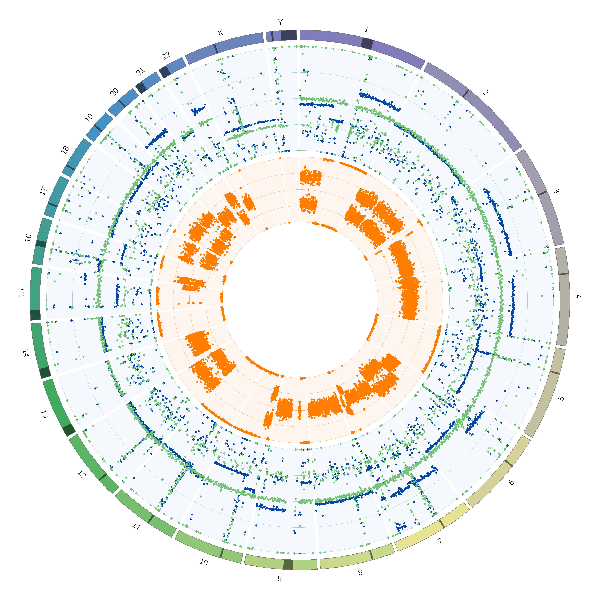
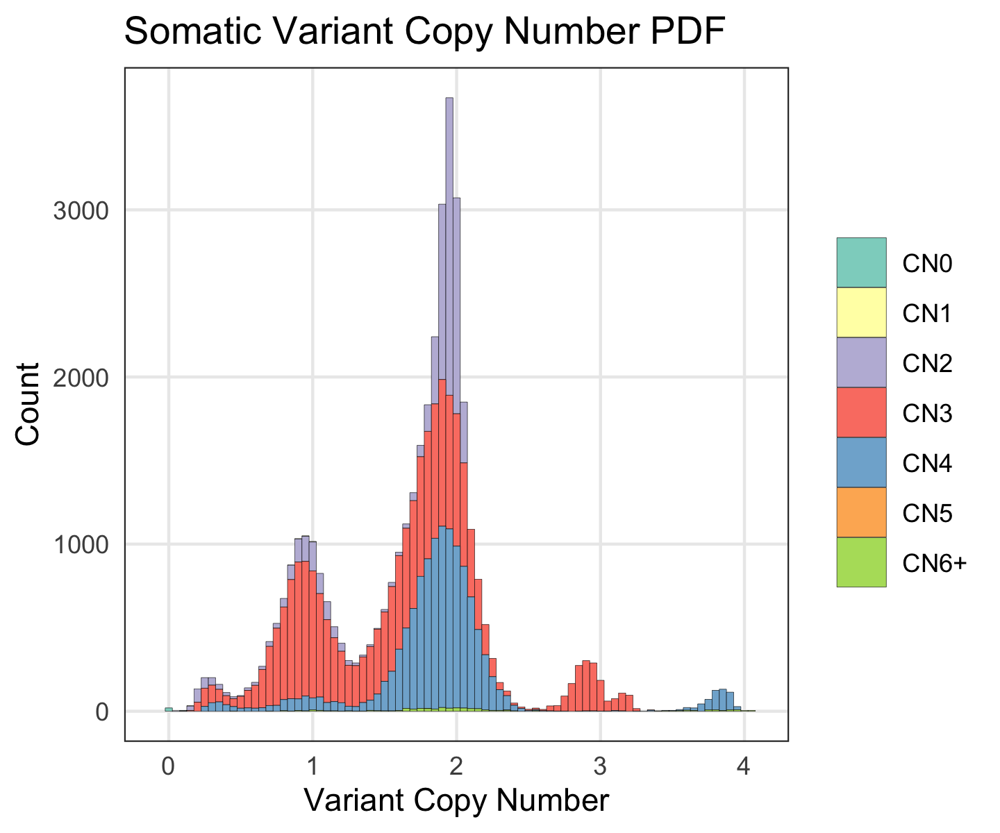
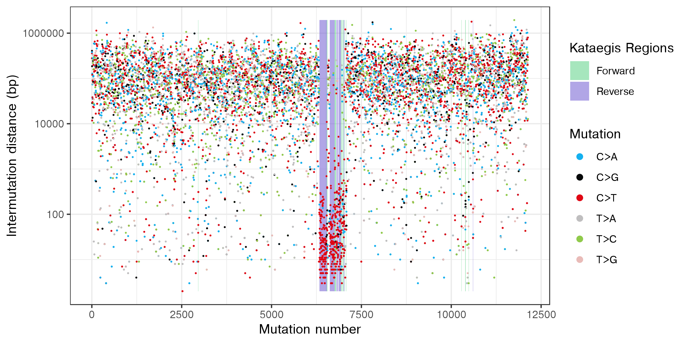
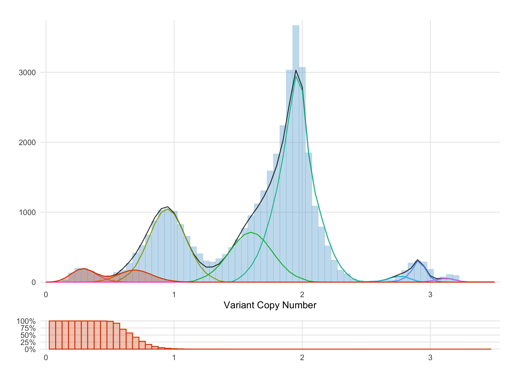

# PURPLE

PURPLE is a **pur**ity **pl**oidy **e**stimator for whole genome sequenced (WGS) data. 

It combines B-allele frequency (BAF) from [AMBER](../amber), read depth ratios from [COBALT](../cobalt), somatic variants and structural variants to estimate the purity and copy number profile of a tumor sample.

PURPLE supports both grch 37 and 38 reference assemblies. 

Whole exome sequenced (WES) data is not supported.

## Contents

* [Installation](#installation)
* [Arguments](#arguments)
  + [Mandatory Arguments](#mandatory-arguments)
  + [Optional Arguments](#optional-arguments)
* [Input](#input)
  + [COBALT](#cobalt)
  + [AMBER](#amber)
  + [Structural Variant Input VCFs (optional)](#structural-variant-input-vcfs-optional)
  + [Somatic Variant Input VCF (optional)](#somatic-variant-input-vcf-optional)
* [Tumor Only Mode](#tumor-only-mode)  
* [Algorithm](#algorithm)
  + [1. Sex](#1-sex-determination)
  + [2. Segmentation](#2-segmentation)
  + [3. Sample Purity and Ploidy](#3-sample-purity-and-ploidy)
  + [4. Copy Number Smoothing](#4-copy-number-smoothing)
  + [5. Inferring copy number for regions without read depth information](#5-inferring-copy-number-for-regions-without-read-depth-information)
  + [6. Allele specific copy number inferring](#6-allele-specific-copy-number-inferring)
  + [7. Structural Variant Recovery](#7-structural-variant-recovery)
  + [8. Identify germline gene_deletions](#8-identify-germline-gene-deletions)
  + [9. Determine a QC Status for the tumor](#9-determine-a-qc-status-for-the-tumor)
  + [10. Somatic enrichment](#10-somatic-enrichment)
  + [11. Germline enrichment](#11-germline-enrichment)
  + [12. Driver Catalog](#12-driver-catalog)
* [Output](#output)
  + [Files](#files)
  + [VCF](#VCF)
  + [Database](#database)
  + [CIRCOS](#circos)
  + [Charts](#charts)
* [Performance Characteristics](#performance-characteristics)
* [Version History / Download Links](#version-history-and-download-links)

## Installation

To install, download the latest compiled jar file from the [download links](#version-history-and-download-links). 
PURPLE also requires the same GC profile as used in COBALT (available from [HMFTools-Resources > Cobalt](https://resources.hartwigmedicalfoundation.nl/) and a reference genome.
While these are sufficient to run PURPLE there are a number of optional dependencies that provide additional functionality.

To generate [output charts](#charts), PURPLE depends on a number of [bioconductor](http://www.bioconductor.org) packages. After installing [R](https://www.r-project.org/) 
or [RStudio](https://rstudio.com/), the chart dependencies can be installed with the following R commands:

```
library(BiocManager)
install("VariantAnnotation")
install("dplyr")
install("ggplot2")
```

Alternatively, PURPLE can be run with the `no_charts` argument which will eliminate the R dependency.

To generate the [CIRCOS output](#circos), CIRCOS must be [downloaded](http://circos.ca/software/download/) and [installed](http://circos.ca/software/installation/). 
Unlike the charts above, CIRCOS charts are not generated by default but only if the `circos` argument is provided. 

To populate a database with the PURPLE output, please follow the instructions in the [database](#database) section.

PURPLE requires Java 1.8+ and can be run with the minimum set of arguments as follows: 

```
java -jar purple.jar \
   -reference COLO829R \
   -tumor COLO829T \
   -output_dir /path/to/COLO829/purple \
   -amber /path/to/COLO829/amber \
   -cobalt /path/to/COLO829/cobalt \
   -gc_profile /path/to/GC_profile.1000bp.37.cnp \
   -ref_genome /path/to/Homo_sapiens_assembly37.fasta
```

We recommend using [GRIDSS](https://github.com/PapenfussLab/gridss) as the structural variant caller and using the following arguments into PURPLE:

```
java -jar purple.jar \
   -reference COLO829R \
   -tumor COLO829T \
   -output_dir /path/to/COLO829/purple \
   -amber /path/to/COLO829/amber \
   -cobalt /path/to/COLO829/cobalt \
   -gc_profile /path/to/GC_profile.1000bp.37.cnp \
   -ref_genome /path/to/Homo_sapiens_assembly37.fasta \
   -somatic_vcf /path/to/COLO829/COLO829.somatic.vcf.gz \
   -structural_vcf /path/to/COLO829/COLO829.sv.high_confidence.vcf.gz \
   -sv_recovery_vcf /path/to/COLO829/COLO829.sv.low_confidence.vcf.gz \
   -circos /path/to/circos-0.69-6/bin/circos \
   -db_enabled -db_user build -db_pass build \
   -db_url mysql://localhost:3306/hmfpatients?serverTimezone=UTC
```

## Arguments

### Mandatory Arguments

Argument  | Description
---|---
reference  | Name of the reference sample. This should correspond to the value used in AMBER and COBALT.
tumor  | Name of the tumor sample. This should correspond to the value used in AMBER and COBALT.
output_dir | Path to the output directory. This directory will be created if it does not already exist. 
amber | Path to AMBER output. This should correspond to the output_dir used in AMBER.
cobalt | Path to COBALT output. This should correspond to the output_dir used in COBALT.
gc_profile | Path to GC profile.
ref_genome | Path to reference genome fasta file.
ref_genome_version | V37 (default) or V38

The GC Profile file used by HMF (GC_profile.1000bp.37.cnp) is available to download from [HMFTools-Resources > Cobalt](https://resources.hartwigmedicalfoundation.nl). 
A 38 equivalent is also available.

The ref genome must be indexed and have an associated sequence dictionary. These can be created with samtools as follows:
```
samtools faidx ref_genome.fasta
samtools dict ref_genome.fasta -o ref_genome.dict
```

### Optional Arguments

Argument | Default | Description 
---|---|---
threads | 2 | Number of threads to use.
germline_vcf | None | Optional location of germline variants vcf. Sample names must match reference parameter. GZ files supported.
somatic_vcf | None | Optional location of somatic variants vcf.  Sample name must match tumor parameter. GZ files supported.
structural_vcf | None | Optional location of high confidence structural variants vcf. GZ files supported.
sv_recovery_vcf | None | Optional location of low confidence structural variants vcf which may be recovered by PURPLE. GZ files supported.
circos | None | Optional path to circos binary. When supplied, circos graphs will be written to <output_dir>/plot
db_enabled | None | This parameter has no arguments. Optionally include if you wish to persist results to a database. Database initialization script can be found [here](https://github.com/hartwigmedical/hmftools/blob/master/patient-db/src/main/resources/generate_database.sql).
db_user | None | Database username. Mandatory if db_enabled.
db_pass | None | Database password. Mandatory if db_enabled.
db_url | None | Database URL. Should be of format: `mysql://localhost:3306/hmfpatients`. Mandatory if db_enabled.
no_charts | NA | Disables creation of (non-circos) charts
tumor_only | NA | [Tumor only mode](#tumor-only-mode)

#### Optional Somatic Fit Arguments
The following arguments control the somatic fit. Changing these values without a thorough understanding of the system is not recommended.

Argument | Default | Description 
---|---|---
somatic_min_peak | 10 | Minimum number of somatic variants to consider a peak.
somatic_min_variants | 10 | Minimum number of somatic variants required to assist highly diploid fits.
somatic_min_purity | 0.17 | Somatic fit will not be used if both somatic and fitted purities are less than this value.
somatic_min_purity_spread | 0.15 | Minimum spread within candidate purities before somatics can be used.
somatic_penalty_weight | 1 | Proportion of somatic penalty to include in fitted purity score.
highly_diploid_percentage | 0.97 | Proportion of genome that must be diploid before using somatic fit.

#### Optional Smoothing Arguments 
The following arguments control the smoothing process. Changing these values without a thorough understanding of the system is not recommended.

Argument | Default | Description 
---|---|---
min_diploid_tumor_ratio_count | 30 | Always smooth over contiguous segments which are fewer than this number of depth windows long and which have no SV support on either side and which are bounded on both sides by copy number regions which could be smoothed together using our normal smoothing rules. This is intended to assist with smoothing residual GC noise in regions of very high or low GC content.  This parameter only works when a SV vcf is provided.    
min_diploid_tumor_ratio_count_centromere | 150 | Always smooth over copy number breakpoints which are fewer than this number of depth windows from the centromere or telomere and which have no further SV breakpoints nearer to the the centromere or telomere.  This is intended to help smooth over noisy mapping in repetitive regions close to the telomere and centromere. 

#### Optional Fitting Arguments 
The following arguments control the fitting behaviour. Changing these values without a thorough understanding of the system is not recommended.

Argument | Default | Description 
---|---|---
min_ploidy | 1 | Minimum ploidy to fit
max_ploidy | 8 | Maximum ploidy to fit
min_purity | 0.08 | Minimum purity to fit to 
max_purity | 1 | Maximum purity to fit to 
purity_increment | 0.01 | Sets the increment from min to max purity  

Min/max purity/ploidy arguments are inclusive.

Purity increments at a fixed rate. Ploidy, however, increments according to the following schedule: 

Min Ploidy | Max Ploidy | Increment
---|---|---
0 | 3 | 0.02
3 | 5 | 0.05
5 | 5+ | 0.1 

#### Optional Driver Catalog Arguments
The following arguments control the driver catalog behaviour.

Argument | Description 
---|---
driver_catalog |  Enables the driver catalog
somatic_hotspots | VCF of somatic hotspot locations. Mandatory if driver catalog enabled.
germline_hotspots | VCF of germline hotspot locations. Mandatory if driver catalog enabled and germline variants supplied.
driver_gene_panel | TSV of driver genes. Mandatory if driver catalog enabled.

The hotspot VCF used by HMF (KnownHotspots.37.vcf.gz) is available to download from [HMFTools-Resources > Sage2](https://resources.hartwigmedicalfoundation.nl). 
A 38 equivalent is also available. The file is used to re-annotate all somatic variants with a HOTSPOT or NEAR_HOTSPOT flag if they are on or within 5 bases of a hotspot. 
Hotspots are assigned a driver likelihood of 1. 

The driver gene panel (DriverGenePanel.37.tsv) and 38 equivalent is also available from [HMFTools-Resources > Gene Panel](https://resources.hartwigmedicalfoundation.nl)

Note that generating the driver catalog for SNVs assumes that the VCF has been annotated with SNPEFF.

## Input

The PURPLE algorithm relies on the BAF and read depth ratio output from [AMBER](https://github.com/hartwigmedical/hmftools/tree/master/amber) and [COBALT](https://github.com/hartwigmedical/hmftools/tree/master/cobalt) respectively.
They should both be run before running PURPLE. 

It is also strongly recommended to run PURPLE with a high quality set of somatic SNV and INDEL calls and somatic structural variant calls.  

### COBALT

COBALT determines the read depth ratios of the supplied tumor and reference genomes. 

COBALT starts with the raw read counts per 1,000 base window for both normal and tumor samples by counting the number of alignment starts in the respective bam files with a mapping quality score of at least 10 that is neither unmapped, duplicated, secondary, nor supplementary. 
Windows with a GC content less than 0.2 or greater than 0.6 or with an average mappability below 0.85 are excluded from further analysis.

Next we apply a GC normalization to calculate the read ratios. 
We divide the read count of each window by the median read count of all windows sharing the same GC content then normalise further to the ratio of the median to mean read count of all windows. 

Finally, the reference sample ratios have a further ‘diploid’ normalization applied to them to remove megabase scale GC biases. 
This normalization assumes that the median ratio of each 10Mb window (minimum 1Mb readable) should be diploid for autosomes and haploid for sex chromosomes in males in the germline sample.

For more information on how to run COBALT please refer to the [readme](https://github.com/hartwigmedical/hmftools/tree/master/cobalt).


### AMBER

AMBER calculates the BAF of the tumor sample by finding heterozygous locations in the reference sample from a panel of 1,344,880 common germline heterozygous SNP loci. 
The loci were chosen by running the GATK HaplotypeCaller over 1700 germline samples and then selecting all SNP sites which are heterozygous in 800 to 900 of the samples.

To ensure that we only capture heterozygous points, we filter the panel to only loci with allelic frequencies in the reference sample between 40% and 65% and with depth between 50% and 150% of the reference sample genome wide average. 
Furthermore, we filter any loci with a mapping quality < 1 or base quality < 13. 
This typically yields 500k-540k heterozygous germline variants per patient. 

As part of a contamination check, AMBER also finds sites in the tumor that are homozygous in the reference sample using the same panel as above. 
A sample is considered contaminated if at least 2000 of these sites contain 3 or more reads supporting an alt in the tumor. 
In this case we model the expected number of non-homozygous sites using a poisson distribution and estimate a contamination percent. 
The result of this is included in the amber QC output file.


For more information on how to run AMBER please refer to the [readme](https://github.com/hartwigmedical/hmftools/tree/master/amber).


### Structural Variant Input VCFs (optional)
Providing a high quality set of structural variant calls to PURPLE allows exact base resolution of copy number changes. 
An accurate estimation of VAF at each breakend also allows PURPLE to infer copy number changes even across very short segments of the genome where a depth based estimation is inaccurate or impractical. 
Finally, PURPLE also supports recovery of filtered structural variant calls 

For these purposes, PURPLE provides full support and integration with the structural variant caller [GRIDSS](https://github.com/PapenfussLab/gridss). 
GRIDSS can be run directly on tumor and reference BAMs. 
Alternatively a lightweight version of GRIDSS can be used to re-analyse a set of variant calls and provide additional filtering and accurate VAF estimation.


### Somatic Variant Input VCF (optional)
An high quality set of somatic SNV and INDEL calls can also improve the accuracy and utility of PURPLE. 
If provided, passing (or unfiltered) variants enhance the purity and ploidy fit in 2 ways. 
Firstly, each solution receives a penalty for the proportion of somatic variants which have implied variant copy numbers that are inconsistent with the minor and major allele copy number. 
Secondly, for highly diploid samples, the VAFs of the somatic variants are used directly to calculate a somatic variant implied purity.

For both purposes, accurate VAF estimation is essential thus PURPLE requires the ‘AD’ (Allelic Depth) field in the vcf.
High quality filtering of artifacts and false positive calls is also critical to achieving an accurate fit. 

#### Preparing Strelka output for PURPLE 

HMF currently uses Strelka for somatic calling. A number of transformations are required to prepare Strelka output for use in PURPLE. 
At a minimum this includes:
1. Merging SNP and INDEL output
2. Renaming samples from NORMAL and TUMOR to names consistent with AMBER/COBALT/PURPLE
3. Generating the AD field from Strelka's AU,GU,TU,CU,TIR and TAR fields. The PURPLE jar contains a tool to do this as demonstrated below. 

The resultant pipeline might look something like this:

```
### Merge strelka snp and indel output
java -jar /path/to/GenomeAnalysisTK.jar \
    -T CombineVariants \
    -R /path/to/Homo_sapiens.GRCh37.GATK.illumina.fa \
    --genotypemergeoption unsorted \
    -V:snvs strelka.snvs.vcf \
    -V:indels strelka.indels.vcf \
    -o strelka.merged.vcf

### Replace NORMAL and TUMOR with actual sample names
sed -i 's/NORMAL/COLO829R/g' strelka.merged.vcf
sed -i 's/TUMOR/COLO829T/g' strelka.merged.vcf

### Add Allelic Depth field
java -Xmx4G -cp purple.jar com.hartwig.hmftools.purple.tools.AnnotateStrelkaWithAllelicDepth \ 
    -in strelka.merged.vcf -out strelka.merged.annotated.vcf.gz

``` 

At this point, file `strelka.merged.annotated.vcf.gz` is ready to be used by PURPLE. 
The actual HMF somatic pipeline includes a number of additional filtering steps including applying a panel of normals.  

While these steps are specific to Strelka, these principles can be applied to other callers. 

## Tumor-Only Mode
Whilst PURPLE is primarily designed to be run with paired normal / tumor data, it is possible to run with tumor data only by including the `tumor_only` flag. 
It is important to first run AMBER and COBALT in tumor only mode. 

[AMBER](../amber#tumor-only-mode) and [COBALT](../cobalt#tumor-only-mode) have native support for tumor only as described in their respective readme files.

Tumor only mode impacts PURPLE in the following ways:
  - Somatic variants are excluded from fitting
  - X and Y chromosomes are excluded from fitting
  - Gender is determined only from AMBER
  - COBALT allosome reference ratios are adjusted according to AMBER gender
  - No germline chromosomal aberrations are detected 


## Algorithm

There are 12 key steps in the PURPLE pipeline described in detail below:
1. Sex determination
2. Segmentation
3. Sample purity and ploidy fitting
4. Copy number smoothing
5. Inferring copy number for regions without read depth
6. Allele specific copy number inferring
7. Recovery of structural variants and filtering of single breakends
8. Identification of germline copy number alterations that are homozygously deleted in the tumor
9. QC Status for the tumor
10. Somatic enrichment
11. Germline enrichment
12. Driver Catalog

### 1. Sex determination

We examine both the AMBER and COBALT data to independently determine and validate the sex of the patient. This includes detecting the presence of Klinefelter syndrome: a chromosomal disorder resulting in 2 or more X chromosome in a male and which we have found to affect 0.2% of the male samples in our cohort.

To determine the sex of a sample with AMBER, we examine the number of heterozygous loci in our provided BED file of 1.3 million common germline SNPs on the X chromosome, outside the pseudoautosomal region.   Anything less than 1k heterozygous loci is considered male. A typical female has 12-13k heterozygous loci.

To determine sex using COBALT, we first use the reference ratio to determine the number of copies of the X chromosome. A median X ratio greater than 0.65 is interpreted as 2 copies (note that nearly all female samples are very close to a ratio of 1, but a handful are significantly lower with mosaic X loss). If there is only one copy of the X chromosome the sample is male. Otherwise, we check for the presence of the Y chromosome as determined by at least 1000 data points with a median ratio > 0.05. If the Y chromosome is present (in addition to the 2 copies of the X chromosome), then the sample is male with Klinefelter syndrome. In the absence of the Y chromosome the sample is female.

Finally we compare the AMBER and COBALT sexes. If they are inconsistent we use the COBALT sex and flag the sample has having failed sex validation.


### 2. Segmentation

We segment the genome into regions of uniform copy number by combining segments generated from the COBALT read ratios for both tumor and reference sample, the BAF points from AMBER, and passing structural variant breakpoints derived from GRIDSS. Read ratios and BAF points are segmented independently using the Bioconductor copynumber package which uses a piecewise constant fit (PCF) algorithm (with custom settings: gamma = 100, k =1). These segment breaks are then combined with the structural variants breaks according to the following rules:
1. Every structural variant break starts a new segment, as does chromosome starts, ends and centromeres. 
2. Ratio and BAF segment breaks are only included if they are at least one complete mappable read depth window away from an existing segment. 

If the segments identified by the PCF algorithm are not contiguous, then there remains some uncertainty about the actual start position of the segment. To address this, we use the PCF break as the start position but also include a min and max start position to capture the uncertainty. Segments with SV support are never uncertain. 

Once the segments have been established we map our observations to them.  In each segment we take the median BAF of the tumor sample and the median read ratio of both the tumor and reference samples.  We also record the number of BAF points within the segment as the BAFCount and the number of tumor read depth windows within the segment as the depth window count.

A reference sample copy number status is determined at this this stage based on the observed copy number ratio in the reference sample, either ‘DIPLOID’ (0.85<= read depth ratio<=1.15), ‘HETEROZYGOUS_DELETION’ (0.1<=ratio<0.85), ‘HOMOZYGOUS_DELETION’ (ratio<0.1),’AMPLIFICATION’(1.15<ratio<=2.2) or ‘NOISE’ (ratio>2.2).  The purity fitting and smoothing steps below use only the DIPLOID germline segments.

### 3. Sample Purity and Ploidy

To estimate purity and sample ploidy, we use a model which considers a matrix of all possible sample purities and ploidies and scores each 
possible combination on a segment by segment basis, based on a set of principles which aim to choose the most parsimonious solution for the fit.      

The specific scoring principles applied are the following:
1. **Penalise sub-clonality**:   The major and minor allele of each segment should be close to an integer ploidy for clonal solutions. Due to sampling noise, small deviations from integer copy numbers will be observed even, but larger deviations require subclonal features and are penalised.
2. **Penalise solutions which deviate from diploid heterozygous copy number**:  Loss of heterozygosity or loss of gain of chromosomal segments requires assumptions additional biological complexity, with the complexity increasing for larger deviations from diploid.  PURPLE uses an event penalty to explicitly penalise deviations from diploid heterozygous copy number
3. **Penalise solutions with implausible somatic SNV copy numbers**: SNVs in principle occur on only one chromatid and should not be found on both alleles.   Therefore we penalise solutions where SNV copy numbers exceed the major allele copy number.   
4. **Weigh segments by count of BAF observations**: Segments are weighted by the count of BAF observations which is treated as a proxy for confidence of BAF and read depth ratio inputs.
5. **Place more weight on segments with higher observed BAF**: segments with lower observed BAFs have more degenerate fits and are weighted less in the fit

For each [sample ploidy, purity] combination we calculate a fit score using the following formula

`Fit Score = DeviationPenalty * EventPenaltyMultiplier + SomaticDeviationPenalty`

The  [sample ploidy, purity] combination with the lowest fit score is selected by PURPLE as the final fit score.

Each of the 3 penalty terms is described in detail in the following sections.


#### Deviation Penalty
The deviation penalty aims to penalise [ploidy|purity] combinations which require extensive sub-clonality to explain the observed copy number pattern.

For each [ploidy|purity] combination tested an implied major and minor allele copy number is calculated based on the observed BAF and depth ratio.    A deviation penalty is then calculated for each segment for both minor and major allele based on the implied copy numbers.   The function used is designed to explicitly capture a set of intuitive rules relating to known biology of cancer genomes, specifically:
- For major allele copy number > 1 and minor allele copy number > 0 a deviation penalty applies to penalise solutions which imply subclonality:
  - the penalty depends only on the distance to the nearest integer copy number and varies between a minimum of a small baseline deviation [0.2] and a max of 1.
  - small deviations from an integer don’t occur any additional penalty, but once a certain noise level is exceeded the penalty grows rapidly to the maximum penalty reflecting the increasing probability that the observed deviation requires an implied non-integer (subclonal) copy number.
  - The deviation penalty is increased more slowly at lower purities reflecting the increased expected noise.   This is implemented by modeling the penalty as a normal distribution with the standard deviation a function of the purity. 
  - An additional and increasing penalty multiplier applies for implied major allele copy number < 1.   This is intended to capture the relative rarity of large homozygous deletions in cancer genomes, so potential solutions with significant amounts of homozygous deletion are penalised significantly. 
- An additional and increasing penalty also applies for implied minor allele copy number < 0 to strongly penalise solutions which imply negative copy number and are biologically implausible.

The following chart illustrates the deviation penalty applied for each of minor and major allele copy number at both 30% and 70% purity.



The total deviation penalty is calculated by adding the minor and major allele deviation penalty.   It is weighted by the observedBAF (which varies between 0.5 and 1) to reflect that higher BAF regions have fewer possible solutions.  The formula used is: 

`Deviation Penalty = (MinorAlleleDeviationPenalty + MajorAlleleDeviationPenalty) * ObservedBAF` 

#### Event Penalty

An event penalty is intended to further penalise [sample ploidy,purity] combinations based on the number of alterations required to get from a normal diploid chromosome to the implied minor and major allele copy number.  In particular, this model penalises higher ploidy solutions that can be highly degenerate and lead to low deviation penalties, but are unlikely to be the most parsimonious or biologically plausible solution.  

The event penalty multiplier is given by:

`EventPenalty = 1 + 0.3 * min(SingleEventDistance, WholeGenomeDoublingDistance);`

`WholeGenomeDoublingDistance = 1 + abs(majorAllele - 2) + abs(minorAllele - 2);`

`SingleEventDistance = abs(majorAllele - 1) + abs(minorAllele - 1);`

Note that a diploid segment with implied minor allele copy number = implied major allele copy number = 1 has an event penalty of exactly 1 whilst all other solutions have increasingly higher multipliers as the minor and major allele deviate further from 1. The formula includes an explicit reduced penalty for a doubling of both major and minor allele copy number since there is a known common mechanism of whole genome doubling which can occur in a single event.

The Deviation Penalty and Event Penalty are aggregated independently across all segments that are diploid in the germline and have a tumor depth ratio of <3x the average depth. An average is calculated for each value weighted by the number of BAF observations in each segment.  The averaged numbers are multiplied by each other to form an overall ploidy penalty for the sample.

The following chart shows the combined shape of the deviation and event penalty:


#### Somatic Penalty

If somatic variants are provided, an additional somatic penalty is added to fits which lead to somatic variants with variant copy number higher than the major allele copy number, since these are biologically implausible. This feature was introduced primarily to deal with a degeneracy where in certain situations a lower purity, lower ploidy solutions may provide a plausible minor and major allele copy number fit to the copy number data, but imply that many SNVs exceed the major allele copy number 
which is biologically implausible.

The somatic penalty is determined for each [sample ploidy,purity] combination by sampling 1000 somatic SNV per tumor and comparing the observed major allele copy number with an upper bound expectation of the variant’s copy number from the 99.9% percentile of a binomial distribution given the major allele at the SNV location. The penalty applied to a single SNV is the max(0,implied SNV copy number - 99.9% expected bound given the major allele). The somatic penalty is averaged across the 1000 variants and multiplied by a somaticPenaltyWeight [0.3] constant and added to the ploidy penalty.

#### Candidates

While the lowest scoring purity becomes the fitted purity, we also examine other solutions within 10% or 0.0005 of the best solution. These become potential candidates if we need to resort to using the somatic purity described below. 
We also record the min and max of the purity, ploidy and diploid proportions of the candidates to give some context around the confidence in the solution.

Note that a segment is diploid only if both the major and minor allele are between 0.8 and 1.2 inclusive. 

#### Somatic Purity

If any of the candidate solutions are highly diploid (>= 0.97), PURPLE checks first for the presence of TUMOR.  If NONE of the following criteria are satisfied, then PURPLE sets qcStatus = FAIL_NO_TUMOR, fitMethod=NO_TUMOR and sets purity to min_purity value [0.08]:
- Tumor has one or more HOTSPOT SV or point mutation
- SNV sum(allele read count) > 5000
- SV sum(startTumorVariantFragmentSupport) > 1000 (excluding SGL breakends)
- Tumor has 3000 BAF points in germline DIPLOID regions regions with tumor ratio < 0.8 OR > 1.2 (ie. evidence of at least some aneuploidy)

If a tumor is detected, and there is a wide range (>= 0.15) of valid purities in the candidate solutions and a somatic point mutation vcf has been supplied then a somatic mode of fitting is triggered, since there may be insufficient copy number events to resolve a purity.   In this case, PURPLE fits somatic peaks in VAF space. 

First PURPLE groups all somatic SNV by VAF with 0.6 x AverageTumorDepth < totalReadCount < 1.4x AverageTumorDepth. A kernel density estimator is used to find peaks in the VAF range [min_purity-min(0.5,max_purity)], and the somatic fitted purity is set to 2* the highest VAF peak with weight > max(10,3% SNV count in depth range).   If no peak meets this criteria but the sample has at least 10 SNV within the depth range in total choose 2 * VAF peak with the greatest count, else set the purity to min_purity [0.08]

If (somatic fitted purity and the copy number fitted purity are both < 0.17 AND the somatic purity > copy number purity) OR if there are no SNV that meet the VAF criteria, then use the copy number fit and set fitMethod = NORMAL.   Otherwise use the somatic fitted purity, set ploidy =2 and set fit method = SOMATIC.

Finally, in case of tumors with very low SNV counts (<1000 total SNV) but with known hotpsot mutations, PURPLE checks if the VAF of any hotspot mutations is not outside the expected distribution of the fitted somatic VAF peak (p<0.01).  If the VAF of the hotspot is significantly higher than the fitted VAF peak, then PURPLE sets the purity to 2x maximum hotspot VAF. 

### 4. Copy Number Smoothing 

Since the initial segmentation algorithm is highly sensitive, and there is a significant amount of noise in the read depth in whole genome sequencing, many adjacent segments will have a similar copy number and BAF profile and are unlikely to represent a real somatic copy number change in the tumor. We therefore apply a smoothing algorithm to merge the raw segments into a final set of smoothed copy number regions. 

The following criteria apply when deciding to merge segments:

1. Never merge across a segment breakpoint with structural variant support.
2. Do not merge segments if the minimum BAF count in the segments being compared > 0 and the change in observed BAF > 0.03 and the minor allele tolerance is exceeded. The absolute minor allele tolerance is 0.3 + 0.5 * max(copy number of compared segments) / sqrt (min count of BAF points ).  For tumors with purity < 20% the absolute tolerances are increased inversely proportional to the purity to allow for greater noise in tumor copy number and BAF measurements.
3. Merge segments where the absolute or relative difference in either the copy number or ref normalised copy number is within tolerances. Absolute copy number tolerance is 0.3 + 2 / sqrt(min depth window count). Relative copy number tolerance is 0.12 + 0.8 / sqrt(min depth window count). Ref normalised copy number uses the actual germline ratios rather than the typical (1 for autosomes, 0.5 for Y etc.). Again, for tumors with purity < 20% the absolute tolerances are increased.
4. Start from most confident germline diploid segment (highest tumor depth window count) and extend outwards in both directions until we reach a segment outside of tolerance. Then move on to next most confident unsmoothed germline diploid segment. 
5. It is possible to merge in (multiple) segments that would otherwise be outside of tolerances if:
    - The total dubious region is sufficiently small (< 30 depth window count or < 50 depth window count if approaching centromere); and
    - The dubious region does not end because of a structural variant; and
    - The dubious region ends at a centromere, telomere or a segment that is within tolerances.

When merging segments, the depth window count (number of COBALT windows) of each segment is used as a proxy for confidence and is used to calculate a weighted average of the copy number. Similarly, the BAF count is used to calculate the weighted average BAF. The min and max start of the combined region is the minimum from each segment.  

Regions that are non-diploid in the germline are typically smoothed over, thus the copy number profile represents the somatic copy number without influence from the germline. However, where smoothing is otherwise not possible PURPLE can sometimes use the reference normalised copy number for this region, ie, the copy number as adjusted for the actual reference read ratio rather than the ideal read ratio. For this to occur, the non-diploid region must:
  - Be directly adjacent to a structural variant but not a centromere;
  - Not be excessively noisy in the germline (reference read ratio < 2.2x expected); 
  - Have some depth window support from COBALT;
  - be amplified in the tumor relative to the normal, ie, observed tumor ratio > observed normal ratio.

Consecutive non-diploid regions un-interrupted by a structural variant will be merged together.

### 5. Inferring copy number for regions without read depth information

Where clusters of SVs exist which are closer together than our read depth ratio window resolution of 1,000 bases, the segments in between will not have any copy number information associated with them.  We use the junction copy number of the structural variants to resolve this.

The outermost segment of any SV cluster will be associated with a structural variant whose junction copy number can be determined from the adjacent copy number region and the VAF of the SV. Note that if we are inferring from a lower copy number region into a higher one and the VAF is > 0.75 then we use the read depth rather than the VAF to infer a junction copy number.  We use the average copy number and read depth of the sample to do estimate junction copy number

Given a SV junction copy number, we use orientation of the structural variant to calculate the change in copy number across the SV and hence the copy number of the outermost unknown segment. 
We repeat this process iteratively and infer the copy number of all regions within a cluster.

When the entire short arm of a chromosome is lacking copy number information (and always on chromosome 13,14,15,21, or 22), the copy number of the long arm is extended to the short arm.


### 6. Allele specific copy number inferring

Once copy number region smoothing and inference is complete, it is possible there will be regions without BAF points which will result in a unknown allele specific copy number, since BAF coverage of the genome is limited and many copy number regions can be very small.

For these regions, we infer a BAF and allele specific copy number of one or more consecutive regions with unknown BAF by first examining neighbouring regions with known allele specific copy number and inferring based on the observed copy number changes to the unknown regions. Where possible, we assume that only one allele changes copy number in a set of consecutive regions of unknown allele specific copy number. The other allele is held constant.

Which allele copy number to hold remain constant from the neighbouring region depends on a number of rules including on whether the allele specific copy number is known on both sides of the unknown region or only one one side.

If only one side of the unknown region is available then we determine which of the major or minor allele of that neighbour to remain constant with the following logic:
- If the unknown region is tiny (<= 30 bases) and is greater in copy number than the neighbour, then hold the minor allele constant.
- Else, find the nearest copy number region where one allele changed by more than 0.5 copy number and hold constant the allele that did not change.
- Failing everything else, keep the minor allele constant. 

If there is neighbouring information on both sides of the unknown region, then the following rules apply to determine which allele copy number to hold constant:
- If the minimum copy number of the unknown region is significantly less (> 0.5) than the major allele of both sides, then keep the minor allele constant.
- If both the major and minor allele of the neighbours are significantly different (> 0.5) but the minor allele of one matches the major allele of the other ( < 0.5) then choose the matching allele copy number as the constant copy number.
- Else, if the major allele of the neighbours is significantly different keep the minor allele constant.
- Else, if the minor allele of the neighbours is significantly different keep the major allele constant.
- Else, if the unknown region is tiny (<= 30 bases), and is greater in copy number than the neighbour with the largest number of BAF observations, then hold constant that neighbours minor allele.  
This rule is intended to deal with the very short overlap which can occur at double strand breaks particularly for LINE insertions.
- Else, if the unknown region is small (<= 1000 bases) and is flanked by large (> 1,000,000 bases) LOH regions, then hold constant the minor allele from the neighbour with the largest number of BAF observations.
This rule is intended to ensure that short templated insertions do not break regions of LOH.
- Else, if the unknown region is bounded by a simple DUP with LOH on both sides, keep the minor allele constant.
- Else, find the nearest region on each side (without crossing the centromere) with a change in minor or major allele. If found, re-apply logic from the first three steps. 
- Failing everything else, hold constant the minor allele of the neighbour with the largest number of BAF observations.

At this stage we have determined a copy number and minor allele copy number for every base in the genome


### 7. Structural Variant Recovery

PURPLE attempts to recover entries from a set of lower confidence structural variants if a recovery vcf (parameter: `sv_recovery_vcf`) is provided.

There are two situations where PURPLE will attempt to recover structural variants. The first is when a copy number segment is unsupported by an existing structural variant. The second is to search for an structural variant which could offset the copy number impact of an existing “unbalanced” structural variant break that has a junction copy number not supported by the copy number change. A structural variant is considered unbalanced if the unexplained copy number change (ie. the junction copy number - copy number change) is greater than 20% of the copy number at the breakpoint and > 0.5.  An unbalanced structural variant must also have a min depth window count of 5 in the copy number segments immediately before and after the SV breakpoint. If only one leg of a structural variant is unbalanced but no suitable candidate was found, a single ended breakpoint will be inferred at that position. 

Eligible recovery candidates must:

1. Be within 1kb of the min and max range of an unsupported copy number breakpoint or within 1kb of the unbalanced structural variant.  Breakpoints where both ends are within 1kb of a recovery site are 
2. Not be “minTumorAF” or "DEDUP" filtered in GRIPSS
3. Have a minQual > 300 (breakpoints) or 800 (single breakends)
4. Have a junction copy number of at least 50% of the unexplained copy number change and of at least 0.5.

Following the successful recovery any structural variants we will rerun the segmentation, copy number smoothing and minor allele copy number smoothing with the updated structural variants to produce a final set of copy number segments and breakpoints. Note that the purity estimation does not change.

### 8. Identify germline gene deletions

PURPLE searches for candidate germline gene deletions based on the combined tumor normal raw segmented copy number files.  For the purposes of purity and ploidy fitting and copy number smoothing each segment  is already annotated according to its genotype in the germline based on its observedNormal ratio, ie, one of DIPLOID ( = 0.85-1.15), HET_DELETION (0.1-0.85), HOM_DELETION (<0.1), AMPLIFICATION (1.15-2.2) or NOISE.    Any driver gene panel gene with a  HET_DELETION or HOM_DELETION segment overlapping (within +/- 500 bases to allow for depth window resolution) an exonic region is marked as a germline gene deletion.    

Deletions  are filtered with the following criteria
Filter|Description
--|--
minLength|the deleted segment must be >1kb long
inconsistentTumorCN|the implied refNormalisedCopyNumber of the deleted segment in the tumor must be less than the major allele copy number +max(20%,0.5)
highNormalRatio|the deleted segment must have an observedNormalCopyNumberRatio < 0.65 (ie equivalent to germline copyNumber < 1.3)

### 9. Determine a QC Status for the tumor

PURPLE will set a FAIL QC status in 2 cases: 
- FAIL_CONTAMINATION - if measured contamination in the tumor (by Amber) is >10%
- FAIL_NO_TUMOR - if no evidence of tumor is found in the sample

PURPLE may also report a warning if one of the following conditions is met:
- WARN_DELETED_GENES - if the number of homozygously deleted genes (excluding chr Y) in the sample is > 280.   This sometimes occurs in samples with very high MB scale GC Bias, and particularly affects high GC content regions such as CHR 19.   It may also indicate a poor fit.
- WARN_HIGH_COPY_NUMBER_NOISE - if the number of copy number segments unsupported on both sides is >220.   This can occur due to GC bias on both MB scale and KB scale and also due to other artefacts which may cause short regions to appear highly amplified.
- WARN_GENDER_MISMATCH - if amber and cobalt report different genders
- WARN_LOW_PURITY - if purity is less than 20%

If no warning or fail criteria is met, PURPLE will set qcStatus = PASS

### 10. Somatic Enrichment

If a somatic VCF is supplied to PURPLE each variant is enriched with the following fields:

- PURPLE_CN: Purity adjusted copy number surrounding variant location
- PURPLE_MACN: Purity adjusted minor allele copy number surrounding variant location
- PURPLE_AF: Purity adjusted allelic frequency of variant
- PURPLE_VCN: Purity adjusted copy number of variant
- SUBCL: Subclonal likelihood between 0 and 1
- KT: Forward/reverse kataegis id
- BIALLELIC: Flag to indicate variant is biallelic

More detailed descriptions of the kataegis, clonality and biallelic status are found below.

#### Kataegis 

Somatic variants of type C>T and C>G in a TpCpN context are annotated as showing Kataegis ([Nik Zainal et al., 2012](https://www.ncbi.nlm.nih.gov/pubmed/22608084)) 
if there are three or more mutations of that type, strand and context localised within a region with an average inter-mutation distance of 
<= 1kb. The annotation describes the strand it was found on along with an id and is shared by grouped variants.

#### Clonality and Biallelic status

For each point mutation we determined the clonality and biallelic status by comparing the estimated number of copies of the variant to the local copy number at the exact base of the variant.    The copy number of each variant is calculated by adjusting the observed VAF by the purity and then multiplying by the local copy number to work out the absolute number of chromatids that contain the variant. 

We mark a mutation as biallelic (i.e. no wild type remaining) if Variant copy number > local copy number - 0.5. 
The 0.5 tolerance is used to allow for the binomial distribution of VAF measurements for each variant. 
For example, if the local copy number is 2 than any somatic variant with estimated variant copy number > 1.5 is marked as biallelic.

For each variant we also determine a probability that it is subclonal. This is achieved via a two-step process. 

First, we fit the somatic variant copy numbers for each sample into a set of clonal and subclonal peaks. 

We apply an iterative algorithm to find peaks in the variant copy number distribution:
  - Determine the peak by finding the highest density of variants within +/- 0.1 of every 0.01 copy number bucket.
  - Sample the variants within a 0.05 variant copy number range around the peak. 
  - For each sampled variant, use a binomial distribution to estimate the likelihood that the variant would appear in all other 0.05 copy number buckets. 
  - Sum the expected variants from the peak across all copy number buckets and subtract from the distribution.
  - Repeat the process with the next peak

This process yields a set of variant copy number peaks, each with a copy number and a total density (i.e. count of variants). 
To avoid overfitting small amounts of noise in the distribution, we filter out any peaks that account for less than 40% of the variants in the copy number bucket at the peak itself.   After this filtering we scale the fitted peaks by a constant so that the sum of fitted peaks = the total variant count of the sample.  We mark a peak as subclonal if the peak variant copy number < 0.85.   We also calculate the subclonal likelihood for each individual variant as the proportion of variants in that same copy number bucket fitted as belonging to a subclonal peak. 

### 11. Germline Enrichment
If a germline VCF is supplied to PURPLE each variant is enriched with the following fields:

- PURPLE_CN: Purity adjusted copy number surrounding variant location
- PURPLE_MACN: Purity adjusted minor allele copy number surrounding variant location
- PURPLE_AF: Purity adjusted allelic frequency of variant
- PURPLE_VCN: Purity adjusted copy number of variant
- BIALLELIC: Flag to indicate variant is biallelic
- GT: Genotype of variant (applied to germline sample only)
- PATH: Pathogenicity of variant
- REPORTED: Will contribute in the driver catalog

More detailed descriptions of the PATH and GT fields are found below.

#### Pathogenicity
The pathogenicity enrichment requires the clinvar `CLNSIG` and `CLNSIGCONF` annotations. These are consolidated into a single interpretation by taking the strongest signal after ignoring `Uncertain_significance`. 
If both benign and pathogenic signals exist the pathogenicity is set to `CONFLICTING`. 

Regardless of the clinvar signals, a variant will be set to `BENIGN_BLACKLIST` if it contains either of the `BLACKLIST_BED` or `BLACKLIST_VCF` flags.

Valid values are `PATHOGENIC`, `LIKELY_PATHOGENIC`, `BENIGN`, `LIKELY_BENIGN`, `BENIGN_BLACKLIST`, `CONFLICTING`, `UNKNOWN`.

#### Genotype
The genotype enrichment can set the GT field of the germline sample to `0/1` (HET), `1/1` (HOM) or leave it unchanged as `./.` and filter the variant as `LOW_VAF` or 'LOW_TUMOR_VCN'. A variant is filtered as 'LOW_VAF' if AltReadCount < 0.3*TotalReadCount AND POISSON.DIST(totalReadCount-AltReadCount,TotalReadCount/2,TRUE) < 0.002. A variant is filtered as 'LOW_TUMOR_VCN' if the quality is below 120 for HOTSPOT or 200 for PANEL and the variant and the implied variant copy number (VCN) in the tumor is < 0.5.

Alternatively, the variant GT will be set to `1/1` (HOM)  if (totalReadCount==AltReadCount) OR (AltReadCount > 0.75*TotalReadCount AND POISSON.DIST(totalReadCount-AltReadCount,TotalReadCount/2,TRUE) < 0.005) in BOTH tumor and normal and `0/1` (HET) otherwise.  AdjustedVAF is set to 1 for Homozygous germline variants.

#### Reported
The reported flag controls if the variant should appear in the driver catalog.   In the gene panel configuration reporting may be configured per gene independently for known hotspots and also other likely pathogenic germline variants (specifically nonsense/frameshift or splice variants that are not annotated as BENIGN or LIKELY BENIGN in CLINVAR).    For both types of events, the configuration allows the following per gene reporting options:
- 'NONE' - never report for this gene
- 'ANY' - always report events for this gene
- 'WILDTYPE_LOST' - report only if the wildtype is predicted to be lost in the tumor for this gene either via LOH or a somatic 2nd hit
- 'VARIANT_NOT_LOST' - report only if the variant is predicted to be NOT lost in the tumor for this gene:

### 12. Driver Catalog

PURPLE builds a catalog of drivers based on a configured gene panel.    PURPLE automatically assigns a driver likelihood of 1 to all significant amplifications (minimum exonic copy number > 3 * sample ploidy) and deletions (minimum exonic copy number < 0.5) that are reportable.  If the somatic VCF is SnpEff annotated, a driver likelihood is calculated for any point mutations in the gene panel.

A detailed description of the driver catalog is available [here](./DriverCatalog.md).

Note that additional restrictions apply on amplification and deletion drivers for samples with QC warnings:
- If warning = DELETED_GENES or WARN_HIGH_COPY_NUMBER_NOISE, DELs must be supported on both sides by SV OR (supported by SV + CENTROMERE/TELOMERE and be <10M bases).
- If warning = HIGH_CN_WARN_HIGH_COPY_NUMBER_NOISE, AMPS must be bounded on at least one side by an SV.   


## Output

### Files

PURPLE generates a number of tab separated output files as described in the following sections.

#### Purity File 

The purity file `TUMOR.purple.purity.tsv` contains a single row with a summary of the purity fit:

Column  | Example Value | Description
---|---|---
Version | 2.25 | Version of PURPLE
Purity  | 0.98 | Purity of tumor in the sample
NormFactor | 0.64 | Internal factor to convert tumor ratio to copy number.
Ploidy | 3.10 | Average ploidy of the tumor sample after adjusting for purity
SomaticDeviation | 0.00 | Penalty from somatic variants with implied variant copy numbers that are inconsistent with the minor and major allele copy number 
Score | 0.68 | Score of fit (lower is better)
Diploid Proportion | 0.02 | Proportion of copy number regions that have 1 (+- 0.2) minor and major allele
PolyclonalProportion | 0.09 | Proportion of copy number regions that are more than 0.25 from a whole copy number
WholeGenomeDuplication | true | True if more than 10 autosomes have major allele copy number > 1.5
[Gender](#1-sex-determination) | MALE | One of `MALE` or `FEMALE`
MinPurity | 0.95 | Minimum purity with score within 10% of best
MaxPurity | 1.00 | Maximum purity with score within 10% of best
MinPloidy | 3.08 | Minimum ploidy with score within 10% of best 
MaxPloidy | 3.13 | Maximum ploidy with score within 10% of best
msIndelsPerMb | 0.1186 | Microsatellite indels per mega base
msStatus | MSS | Microsatellite status. One of `MSI`, `MSS` or `UNKNOWN` if somatic variants not supplied
tmbPerMb | 13.6352 | Tumor mutational burden (#passing variants per Mb) per mega base
tmbStatus | HIGH | Tumor mutational burden status. One of `HIGH`, `LOW` or `UNKNOWN` if somatic variants not supplied.  High = > 10 pass variants per Mb
tml | 182 | Tumor mutational load (# of missense variants in sample)
tmlStatus | HIGH | Tumor mutational load status. One of `HIGH`, `LOW` or `UNKNOWN` if somatic variants not supplied
germlineAberration | NONE | Any germline chromosomal aberrations detected.  Can be one or more of: {KLINEFELTER,TRISOMY_X,TRISOMY_21,TRISOMY_13,TRISOMY_18,TRISOMY_15,XYY,MOSAIC_X}
fitMethod | NORMAL | One of `NORMAL`, `HIGHLY_DIPLOID`, `SOMATIC` or `NO_TUMOR`
qcStatus | PASS | Either PASS or one or more warning or fail status.  Warnings include 'WARN_DELETED_GENES', 'WARN_HIGH_COPY_NUMBER_NOISE', 'FAIL_CONTAMINATION', FAIL_NO_TUMOR, 'WARN_GENDER_MISMATCH' or 'WARN_LOW_PURITY
copyNumberSegments | 462 | Total number of copy number segments in sample
unsupportedCopyNumberSegments | 256 | Count of copy number segments with no SV support on either side.  A high number is an indicator of poor sample quality
svTmb | 168 | Total number of non inferred, non single passing structural variants detected in sample
contamination | 0.003 | rate of contamination in tumor sample as determined by Amber.


#### Purity Range File

The purity range file `TUMOR.purple.purity.range.tsv` file summarises the best fit per purity sorted by score. 
Descriptions of the fields are the same as above.

Purity|NormFactor|Score|DiploidProportion|Ploidy|SomaticDeviation
---|---|---|---|---|---
0.9800|0.6400|0.6867|0.0199|3.1076|0.0000
0.9900|0.6400|0.6888|0.0199|3.0965|0.0000
1.0000|0.6300|0.6928|0.0199|3.1345|0.0000

#### Copy Number File

The copy number file `TUMOR.purple.cnv.somatic.tsv` contains the copy number profile of all (contiguous) segments of the tumor sample:

Column  | Example Value | Description
---|---|---
Chromosome  | 1 | Chromosome of copy number segment
Start  | 1 | Start base of copy number segment
End  | 87337011 | End base of copy number segment
CopyNumber  | 2.8189 | Fitted absolute copy number of segment adjusted for purity and ploidy
BafCount  | 4464 | Count of AMBER baf points covered by this segment
ObservedBAF  | 0.7094 | Combined reference and tumor BAF in TUMOR sample **un**adjusted for purity and ploidy
BAF  | 0.7124 | Tumor BAF after adjusted for purity and ploidy
SegmentStartSupport  | TELOMERE |  The type of structural variant support for the copy number breakpoint at start of region.  Allowed values:  (`CENTROMERE`, `TELOMERE`,`INV`,`DEL`,`DUP`,`BND` - translocation, `SGL` - single breakend SV support, `NONE` - no SV support for CN breakpoint, `MULT` - multiple SV support at exact breakpoint)
SegmentEndSupport  | BND | The type of structural variant support for the copy number breakpoint at end of region. Allowed values as per SegmentStartSupport.
Method | BAF_WEIGHTED | Method used to determine the copy number of the region. Allowed values: (`BAF_WEIGHTED` - average of all depth windows for the region ,`STRUCTURAL_VARIANT` - inferred using junction copy number of flanking SVs ,`LONG_ARM` - inferred from the long arm,`GERMLINE_AMPLIFICATION` - inferred using special logic to handle regions of germline amplification)
DepthWindowCount | 77277 | Count of COBALT windows covered by this segment
GcContent | 0.4351 | Proportion of segment that is G or C
MinStart | 1 | Minimum start location of this segment if there is any uncertainty.
MaxStart | 1 | Maximum start location of this segment if there is any uncertainty.
MinorAllelePloidy | 0.8165 | Copy number of minor allele adjusted for purity
MajorAllelePloidy | 2.0076 | Copy number of major allele adjusted for purity

#### Gene Copy Number File

The gene copy number file `TUMOR.purple.cnv.gene.tsv` summarises copy number alterations of each gene in the HMF gene panel:

Column  | Example Value | Description
---|---|---
Chromosome  | 9 | Chromosome of gene
Start  | 21968055 | Start location of gene transcript
End  | 21974865 | End location of gene transcript
Gene  | CDKN2A | Name of gene
MinCopyNumber  | 2.0098 | Minimum copy number found in the gene exons
MaxCopyNumber  | 2.0098 | Maximum copy number found in the gene exons
SomaticRegions | 1 | Count of somatic copy number regions this gene spans
GermlineHomDeletionRegions | 0 | Number of regions spanned by this gene that are homozygously deleted in the germline
GermlineHetToHomDeletionRegions | 0 | Number of regions spanned by this gene that are both heterozygously deleted in the germline and homozygously deleted in the tumor
TranscriptId | ENST00000498124 | Ensembl Transcript ID
TranscriptVersion | 1 | Ensembl Transcript ID Version
ChromosomeBand | p21.3 | Chromosome Band of the gene
MinRegions | 1 | Number of somatic regions inside the gene that share the min copy number
MinRegionStart | 1 | Start base of the copy number region overlapping the gene with the minimum copy number
MinRegionEnd | 28031835 | End base of the copy number region overlapping the gene with the minimum copy number
MinRegionStartSupport | TELOMERE | Start support of the copy number region overlapping the gene with the minimum copy number
MinRegionEndSupport | INV | End support of the copy number region overlapping the gene with the minimum copy number
MinRegionMethod | BAF_WEIGHTED | Method used to determine copy number of the copy number region overlapping the gene with the minimum copy number
MinMinorAllelePloidy | 0 | Minimum allele copy number found over the gene exons - useful for identifying LOH events  

#### Driver Catalog File

The driver catalog file `TUMOR.driver.catalog.somatic.tsv` contains significant amplifications (minimum exonic copy number > 3 * sample ploidy) and deletions (minimum exonic copy number < 0.5) that occur in the HMF gene panel.
If the supplied somatic VCF has been enriched with SnpEff, the driver catalog file will also include a likelihood of any point mutations in the gene panel. 

If a germline variant VCF is supplied then Purple will also produce a driver catalog for those, named `TUMOR.driver.catalog.germline.tsv`. 

A detailed description of the driver catalog is available [here](./DriverCatalog.md).

Column  | Example Value | Description
---|---|---
Chromosome | 7 | Chromosome of gene
ChromosomeBand | q34 | Chromosome band of driver
Gene | BRAF | Name of gene
Driver |  MUTATION | Driver type [AMP, DEL, MUTATION]
Category | ONCO | Gene driver type [ONCO, TSG]
LikelihoodMethod | DNDS | Method used to determine likelihood [AMP, DEL, BIALLELIC, DNDS, HOTSPOT, INFRAME]
DriverLikelihood | 1 | Likelihood that gene is a driver 
DndsLikelihood | 0.3902 | Raw dnds driver likelihood
Missense | 0 | Number of missense variants in gene
Nonsense | 0 | Number of nonsense variants in gene
Splice | 0 | Number of splice variants in gene
Inframe | 0 | Number of inframe variants in gene
Frameshift | 0 | Number of frameshift variants in gene
Biallelic | false | True if any variants in the gene are biallelic
MinCopyNumber  | 2.0098 | Minimum copy number found in the gene exons
MaxCopyNumber  | 2.0098 | Maximum copy number found in the gene exons

### VCF

If structural or somatic VCF files have been supplied to PURPLE then corresponding VCFs will be written to the output directory enriched with purity information.

####  Structural Variant VCF

The output VCF `TUMOR.purple.sv.vcf.gz` will contain all (filtered and unfiltered) entries from the input structural variant VCF and also any entries recovered from the recovery VCF 
enriched with the following fields:

Field | Count | Description 
--- | --- | ---
PURPLE_JCN | 1 | Purity adjusted junction copy number of variant
PURPLE_AF | 1 or 2 |Purity adjusted allele frequency at each breakend
PURPLE_CN | 1 or 2 | Purity adjusted copy number at each breakend
PURPLE_CN_CHANGE | 1 or 2 | Purity adjusted change in copy number at each breakend
RECOVERED | 0 | Flag to indicate entry has been recovered
RECOVERY_METHOD | 1 | Method used to recover, one of `UNBALANCED_SV_START`, `UNBALANCED_SV_END`, `UNSUPPORTED_BREAKEND_START`, `UNSUPPORTED_BREAKEND_END`
RECOVERY_FILTER | n | Filter prior to recovery
REFG | 1 | Ref genome surrounding break point

#### Somatic Variant VCF

The output VCF `TUMOR.purple.somatic.vcf.gz` will contain all (filtered and unfiltered) entries from the input somatic VCF enriched with the following fields:

Field | Count | Description 
--- | --- | ---
PURPLE_VCN | 1 | Purity adjusted number of copies of variant
PURPLE_AF | 1 | Purity adjusted allelic frequency of variant
PURPLE_CN | 1 | Purity adjusted copy number surrounding variant location
PURPLE_MACN | 1 | Purity adjusted minor allele copy number surrounding variant location
PURPLE_GERMLINE | 1 | Germline classification surrounding variant location, one of `HOM_DELETION`, `HET_DELETION`, `AMPLIFICATION`, `NOISE`, `DIPLOID`, `UNKNOWN`
BIALLELIC | 1 | Flag to indicate variant is biallelic
REP_S | 1 | Repeat sequence
REP_C | 1 | Repeat sequence count
TNC | 1 | Tri-nucleotide context
MH | 1 | Microhomology
KT | 1 | Forward/reverse kataegis id
SUBCL | 1| Subclonal likelihood between 0 and 1

### Database

PURPLE can optionally persist its output to a SQL database. This is particularly useful when querying data over a cohort. 

While any database with a JDBC driver is supported. The following steps illustrate how to create and query a database with MySQL 5.7.22. 

#### Create Database

The following commands will create a user with write permissions, a user with read permissions and a database.  

```
mysql> ​CREATE USER 'purple_writer'@'localhost' IDENTIFIED WITH mysql_native_password BY 'purple_writer_password'; 
Query OK, 0 rows affected (0.00 sec)
mysql> ​CREATE USER 'purple_reader'@'localhost' IDENTIFIED WITH mysql_native_password BY 'purple_reader_password'; 
Query OK, 0 rows affected (0.00 sec)
mysql> CREATE DATABASE patientdb; 
Query OK, 1 row affected (0.00 sec)
mysql> GRANT ALL on patientdb.* TO 'purple_writer'@'localhost'; 
Query OK, 0 rows affected (0.00 sec)
mysql> GRANT SELECT on patientdb.* TO 'purple_reader'@'localhost'; 
Query OK, 0 rows affected (0.00 sec)
```

#### Create Tables
If creating a database from scratch, execute the [generate_database.sql](../patient-db/src/main/resources/generate_database.sql) script from the command with the following. 
Note that you will be prompted for a password:

```
mysql -u purple_writer -p < generate_database.sql
```

It is also worth noting that this script contains many more tables than just those used by PURPLE. 

#### Update Tables
If upgrading to a newer version of PURPLE, check the [patches directory](../patient-db/src/main/resources/patches/purple) for purplex_to_y_migration patch scripts. 
They can be executed in a similar manner as above.

#### Persist Data

There are two methods for persisting to the database. 

The first is by including appropriate arguments when running PURPLE, eg:

```
java -jar purple.jar \
    ...
    -db_enabled -db_user purple_writer -db_pass purple_writer_password \
    -db_url mysql://localhost:3306/patientdb?serverTimezone=UTC
```

The second method can load data from reading the output files without the need to rerun PURPLE. This can be run with the following command:

```
java -cp purple.jar com.hartwig.hmftools.patientdb.LoadPurpleData \ 
    -tumor COLO829T \
    -purple_dir /path/to/COLO829/purple \
    -db_user purple_writer -db_pass purple_writer_password \
    -db_url mysql://localhost:3306/patientdb?serverTimezone=UTC
```

Regardless of which method is used, that sample's PURPLE data will be deleted before new records are inserted.
PURPLE does not support updating records.

#### Query Data

After connecting to the PURPLE database (eg `mysql -u purple_reader -p -d patientdb`), you can query the following PURPLE tables:

```
SELECT * FROM purity WHERE sampleId = 'COLO829T';
SELECT * FROM purityRange WHERE sampleId = 'COLO829T';
SELECT * FROM copyNumber WHERE sampleId = 'COLO829T';
SELECT * FROM copyNumberGermline WHERE sampleId = 'COLO829T';
SELECT * FROM geneCopyNumber WHERE sampleId = 'COLO829T';
```

The tables correspond to the file output described above. 

#### Structural Variant Data

It is possible to load the PURPLE enriched structural variants into the database with the following command:

```
java -cp purple.jar com.hartwig.hmftools.patientdb.LoadStructuralVariants \ 
    -sample COLO829T \
    -structural_vcf /path/to/COLO829/COLO829T.purple.sv.vcf.gz \
    -db_user purple_writer -db_pass purple_writer_password \
    -db_url mysql://localhost:3306/patientdb?serverTimezone=UTC
```

The structural variant VCF produced by PURPLE is only an intermediary step in the HMF pipeline, thus there are a couple of caveats to be aware of when loading this file:
1. Patch scripts will be named variant_annotatorx_to_y_migration.sql and may not correspond to a PURPLE version.
2. Not all fields in the database will be populated. Fields without a match in the VCF may be empty, null or have a default value.   

Once loaded, the data can be queried with:

```
SELECT * FROM structuralVariant WHERE sampleId = 'COLO829T';
```

#### Somatic Variant Data

It is possible to load the PURPLE enriched somatic variants into the database with the following command:

```
java -cp purple.jar com.hartwig.hmftools.patientdb.LoadPurpleSomaticVariants \ 
    -sample COLO829T \
    -purple_dir /path/to/COLO829/purple \
    -somatic_vcf /path/to/COLO829/COLO829T.purple.somatic.vcf.gz \
    -db_user purple_writer -db_pass purple_writer_password \
    -db_url mysql://localhost:3306/patientdb?serverTimezone=UTC
```

Note that if the somatic variants also contain a reference or an rna sample (or both) these can be loaded by supplying the optional arguments `reference` and `rna` respectively, eg:

```
java -cp purple.jar com.hartwig.hmftools.patientdb.LoadPurpleSomaticVariants \ 
    -sample COLO829T -reference COLO829R -rna COLO829RNA \
    ...
```

The somatic variant VCF produced by PURPLE is only an intermediary step in the HMF pipeline, thus there are a couple of caveats to be aware of when loading this file:
1. Patch scripts may be named patientdbx_to_y_migration and may not correspond to a PURPLE version.
2. Not all fields in the database will be populated. Fields without a match in the VCF may be empty, null or have a default value.   

Once loaded, the data can be queried with:

```
SELECT * FROM somaticVariant WHERE sampleId = 'COLO829T';
```

With all the resources of SQL available, it is possible to construct powerful and informative queries such as this example of how one might 
calculate the microsatellite status of a sample by examining its indels:

```
SELECT sampleId, count(*)/2859 as indelsPerMb, if(count(*)/2859 > 4, "MSI", "MSS" ) AS status 
FROM somaticVariant
WHERE filter = 'PASS'
 AND type = 'INDEL' AND repeatCount >= 4 AND length(alt) <= 50 AND length(ref) <= 50
 AND ((length(repeatSequence) BETWEEN 2 AND 4 ) OR
	 (length(repeatSequence) = 1 AND repeatCount >= 5))
 AND sampleId IN ('COLO829T')
GROUP BY sampleId
ORDER BY 2 DESC;
```  

Similarly, it is possible to query the tumor mutation burden of all samples with a query such as:

```
SELECT sampleId, count(*)/2859 AS TMB, IF (count(*)/2859 > 10, "High", "Low") AS status
FROM somaticVariant 
WHERE filter = 'PASS'
GROUP BY 1;
```

Regions of kataegis within a sample are queried with:
```
SELECT kataegis, min(chromosome) as chromosome, min(position) as start, max(position) as end,  
       count(*), round((max(position) - min(position)) / (count(*) - 1))  as avgDistance
FROM somaticVariant 
WHERE sampleId = 'COLO829T' AND kataegis <> ''
GROUP BY kataegis
ORDER BY count(*) DESC;
```

### CIRCOS
Data for the CIRCOS plots is found in the `output_dir/circos` directory even if the `circos` parameter is not supplied. 
This allows the figures to be generated after PURPLE has finished from the command line, eg:
```
~/hmf/tools/circos-0.69-6/bin/circos -nosvg -conf ~/hmf/analysis/COLO829/purple/circos/COLO829T.input.conf -outputdir ~/hmf/analysis/COLO829T/purple/plot -outputfile COLO829T.input.png
~/hmf/tools/circos-0.69-6/bin/circos -nosvg -conf ~/hmf/analysis/COLO829/purple/circos/COLO829T.circos.conf -outputdir ~/hmf/analysis/COLO829T/purple/plot -outputfile COLO829T.circos.png

```

If the `circos` parameter is supplied, these input and output diagrams will be automatically created in the `output_dir/plot` directory. 
The first figure shows the input to PURPLE from AMBER and COBALT. 
The second figure shows the output from PURPLE.

A typical input figure is shown below:



The outer circle shows the COBALT ratios of the reference and tumor samples in green and blue respectively.
Note the reference ratios are after GC and diploid normalization have been applied. 
The tumor ratios are after GC normalization has been applied.

The inner circle shows the raw AMBER BAF points in orange.

A typical output figure is shown below:


The outer first circle shows the chromosomes. The darker shaded areas represent large gaps in the human reference genome:  i.e. regions of centromeres, heterochromatin & missing short arms.

The second circle shows the somatic variants (incl. exon, intron and intergenic regions). 
Somatic variants are further divided into an outer ring of single nucleotide polymorphism (SNP) allele frequencies and an inner ring of short insertion/deletion (INDEL) locations.
SNP allele frequencies have been corrected for tumor purity and scale from 0 to 100%.
Each dot represents a single somatic variant.
SNPs are colored according to the type of base change (e.g. C>T/G>A in red) and are in concordance with the coloring used in Alexandrov et al. 2013 Nature paper that describes the use of mutational signatures.
INDELs are colored yellow and red for insertions and deletions respectively.
                                
The third circle shows all observed tumor purity adjusted copy number changes, including both focal and chromosomal somatic events. 
Absolute copy number less than 2 is indicated in red, green shows regions of copy number greater than 2.
The scale ranges from 0 (complete loss) to 6 (high level gains).
If the absolute copy number is > 6 it is shown as 6 with a green dot on the diagram.

The fourth circle represents the observed 'minor allele copy numbers’ across the chromosome.
The range of the chart is from 0 to 3. The expected normal minor allele copy number is 1, and anything below 1 is shown as a loss (orange) and represents a LOH event.
Minor allele copy numbers above 1 (blue) indicate amplification events of both A and B alleles at the indicated locations.

The innermost circle displays the observed structural variants within or between the chromosomes. 
Translocations are indicated in blue, deletions in red, insertions in yellow, tandem duplications in green and inversions in black.

### Charts
Charts are generated with R using the data found in the output directory. 
They are created from the [copyNumberPlots.R](src/main/resources/r/copyNumberPlots.R) script and can be regenerated by supplying the tumor name, 
PURPLE output directory and desired location to create the figures, eg.
```
Rscript copyNumberPlots.R COLO829T ~/hmf/COLO829T/purple ~/hmf/COLO829T/purple/plot
``` 

The following 'sunrise' chart shows the range of scores of all examined solutions of purity and ploidy. 
Crosshairs identify the best purity / ploidy solution. Other viable solutions are shown in blue.

<p align="center">
    
</p>

The contribution of each fitted segment to the final score of the best fit is shown in the following figure. 
Each segment is divided into its major and minor allele copy number. The area of each circle shows the weight (AMBER baf count) of each segment.

<p align="center">
  
</p>

The following figures shows the AMBER BAF count weighted distribution of copy number and minor allele copy number throughout the fitted segments.
Copy numbers are broken down by colour into their respective minor allele copy number (MAP) while the minor allele copy number figure is broken down by copy number. 

<p align="center">
  
</p>

<p align="center">
  
</p>

If a somatic variant VCF has been supplied, a similar figure will be produced showing the somatic variant copy number broken down by copy number as 
well as rainfall plot with kataegis clusters highlighted grey:

<p align="center">
  
</p>

<p align="center">
  
</p>

The following diagram illustrates the clonality model of a typical sample.
 
The top figure shows the histogram of somatic variant copy number for all SNV and INDEL in blue. 
Superimposed are peaks in different colours fitted from the sample as described above while the black line shows the overall fitted copy number distribution. 
Red filled peaks are below the 0.85 subclonal threshold. 

We can determine the likelihood of a variant being subclonal at any given variant copy number as shown in the bottom half of the figure.   

<p align="center">
  
</p>


## Performance Characteristics
Performance numbers were taken from a 72 core machine using COLO829 data including generation of CIRCOS diagram but excluding database writing.
Elapsed time is measured in minutes. 
CPU time is minutes spent in user mode. 
Peak memory is measure in gigabytes.

PURPLE has the following characteristics:

Threads | Elapsed Time| CPU Time | Peak Mem
---|---|---|---
1 | 1.5 | 3 | 4.13
2 | 1 | 3 | 4.18
4 | 1 | 3 | 4.38


## Version History and Download Links
- [3.2](https://github.com/hartwigmedical/hmftools/releases/tag/purple-v3.2)
- [3.1](https://github.com/hartwigmedical/hmftools/releases/tag/purple-v3.1)
- [3.0](https://github.com/hartwigmedical/hmftools/releases/tag/purple-v3.0)
- [2.54](https://github.com/hartwigmedical/hmftools/releases/tag/purple-v2.54) 
  - Germline VAF = 0 for negative copy numbers
  - Fix logic for acceptor +3 splice variant to consider strand
  - Fix bug in LOW_TUMOR_VCN logic
  - WILDTYPE_LOST logic only applies if multiple germline variants do not share same LPS
  - Stop loading MT variants. It causes lots of unexpected headaches.
- [2.53](https://github.com/hartwigmedical/hmftools/releases/tag/purple-v2.53) 
  - Added LOW_TUMOR_VCN filter to germline variants
  - Fixed bug with incorrect driver category in copy number drivers.
  - Better coding effect interpretation of splice variants
  - Improved germline reporting logic
- [2.52](https://github.com/hartwigmedical/hmftools/releases/tag/purple-v2.52) 
  - Support for COBALT tumor only mode
  - Indels over splice regions should be marked as such
  - Add `PARTIAL_AMP` driver type for amplifications where only part of a gene is > 3 * tumor ploidy
  - Germline variant enrichment
  - Germline driver catalog
- [2.51](https://github.com/hartwigmedical/hmftools/releases/tag/purple-v2.51) 
  - Correctly identify SV genotypes in tumor-only mode
  - Allow overwrites of MH field in somatic VCF
- [2.50](https://github.com/hartwigmedical/hmftools/releases/tag/purple-v2.50) 
  - Fixed ref genome 38 regression
- [2.49](https://github.com/hartwigmedical/hmftools/releases/tag/purple-v2.49) 
  - Re-added support for cancel panel integration test 
- [2.48](https://github.com/hartwigmedical/hmftools/releases/tag/purple-v2.48) 
  - Do not produce somatic variant rainfall plot if >100000 variants
  - Refreshed DNDS values with larger cohort (4404 samples)
  - Add support for XXY, XYY, Female Mosaic X, and Trisomy 13,15,18,21,X germline aberrations. Requires [patch](../patient-db/src/main/resources/patches/purple/purple2.47_to_2.48_migration.sql) to load to data base.
  - Removed MALE_KLINEFELTER as a gender. Gender will instead be MALE and KLINEFELTER will be added to the germline aberrations field.
  - QC Status improvements.
  - Changing fitting space from ‘normFactor’ to ‘ploidy’ (allows configuration of min-max ploidy and improves fitting resolution at low purity).
  - Add `min_ploidy` [1] and `max_ploidy` [8] parameters. 
  - Renamed `somatic_min_total` parameter to `somatic_min_variants`
  - Changed default value of `somatic_min_total` to 10
  - Changed default value of `somatic_min_peak` to 10
  - Write all purity range records to `TUMOR.purple.purity.range.tsv` file
- [2.47](https://github.com/hartwigmedical/hmftools/releases/tag/purple-v2.47) 
  - Add ref genome 38 support for driver gene panel
  - Phased inframe indels only annotated as MISSENSE if they are otherwise NONSENSE or FRAMESHIFT
- [2.46](https://github.com/hartwigmedical/hmftools/releases/tag/purple-v2.46) 
  - Configurable driver gene panel
  - Added `REPORTED` flag to any variants that are eligible for the driver catalog. Requires [patch](../patient-db/src/main/resources/patches/patientdb/patientdb3.45_to_3.46_migration.sql) to load to data base.
- [2.45](https://github.com/hartwigmedical/hmftools/releases/tag/purple-v2.45) 
  - Sunrise plot shows relative score
  - Minor cosmetic changes to plots
  - Replicate SAGE SnpEff somatic variant enrichments SEW and SEC for driver catalog
- [2.44](https://github.com/hartwigmedical/hmftools/releases/tag/purple-v2.44) 
  - Requires [database patch](../patient-db/src/main/resources/patches/purple/purple2.43_to_2.44_migration.sql). Note that there are corresponding patches for [Linx](../patient-db/src/main/resources/patches/linx/linx_1.10.sql) and [PatientDb](../patient-db/src/main/resources/patches/patientdb/patientdb3.43_to_3.44_migration.sql).
  - Use non diploid-normalised normal ratio for input circos figure
  - Do not include chrY in female output in ref genome 38
  - Small change to LOH BAF inferring
  - Always use LONG-ARM inferring for 21p copy number
  - Rename structural variant VCF field PURPLE_PLOIDY to PURPLE_JCN
  - Rename somatic VCF fields PURPLE_MAP & PURPLE_PLOIDY to PURPLE_MACN & PURPLE_VCN respectively
  - Fix bug where driver likelihood of having multiple variants can be less than having single variant
  - Change tumor mutational load to be int rather than double
- [2.43](https://github.com/hartwigmedical/hmftools/releases/tag/purple-v2.43) 
  - Update allelic frequency calculation
- [2.42](https://github.com/hartwigmedical/hmftools/releases/tag/purple-v2.42) 
  - Fix bug when trying to recover structural variant in alt contig
- [2.41](https://github.com/hartwigmedical/hmftools/releases/tag/purple-v2.41) 
  - Fix bug when trying to recover structural variant without allelic frequency
  - Updated fitting deviation to aggressively penalise highly negative implied copy number
- [2.40](https://github.com/hartwigmedical/hmftools/releases/tag/purple-v2.40) 
  - Increase default value of min_diploid_tumor_ratio_count_centromere to 150
  - Update driver catalog DNDS values
  - Driver catalog does not run by default. Only if `driver_catalog` argument supplied
  - Driver catalog requires KnownHotspots vcf
- [2.39](https://github.com/hartwigmedical/hmftools/releases/tag/purple-v2.39) 
  - Use appropriate karyotype in circos plot 
- [2.38](https://github.com/hartwigmedical/hmftools/releases/tag/purple-v2.38) 
  - Added tumor mutational load and burden to purity output (requires database [patch](../patient-db/src/main/resources/patches/purple/purple2.37_to_2.38_migration.sql))
  - Support ensemble transcript version id in driver catalog
- [2.37](https://github.com/hartwigmedical/hmftools/releases/tag/purple-v2.37)
  - Remove requirement of chromosome lengths in somatic VCF 
- [2.36](https://github.com/hartwigmedical/hmftools/releases/tag/purple-v2.36)
  - Support for new GRIDSS fields
- [2.35](https://github.com/hartwigmedical/hmftools/releases/tag/purple-v2.35)
  - Driver catalog written to DB
  - Tumor only mode (disables somatic fitting)
- [2.34](https://github.com/hartwigmedical/hmftools/releases/tag/purple-v2.34)
  - Added driver catalog to file output
  - Purity sunrise plot now supports somatic inferred purity 
  - Additional BAF inferring rule
  - Removed `GERMLINE_AMPLIFICATION` copy number method.
  - Added `NON_DIPLOID` copy number method. This uses the ref normalised tumor copy number (adjusted for observed normal ratio rather than ideal).  
  - Only extend long arm copy numbers to unknown regions of chromosomes 13-15,21,22
  - Use read count structural variant inferring logic when VAF = 1
- [2.33](https://github.com/hartwigmedical/hmftools/releases/tag/purple-v2.33)
  - Raised QC segment fail to >220 unsupported segments
  - Infer LOH in simple DUPs between 2 LOH regions 
  - Fixed ref genome 38 regression bug
  - Added new logic to structural variant recovery to create inferred variant if unable to find suitable candidate in file.  
  - Changed relative copy number tolerance when smoothing from fixed 10% to 0.12 + 0.8 / sqrt(min depth window count) 
  - Fixed bug in subclonal plot
- [2.32](https://github.com/hartwigmedical/hmftools/releases/tag/purple-v2.32)
  - Fixed bug in subclonal modelling when somatic peak is close to max 
- [2.31](https://github.com/hartwigmedical/hmftools/releases/tag/purple-v2.31)
  - Added microsatellite status
  - Added subclonal likelihood model and figure
  - Consistent file headers
  - Consistent file names
  - Fix whole genome duplication calculation
  - Changed definition of `ref_genome` parameter to be mandatory path to reference fasta file.
  - Added REP_S, REP_C, MH, TNC, KT fields to somatic vcf output 
  - Added REF_G to structural vcf output
  - Added variant rainfall plot
- [2.30](https://github.com/hartwigmedical/hmftools/releases/tag/purple-v2.30)
  - Removed FittedSegment file and db table
  - Added wholeGenomeDuplication field to purity output (true if more than 10 autosomes have average major allele copy number > 1.5)
  - Improved logging of missing arguments
  - Added support for new AMBER and COBALT file names and formats
- [2.29](https://github.com/hartwigmedical/hmftools/releases/tag/purple-v2.29)
  - Add biallelic status to somatic VCF
  - Removed low VAF SGL filtering logic
  - Create plot directory before writing to it
  - Allow plotting of negative copy numbers
- [2.28](https://github.com/hartwigmedical/hmftools/releases/tag/purple-v2.28)
  - Fixed exception when no SV vcf supplied
- 2.27 
  - Fixed missing ploidy when loading somatics
- 2.26
  - Support for MySQL 8
  - Added fitted segment chart
  - Added purity range chart
  - Ported existing charts to R
  - Added `no_chart` option
  - Write purity enriched somatic VCF into output dir 
  - Added application to persist PURPLE structural variants to DB
  - Added application to persist PURPLE somatic variants to DB
- 2.25
  - Removed unused columns from GeneCopyNumber output
  - Added minorAllelePloidy and majorAllelePloidy to copy number output
  - Cleaned up names of penalty fields and parameters to be more consistent
- 2.24
  - Recovered SVs were not being used for re-segmentation.
- 2.23
  - Fixed bug where SV VCF samples were being sorted into alphabetical order. Now they will be in same order as input VCF.
- 2.22
  - Added new tool to annotate SNPs and INDELS in strelka output with AD field. Will **not** override existing AD values. 
  - Example Usage: `java -Xmx4G -cp purple.jar com.hartwig.hmftools.purple.tools.AnnotateStrelkaWithAllelicDepth -in strelka.vcf -out strelka.annotated.vcf`
- 2.21
  - No functional changes.
  - Changed ref_sample and tumor_sample parameters to reference and tumor respectively to be consistent with AMBER and COBALT. 
  - Made run_dir parameter optional so long as output_dir, amber and cobalt parameters are set.
- 2.20
  - Added purity and copy number fields to structural variant VCF output
  - Fixed bug in somatic fit logic to only select from candidate purities.
  - Fixed BAF inferring bug
- 2.19
  - Improvements to SV copy number inferring.
  - Improvements to SV recovery.
- 2.18
  - Allow recovery of pon filtered SVs
- 2.17
  - Added ref genome 38 support for gene copy numbers.
  - Look further out to infer baf if there are no amber points in a region.
  - Fixed bug where some structural variant breakpoints were off by one base.  
- 2.16
  - Added support for ref genome 38. Purple will try to automatically detect the ref genome used from the cobalt output otherwise -ref_genome should be set to either 37 or 38.
  - Added feature to recover filtered structural variants. If supplied, the recovery vcf will be searched for candidates at any copy number break points that are currently unexplained by an SV.
    If suitable, they will be recovered and included in the segmentation and smoothing algorithms. 
    All passing and recovered structural variants are now written as a VCF to the purple output directory.
- 2.15
  - New ploidy penalty model adopted using minor and major allele copy number deviation instead of baf and copy number deviation.
  - A somatic deviation penalty has been added to penalise fits which lead to somatic variants with higher variant copy numbers than the major allele copy number. 
    The 99.9% upper cutoff for binomial distribution from the major allele copy number is used as a cutoff to mark variants as inconsistent. 
    1000 somatic variants are sampled per tumor, with the somatic penalty equal to the sum of the deviations over the 99.9% cutoff divided by the number of somatic variants sampled.
  - Cutoff to be classified as highly diploid tightened (minor and major allele copy number must both be between 0.8 and 1.2).
  - If there is <300 variants (all types) with raw vaf > 10% then mark as NO_TUMOR (formerly was if there were >1000 SNP in total). 
    Purity is set to what it would have been if NO_TUMOR rule had not been applied (ie the somatic peak or highly diploid)
- 2.14
  - Added check for excessive deleted genes.
  - Added C11orf95 to gene panel.    
