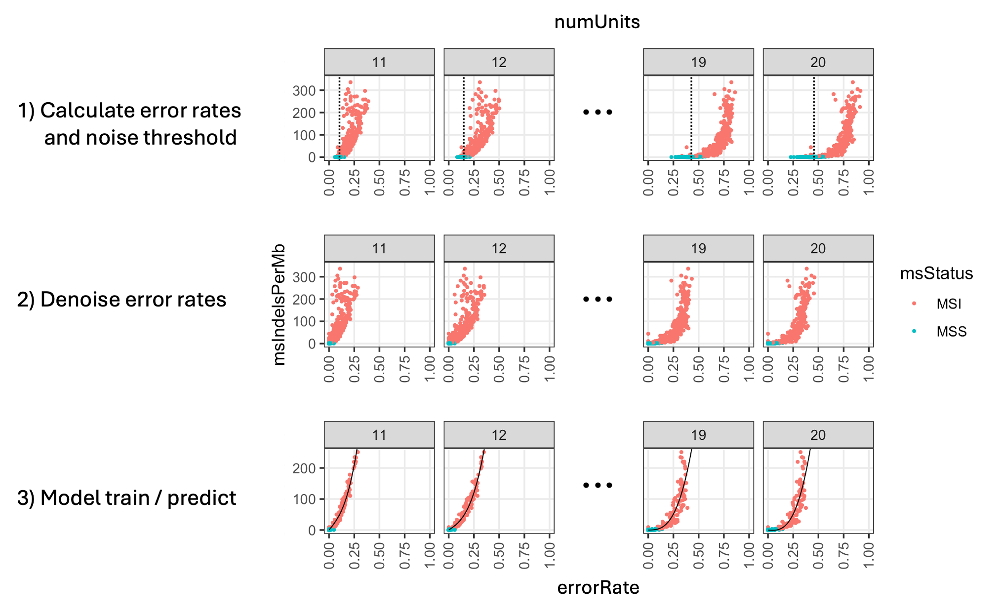
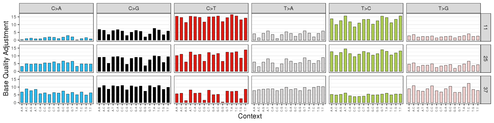

# Redux

The purpose of Redux (**RE**calibrate **DE**duplicate **U**nmap e**X**tract) is to abstract any platform, library prep and aligner specific
artefacts from the BAM. A key aim of Redux is to make it simple to adapt to different sequencing technologies or library preparation
techniques.

Redux performs these key tasks:

| Feature                        | Functionality                                                                                                                                                                                                                                                                                                                                                                                                                                               | Why?                                                                                                                                                                                                                                                                                                                                                                                                                                                                                                                                                                                                                                                                                       |
|--------------------------------|-------------------------------------------------------------------------------------------------------------------------------------------------------------------------------------------------------------------------------------------------------------------------------------------------------------------------------------------------------------------------------------------------------------------------------------------------------------|--------------------------------------------------------------------------------------------------------------------------------------------------------------------------------------------------------------------------------------------------------------------------------------------------------------------------------------------------------------------------------------------------------------------------------------------------------------------------------------------------------------------------------------------------------------------------------------------------------------------------------------------------------------------------------------------|
| Unmapping                      | Unmap reads that are aligned to a set of predefined problematic regions AND are either discordant, have long soft clipping or are in a region of extreme high depth. The reads are retained in the BAM and can be used by downstream tools. Supplementary reads that qualify for unmapping are deleted.<br/><br/>Overall, the problematic regions make up ~0.3% of the genome and lead to the ~3-6% of all reads being unmapped depending on genome version | There are 2 types of reads we want to unmap: <br/><br/> 1. Regions with recurrent very high depth – these are generally unmappable regions that have high discordant fragments.  Unmapping reduces false positive variant calling downstream and can drastically reduce runtime and memory usage.  ~98% of unmapped reads fall into this category  <br/> 2. Very long repeats – reads with long homopolymers or dinucleotide repeats may align randomly to arbitrary microsatellite locations based on idosyncratic sequencing errors.  Unmapping improves duplicate marking and detection of LINE insertions (which have a characteristic polyA insert which often is misaligned by BWA). |
| Duplicate marking and consensus | Mark duplicates based off fragment start and end positions and UMI (if available). Supplementary reads are also deduplicated. <br/><br/> For any fragments found to be duplicates a single consensus fragment is formed and a consensus base and qual is calculated.                                                                                                                                                                                        | Amplification during library preparation or on-sequencer can cause duplicates of fragments. By marking duplicates, we avoid potential multiple counting of evidence from a single source fragment which reduces FP variant calling. <br/><br/> Forming a consensus read for every duplicated fragment ensures we choose the most likely base at each location and a representative base quality.                                                                                                                                                                                                                                                                                           |
| Microsatellite jitter rates    | The rate of microsatellite errors is measured genome wide per {consensusType, repeatContext, repeatLength} and fit to a model.                                                                                                                                                                                                                                                                                                                              | Microsatellite jitter or stutter is a common error caused by PCR amplification and on-sequencer errors.  Some sequencing technologies have specific problems with homopolymers. The rate may be highly sample specific as it depends on the amount of and quality of the amplification process. The sample and context specific rate measured in Redux is used to inform and improve variant calling in downstream tools                                                                                                                                                                                                                                                                   |
| MSI prediction            | Uses indel jitter rates to estimate a rate of MS indels per MB                                                                                                                                                                                                                                                                                                                                                                                              |


### Notes on Redux compatibility

Redux conforms fully to SAM specifications. We have validated Redux on DRAGEN and BWA-MEM / BWA-MEM2. Redux may also be run on BAMs with any
prior duplicate marking and strip previous consensus results. Please note that Redux does require the mate CIGAR attribute to be set for all
paired reads. If this is not set for some reason, this can be rectified using the BamTools BamChecker routine in WiGiTs.

Whilst Redux does unmap reads and delete supplementaries, no primary read information is removed or lost when Redux is run, and hence the
original FASTQ is fully recoverable. If you wish a BAM to be converted to FASTQ, note that consensus reads must be deleted prior to
conversion. This functionality is included by default in the BamTools BamToFastq routine.

## Roche SBX Alexios and Ultima BAMs

Redux supports BAMs (or CRAMs) from SBX and Ultima. These do not produce recoverable BAMs since some read attributes are overwritten.

Set 'sequencing_type' as described below for these platforms. Details of algorithms specific to these technologies will be provided.


## Commands

```
java -jar redux.jar 
    -sample SAMPLE_ID 
    -input_bam SAMPLE_ID.lane_01.bam,SAMPLE_ID.lane_02.bam,SAMPLE_ID.lane_03.bam  
    -ref_genome /path_to_fasta_files/
    -ref_genome_version V37
    -unmap_regions /ref_data/unmap_regions.37.tsv
    -ref_genome_msi_file /ref_data/msi_jitter_sites.37.tsv.gz 
    -form_consensus 
    -bamtool /path_to_samtools/ 
    -output_dir /path_to_output/
    -log_level DEBUG 
    -threads 24
```

## Arguments

| Argument           | Description                                                                             |
|--------------------|-----------------------------------------------------------------------------------------|
| sample             | Sample ID                                                                               |
| input_bam          | Path to BAM file(s)                                                                     |
| output_bam         | Output BAM file, otherwise will write SAMPLE_ID.redux.bam                               |
| ref_genome         | Path to reference genome files as used in alignment                                     |
| ref_genome_version | V37 or V38                                                                              |
| sequencing_type    | ILLUMINA (default), SBX or ULTIMA                                                       |
| form_consensus     | Form a consensus read from duplicates                                                   |
| unmap_regions      | TSV file specifying regions of high depth, repeats or otherwise problematic for mapping |
| bamtool            | Used for BAM sorting, concatenation and indexing                                        |
| threads            | Number of threads, default = 1                                                          |
| output_dir         | If not specified will write output same directory as input BAM                          |
| jitter_bqr_dir     | Path to sample MSI jitter files and BQR files                                           |

| ref_genome_msi_file | (Optional) Path to file of microsatellite sites used for sample-specific jitter, required for Sage |
| msi_model_coefficients | (Optional)MSI model cooefficients file                                                             |
| msi_model_error_rates  | (Optional) MSI model error rates file                                                              |
| bqr_use_all_regions | Base qual recalibration by default uses 2M-base regions from each chromosome. Add this flag in targeted panel model to use entire BAM | 

### Optional arguments

| Argument            | Description                                                                     |
|---------------------|---------------------------------------------------------------------------------|
| bqr_jitter_msi_only | Only generate BQR and MSI model output, requires an existing Redux BAM as input 
| drop_duplicates     | Drop duplicate reads from output BAM  <br/>jitter_bqr_dir                       | BAM path | Path to Redux MSI jitter files and BQR files
| skip_bqr            | Disable base quality recalibration                                              |


### UMI Command

```
java -jar redux.jar 
    -sample SAMPLE_ID 
    -input_bam SAMPLE_ID.aligned.bam
    -output_bam SAMPLE_ID.bam  
    -ref_genome /path_to_fasta_files/
    -ref_genome_version V37
    -unmap_regions /ref_data/unmap_regions.37.tsv 
    -umi_enabled
    -umi_duplex
    -umi_duplex_delim + 
    -ref_genome_msi_file /path/to/msi_jitter_sites.37.tsv.gz
    -bamtool /path_to_samtools/ 
    -output_dir /path_to_output/
    -log_level DEBUG 
    -threads 24
```

### UMI Arguments

| Argument            | Description                                                                                                                |
|---------------------|----------------------------------------------------------------------------------------------------------------------------|
| umi_enabled         | Extract UMI from Read ID and use in duplicate group identification                                                         |
| umi_duplex          | Collapse duplex UMI groups                                                                                                 |
| umi_duplex_delim    | Duplex UMI character, default = '_'                                                                                        |
| umi_base_diff_stats | Write UMI statistics files                                                                                                 |
| umi_type            | values: SINGLE, TWIST_DUPLEX, TSO500_DUPLEX, MSK, KAPPA |

Setting 'umi_type' for known UMI technologies is a convenience and will map as follows:
- TWIST_DUPLEX: umi_enabled, umi_duplex, umi_duplex_delim='_'
- TSO500_DUPLEX umi_enabled, umi_duplex, umi_duplex_delim='+'

## Algorithm

### 'Unmapping’ in problematic regions

Due to the incompleteness and repetitiveness of the human genome and idiosyncratic errors in sequencing, there are certain regions that have
reads aligned to them, often with very high coverage, which recurrently cause issues in downstream tools. Key examples include PolyG
regions, long PolyA/T repeats, long dinucleotide repeats, ribosomal regions on short arms of chr21 and chr22 and many centromeric regions.
One key case is that duplicate fragments with one read consisting mainly of homopolymers will not be properly marked as duplicates as the
homopolymer read may be mapped to numerous places in the genome

We therefore introduce logic to handle problematic regions of recurrent high depth across germline samples and long repeats (see appendix
for definition of problematic regions). Specifically, we unmap a read if it has <10 bases aligned outside a problematic region AND meets at
least one of these criteria:

- Region has very high depth (3rd highest maxDepth >1000, ~700kb in hg38)
- Read pair is discordant – an inversion, translocation, one read unmapped or fragment length > 1000 bases
- Read has at least 20 base of soft clip

All supplementary and secondary reads with <10 bases aligned outside a problematic region are also deleted.

Note that when a read is unmapped or a supplementary is deleted, other reads in the read group pair are also updated to reflect the mates
unmapped status. Removing / unmapping these reads simplifies and improves performance of variant calling downstream including in SAGE,
COBALT and SV calling.

Note also that all supplementary reads with alignment score < 30 are unmapped.

### Deduplication

There are 2 steps in the deduplication algorithm:

#### 1. Identify duplicates

Duplicates can be marked either with or without UMIs. If UMIs are not available, then simply mark any fragments (including any secondary &
supplementary alignments) with the same fragment strand orientation and identical unclipped 5’ alignment coordinates (allowing for strand)
on both reads in fragment are identified as belonging to the same duplicate group. For non-paired reads the length of the fragment must also
be identical.

For paired reads, the MC (mate cigar) tag is used, where available (note BWA normally populates this but not STAR), to identify from the 1st
read whether the fragment is in the same duplicate group. Where it is not available, both reads are assessed together, at the cost of higher
runtime memory. If a primary read is marked as duplicate, all supplementary and secondary reads from the same fragment will also be marked
duplicate. If one of the reads is unmapped then all fragments with the same start coordinates on the mappable side are placed in the same
duplicate group.

For each duplicate group, the fragment with the highest R1 average base qual (or highest base qual are assessed together) is kept as primary
and the remaining are marked as duplicates. If UMIs are available, then 1 duplicate group is made per UMI allowing for a small edit distance
using a directional network (as described by [UMI-tools](https://www.ncbi.nlm.nih.gov/pmc/articles/PMC5340976/)). To implement this, UMIs
with the same alignment coordinates are ranked from most supported to least supported. Starting with the 2nd highest supported distinct UMI,
each UMI may be collapsed recursively into a more supported UMI group if it is within 1 edit distance of any UMI in that group. Following
this, a 2nd single level sweep is made from most supported to least supported, where any UMIs with same alignment coordinates and a
configurable edit distance [3]. A 3rd single level sweep is to a default edit distance of 4 to collapse any highly imbalanced groups (ie
where 1 group has more than 25x the support of another).

For DUPLEX UMIs only, duplicates with the same coordinates but opposite orientations are further collapsed into a single group and and
marked as 'DUAL_STRAND’.

If run in duplex mode, the UMI pairs must match (within an edit distance of 1) between the fragments to be collapsed. If multiple UMI groups
with the same coordinates may be collapsed then the group with the highest support on the forward strand is matched first to the group with
the highest support on the reverse strand.

There are two additional categories of UMI-based duplicate collapsing that do not adhere to these strict conditions:

1. PolyG UMI collapse - this handles scenarios where one or more duplicate fragments has its sequencing die out, leading to a poly-G tail.
   This results in an unmapped read and a UMI with a trailing poly-G. Therefore, allow collapsing if:
    * each fragment to be collapsed has the same unclipped 5’ position on one read, and
    * at least one of the fragments has the other read unmapped, and
    * the UMIs match, excluding letters in the trailing poly-G on the unmapped read(s) which are not checked
2. Jitter tolerance collapse - this handles scenarios where a fragment edge borders a long microsatellite repeat, such that jitter in this
   repeat leads to slightly different fragment coordinates across different fragment duplicates. Therefore, allow collapsing between two
   duplicate groups if:
    * the consensus groups have matching UMIs, and
    * have an exact 5’ unclipped coordinate match
    * have a unclipped 5’ coordinate distance within 10bp of each other

#### 2. Consensus fragments

Optionally, a new ‘consensus’ read/fragment can be created to represent each duplicate group. In this case all fragments in a duplicate
group will be marked as a duplicate and the new consensus read will be the primary alignment.

To construct the consensus fragment, the following logic is applied separately for read 1 and read 2:

- The consensus cigar is chosen as the cigar with the most support followed by the least soft clip and then arbitrarily.
- Using the consensus cigar as the reference, for each base assess each reads in the duplicate group and set the consensus base to the most
  supported base by sum of base qual. If 2 or more alleles have the same base qual support choose the reference first.
- For reads which differ by an indel from the consensus, ignore the differences, and ensure that the subsequent bases match the position in
  the consensus cigar. Ignore any soft clip base that is not present in the consensus cigar.
- Set the base qual = roundedUp[median(supportedBaseQual)] * [max(0,Sum(supportedBaseQual) - Sum(contraryBaseQual))] / Sum(
  supportedBaseQual)

In the case of DUPLEX UMIs, the logic is applied to each strand individually and then again to merge the 2 strands. When merging strands, if
the consensus base on each strand is different and one matches the ref genome then the base is set to the ref genome, otherwise the highest
qual base is chosen as per above.

The ‘UT’ tag is added to the BAM to mark the consensus group status of the read:

| Value      | Description                    |
|------------|--------------------------------|
| NONE  | Read is not part of any consensus group       |
| DUAL  | Read is formed from a consensus of reads from both original DNA strands (i.e. at least one read of each fregment orientation). Only applicable if DUPLEX UMIs are used.     |
| SINGLE | Read is formed from a consensus group, but does not meet the requirements of DUAL (i.e. constituent reads are only from a single fragment orientation and/or DUPLEX UMIs are not used) |

The ‘CR’ tag is used to record the number of reads contributing to each consensus read. It is a series of 3 numbers and can be interpreted as follows:

1. Number of fragments in the consensus group
2. Number of fragments in the most common strand
3. Number of distinct PCR clusters identified for the consensus group, using the following rules:
    * A 2-fragment duplicate group with both fragments on the same run and lane and with tile difference is in {0,1,999,1000,1001} are in
      the same cluster
    * For larger duplicate groups, a tile with exactly two fragments in the group, with tile distance < 2500 between each other, are in the
      same cluster

### Microsatellite jitter modelling

Different sequencing technologies, lab preparation techniques and sample-specific idiosyncracies can affect the rate of jitter error in
microsatellite sites. As such, the magnitude and skew of errors are both modelled for use in downstream tools such as Sage.

This process begins by considering reads that cover a given microsatellite repeat from the provided microsatellite repeats file. Such reads
must satisfy the following conditions:

* Mapping quality >= 50
* At least 5 aligned (i.e. inside M cigar element) flanking the microsatellite repeat on both sites
* Each base associated with the microsatellite repeat is part of a M, I or D Cigar element
* Any inserted bases should be multiples of the microsatellite repeat unit
* No bases inside the repeat (plus 1 flanking base) should be a minimum quality base (qual 1) or a simplex base (SBX only)

For each read, identify the insertion or deletion at the start of the microsatellite repeat which extends or contracts the repeat count, and
this becomes the repeat unit count. Then for each microsatellite site, the number of reads with repeat unit counts from ref_count-10 to
ref_count+10 are determined. Then a site is considered to potentially contain an alt if any of the following are true:

* 20% or more considered reads are rejected
* Less than 20 non-rejected reads are accumulated
* A site has a sufficiently high AF for a non-zero repeat count change:
    * For ±1 repeat count: AF > 30%
    * For ±2 repeat counts: AF > 25%
    * For ±3 repeat counts: AF > 20%
    * For ±4 repeat counts: AF > 15%
    * For ±5 or more repeat counts: AF > 10%

Sites are aggregated by consensus type, repeat unit and repeat count (from 4-20), producing a file which is exported
as `SAMPLE.ms_table.tsv.gz`. This aggregated data is then used to produce a 6-parameter model for each consensus type and repeat unit
describing a series of asymmetric laplace distributions, which collectively model empirical jitter frequencies for any given repeat unit +
repeat count. A file containing the 6 parameters for each repeat unit is exported as `SAMPLE.jitter_params.tsv`. The parameters can be
interpreted as such:

* `optimalScaleRepeat4` - represents the magnitude of jitter at repeat count = 4
* `optimalScaleRepeat5` - represents the magnitude of jitter at repeat count = 5
* `optimalScaleRepeat6` - represents the magnitude of jitter at repeat count = 6
* `scaleFitGradient`, `scaleFitIntercept` - collectively describe a linear relationship between the repeat count and magnitude of jitter for
  repeat counts > 6
* `scaleFitSkew` - describes the skew between delete and insert jitter. 1.0 represents a symmetric distribution

The fitting process works as follows:

* Each repeat unit + repeat count will end up with two jitter parameters, scale and skew
* These parameters describe an modified asymmetric laplace distribution, normalised to sum to 1 over the range `[-5, 5]`
* A loss function is defined, which minimises the difference between predicted and actual phred score (capped at 40) associated with jitter
  rates, with per-repeat count weights proportional to their frequency

Then for each repeat unit, we do the following:

1. For each repeat length 4-6, find the optimal scale and skew values using the loss function, with a small regularisation term that
   penalises highly skewed distributions
    * If the total read count for any of these repeat lengths < 20000, we replace the optimal scale with a fallback value
2. Repeat the process for each repeat length 7-15, adding an additional regularisation term penalising scale values deviating sharply from
   the previous length's value. Fallback scales are not used for these repeat lengths
3. Fit a weighted least squares linear regression between repeat length and optimal scale from 7-15. The weight of a repeat length’s data
   point is proportional to the count of observations for that repeat length, capped at 20% of the total count from 7-15
4. Assuming at least 2 counts from 7-15 have at least 20000 total read count and the gradient of the linear regression is
   positive, `scaleFitGradient` and `scaleFitIntercept` are set to the gradient and intercept of the regression, respectively. In this
   case, `scaleFitSkew` is set to a weighted average of the optimal skew values for each repeat length 7-15, where the weights for each
   repeat are the same ones specified in step 3
    * If the above conditions are not both satisfied, we fall back to `scaleFitGradient=0.06`, and `scaleFitIntercept` is set such that a
      line with slope of `0.06` and intercept of `scaleFitIntercept` passes through the optimal scale associated with repeat
      length=6. `scaleFitSkew` is set based on an aggregate count of delete and insert jitter counts, unless at least one of these sums <
      50, in which case it defaults to 1.0

### MSI prediction

Redux estimates microsatellite indels per MB using an ensemble of polynomial regressions ("MSI model") trained on jitter rates ("error rates")
for a range of A/T repeat lengths (length range varies depending on sequencing technology). MSI model output is written to 
`SAMPLE_ID.msi_prediction.tsv` and used by Sage (jitter handling) and Purple (microsatellite indels per MB estimation for targeted panels).

#### Training vs prediction

The MSI model is trained on Hartwig WGS samples with purities < 50% using denoised error rates (normalised to a baseline). For targeted panel cohorts,
cohort-specific normalisation factors must be trained since error rate noise varies by cohort. Error rate normalisation allows a single set
of coefficients (trained using WGS samples) to be used for all cohorts. Other sequencing technologies are trained separately using their own WGS cohorts, with a purity cutoff of 85%.



#### 1. Calculate error rate

For a given microsatellite repeat length (`numUnits`), the number of observed reads (`readCount`) with a given indel length (`jitter`) may be:

```
   jitter  ..., -3, -2,  -1,   0,   1, 2, 3, ...
readCount  ...,  6, 11, 3e3, 7e7, 352, 5, 0, ...
```

The error rate for a given `numUnits` is calculated as below:

```
weightedErrorCounts = sum(readCounts * abs(jitter)) # By definition, 0 jitter counts are not counted as errors 
errorRate = weightedErrorCounts / sum(readCounts)
```

For Illumina samples, the assessed repeat types are A/T homopolymers of length 11-20. For SBX we use A/T of length 11-15, and for Ultima we use AC/AG repeats of length 11-15.

#### 2. Denoise error rates

During training, the noise threshold (90th percentile of error rates, 80th percentile for Ultima) is calculated per `numUnits`:

`noiseThreshold = percentile(errorRates, 90)`

Error rates are then normalised as below:

`denoisedErrorRate = errorRate - noiseThreshold`

#### 3. Train and predict

During training, a polynomial regression is fitted per `numUnits` with the form:

`y = 0 + ax + bx^3  # where x = denoisedErrorRate, y = known msIndelsPerMb`

When predicting, the output is clamped to non-negative values:

`y = max(0, y)`

The final predicted `msIndelsPerMb` is the mean across all polynomial regressions (i.e. one per `numUnits`). Any with less than 500 read counts are omitted due to sparsity.

### Alt Specific Base Quality Recalibration

Redux includes a base quality recalibration method to adjust sequencer reported base qualities to empirically observed values since we observe that qualities for certain base contexts and alts can be systematically over or under estimated which can cause either false positives or poor sensitivity respectively.
This idea is inspired by the GATK BQSR tool, but instead of using a covariate model we create a direct lookup table for base quality adjustments.
The recalibration is unique per sample.

R is used to generate the base quality recalibration charts, which is done if the config 'write_bqr_plot' is included. Required packages include `ggplot2`,`tidyr` and `dplyr`.

The empirical base quality is measured in each reference and tumor sample for each {trinucleotide context, alt, sequencer reported base qual, consensus type} combination and an adjustment is calculated. This is performed by sampling a 2M base window from each autosome and counting the number of mismatches per {trinucleotide context, alt, sequencer reported base qual, consensus type}. For Ultima, we only consider bases that are max qual, have adjacent max qual bases, and have max `t0` due to tech-specific complications of the quality model.

Fragments with low mapping quality (by default: below 50) or with high NM density (above 5%) are ignored as errors can be plausibly explained as mapping errors rather than base quality errors. Similarly, sites that may harbour a genuine germline or somatic variant rather than errors are excluded from contribution. This is determined as follows:

* Across `DUAL` fragments (i.e. duplex consensus): exclude site if `altVaf >= 0.01 && (altVaf >= 0.05 || altCount > 2)`
* Across other fragments (i.e. non-duplex or singleton): exclude site if `altVaf >= 0.075 && (altVaf >= 0.125 || altCount > 3)`

We also conditionally exclude sites with indels in the pileup:

| Highest qual indel | Definition                                 | Cutoff to exclude |
|--------------------|--------------------------------------------|-------------------|
| High qual          | Any Illumina indel, or SBX/Ultima qual 30+ | 1 read            |
| Medium qual        | SBX simplex qual                           | 4% AF             | 
| Low qual           | Any lower quality SBX/Ultima read          | 10% AF            |

Note that the definition of this recalibrated base quality is slightly different to the sequencer base quality, since it is the probability of making a specific ALT error given a trinucleotide sequence, whereas the sequencer base quality is the probability of making any error at the base in question.   Since the chance of making an error to a specific base is lower than the chance of making it to a random base, the ALT specific base quality will generally be higher even if the sequencer base quality matches the empirical distribution.

For all SNV and MNV calls the base quality is adjusted to the empirically observed value before determining the quality.
Sage produces both a file output and QC chart which show the magnitude of the base quality adjustment applied for each {trinucleotide context, alt, sequencer reported base qual, consensus type} combination.
These files are written into the same directory as the output file.

A typical example of the chart (for one consensus type) is shown below. Note that each bar represents the amount that will be added to the sequencer Phred score:



Base quality recalibration is enabled by default but can be disabled by supplying including the`-bqr_disable` argument.

The base quality recalibration chart is generated with the config `-bqr_write_plot`.

## Ultima specific routines
Redux determines consensus type from the ppm-seq tags present in Ultima BAMs and supports both legacy and current tag formats.
Redux also generates an Ultima low-quality homopolymer tag (`UQ`) for use by downstream pipeline tools. Homopolymers are evaluated directly from the read sequence and marked when either the associated `t0` quality is below 20 or the homopolymer quality falls below a length-specific threshold. The `UQ` tag records all read indices belonging to flagged homopolymers. The thresholds are as follows:

| Homopolymer length | Minimum quality |
|--------------------|-----------------|
| 1                  | 25              |
| 2                  | 22              |
| 3                  | 19              |
| 4-6                | 16              |
| 7-8                | 14              |
| 9+                 | 12              |

## SBX specific routines

### Homopolymer indel normalisation
Prior to duplicate collapsing, Redux identifies duplex indel disagreement regions using the `YC `tag and determines the associated repeat context. Repeat-associated insertion differences are normalised by trimming excess inserted sequence. The number of duplex discordant bases in the untrimmed repeat is noted, and those low quality bases are evenly distributed to each side of the trimmed repeat. Supplementaries are used where available to infer the reference sequence inside softclipping.

This eliminates the insertion bias in SBX sequencing that comes from synthesising two independent sequencing passes and priorising retaining bases if they are in only one pass.
### Duplicate collapsing
Duplicate groups are formed using an SBX-specific collapse strategy that tolerates small differences between read ends while preventing merges between substantially different molecules. In particular, we tolerate a 'wiggle room' in position coordinates of up to 2bp between individual fragments, and 6bp total across the whole duplicate group.
### Consensus generation
SBX consensus generation uses the per-base status (concordant duplex, simplex, discordant duplex) encoded in the base qualities. 
For each position, Redux preferentially derives consensus sequence from concordant duplex evidence where a dominant base exists. When all bases are simplex, simplex evidence is used instead. In either case, positions lacking majority agreement are interpreted as qual 1 reference bases.

Consensus CIGAR elements are generated using the same principle. When read-level disagreement exists, Redux preferentially selects operations supported by high-confidence duplex evidence, then simplex evidence if all reads are simplex at that location, and otherwise falls back to the most reference-like representation (`M` over `D` or `I`).
### Quality remapping
Raw SBX qualities encode categorical status rather than conventional phred scores. During consensus generation, Redux remaps these values onto a standardised quality scale:

| Status            | Mapped base quality |
|-------------------|---------------------|
| Discordant duplex | 1                   |
| Simplex           | 27                  |
| Concordant duplex | 40                  |

In addition, concordant duplex bases near discordant duplex bases are assigned a lower base quality to model their higher empirical erorr rates:
* Concordant duplex 1bp from a discordant duplex base and = the ref discordant base -> 15 
* Concordant duplex 1bp from a discordant duplex base and ≠ the ref discordant base -> 20 
* Concordant duplex 2-3bp from a discordant duplex base -> 25 

Consensus reads are assigned one of the standard Redux consensus types:
* `NONE`: singleton reads
* `SINGLE`: non-trivial consensus group, all reads are simplex
* `DUAL`: non-trivial consensus group, including duplex

For consensus reads containing both simplex and duplex regions, Redux records the first duplex-supported base position in the `YX` tag.

## Performance and Settings

When run with multiple threads, a BAM will be written per thread and then merged and index at the end.
Recommended settings for a standard 100x tumor BAM is 16-24 CPUs and 48GB RAM.
Runtime on COLO829T with these settings is approximately 100mins.

## Output Files

| File Name                          | Details                                                                                                                                                   |
|------------------------------------|-----------------------------------------------------------------------------------------------------------------------------------------------------------|
| SAMPLE_ID.redux.duplicate_freq.tsv | Frequency distribution of duplicate groups                                                                                                                |
| SAMPLE_ID.redux.bqr.tsv            | Base quality recalibration counts for use in Sage                                                                                                         |
| SAMPLE_ID.redux.ms_table.tsv.gz    | Aggregating counts of reads across microsatellites by consensus type / repeat unit / ref repeat count / read repeat count, discarding potential alt sites |
| SAMPLE_ID.redux.jitter_params.tsv  | 6-parameter model parameterisation for each consensus type and repeat unit                                                                                |
| SAMPLE_ID.redux.msi_prediction.tsv | MS indels per MB estimation                                                                                                                               |

If -umi_base_diff_stats config is specified, the following detailed UMI-related output is written:

| File Name                          | Details                                                        |
|------------------------------------|----------------------------------------------------------------|
| SAMPLE_ID.umi_coord_freq.tsv       | Frequency distribution of UMI duplicate groups                 |
| SAMPLE_ID.umi_edit_distance.tsv    | Analysis of UMI differences and potential UMI base mismatches  |    
| SAMPLE_ID.umi_nucleotide_freq.tsv  | Frequency distribution for nucleotides in UMIs                | 

### Duplicate Frequency

| Field               | Description                    |
|---------------------|--------------------------------|
| DuplicateReadCount  | # of duplicates in group       |
| Frequency           | Total read observations        |
| DualStrandFrequency | Total dual strand observations |

### UMI Edit Distance

This file shows the edit distance from each duplicate ead to each consensus UMI for coordinates with 1 or 2 distinct UMI groups only and can
be used to detect potential underclustering of UMIS

| Field                        | Description                                                       |
|------------------------------|-------------------------------------------------------------------|
| UMICountWithCoordinatesField | # of unique UMI groups that share the coordinates (either 1 or 2) |
| DuplicateReadCount           | Total # of duplicates at coordinates                              |
| Frequency                    | Total read observations                                           |
| <ED_0 to ED_10>              | Count of reads by edit distance                                   |

### UMI coordinate frequency

This file shows how frequently distinct UMI groups that share the same start position also share the same coordinates.

| Field                              | Description                                                          |
|------------------------------------|----------------------------------------------------------------------|
| UniqueCoordinatesWithStartPosition | # of fragments with unique coordinates that share the start position |
| PrimaryFragmentsWithStartPosition  | # of fragments after deduplication that share the start position     |
| Frequency                          | Total read observations                                              |

### UMI nucleotide frequency

This file gives the nucleotide frequency by UMI base position

| Field       | Description          |
|-------------|----------------------|
| UMIPosition | Base position in UMI |
| ACount      | Frequency of ‘A’ NT  |
| CCount      | Frequency of ‘C’ NT  |
| GCount      | Frequency of ‘G’ NT  |
| TCount      | Frequency of ‘T’ NT  |
| NCount      | Frequency of ‘N’ NT  |

### Microsatellite jitter

Details of how to interpret these files (`SAMPLE_ID.ms_table.tsv.gz` and `SAMPLE_ID.jitter_params.tsv`) are specified in the 'Microsatellite jitter modelling' section of the readme.

## Problematic regions file definition

Certain regions of the genome are consistently problematic and lead to frequently obvious mismapped regions which can cause several
downstream interpretation problems in variant calling. We specifically identify 2 types of such regions - very long repeats and regions which
consistently align with much higher coverage across many WGS samples and create a bed file

Problematic high depth regions are identified (for both 37 and 38) by observing the depth of 10 WGS germline samples with depth of
approximate 40x.

- For each sample create a bed of high depth regions (>150 depth to start a region and extend in both directions if >100 depth)
- Take the UNION of all the bed files across the 10 samples (NB – only 5/10 samples were Males, so
- For each region, annotate avgDepth and maxDepth in each of the samples
- Filter for regions with at least 3/10 samples with MaxDepth > 250

Additionally any homopolymer or dinucleotide repeat of >=30 bases is added to the problematic regions file. We merge repeat regions that
have a gap no larger than 20 bases. If a repeat overlaps a problematic region as defined above, then we simply extend the problematic region
is include the repeat region.

Each region in the problematic regions file is further annotated with the following information

- Overlapping genes (exonic regions only)
- G,C,T,A count
- DistanceToTelomere
- DistanceToN

In hg38, 152 genes in total have some overlap with the problematic regions file, many of which are proximate to the centromere. 3 genes of
clinical cancer interest have some overlap:  FOXP1 (driver - intronic only), COL6A3 (fusion partner - intronic only) and DNMT3A (3’UTR). All
3 cases are short PolyA regions <100 bases and will likely benefit from removing discordant pairs / soft clipped reads in these regions.

## Known Issues / Future improvements

**Duplicate marking**

- **PolyG UMI collapsing** – Checking only one read could lead to over-clustering at high depth sites.
- **Reads with mates with multiple similar local alignments** – These are currently under-clustered and lead to counting umi groups multiple
  times

**UMI matching**

- **Fixed UMI sets** - (eg TWIST) aren't explicitly modelled, but doing so could lead to improvements
- **Indel UMI errors** - will cause alignments to be different and we will fail to mark as duplicates
- **UMI Base qual** - Not currently used, but could add value. Used in fgbio.
- **G>T errors on 1st base on UMIs** – We have observed this frequently in TWIST data, but don’t know why.

**Consensus Fragment**

- **DUAL strand consensus ref preference** - For DUAL strand consensus a qual 11 ref on one strand can cause a qual 37 alt on the other to
  be set to consensus ref. This may be sub-optimal.
- **Max QUAL not always representative** - Sometimes we may see n fragments collapsed with n-1 having base qual 11 and the nth fragment
  having base qual 37. The low median qual indicates a potential issue, but we take the max qual right now. This can lead to over confident
  DUPLEX calls. Even if we took the median instead, if one strand has just a single read with high base qual, the final consensus will have
  high base qual.

**Problematic regions definitions**

- Redux should trinucleotide repeats of at least 30 length and all dinucleotide / single base repeats of of 20-30 bases to the problematic
  regions file.
- Redux should increase minimum 10 bases outside of problematic region to 20.
- Redux should unmap any read with discordant mate if 'repeat trimmed length' < 30 bases

**Microsatellite jitter modelling**

- For non-homopolymers, the empirical jitter model does not closely resemble an Asymmetric Laplace distribution for medium to large repeat
  counts. This manifests as the model overstating the likelihood of 1xINS/DEL, and understating the likelihood of >=3xINS/DEL. Could change
  underlying model or add a wing boost
- The empirical 4bp repeat / 5bp jitter data tends to be sparse and difficult to fit. To address this, we clump all 3bp/4bp/5bp
  microsatellite data together and fit as one microsatellite category

**Base Quality Recalibration**

- **BQR based on read position** - some library preparations have strong positional biases. Adjusting for this would reduce FP.
- **BQR at long palindromic sequences** - some library preparations frequently have errors in palindromic regions. Adjusting for this would reduce FP.
- **Adding strand context to BQR** - Recalibration accuracy could be improved if we aggregated BQR evidence on reverse strand reads into reverse complemented trinucleotide/ref/alt contexts
