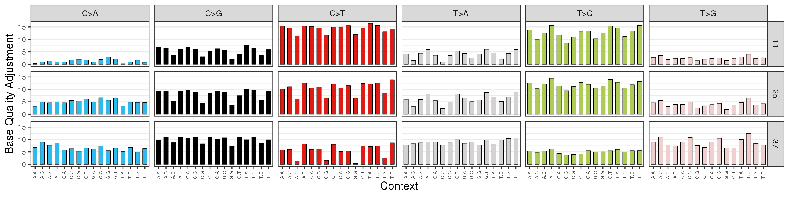

# Somatic Alterations in Genome (SAGE)

SAGE is a precise and highly sensitive somatic SNV, MNV and small INDEL caller.   It has been optimised for 100x tumor / 40x normal coverage, but has a flexible set of filters that can be adapted to lower depth coverage.

Key features include:
  - 4 tiered (`HOTSPOT`,`PANEL`, `HIGH_CONFIDENCE`, `LOW_CONFIDENCE`) calling allows high sensitivity calling in regions of high prior likelihood including hotspots in low mappability regions such as HIST2H3C K28M
  - kmer based model which determines a unique [read context](#read-context) for the variant + 10 bases of anchoring flanks and rigorously checks for partial or full evidence in tumor and normal regardless of local mapping alignment
  - Modified [quality score](#modified-tumor-quality-score) incorporates different sources of error (MAPQ, BASEQ, edge distance, improper pair, distance from ref genome, repeat sequencing errors) without hard cutoffs
  - Explicit modelling of ‘jitter’ sequencing errors in microsatellite allows improved sensitivity in microsatellites while ignoring common sequencing errors
  - No cutoff for homopolymer repeat length for improved INDEL handling 
  - [Phasing](#6-phasing) of somatic + somatic and somatic + germline variants over whole read length
  - Native MNV handling 
  - Tumor sample only support
  - Multiple tumor sample support - a 'tumor' in SAGE is any sample in which we search for candidate variants and determine variant support.
  - Additional reference sample support - a 'reference' sample in SAGE is a sample in which we don't look for candidate variants, but in which we still determine variant support and read depth at each candidate location.  One potential case is to have a paired RNA sample as an additional reference to measure RNA support for candidate variants
  - An internal [alt specific base quality recalibration](#1-alt-specific-base-quality-recalibration) method
  
## Germline mode

Sage can be run in a germline mode.  See details [here](https://github.com/hartwigmedical/hmftools/blob/master/sage/GERMLINE.md).

## BAM Requirements
BAM records that are flagged as unmapped, duplicateRead or secondary/supplementary are ignored. 

Optional NM tag (edit distance to the reference) is used in the quality calculation where available otherwise it is calculated on the fly.
More information about the tag available [here](https://samtools.github.io/hts-specs/SAMtags.pdf).

While SAGE does support CRAM files, we strongly recommend converting them to BAM first as SAGE makes multiple passes over the supplied alignment files. 
Converting them first up front saves significant CPU time overall. 

## Installation

To install, download the latest compiled jar file from the [download links](#version-history-and-download-links). 

37 and 38 resources are available to download from [HMFTools-Resources > SAGE](https://resources.hartwigmedicalfoundation.nl/). 

R is used to generate the base quality recalibration charts, which is done if the config 'write_bqr_plot' is included. Required packages include `ggplot2`,`tidyr` and `dplyr`. 


# Usage

## Mandatory Arguments

Argument | Description 
---|---
tumor | Comma separated names of the tumor sample
tumor_bam | Comma separated paths to indexed tumor BAM file
out | Name of the output VCF
ref_genome | Path to reference genome fasta file
ref_genome_version | One of `37` or `38`
hotspots | Path to hotspots vcf
panel_bed | Path to panel bed
high_confidence_bed | Path to high confidence bed
ensembl_data_dir | Path to Ensembl data cache

The cardinality of `tumor` must match `tumor_bam`. At least one tumor must be supplied.

## Optional Arguments
Argument | Default | Description 
---|---|---
reference | NA | Comma separated names of the reference sample
reference_bam | NA | Comma separated paths to indexed reference BAM file
ref_sample_count | 1 | Controls the set of ref samples used for tumor-normal soft-filtering. Zero means none will be used.)
resource_dir | None | Path to all resource files, in which case specify the file names only for ref_genome, hotspots, panel_bed and high_confidence_bed  
threads | 2 | Number of threads to use
max_read_depth | 1000 | Maximum number of reads to look for evidence of any `HIGH_CONFIDENCE` or `LOW_CONFIDENCE` variant. Reads in excess of this are ignored.  
max_read_depth_panel | 100,000 | Maximum number of reads to look for evidence of any `HOTSPOT` or `PANEL` variant. Reads in excess of this are ignored.  
max_realignment_depth | 1000 | Do not look for evidence of realigned variant if its read depth exceeds this value
min_map_quality | 10 | Min mapping quality to apply to non-hotspot variants
coverage_bed | NA | Write file with counts of depth of each base of the supplied bed file
validation_stringency | STRICT | SAM validation strategy: STRICT, SILENT, LENIENT
include_mt | NA | By default the mitochondrial DNA is not read but will be if this config is included

The cardinality of `reference` must match `reference_bam`.

## Optional Base Quality Recalibration Arguments

The following arguments control the [alt specific base quality recalibration](#1-alt-specific-base-quality-recalibration) logic.

Argument | Default | Description 
---|---|---
bqr_enabled | true | Enable base quality recalibration
write_bqr_data | NA | Write BQR calculations - for information purposes, or to re-use if Sage is run again with 'load_bqr_files'
load_bqr_files | NA | Attempts to reload previously generated BQR files
write_bqr_plot | NA | Generate base-quality recalibration plots (requires R)
bqr_sample_size | 2,000,000 | Sample size of each autosome
bqr_max_alt_count | 3 | Max support of variant before it is considered likely to be real and not a sequencing error
bqr_min_map_qual | 10 | Min mapping quality of bam record

## Optional Quality Arguments

The following arguments are used to calculate the [modified tumor quality score](#modified-tumor-quality-score)

Argument | Default | Description 
---|---|---
jitter_penalty | 0.25 | Penalty to apply to qual score when read context matches with jitter
jitter_min_repeat_count | 3 | Minimum repeat count before applying jitter penalty
base_qual_fixed_penalty | 12 | Fixed penalty to apply to base quality
map_qual_fixed_penalty | 15 | Fixed penalty to apply to map quality
map_qual_improper_pair_penalty | 15 | Penalty to apply to map qual when SAM record does not have the ProperPair flag
map_qual_read_events_penalty | 8 | Penalty to apply to map qual for additional events in read

## Debug and logging Arguments


Argument | Default | Description 
---|---|---
threads | 1 | Number of threads to use
log_level | INFO | Also DEBUG and TRACE
specific_chr | None | Limit sage to list of chromosomes, separated by ';'
specific_regions | None | Limit sage to list of regions, separated by ';' in the form chromosome:positionStart:positionEnd
perf_warn_time | None | Log a warning if any region (ie 100K partition by default) takes more than X seconds to complete  


## Example Usage

Minimum set of arguments (running in tumor only mode):

```
java -Xms4G -Xmx32G -cp sage.jar com.hartwig.hmftools.sage.SageApplication \
    -tumor COLO829v003T -tumor_bam /path/to/COLO829v003T.bam \
    -ref_genome_version 37 \
    -ref_genome /path/to/refGenome.fasta \
    -hotspots /path/to/KnownHotspots.37.vcf.gz \
    -panel_bed /path/to/ActionableCodingPanel.somatic.37.bed.gz \
    -high_confidence_bed /path/to/NA12878_GIAB_highconf_IllFB-IllGATKHC-CG-Ion-Solid_ALLCHROM_v3.2.2_highconf.bed \
    -ensembl_data_dir /path_to_ensmebl_cache/ \
    -out /path/to/COLO829v003.sage.vcf.gz
```

Typical arguments running in paired tumor-normal mode:

```
java -Xms4G -Xmx32G -cp sage.jar com.hartwig.hmftools.sage.SageApplication \
    -threads 16 
    -reference COLO829v003R -reference_bam /path/to/COLO829v003R.bam \
    -tumor COLO829v003T -tumor_bam /path/to/COLO829v003T.bam \
    -ref_genome_version 37 \
    -ref_genome /path/to/refGenome.fasta \
    -hotspots /path/to/KnownHotspots.37.vcf.gz \
    -panel_bed /path/to/ActionableCodingPanel.somatic.37.bed.gz \
    -high_confidence_bed /path/to/NA12878_GIAB_highconf_IllFB-IllGATKHC-CG-Ion-Solid_ALLCHROM_v3.2.2_highconf.bed \
    -ensembl_data_dir /path_to_ensmebl_cache/ \
    -out /path/to/COLO829v003.sage.vcf.gz
```

# Append Reference Samples
It is possible to append additional reference samples to an existing SAGE VCF file. A typical use case would be to append RNA without having to rerun all of SAGE.

In append mode SAGE only performs the [alt specific base quality recalibration](#1-alt-specific-base-quality-recalibration) and [normal counts and quality](#4-normal-counts-and-quality) steps.
The supplied SAGE VCF is used to determine the candidate variants and no changes are made to tumor counts, filters, phasing, de-duplication or realignment.

## Usage

## Mandatory Arguments

Argument | Description 
---|---
reference | Comma separated names of the reference sample
reference_bam | Comma separated paths to indexed reference BAM file
input_vcf | Name of the existing SAGE 2.4+ VCF
out | Name of the output VCF
ref_genome | Path to reference genome fasta file

The cardinality of `reference` must match `reference_bam` and must not already exist in the input VCF.

## Optional Arguments
Argument | Default | Description 
---|---|---
threads | 2 | Number of threads to use
chr | NA | Limit sage to comma separated list of chromosomes
max_read_depth | 1000 | Maximum number of reads to look for evidence of any `HIGH_CONFIDENCE` or `LOW_CONFIDENCE` variant. Reads in excess of this are ignored.  
max_read_depth_panel | 100,000 | Maximum number of reads to look for evidence of any `HOTSPOT` or `PANEL` variant. Reads in excess of this are ignored.  
max_realignment_depth | 1000 | Do not look for evidence of realigned variant if its read depth exceeds this value
min_map_quality | 10 | Min mapping quality to apply to non-hotspot variants

The optional [base quality recalibration](#optional-base-quality-recalibration-arguments) and [quality](#optional-quality-arguments) arguments also apply.  

## Example Usage

Minimum set of arguments:

```
java -Xms4G -Xmx32G -cp sage.jar com.hartwig.hmftools.sage.SageAppendApplication \
    -reference COLO829v003RNA -reference_bam /path/to/COLO829v003RNA.bam \
    -ref_genome /path/to/refGenome.fasta \
    -input_vcf /path/to/COLO829v003.sage.vcf.gz
    -out /path/to/COLO829v003.sage.rna.vcf.gz
```

# Read context 
 The read context of a variant is the region surrounding it in the read where it was found.
 It must be sufficiently large to uniquely identify the variant from both the reference and other possible variants at that location regardless of local alignment.
 SAGE uses the read context to search for evidence supporting the variant and calculate the allelic depth and frequency.
 
 The core read context is a distinct set of bases surrounding a variant after accounting for any microhomology in the read and any repeats in either the read or ref genome.
 A 'repeat' in this context, is defined as having 1 - 10 bases repeated at least 2 times. 
 The core is a minimum of 5 bases long.  
 
 For a SNV/MNV in a non-repeat sequence this will just be the alternate base(s) with 2 bases either side. 
 For a SNV/MNV in a repeat, the entire repeat will be included as well as one base on either side, eg 'TAAAAAC'.
 
 A DEL always includes the bases on either side of the deleted sequence. 
 If the delete is part of a microhomology or repeat sequence, this will also be included in the core read context.
 
 An INSERT always includes the base to the left of the insert as well as the new sequence. 
 As with a DEL, the core read context will be extended to include any repeats and/or microhomology.

The complete read context is the core read context flanked on either side by an additional 10 bases. 
 
The following example illustrate how we construct and use a read context for a simple T > A SNV.  

The read context core is the variant itself expanded to cover at least 5 bases. 
Typically we use 10 bases for the flank, but for this illustration we then use an additional 5 bases on either side to get the complete read context. 
  
<pre>
Reference:                ...ACCATGGATACCATCATAACATACGA...
Variant:                                  <b>A</b>
Core read context:                      <b>CAACA</b>
Flanked read context:              <b>GATACCAACATAACA</b>
</pre>

In the following table we match the read context against bam reads in numerous ways. 
A `FULL` match includes both flanks, a `PARTIAL` match is if the read is truncated over one of the flanks but matches what is remaining, and a `CORE` match is only the core. 
A `REALIGNED` match must include both flanks but just be offset. An `ALT` match matches only the variant. All types of matches contribute to the VAF but only `FULL` and `PARTIAL` matches contribute to the `QUAL` score.

<pre>
Reference:                ...ACCATGGATACCATCATAACATACGA...
Variant:                                  <b>A</b>
Read context:                      <b>GATACCAACATAACA</b>
Full Match:               ...ACCATG<b>GATACCAACATAACA</b>TACGA...
Partial Match:                       <b>TACCAACATAACA</b>TACGA...
Core Match:               ...ACCATGGAC<b>ACCAACATAACA</b>TAACATACGA...
Realigned Match:          ...ACCCATG<b>GATACCAACATAACA</b>TACG...
Alt Match:                ...ACCATGGATACC<b>GAG</b>ATAACATACGA...
</pre>

If the variant itself is the ref (regardless of whatever else happens in the core), the read supports the ref.
 
<pre>
Reference:                ...ACCATGGATACCATCATAACATACGA...
Variant:                                  <b>A</b>
Read context:                      GATACCA<b>A</b>CATAACA
No Match:                 ...ACCATGGATACC<b>TC</b>CATAACATACGA...
No Match:                 ...ACCATGGATACCA<b>CT</b>ATAACATACGA...
Ref Match:                ...ACCATGGATACC<b>T</b>TCATAACATACGA...
Ref Match:                ...ACCATGGATACCAT<b>T</b>ATAACATACGA...
</pre>

The importance of capturing the microhomology is demonstrated in the following example. This delete of 4 bases in a AAAC microhomology is nominally left aligned as 7: AAAAC > A but can equally be represented as 8:AAACA > A, 9:AACAA > A, 10: ACAAA > A, 11: CAAAC > C etc. 
 
Using a (bolded) read context of `CAAAAACAAACAAACAAT` spanning the microhomology matches every alt but not the ref:
 
 <pre>
 REF:   GTCTCAAAAACAAACAAACAAACAATAAAAAAC 
 ALT:   GTCT<b>CAA    AAACAAACAAACAAT</b>AAAAAAC
 ALT:   GTCT<b>CAAA    AACAAACAAACAAT</b>AAAAAAC
 ALT:   GTCT<b>CAAAA    ACAAACAAACAAT</b>AAAAAAC
 ALT:   GTCT<b>CAAAAA    CAAACAAACAAT</b>AAAAAAC
 ALT:   GTCT<b>CAAAAAC    AAACAAACAAT</b>AAAAAAC
 ALT:   GTCT<b>CAAAAACA    AACAAACAAT</b>AAAAAAC
 ALT:   GTCT<b>CAAAAACAA    ACAAACAAT</b>AAAAAAC
 ALT:   GTCT<b>CAAAAACAAA    CAAACAAT</b>AAAAAAC
 ALT:   GTCT<b>CAAAAACAAAC    AAACAAT</b>AAAAAAC
 ALT:   GTCT<b>CAAAAACAAACA    AACAAT</b>AAAAAAC
 ALT:   GTCT<b>CAAAAACAAACAA    ACAAT</b>AAAAAAC
 ALT:   GTCT<b>CAAAAACAAACAAA    CAAT</b>AAAAAAC
 ALT:   GTCT<b>CAAAAACAAACAAAC    AAT</b>AAAAAAC
 ALT:   GTCT<b>CAAAAACAAACAAACA    AT</b>AAAAAAC
 ALT:   GTCT<b>CAAAAACAAACAAACAA    T</b>AAAAAAC
 </pre>
 
A similar principle applies to any repeat sequences. Spanning them in the read context permits matching with alternate alignments.
 
# Algorithm

There are 9 key steps in the SAGE algorithm described in detail below:
  1. [Alt Specific Base Quality Recalibration](#1-alt-specific-base-quality-recalibration)
  2. [Candidate Variants](#2-candidate-variants)
  3. [Tumor Counts and Quality](#3-tumor-counts-and-quality)
  4. [Normal Counts and Quality](#4-normal-counts-and-quality)
  5. [Soft Filter](#5-soft-filters)
  6. [Phasing](#6-phasing)
  7. [De-duplication](#7-de-duplication)
  8. [Gene Panel Coverage](#8-gene-panel-coverage)

## 1. Alt Specific Base Quality Recalibration

SAGE includes a base quality recalibration method to adjust sequencer reported base qualities to empirically observed values since we observe that qualities for certain base contexts and alts can be systematically over or under estimated which can cause either false positives or poor sensitivity respectively.
This idea is inspired by the GATK BQSR tool, but instead of using a covariate model we create a direct lookup table for base quality adjustments. 
The recalibration is unique per sample.

The empirical base quality is measured in each reference and tumor sample for each {trinucleotide context, alt, sequencer reported base qual} combination and an adjustment is calculated.   This is performed by sampling a 2M base window from each autosome and counting the number of mismatches per {trinucleotide context, alt, sequencer reported base qual}.
Sites with 4 or more ALT reads are excluded from consideration as they may harbour a genuine germline or somatic variant rather than errors.    

Note that the definition of this recalibrated base quality is slightly different to the sequencer base quality, since it is the probability of making a specific ALT error given a trinucleotide sequence, whereas the sequencer base quality is the probability of making any error at the base in question.   Since the chance of making an error to a specific base is lower than the chance of making it to a random base, the ALT specific base quality will generally be higher even if the sequencer base quality matches the empirical distribution.

For all SNV and MNV calls the base quality is adjusted to the empirically observed value before determining the quality. 
SAGE produces both a file output and QC chart which show the magnitude of the base quality adjustment applied for each {trinucleotide context, alt, sequencer reported base qual} combination.
These files are written into the same directory as the output file.

A typical example of the chart is shown below. Note that each bar represents the amount that will be added to the sequencer Phred score: 



Base quality recalibration is enabled by default but can be disabled by supplying including the`-bqr_enabled false` argument.

The base quality recalibration chart can be independently disabled by including the `-bqr_plot false` argument.
 
## 2. Candidate Variants

In this first pass of the tumor BAM(s), SAGE looks for candidate variants using reads with MAPQ >=1.
Valid candidates include a complete read context in addition to raw counts of ref and alt support (`RAD`) and their respective base quality contributions (`RABQ`).  
The raw values are calculated directly from the aligner without any filters or quality requirements.

INDELS are located using the `I` and `D` flag in the CIGAR.
SNVs and MNVs are located by comparing the bases in every aligned region (flags `M`, `X` or `=`) with the provided reference genome.
MNVs can be of up to 3 bases, with 2 SNVs split by 1 reference base also treated as a 3 base MNV.  ie, MNVs with CIGARs `1X1M1X` and `3X` are both considered valid MNVs of length 3.  

SAGE tallies the raw ref/alt support and base quality and selects the most frequently found read context of each variant. As each variant can potentially have multiple read contexts due to sequencing errors or sub-clonal populations, SAGE also allows additional read contexts as candidates IF there are at least max(25% max support,3) reads with full CORE and FLANK support for that read context.  Multiple read contexts may be possible for example where a germline HET SNV overlaps read context with a germline HOM SNV or when a somatic subclonal SNV overlaps read context with a somatic clonal SNV. If a variant does not have at least one complete read context (including flanks) it is discarded. 

The variants at this stage have the following properties available in the VCF:

Field | Description
---|---
RC | (Core) Read Context
RC_REPS | Repeat sequence in read context
RC_REPC | Count of repeat sequence in read context
RC_MH | Microhomology in read context
RDP | Raw Depth
RAD\[0,1\] | Raw Allelic Depth \[Ref,Alt\]
RABQ\[0,1\] | Raw Allelic Base Quality \[Ref,Alt\]

Note that these raw depth values do NOT contribute to the AD, DP, QUAL or AF fields. These are calculated in the second pass. 

### Multiple Tumors
If multiple tumors are supplied, the final set of candidates is the superset of all individual tumor candidates that satisfy the hard filter criteria. 

## 3. Tumor Counts and Quality

The aim of the stage it to collect evidence of each candidate variant's read context in the tumor. 
SAGE examines every read with MAPQ >=1 overlapping the variant tallying matches of the read context. 
A match can be:
  - `FULL` - Core and both flanks match read at same reference location.
  - `PARTIAL` - Core and at least one flank match read fully at same position. Remaining flank matches but is truncated.  An 'N' cigar (representating a splice junction gap in RNA) may overlap both the flank and part of the core as long as the remaining flank and core match precisely.  
  - `CORE` - Core matches read but either flank doesn't.
  - `REALIGNED` - Core and both flanks match read exactly but offset from the expected position.
  - `ALT` - variant matches but CORE does not

Note that CORE must match precisely whereas errors are tolerated in flanks so long as raw base qual at mismatch base < 20.   

Failing any of the above matches, SAGE searches for matches that would occur if a repeat in the complete read context was extended or retracted.  Matches of this type we call 'jitter' and are tallied as `LENGTHENED` or `SHORTENED`. 

If the variant is not found and instead matches the ref genome at that location, the `REFERENCE` tally is incremented.

Any read which spans the core read context increments the `TOTAL` tally.  

### Modified Tumor Quality Score

If a `FULL` or `PARTIAL` match is made, we update the quality of the variant. 
No other match contributes to quality.  
There are a number of constraints to penalise the quality:
  1. as the variant approaches the edge of a read,
  2. if the read encompasses more than one variant, or
  3. if the ProperPair flag (0x02) is not set 

To do this we first calculate a modified base quality as follows:

<pre>
distanceFromReadEdge = minimum distance from either end of the complete read context to the edge of the read  
baseQuality (SNV/MNV) = BASEQ at variant location(s)  
baseQuality (Indel) = average BASEQ over core read context  
modifiedBaseQuality = min(baseQuality - `baseQualityFixedPenalty (12)` , 3 * distanceFromReadEdge) 
</pre>

We also modify the map quality taking into account the number of events, soft clipping and improper pair annotation:

<pre>
readEvents = NM tag from BAM record adjusted so that INDELs and (candidate) MNVs count as only 1 event
distanceFromReferencePenalty =  (readEvents - 1) * `map_qual_read_events_penalty (8)`^ 
softClipPenalty =  if(hasSoftClip,(max(1,soft clip bases /12),0)  * `map_qual_read_events_penalty (8)`^    
improperPairPenalty = `mapQualityImproperPaidPenalty (15)`  if proper pair flag not set else 0  
modifiedMapQuality^ = MAPQ - `mapQualityFixedPenalty (15)`  - improperPairPenalty - distanceFromReferencePenalty - softClipPenalty 
</pre>

^ note that for the 6 highly polymorphic HLA genes (HLA-A,HLA-B,HLA-C,HLA-DQA1,HLA-DQB1,HLA-DQR1) we instead use modified MAPQ = min (10, MAPQ - mapQualityFixedPenalty).  We intend to improve this at some later stage by making the caller HLA type aware.

We then take the minimum of the 2 modified qualities as the read contribution to the total quality: 

<pre>
matchQuality += max(0, min(modifiedMapQuality, modifiedBaseQuality))
</pre>

A 'jitter penalty' is also calculated.  The jitter penalty is meant to model common sequencing errors whereby a repeat can be extended or contracted by 1 repeat unit.  Weakly supported variants with read contexts which differ by only 1 repeat from a true read context found in the tumor with a lot of support may be artefacts of these sequencing errors and are penalised.  If a `LENGTHENED` or `SHORTENED` jitter match is made we increment the jitter penalty as a function of the count of the repeat sequence in the microsatellite:

<pre>
`JITTER_PENALTY` += `jitterPenalty (0.25)`  * max(0, repeatCount - `jitterMinRepeatCount (3)`)
</pre>

The final quality score also takes into account jitter and is calculated as:

<pre>
`QUAL` =  matchQuality - `JITTER_PENALTY`
</pre>

As a performance optimisation in SAGE, any read that could not produce a modifiedMAPQ > 0 in the evidence phase is filtered immediately in the candidate variant stage in SAGE to prevent unnecessary processing.  

### Output

The outputs of this stage are found in the VCF as:

Field | Description
---|---
RC_CNT\[0,1,2,3,4,5,6\] | Read Context Count \[`FULL`, `PARTIAL`, `CORE`, `REALIGNED`, `ALT`, `REFERENCE`, `TOTAL`\]
RC_QUAL\[0,1,2,3,4,5,6\] | Read Context Quality \[`FULL`, `PARTIAL`, `CORE`, `REALIGNED`, `ALT`,`REFERENCE`, `TOTAL`\]
RC_JIT\[0,1,2\] | Read Context Jitter \[`SHORTENED`, `LENGTHENED`, `JITTER_PENALTY`\]
AD\[0,1\] | Allelic Depth  (=\[RC_CNT\[5\], RC_CNT\[0\] + RC_CNT\[1\] + RC_CNT\[2\] + RC_CNT\[3\] + RC_CNT\[4\]\] )
DP | Read Depth (=RC_CNT\[6\])
AF | Allelic Frequency (=AD\[1\] / DP)
QUAL | Variant Quality (=RC_QUAL\[0\] + RC_QUAL\[1\] - RC_JIT\[2\])

### Hard Filters

To reduce processing the following hard filters are applied: 

Filter | Default Value | Field
---|---|---
hard_min_tumor_qual |50| `QUAL`
hard_min_tumor_vaf |0.01| `VAF`
hard_min_tumor_raw_alt_support |2| `RAD[1]`
hard_min_tumor_raw_base_quality |0| `RABQ[1]`
filtered_max_normal_alt_support |3| Normal `AD[1]`

Note that hotspots are never hard-filtered.

The first 3 filters are excluded from this point onwards and have no further processing applied to them.  The filtered_max_normal_alt_support is applied at the final step of the algorithm, solely to reduce file size, and is not applied in the absence of a provided reference sample.  The filtered_max_normal_alt_support does not apply to germline variants in the same local phase set as passing somatic variants.
 
## 4. Normal Counts and Quality

Evidence of each candidate variant is collected in all of the supplied reference bams in the same manner as step 3. 

RNA bams are valid reference sources.

## 5. Soft Filters

Given evidence of the variants in the tumor and normal we apply somatic filters. 
The key principles behind the filters are ensuring sufficient support for the variant (minimum VAF and score) in the tumor sample and validating that the variant is highly unlikely to be present in the normal sample.

The filters are tiered to maximise sensitivity in regions of high prior likelihood for variants. 
A hotspot panel of 10,000 specific variants are set to the highest sensitivity (TIER=`HOTSPOT`) followed by medium sensitivity for exonic and splice regions for the canonical transcripts of a panel of cancer related genes (TIER =`PANEL`) and more aggressive filtering genome wide in both high confidence (TIER=`HIGH_CONFIDENCE`) and low confidence (TIER=`LOW_CONFIDENCE`) regions to ensure a low false positive rate genome wide.   These tiers can be customised by providing alternative bed files as configuration

The specific filters and default settings for each tier are:

Filter  | Hotspot | Panel | High Confidence | Low Confidence | Field
---|---|---|---|---|---
min_tumor_qual<sup>1</sup>|70<sup>2</sup>|100|160|240|`QUAL`
min_tumor_vaf|0.5%|2.0%|2.5%|2.5%|`AF`
min_germline_depth|0|0|10 | 10 | Normal `RC_CNT[6]`
min_germline_depth_allosome|0|0|6 | 6 | Normal `RC_CNT[6]`
max_germline_vaf<sup>3</sup>|10%|4%|4% | 4% | Normal`RC_CNT[0+1+2+3+4]` / `RC_CNT[6]`
max_germline_rel_raw_base_qual|50%|4%|4% | 4% | Normal `RABQ[1]` / Tumor `RABQ[1]` 
strandBias|0.0005 |0.0005|0.0005 |0.0005| SBLikelihood<sup>4</sup>

1. These min_tumor_qual cutoffs should be set lower for lower depth samples.  For example for 30x tumor coverage, we recommend (Hotspot=40;Panel=60;HC=100;LC=150)

2. Even if tumor qual score cutoff is not met, hotspots are also called so long as tumor vaf >= 0.08 and  allelic depth in tumor supporting the ALT >= 8 reads.  This allows calling of pathogenic hotspots even in known poor mappability regions, eg. HIST2H3C K28M.

3. If 0<Normal `RABQ[1]`<25 and Normal `RawAD[1]`==`normalAD[1]` then we instead require `min[normalAF,normalRawBQ1/(normalRawBQ1+normalRawBQ0)] < max_germline_vaf`. This allows us to tolerate low quality base qual errors in the normal.  A special filter (max_germline_alt_support) is also applied for MNVs such that it is filtered if 1 or more read in the germline contains evidence of the variant.

4. StrandBiasLikelihood =  `binomial(min(SB,1-SB)*AD,AD,0.5,TRUE)`  If 0.1<SB<0.9 we never filter

If multiple tumors are supplied, a variant remains unfiltered if it is unfiltered for any single tumor. The germline criteria are only evaluated against the primary reference, ie, the first in the supplied reference list. If no reference bams supplied, the germline criteria are not evaluated.

Soft filters can be disabled using the `disable_soft_filter` parameter.

Soft filters become hard filters when the `hard_filter` flag is included. 

To set the parameters at the command line append the tier to the filter eg `hotspot_min_tumor_qual` and `high_confidence_min_tumor_qual` set the value of the min_tumor_qual for the `HOTSPOT` and `HIGH_CONFIDENCE` tiers respectively.

### Germline filters for multiple reference samples

Patients who have previously undergone bone marrow transplantation may have a significant proportion of donor DNA in the blood and impurities tumor biopsy both.  In such cases, we may want to treat multiple reference samples (ie patient + donor samples) as germline references for subtraction in Sage.  Sage now includes an optional parameter (germlineSampleCount  {0->N}).   If not set, then Sage will assume that the first reference sample is a germline sample, otherwise the first N samples will be treated as germline samples and germline filters will be applied.  If germlineSampleCount = 0, then germline filters are not applied and reference samples are annotated only.

## 6. Phasing

### Local Phase Set

SAGE tries to phase variants which have overlapping read evidence.   Phasing is considered for any  variants not filtered by the ‘hard_min_tumor_qual’, ’hard_min_tumor_raw_alt_support’ or ‘hard_min_tumor_raw_base_quality’ hard filters or by the ‘min_tumor_vaf’ soft filter.  

The variants are into ‘phase regions’ (ie regions without any read overlap and can hence which can be phased independently).   If a phase region has no PASS variants, then skip phasing.  For each phase region the following operations are performed:     
- **Create ‘sets’** - Sets are groups of reads that overlap identical candidate variants with the same phase support (either + for alt support or - for reference support). For example, one set would be all the reads that support +A+B where A and B are 2 candidate variants)
- **Collapse sets** - Collapse sets which are proper subsets of other sets into their supersets, eg. ‘+A+B’ but do NOT also cover variant C may be collapsed into the superset ‘+A+B+C’.   1 set may be collapsible into multiple supersets (eg. +A+B may be collapsable into +A+B+C and +A+B-C if both have independent support.  In this case the read counts are pro-rata added to the supersets
- **Iteratively merge overlapping sets** - merge any pairs of overlapping sets, if at least in one direction there exists only 1 option with consistent overlap.   .Repeat until no further sets can be merged
- **Filter uninformative sets** - ie sets that contain no positive phasing combinations that do not already exist in another consistent set.
- **Filter sets with identical PASS variants** - Retain only sets with maximum read count support. 
- **Filter sets with subsets of PASS variants** - Filter any subsets of PASS variants with <25% read support of a superset of PASS variants
 
Each variant is annotated on the basis of this algorithm with one or more LPS.  The support is also annotated for each phase set as LPS_RC.  Downstream analyses such as PAVE and Neo which utilise LPS may use either the most supported LPS or consider all LPS.

Note that phasing is only done on the first tumor sample.    Any filtered variant that shares a local phase set with a PASS variant after all filters are applied is retained in the file and not hard filtered to allow phased neo-epitopes and functional impact to be assessed downstream.

Note also that to increase performance for complex regions with high numbers of candidate sets a threshold is applied to the number of reads support each set:
```
 readCountThreshold = max(log10(localSetCount) - 2),1)
```
Sets with less than the read count threshold are dropped before merging and collapsing. 

## 7. De-duplication

The multip

De-duplication removes any duplicate candidate variants, which may represent the same underlying mutation in different ways.  SAGE removes the following 4 types of deduplication in the following order on PASS variants only:
- **dedupMNV** - DEDUP any overlapping MNV in the same phase set. MNV may have 2 or 3 bases.  First any MNV which has 2 changed bases and overlaps with an MNV with 3 changed bases is filtered. If both have 2 changed bases then the least compact MNV is filtered.  If both have the same number of bases and changed bases then the lowest qual MNV is filtered.
- **dedupMixedGermlineSomatic** -  Filter MNVs as DEDUP which can be explained by a germline filtered SNV and PASS, except when the MNV is in a coding region and impacts more than one base of the same codon impacted by the SNV. Any MNVs that have a germline component and all associated SNVs (including somatic) are given a shared MSG (mixed somatic germline) identifier.
- **dedupMNVSNV** - Any remaining passing SNVs that are phased with and contribute to a passing somatic MNV are filtered as DEDUP.
- **dedupINDEL** - Consider any variants that share at least 1 LPS, have partially overlapping cores and at least partially overlap and at least 1 of the variants is an INDEL. Calculate the read context and flank of each variant excluding the variant. If the CORE of one variant is fully explained by the CORE+FLANKS of the other, then filter as DEDUP whichever has a shorter CORE or if identical, the lowest quality.  Additionally, If an INDEL coexists at the same base as another variant and shares an LPS, or a DEL overlaps any other variant which shares an LPS, then the variant with the shorter read context should be filtered as DEDUP

After deduplication any uninformative or duplicate phase sets are further removed.   

If there are any cases where the exact same variant is still duplicated (ie. same chromosome, position,ref,alt) but with different read core contexts, then the lower quality variant is hard filtered with the LPS information merged.

## 8. Gene Panel Coverage
To provide confidence that there is sufficient depth in the gene panel a count of depth of each base in the gene panel is calculated and written to file for each tumor sample. 

The file shows the number of bases with 0 to 30 reads and then buckets reads in intervals of 10 up to 100+.

For a sample with approximately 30x depth this may appear as: 

```
gene	0	1	2	...	27	28	29	30-39	40-49	50-59	60-69	70-79	80-89	90-99	100+
BRCA1	0	0	0	...	23	54	116	1854	2834	875	5	0	0	0	0
ERBB2	0	0	0	...	106	154	203	2315	832	83	0	0	0	0	0
TP53	0	0	0	...	31	41	59	636	192	35	0	0	0	0	0
```

While a 100x depth sample might appear something more like:

```
gene	0	1	2	...	27	28	29	30-39	40-49	50-59	60-69	70-79	80-89	90-99	100+
BRCA1	0	0	0	...	0	0	0	0	0	0	0	8	390	1700	3672
ERBB2	0	0	0	...	0	0	0	0	0	18	257	590	1311	1111	611
TP53	0	0	0	...	0	0	0	0	0	0	0	90	423	343	376
```

A 'missed variant likelihood' is calculated using poisson as the mean probability of not finding at least 3 reads coverage for an allele given the depth distribution over the whole gene.

# Performance Characteristics
Time taken for Sage to run is proportional to the size of the BAM file and the number of threads used. Memory increases with number of threads. 
Each chromosome is partitioned into blocks of 100K bases for each stage of processing.

Performance numbers were taken from a 24 core machine using paired normal tumor COLO829 data with an average read depth of 35 and 93 in the normal and tumor respectively.
- elapsed time = 46 minutes
- peak memory = 7GB

# Known issues / points for improvement

Variant calling Improvements
- **Auto scale parameterisation for lower / higher depth**  - This has caused problems for external users who just take our default parameters.  Also relevant for priority analyses
- **Quality trimming in long read context cores** - some variants (particularly indel in long repeats) may have very long read context cores.   We should allow quality trimming of non sensitive sections of the core (eg. in the repeat sections) as we do for the flanks to improve sensitivity.
- **Count overlapping reads from the same fragment once** - We treat all reads separately at the moment.   Treating as fragments may improve calling for RNA, but likely has little impact in DNA.
- **Extended core definition at long dinucleotide transitions** - Insertions, deletions or SNV at reference genome contexts with adjacent dinucleotide repeats (eg. GAGAGAGAGAGAGTGTGTGTGTGT) may lead to artefacts due to jitter in either repeat and multiple read representations of different errors.  We could do a better job to extend the core to make sure it always covers both repeats in these dinucleotide transitions.  (Eg. GiabvsSelf004T chr17:12806443 G>GA or COLO829v003T ​​21:38036807 AACACAC>C failure to DEDUP)
- **Relative Tumor Normal RawBQ filter** - may not be appropriate for difficult indels Eg. GIABvsSELF0004T  ​​9:139429959 TGGGAGTGGGTGG>T finds support in normal, but not raw support so we fail to filter.
- **MNV calling near qual cutoffs** - Occasionally 2 variants may individually PASS but the combined MNV may fail filters.  Impact is very limited since we will phase anyway.   An example is COLO829v003T 13:5559855 TCA>CAT (which narrowly fails qual filtering but the component SNVs PASS).
- **Germline INDEL with core overlapping somatic SNV/MNV may be called as somatic** - Since the CORE will not be found in the reference sequence.  The calling of the somatic SNV may also be confounded.   
- **DEDUP one vs many** - We have only implemented DEDUP logic for 1 vs 1 variants.  We could also check against combinations in the same local phase set.
- **Support for MT chromosome & ALT contigs** - For now we only support chromosomes 1-22, X & Y.
- **Hard filter settings** - These should potentially be set much higher for FFPE samples to improve performance and reduce memory and file size. SAGE would ideally detect this internally and dynamically set the optimal filter.
- **Optionally rescue based on RNA reference sample support** - If RNA is run, we should have the option of rescuing variants from minTumorQual support failure using qual from RNA.
- **Base support near edge of read** - SAGE currently penalises this aggressively, and never counts support on the last 2 bases.   We may be able to improve sensitivity by reducing this penalty without too much cost of precision.
- **Read position diversity** - Similar to ignoring duplicates we could limit the maximum qual support from reads with the same base position.   We see some FFPE panel samples where this could help
- **Filtering of supplementary reads** - This is necessary to remove artefacts, but may lead to reduced sensitivity particularly for long deletions which may be mapped with a supplementary read 
- **Event penalty** - We currently have an event penalty which reduces MAPQ by 8 for every ‘event’ in a read.   This means we have reduced sensitivity for highly clustered variants and no sensitivity where there are more than 6 events in a 150 base window.  The penalty on soft clips also decreases sensitivity near genuine SV.
- **Complex events in key cancer genes** - Any messy read profile is likely to be something interesting if it falls within a well known cancer gene.  We should make sure not to miss any of these

Phasing improvements
- **Only first tumor sample is currently phased** - Reference and additional tumor samples are not utilised for phasing
- **Fragment based phasing** - We can extend phasing even further by looking at the fragment level.   Fragments typically extend 400-600 bases.  This may be relevant in assessing ASE where coverage is low or for determining whether 2xTSG hits are on the same parental chromosome.   Again similar to point 1 we could search for fragments that cover both core regions and look for relative support for neither, both or one or the other variants. 
- **Population based phasing** - we can extend germline phasing even further afield using population based phasing known as imputation with ranges of up to 100kb. This could potentially assist with phasing across exon boundaries and would allow more accurate purity and ploidy fitting.
- **Phasing across exon boundaries with WTS data** - May be relevant for neo-epitope prediction or functional consequence.

# Version History and Download Links
- [3.0](https://github.com/hartwigmedical/hmftools/releases/tag/sage-v3.0)
- [2.8](https://github.com/hartwigmedical/hmftools/releases/tag/sage-v2.8)
  - Right align inserts that would otherwise be outside a coding region in the same manner as deletes
- [2.7](https://github.com/hartwigmedical/hmftools/releases/tag/sage-v2.7)
  - Calculate NM field if not present in alignment file
- [2.6](https://github.com/hartwigmedical/hmftools/releases/tag/sage-v2.6)
  - Coverage is now calculated on supplied bed file rather than on panel bed file
  - Added validation_stringency parameter
- [2.5](https://github.com/hartwigmedical/hmftools/releases/tag/sage-v2.5)
  - Gene panel coverage including estimate of missed variant likelihood 
  - Changed default value of max_germline_rel_raw_base_qual for HOTSPOTS to 50% (from 100%)
  - Improved VAF estimation by including alt match type 
- [2.4](https://github.com/hartwigmedical/hmftools/releases/tag/sage-v2.4)
  - Added SageAppendApplication to [append additional reference samples](#append-reference-samples) to existing SAGE output. 
  - Do not hard filter germline variants in the same local phase set as passing somatic variants
  - Large skipped reference sections (representating a splice junction gap in RNA) contribute towards FULL or PARTIAL matches.
- [2.3](https://github.com/hartwigmedical/hmftools/releases/tag/sage-v2.3)
  - Extend local phase set detection to maximum of 60 bases
  - Favour reads with variants closer to the centre when determining read context
  - Fix bug creating BQR plots with too many quality scores
- [2.2](https://github.com/hartwigmedical/hmftools/releases/tag/sage-v2.2)
  - Realignment of inframe indels
  - Improved MNV deduplication
  - Detection of phased inframe indels
  - Base Quality Recalibration
  - Improved sensitivity in high depth regions
  - Tumor only support
  - Mitochondria support
  - Multiple tumor support
  - Multiple reference (or RNA) support
  - Removed explicit RNA support (can use additional reference instead)
  - Performance and memory improvements
- [2.1](https://github.com/hartwigmedical/hmftools/releases/tag/sage-v2.1)
  - Reduced memory footprint
  - Add version info to VCF
  - RNA support
  - CRAM support
  - Filter variants with ref containing bases other then G,A,T,C
  - Look for read context of variants that are partially soft clipped
  - Ref genome 38 support
- 2.0
  - Revamped small indel / SNV caller
