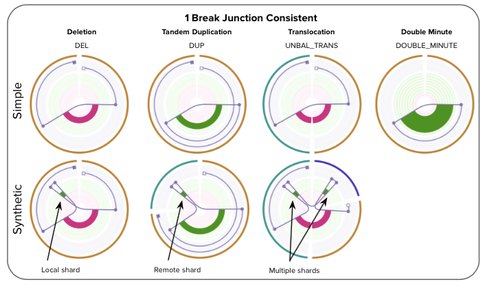
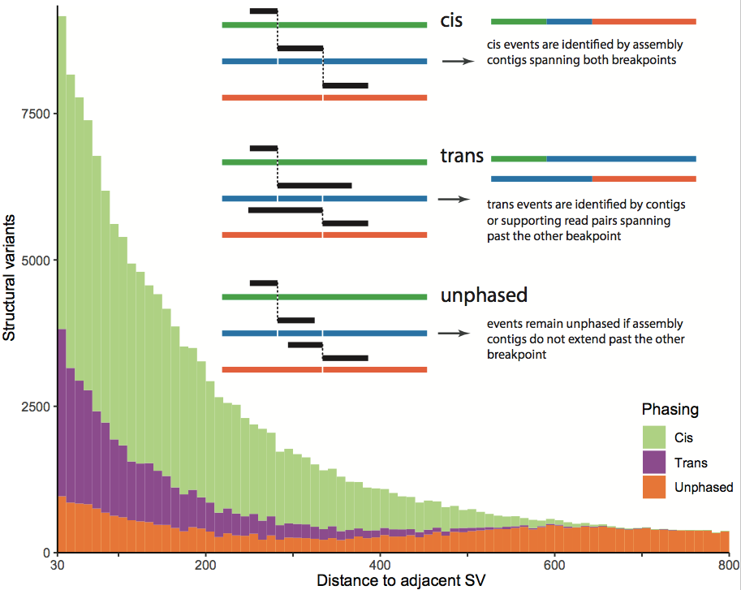
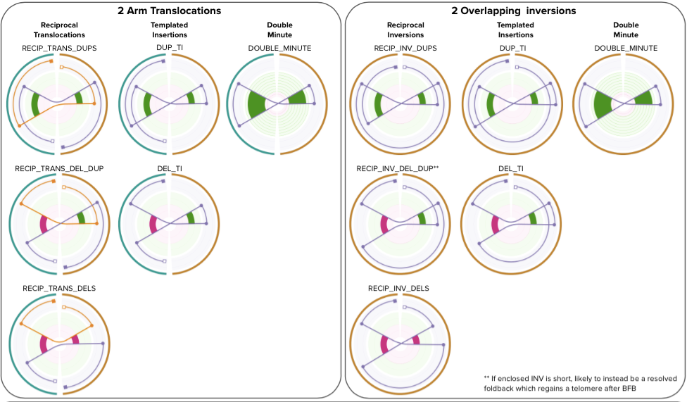
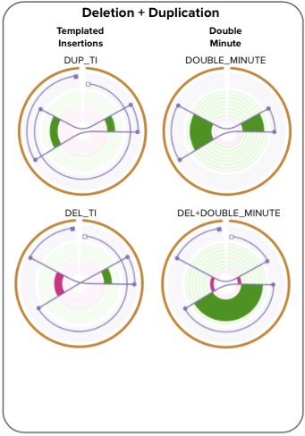
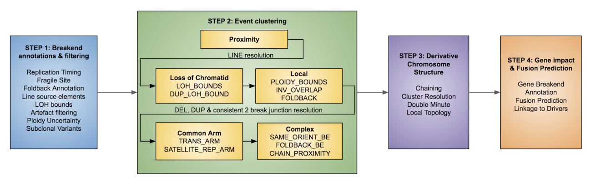
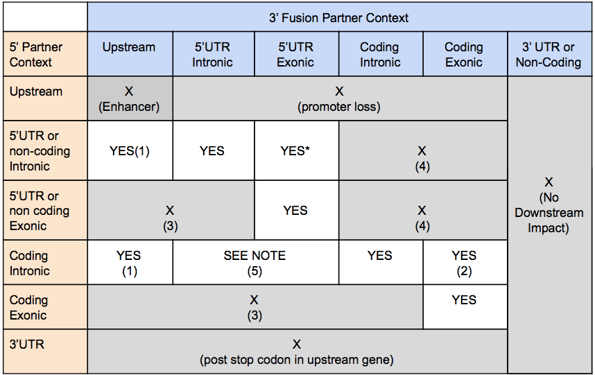

# LINX

LINX is an annotation, interpretation and [visualisation](./README_VIS.md) tool for structural variants. The primary function of LINX is grouping together individual SV calls into distinct events and properly classify and annotating the event to understand both its mechanism and genomic impact.

## Contents

* [Configuration](#configuration)
  + [Example Usage](#example-usage)
* [Dependencies](#dependencies)
* [Outputs](#outputs)
* [Key Concepts in LINX](#key-concepts-in-linx)
  + [LINX terminology and conventions for linking proximate breakends](#linx-terminology-and-conventions-for-linking-proximate-breakends)
  + [Overview of event classification system in LINX](#overview-of-event-classification-system-in-linx)
* [LINX ALGORITHM](#linx-algorithm)
  + [Annotation of genomic properties and features](#annotation-of-genomic-properties-and-features)
  + [Clustering of SVs into events](#clustering-of-svs-into-events)
  + [Chaining of Derivative Chromosomes](#chaining-of-derivative-chromosomes)
  + [Gene impact and fusion prediction](#gene-impact-and-fusion-prediction)
* [Visualisation](#visualisation)  
* [Version History](#version-history)

## Configuration
All values are optional unless otherwise specified.

### Core
Argument  | Description
---|---
sample  | Required: Specific sample ID
sv_vcf | Full path and filename for the SV VCF
purple_dir | Directory with sample data for structural variant VCF, copy number and purity data files as written by GRIDSS and Purple.
output_dir | Required: directory where all output files are written
ref_genome_version | Defaults to HG19, valid values are HG19, HG37 or HG38. 

#### Database Connectivity
LINX can source structural variants, copy number and purity data from the HMF MySQL database instead of from the VCF and TSV files.
In this case specify database connection config: db_user, db_pass and db_url.

LINX will read sample data from the following HMF tables:
* copyNumber
* structuralVariant
* purity
* geneCopyNumber and driverCatalog - if running driver annotation

and upload samples data to the following HMF tables:
* svAnnotation, svCluster and svLink, viralInsertion
* svBreakend, svFusion and svDriver

#### Multi-sample batch mode
LINX can run in a batch mode where it processes multiple samples at once. In this case it downloads SV and copy number data for each sample from the HMF MySQL database.

The set of samples to be processed is specified in the 'sample' config value in 1 of 3 ways:
* a list of samples separated by ','
* a CSV containing sample IDs with file header SampleId
* an '*' to process all samples in the HMF purity table. If the config option 'filter_qc_pass' is present then only samples passing QC are processed.

### Modes and Routines
Argument  | Description
---|---
check_drivers | run driver annotation logic
check_fusions | discover and annotate gene fusions

### Reference files
Argument  | Description
---|---
fragile_site_file | List of known fragile sites - specify Chromosome,PosStart,PosEnd
line_element_file | List of known LINE elements - specify Chromosome,PosStart,PosEnd
replication_origins_file | Optional: Replication timing input - in BED format with replication timing as the 4th column
viral_hosts_file | Optional: List of known viral hosts - Refseq_id,Virus_name
gene_transcripts_dir | Directory for Ensembl reference files - see instructions for generation below.

### Clustering
Argument  | Description
---|---
proximity_distance | (default = 5000), minimum distance to cluster SVs 
chaining_sv_limit | threshold for # SVs in clusters to skip chaining routine (default = 2000)

### Fusions Analysis
Argument  | Description
---|---
log_reportable_fusion | only log reportable fusions
known_fusion_file | Known fusion reference data - known pairs, promiscuous 5' and 3' genes, IG regions and exon DELs & DUPs 
fusion_gene_distance | distance upstream of gene to consider a breakend applicable (default = 100K)
restricted_fusion_genes | restrict fusion search to specified genes, separated by ';'

### Logging
Argument  | Description
---|---
write_vis_data | write output to for generation of Circos clustering and chaining plots
log_debug | logs in debug mode

### Example Usage
Single sample - Load SVs and purple data from file, upload Linx results to database:

```
java -jar sv-linx.jar 
    -sample SAMPLE_ID 
    -db_url [db_url] -db_user [username] -db_pass [password] 
    -sv_vcf /path_to_purple_vcf/
    -purple_dir /path_to_purple_data_files/
    -output_dir /path_to_sample_data/ 
    -fragile_site_file fragile_sites.csv 
    -line_element_file line_elements.csv 
    -replication_origins_file heli_rep_origins.bed 
    -viral_hosts_file viral_host_ref.csv 
    -gene_transcripts_dir /path_to_ensembl_data_cache/ 
    -check_fusions 
    -known_fusion_file known_fusion_data.csv 
    -check_drivers
    -log_debug
```

Single sample - query SVs and purple data from database, upload Linx results to database:

```
java -jar sv-linx.jar 
    -sample SAMPLE_ID 
    -db_url [db_url] -db_user [username] -db_pass [password] 
    -output_dir /path_to_sample_data/ 
    -fragile_site_file fragile_sites.csv 
    -line_element_file line_elements.csv 
    -replication_origins_file heli_rep_origins.bed 
    -viral_hosts_file viral_host_ref.csv 
    -gene_transcripts_dir /path_to_ensembl_data_cache/ 
    -check_fusions 
    -known_fusion_file known_fusion_data.csv 
    -check_drivers
    -log_debug
```

Cohort analysis - run all samples by sampleId in provided file, query SVs and purple data from database.
Write Linx results to cohort files, no uopload to database:

```
java -jar sv-linx.jar 
    -sample cohort_sample_ids.csv
    -db_url [db_url] -db_user [username] -db_pass [password] 
    -output_dir /path_to_sample_data/ 
    -fragile_site_file fragile_sites.csv 
    -line_element_file line_elements.csv 
    -gene_transcripts_dir /path_to_ensembl_data_cache/ 
    -check_fusions 
    -known_fusion_file known_fusion_data.csv 
    -check_drivers
    -write_all
```

### Generating cached Ensembl data files
To annotate SVs with gene information and to support fusion detection, LINX uses gene, transcript, exon and protein domain information from the Ensembl database. 
To improve performance, this data is first extracted into 4 CSV data files and then loaded into memory each time LINX runs.

To generate these 4 data files, first run LINX with these command line options:

```
java -cp sv-linx.jar com.hartwig.hmftools.linx.gene.GenerateEnsemblDataCache
    -ensembl_db [see below] -ensembl_user "anonymous" -ensembl_pass "" 
    -output_dir /path_to_write_data_files/ -ref_genome_version [37 or 38]
```

Ensembl database URLs for 19/37 & 38 are:
- mysql://ensembldb.ensembl.org:3337/homo_sapiens_core_89_37
- mysql://ensembldb.ensembl.org:3306/homo_sapiens_core_98_38

By default LINX will use HG19, but this can be overridden using the ref_genome_version config described above.

## Outputs

Linx writes all output to tsv files, each of which is decribed below.

### SV Annotations

Additional annotations of each breakjunction

Generated file: sample_id.svs.tsv

Field | Description 
---|---
svId | Id of break junction
vcfId | Id of break junction for mapping to GRIDSS / PURPLE vcf
clusterId | Id of cluster which break junction is assigned to
clusterReason | Reason for clustering and svId of clustered break junction for other break junction(s) to which the variant has been clustered
fragileSiteStart | Start breakend of break junction is in a known fragile site (T/F)
fragileSiteEnd | End breakend of break junction is in a known fragile site (T/F)
isFoldback | Break junction is classified as a foldback (T/F)
lineTypeStart | Start breakend of break junction is in a known or suspected line source element
lineTypeEnd | End breakend of break junction is in a known or suspected line source element
junctionCopyNumberMin | Minimum bound JCN estimate for breakjunction
junctionCopyNumberMax | Maximum bound JCN estimate for breakjunction
geneStart | Gene(s) overlapping start breakend of SV
geneEnd | Gene(s) overlapping end breakend of SV
replicationTimingStart | Start breakend of break junction is in a known fragile site (based on HeLa replication timing,  hg19 only)
replicationTimingEnd | End breakend of break junction is in a known fragile site (based on HeLa replication timing,  hg19 only)
localTopologyIdStart | Id for group of proximate breakends to the start breakend of break junction within an extending 5kb window 
localTopologyIdEnd | Id for group of proximate breakends to the end breakend of break junction within an extending 5kb window 
localTopologyStart | Local breakend toplogy type at site of start breakend.  One of ('ISOLATED_BE','DSB','TI_ONLY','SIMPLE_DUP','FOLDBACK', 'FOLDBACK_DSB','SAME_ORIENT','COMPLEX_FOLDBACK','COMPLEX_LINE','COMPLEX_OTHER')
localTopologyEnd | Local breakend toplogy type at stie of end breakend.  One of ('ISOLATED_BE','DSB','TI_ONLY','SIMPLE_DUP','FOLDBACK', 'FOLDBACK_DSB','SAME_ORIENT','COMPLEX_FOLDBACK','COMPLEX_LINE','COMPLEX_OTHER')
localTICountStart | Number of chained templated insertions in local topology group of start breakend
localTICountEnd | Number of chained templated insertions in local topology group of end breakend

### Breakends

Impact of each break junction on each overlapping gene

Generated file: sample_id.breakend.tsv

Field | Description 
---|---
Id | Id of breakend annotation
SvId | Id of break junction
IsStart | Annotation relates to the start breakend of the break junction (1 = true,0 = false)
Gene | Gene annotated
TranscriptId | Ensembl stable transcript id of annotation
Canonical | Transcript is the canonical transcript of the gene.   LINX annotates 1 record for each canonical transcript overlapping the breakend + a record for any non-canonical transcript that is annotated as part of a fusion
geneOrientation | Orientation which breakend points relative to the gene taking into account both gene strand and breakend orientation.  
Disruptive | Breakend is part of a break junction which disrupts the exonic sequence of the transcript
ReportedDisruption | Breakend is disruptive and gene is flagged as reportable for disruption
UndisruptedCopyNumber | Number of remaining wildtype alleles of the gene that are not disrupted by the breakend.  If <0.5 then disruption is considered Homozygous
RegionType | Location of the breakend relative to the transcript.    One of 'UPSTREAM' (within 10kb upstream of the 1st base of the transcript), 'INTRONIC' or 'EXONIC'
CodingContext | Location of the breakend relative to the coding context of the transcript.    One of  'CODING', 'NON_CODING','UTR_5P','UTR_3P' or 'ENHANCER' (IG enhancer rearrangements only)
Biotype | Ensembl biotype of the transcript
ExonicBasePhase | If regionType = EXONIC, the exact base phase of the breakend, else -1
NextSpliceExonRank | The exon rank of the next splice acceptor (if gene orientation is 'DOWNSTREAM') or splice donor (if gene orientation is 'UPSTREAM')
NextSpliceExonPhase | The phase of the 1st base after the next splice acceptor (if gene orientation is 'DOWNSTREAM') or splice donor (if gene orientation is 'UPSTREAM')
NextSpliceDistance | The distance in bases to the next splice site identified in nextSpliceExonRank
TotalExonCount | Total number of exons in the transcript

### Clusters

Clustering of all SV events and their resolved classification.

Generated file: sample_id.clusters.tsv

Field | Description 
---|---
ClusterId | Unique Id for the cluster
Category | High level categoristion of the cluster classification
Synthetic | Set to TRUE if the cluster is resolved to a non complex type by simplification of a short templated insertion (<1kb)
ResolvedType | Resolved classification of the cluster.
clusterCount | The number of break juncitons in the cluster
clusterDesc | String containing the types and counts of break junctions in the cluster.   eg. DEL=2_INV=2 


### Links

Chromosomal segments joining break junction pairs predicted to be linked and phased in cis on the derivative chromosome

Generated file: sample_id.links.tsv

Field | Description 
---|---
clusterId | Id of the cluster which contains the link
chainId | Id of the chain to which the link belongs representing a multi-segment prediction of the derivative chromosme
chainIndex | Position of the linked segment in the chain.  The predicted chain can be reconstructed by traversing each linked segment in order ie. 0,1,...,n
chainCount | Total count of linked segments in the chan
lowerBreakendId | svId of the leftmost breakend of the linked segment
upperBreakendId | svId of the rightmost breakend of the linked segment
lowerBreakendIsStart | True if the lower breakend is the start breakend of the break junction
upperBreakendIsStart | True if the right breakend is the start breakend of the break junction
chromosome | Chromosome of the linked sgement
arm | Arm (P/Q) of the linked segment
assembled | True if the segment is linked by a GRIDSS assembly
traversedSVCount | The number of other breakends that are located on the linked segment
length | Length of the linked segment
junctionCopyNumber | Predicted copy number of the chain
junctionCopyNumberUncertainty | Uncertainty in the copy number of the chain
pseudogeneInfo | If the segment precisely matches an exon of an ensembl gene, then containts details of the matching exon:  {geneName;TranscriptId,ExonRank,ExonLength}
ecDna | True if the link is predicted to be part of a DM / ecDNA chain

### Viral insertions

Viral insertions detected in the sample

Generated file: sample_id.viral_inserts.tsv

Field | Description 
---|---
SvId | Id of break junction
VirusId | Id of virus that insertion sequence is mapped to
VirusName | Full name of virus


### Fusions

All inframe and out of frame fusions predicted in the sample including HMF fusion knowledgebase annotations

Generated file: sample_id.fusions.tsv

Field | Description 
---|---
FivePrimeBreakendId | Id of the 5' breakend in the fusion
ThreePrimeBreakendId | Id of the 3' breakend in the fusion
Name | Name of the fusion in the form 5'GENE_3'GENE
Reported | True if the fusion meets all reportable fusion criteria for LINX
ReportedType | If one or both of the genes matches  a promiscuous gene or known rearrangament in the HMF fusion knowledgebase, then the type of reportable gene pair:  f 'KNOWN_PAIR', 'PROMISCUOUS_5', 'PROMISCUOUS_3', 'PROMISCUOUS_BOTH', 'EXON_DEL_DUP', 'IG_PROMICUOUS', 'IG_KNOWN_PAIR', KNOWN_PAIR_UNMMABLE_3' or 'NONE' (if no match is found)
Phased | Set to 1 if a phased fusion can be formed (after allowing for exon skipping)
ChainLength | 0 for simple fusions.  If fusion is chained equal to the total length of segments chained between 5' and 3' partners
ChainLinks | 0 for simple fusions.  If fusion is chained equal to the number of segments chained between 5' and 3' partners
ChainTerminated | True if the fusion is interupted either on the 5’ partner side by a chained breakend prior to the start of the 5’ gene or by a chained breakend prior to the last coding base of the 3’ gene
DomainsKept | List of 3' partner domains retained in fusion product (as annotated by PROSITE profiles)
DomainsLost | List of 3' partner domains lost in fusion product (as annotated by PROSITE profiles)
SkippedExonsUp | Count of splice donors required to be skipped on 5' partner side to form an inframe fusion.  
SkippedExonsDown | Count of splice donors required to be skipped on 3' partner side to form an inframe fusion
FusedExonUp | Last exon fused on 5' partner side
FusedExonDown | First exon fused on 3' partner side

### Driver Catalog

Reproduction of the driver catalog produced by PURPLE with homozygous disruptions events appended

Generated file: sample_id.driver.catalog.tsv

For more details about this file see:   https://github.com/hartwigmedical/hmftools/tree/master/purity-ploidy-estimator#driver-catalog-file

### Drivers

Linkage of drivers from driver catalog to SV cluster which contributed to those drivers including LOH, deletion, disruption and amplification events.

Generated file: sample_id.driver.tsv

Field | Description 
---|---
clusterId | Id of cluster which break junction associated with driver.  Set to -1 for ARM or CHR level events.
gene | Gene of driver.   Multiple clusters may be linked to a gene for a sample
eventType | Type of driver .   One of ''GAIN" (amplification by SV), "GAIN_ARM" (amplification of whole arm), "GAIN_CHR" (amplification of whole chromosome), "DEL" (homozygous deletion), "LOH" (focal LOH), "LOH_ARM" (arm level LOH), "LOH_CHR" (chromosome level LOH), "LOH_SV_TELO" (LOH from SV to telomere), "LOH_SV_CENTRO" (LOH from SV to centromere), "HOM_DUP_DISRUPTION (homozygous disruption via cross exonic tandem duplication), "HOM_DEL_DISRUPTION" (homozygous disruption without homozygous copy number loss)

## Key Concepts in LINX

### LINX terminology and conventions for linking proximate breakends

#### Assembled vs Inferred links
In LINX, links are chromosomal segments connected by break junctions which are predicted to form part of a derivative chromosome. Assembled links are those that were linked by in a single assembly by GRIDSS as being and are very high confidence somatically phased. All other links are inferred, based on proximity, topology and ploidy characteristics using the chaining logic described below.

#### Templated Insertions
We have adopted the term ‘templated insertion’ as has been used previously [CITE PCAWG] to describe any piece of DNA which is a templated sequence from a section of the ref genome flanked by breakends on either side inserted elsewhere (either locally or on a remote chromosome) into a chain to form part of a derivative chromosome.

#### ‘Shards’ and ‘synthetic’ events
A special and very common case of templated insertions we observe are very small templated genomic fragments of up to several hundred bases in length, which are frequently inserted into breakpoints without disruption at the source site for the inserted sequence. These have been observed previously [https://www.ncbi.nlm.nih.gov/pmc/articles/PMC1950898/] and termed as genomic ‘shards’. In LINX we model shards explicitly as short templated insertion lengths of less than 1k bases. These inserted sequences can make simple events such as deletions and tandem deletions appear to have complex geometries. For example, if we have a simple short deletion with a shard inserted, and the templated sequence of the shard is from another chromosome the deletion now presents notionally as a chained pair of translocations. Where more than 1 shard is inserted, the complexity can grow even further. LINX simplifies events that could be explained as a 1 or 2 break cluster and where shards which do not overlap the region where they are inserted and marks them as the simple type and marks the cluster as ‘synthetic’.

The following figure shows a number examples of synthetic events with the shards marked.

<p align="center">
    
</p>

#### Deletion Bridges, Anchor Distance & Overlapping Deletion Bridges
We use the term ‘deletion bridge’ as defined previously [CITE Chromoplexy paper] to refer to sections of DNA loss between 2 breakpoints on the same chromatid that are fused to other segments of the genome. 

GRIDSS provides an anchor support distance for each structural variant breakend which is the number of bases mapped to the reference genome at that breakend as part of the assembly contig, which is typically in a range from 29 bases (the minimum anchor distance for GRIDSS to be able to call) up to approximately 800 bases for short read sequencing. 
Any other breakend that falls within this anchor distance cannot be ‘cis’ phased with the variant as the contig was able to be mapped past the breakend and the 2 breakends are ‘trans’.


  
Trans breakends within this distance are common. One possibility is that the breakends could occur on the other chromatid, but this highly unlikely as there is no reason to expect 2 different chromatids to both be damaged within a few hundred base region. Much more likely is that when the double stranded break occurred, that there was significant overlap between the break locations on the 2 strands and the overlapping break ends have been replicated prior to fusing with other genome. This is highly analogous to a deletion bridge except with small sections of replication of DNA instead of loss. LINX uses the term ‘overlapping deletion bridge’ to describe this break topology.

### Overview of event classification system in LINX
LINX attempts to classify all variants into a set of consistent events, ie events that transform the genome from one stable configuration into another. The 4 basic categories of events that we have are simple deletions, tandem duplications, insertions and two break events (including both reciprocal events and unbalanced translocations). For events with 3 or more variants that cannot be simplified into the above types, the number of possible configurations quickly explodes so we group these together in COMPLEX and analyse them via topological features rather than as distinct classes.

A key assumption in LINX is that each derivative chromosome arm in a stable configuration must connect a telomere to a centromere (since centromere to centromere joins will cause unstable breakage fusion bridge and telomere to telomere joins will have no centromere and will be ultimately lost during stochastic mitosis processes). A special case is allowed in highly restricted circumstances for double minute chromosomes which are circular and have no telomere or centromere but are highly positively selected for. This assumption means that variants such as a lone head to head or tail to tail inversion are considered incomplete, and in these cases we intensively search for other variants which may have occurred concurrently and could restore a stable configuration. Because of limitations of both input data accuracy and completeness and our clustering and chaining algorithm, many COMPLEX clusters will not be fully resolved to a stable configuration although it is assumed that such a resolution exists. Furthermore, we have a number of residual 1 and 2 clusters (eg. a lone inversion) which are inconsistent cannot be accurately clustered and hence we classify them as INCOMPLETE. 

Ultimately we classify each cluster into 1 of 7 major event super types:

Event Super Type | Description
---|---
SIMPLE | Single break junction cluster which forms a local deletion, tandem duplication or unbalanced translocation
RECIPROCAL | Reciprocal inversion or translocation events forming from 2 concurrent breaks interacting with each other
TEMPLATED INSERTION | DEL or DUP or unbalanced translocation (‘chain’) with templated insertion
INSERTION | SV that are formed by the insertion of a templated piece of DNA normally via either a mobile line element or virus.
DOUBLE_MINUTE | Any cluster where all variants form part of a double minute
COMPLEX | Clusters with 3 or more variants that cannot be resolved into one of the above categories
INCOMPLETE | 1 or 2 breakpoint clusters which are inconsistent, but cannot be clustered further OR clusters which are inferred from copy number changes only

A brief overview of the non single break junction events types is given below:

#### Reciprocal Events
Linx models reciprocal 2-break junction events as events that could be caused by the interaction of 2 simple local concurrent breaks which would normally form deletes and tandem duplications. Depending on whether the breaks are on the same or opposite chromosomes this forms reciprocal translocations or reciprocal inversions. Note that in the translocation case, if one side of the reciprocal event is subsequently lost either before or after repair, then we observe an unbalanced translocation. 

The possible geometries for reciprocal events supported by LINX are explained in the table below and shown below:

Interacting Break Types | Same chromosome (Inversion) | Translocation 
---|---|---
Concurrent double stranded breaks | RECIP_INV - 2 facing inversions with outer breakends overlapping | RECIP_TRANS - 2 translocations forming deletion bridges on both arms.
Concurrent tandem duplications | RECIP_INV_DUPS - 2 facing inversion with inner breakends overlapping | RECIP_TRANS_DUPS - 2 translocations with facing breakends on both arms
Tandem Duplication + Double Stranded Break | RECIP_INV_DEL_DUP - inversion enclosing inversion with opposite orientation | RECIP_TRANS_DEL_DUP - 2 translocations forming a deletion bridge on one arm and and facing breakends on other arm

<p align="center">
    
</p>


A facing pair of foldback inversions (FB_INV_PAIR) is also classified as a reciprocal, although the mechanism for forming this structure is unclear.   It is possible that many of these events are formed from a breakage fusion bridge event but have not been properly clustered with a resolving break junction which may be distant in a breakage fusion bridge scenario.

#### Templated Insertions
For the 4 reciprocal event cases above involving duplication (ie. RECIP_INV_DUPS, RECIP_INV_DEL_DUP, RECIP_TRANS_DUPS & RECIP_TRANS_DEL_DUP), the same break junctions can be alternately chained to form a single derivative chromosome with a templated insertion [see extended figure ??? ]. LINX gives precedence to the reciprocal interpretation, but if any of the duplicated segments bound a telomeric or centromeric loss of heterozygosity, the reciprocal interpretation is implausible

A deletion and duplication can together also form either a duplication or deletion with templated insertion structure (as shown below) identical to the 2 inversion case but with the inserted segment in the opposite orientation. 
Unlike inversions, simple deletions and tandem duplications are consistent standalone events and are common genomic events so some of these structures may be clustered incorrectly where separate DEL and DUP events are highly proximate or overlapping by chance

<p align="center">
    
</p>


#### Insertions
An insertion event is modelled by LINX as a pair of structural variants which inserts a section of templated sequence from either another part of the genome WITHOUT disruption to the chromatid at the source location OR from an external sequence such as an insertion from a viral genome. 

The most common class of insertion in tumor genomes by far are mobile line element insertions, which are not typically active in the germline, but can be highly deregulated in many different types of cancer. Mobile line elements frequently insert short sequences of their own DNA sequence and templated segments from adjacent to the source line element, with sometimes many segments from the same source location being inserted at multiple locations around the genome [CITE PCAWG]. Mobile LINE elements can also cause SINE and pseudogene insertions. LINE insertions breakpoints can be often difficult to map correctly on both ends, since they typically involve a repetitive LINE element at the start of the insertion element and a poly-A section at the end of the inserted section. LINX uses a combination of previously known line element source information and identification of both the local breakpoint structure and POLY-A sequences to classify both fully and partially mapped breakpoints as LINE insertions. 

#### Double Minute
Any cluster which is predicted to form a closed loop by LINX without a centromere is resolved as a double minute.   All variants must form part of the double minute to be classified as event type double minute, although double minutes may also occur as part of a complex cluster.    An exception is made for a simple DUP double minute clustered with an enclosing DEL, which is classified as double minute despite the DEL not being a part of the double minute structure.

#### Complex Events
‘Complex’ events are simply clusters with 3 or more variants or 2 clusters that can be fully chained, that cannot be resolved into either a simple or synthetic type of insertion, del, dup or 2-break event. 

Complex events may be formed by any combination of non-mutually exclusive processes including multiple concurrent breaks, replication prior to repair, breakage fusion bridge processes. Local topology annotations in LINX are intended to shed light on these complex processes.

#### Incomplete & Inferred Events
There are a number of possible configurations which are not ‘COMPLEX’ by the above definition since they are formed from 1 or 2 SVs, but lead to inconsistent genomes or involve single breakends. For these clusters there is assumed to be missing SVs, potential false positive artefacts or under clustering and they are marked as INCOMPLETE.

INCOMPLETE includes but is not limited to the following configurations:
* Lone Inversion
* Lone Single Breakend
* Lone Inferred Breakend
* Any 2 cluster with a single or inferred breakend that cannot be resolved as LINE or inferred as a synthetic.
* Any 2 cluster which cannot be chained OR resolved as either a LINE, synthetic or reciprocal event

Clusters of 2 inferred breakends are also classified in this category. Many of these are likely artefacts due to residual large scale GC biases affecting coverage in our sequencing.


## LINX ALGORITHM
There are 4 key steps in the LINX algorithm:
* Annotation of basic SV types and genomic properties
* Clustering of SVs into events
* Chaining of derivative chromosomes
* Gene impact and fusion prediction

The following schematic outlines the overall workflow in the LINX algorithm. Each step is described in detail below. 




### Annotation of genomic properties and features
To help resolve and characterise events, LINX first annotates a number of genomic properties.

#### Externally sourced genomic annotations
Each breakend is first annotated with the following information from external sources
* Whether it is in a known fragile site <SOURCE: Driver paper>
* Whether it is in a known LINE source element <SOURCE: PCAWG LINE paper>
* The replication timing of the breakend <SOURCE: HeLA replication timing>

#### Identification of foldback inversions
Foldback inversions are important structural features in the genome since they are a hallmark of the breakage fusion bridge process and are used by LINX in a number of ways in both the clustering and chaining algorithms. They can also be objectively identified independently of the clustering and chaining so it is useful to identify them upfront. We perform a genome wide search for foldback inversions. A pair of breakends are marked as forming a foldback if they meet the following criteria:
* the breakend orientations are the same and are consecutive (ignoring any fully assembled interim breakends) and after allowing for overlapping deletion bridges on both ends, specifically both 
    * The outer breakend may be overlapped by a variant within it’s anchor distance
    * The inner breakend may not have a facing breakend within it’s anchor distance
* the breakends belong to a single inversion or are linked by an assembled or short chain (<= 5K bases)
* A single breakend where the other end of the structural variant is assembled to itself via a chain
* Neither breakend forming the foldback is linked via assembly to another breakend.

#### Identification of suspected LINE sources elements
LINE source elements are also important genomic features and are modelled in LINX as regions of ~5000 bases which we suspected are the source for templated LINE insertions. LINE insertion type SVs are common in cancer genomes and typically present as a pair of balanced SVs representing a templated sequence from around the source element with a PolyA tail inserted into random locations in the genome although favoring a A|TTTTT motif [CITE PCAWG] for the insertion site with no net copy number change at either source or insertion site. However, due to both the repetitive nature of the LINE source elements and the difficulty of accurately sequencing across the polyA tail, one or both of the SVs that make up the insertion may be mapped as a single breakend (failing to uniquely map on the other side) OR be missed altogether. The lone remaining breakend can easily be mistaken as an unbalanced translocation so it is important to correctly identify as a LINE element. This picture can be complicated even further by the fact that many overlapping fragments from single source location may be copied to many different locations in the same genome, each potentially with one or both sides incompletely mapped. This can appear as a very complex feature if not broken into the constituent insertions that it represents.

Although we already annotate XXX well ‘known’ mobile line source elements which have been previously discovered, there are many more potential mobile line source elements and many are highly sample specific. We look exhaustively for likely LINE source elements in each individual tumor genome. Specifically each breakend may be classified as being a ‘Suspected’ line source element if:
* there are 2+ breakends within 5kb which both have a polyA insertion sequence
* OR there are 2+ translocations within 5kb with at least one not forming a deletion bridge of < 30 bases AND at least one SV within 5kb having an INS sequence containing at least 11 repeated As or Ts.
* OR we find at least 1 translocation with a remote single breakend forming a deletion bridge of < 30 bases AND EITHER at least one SV also within 5kb OR the remote single breakend HAVING an INS sequence containing at least 11 repeated As or Ts. 

The suspected LINE source element is also checked that it is not a potential pseudogene insertion by checking that there is no deletion within 5kb of the suspected source element that  matches an exon boundary at both ends.

#### Identification of LOH boundaries
We also identify each pair of breakends flanking regions of Loss of Heterozygosity (LOH), restricted to cases where there is no subset of the region with homozygous loss that is not caused by anything other than a simple deletion. This is a useful annotation as since an entire chromatid is lost for the whole distance between these 2 breakends (and since there is no homozygous loss we know it is the same chromatid lost at both ends, not two overlapping losses) then the structural variants are very likely to have occurred at the same time. 

Note that an uninterrupted deletion or tandem duplication cannot theoretically form an LOH boundary with another variant and hence these are excluded from LOH boundaries.

#### Long DEL and DUP length calculation
Shorter deletions and tandem duplications are found frequently as stand alone events in the tumor genome, but longer stand alone deletions and duplications are relatively rare and when they do occur are often associated with more complex events. The following method is used to determine a characteristic length threshold for each sample for what is considered a 'long' DEL or DUP.
find all DUPs and DELs on arms with no inversions (inversions are used as a proxy for the presence of complex events)
* Set LONG_DUP_LENGTH to the length of the longest DUP excluding the 5 longest DUP lengths (normalised for the proportion of arms without inversions). Min =100k, Max = 5M
* Set LONG_DEL_LENGTH to the length of the longest DEL excluding the 5 longest DEL lengths (normalised for the proportion of arms without inversions). Min =100k, Max = 5M

The threshold is subsequently used in clustering rules by LINX. 

#### Artefact filtering
Prior to clustering and chaining, LINX applies additional artefact filtering. This is due to the fact that depending on sequencing quality, we may still find a number of false positive artefacts in our data. False positive artefacts are typically either SVs with little or no copy number support (ie copy number change at both breakends < 0.5) or inferred SV breakends from the copy number analysis. Unfortunately these can be difficult to distinguish from bonafide subclonal variants with ploidies of 0.5, and from genuine clonal variants where we have missed an offsetting SV call which netted out the copy number change.

To remove residual artefacts, but preserve genuine subclonal variants, we limit filtering to very 4 very specific situations which strongly appear to be artifactual in our data:
* Equivalent breakend calls - Any single breakend marked as 'eqv' in GRIDSS assembly data or which matches the orientation and the breakend of another SV within 1 base is filtered prior to clustering 
* Spanning SV calls - if an SV’s breakends match orientation and position (to within 1 base) of the breakends of 2 other SVs, and these other 2 SVs are assembled into a templated insertion on their other breakends, then the spanning SV is considered an artefact.
* Short foldbacks Inversions (<100 bases) unsupported by copy number change at both breakends- Typically foldback inversions range from several hundred to several thousand bases. However, we also frequently find many very short foldbacks inversions in highly damaged samples. Across the cohort as a whole we find these to be overwhelmingly low ploidy and with little copy number support. Hence we mark foldback inversions <100 bases in length as artefacts if both start and end copy number change < 0.5 or VAF < 0.05 at both ends. 
* Isolated translocations and single breakends unsupported by copy number change at both breakends - These also common artefacts and similar to foldback inversions, we find a much higher rate of low ploidy variant calls unsupported by copy number. We filter if both breakends of a translocation are > 5000 bases from another variant AND both breakends have copy number change <0.5 AND the insert sequence is not polyA (which may indicate a Line insertion - see below). 
* Neighbour inferred breakends with opposite orientation and matching or overlapping ploidy - Residual GC bias and other forms of copy number noise can cause many inferred segments to be called. These are unhelpful in chaining and are resolved in pairs of offsetting variants as artefacts

All of the filtered variants will be marked as resolved type = ARTEFACT and will be restricted from any subsequent clustering.

#### Estimation of ploidy and ploidy uncertainty per SV 
We know that by definition PLOIDY = CNChange at start breakend = CNChange at end breakend for each and every Structural Variant. However, often times the PLOIDY and copy number start and end may not match up for one of several reasons including measurement error, false positive SV artefacts and false negative SV calls adjacent to one or both of the breakends for the structural variant. 

To allow for accurate chaining we would like to have a single consolidated ploidy estimation and an idea about the uncertainty in the ploidy for each SV. Since the distribution of the errors in our measurements are unknown and fat tailed due to potentially missing and false positive data, we create a simple model for a reasonable estimation of the likely ploidy range.

We use 3 steps in the process:

##### 1. Estimate an uncertainty for copy number change at each breakend
For this use the principle that the uncertainty in copy number change is driver primarily by the uncertainty in the copy number of the least confident adjacent copy number region which in turn is driven primarily by the number or read depth windows used to estimate the length of the adjacent regions. 

Hence we use the following formula to calculate a copy number uncertainty
```
CNChangeUncertainty = MAX(maxAdjacentCopyNumber * BaseRelativeUncertainy 
[0.1],BaseAbsoluteUncertainty [0.15])+ MAX(AdditionalAbsoluteUncertainty [0.4],AdditionalRelativeUncertainty [0.15]*maxAdjacentCopyNumber)/SQRT(max(minAdjacentDepthWindowCount,0.1))
```
If the mindAdjacentDepthWindowCount = 0, then this means the segment is inferred by the SV ploidy in PURPLE already and no copy number estimate is calculated.

For the special case of foldback inversions, if the flanking depth window counts are both higher than the internal depth window count, a single copy number change observation of half the combined copy number change is made with the confidences determined from the flanking windows

##### 2. Estimate an uncertainty for raw ploidy
The raw ploidy of the SV is already estimated in PURPLE by multiplying the purity adjusted VAF of the SV by the copyNumber at each breakend. The VAF estimate depends ultimately on the measured readcount of supporting tumor fragments which is a binomial distribution.

To estimate the uncertainty in the VAF, we estimate the 0.5% and 99.5% confidence intervals of the true read count from the observed read count and then calculate the ploidy uncertainty as half the relative range of the confidence interval. We also add half the minimum of the 2 breakend copy number uncertainties to reflect the copyNumber impact on uncertainty. This gives the formula:

```
Ploidy Uncertainty = Ploidy * (ReadCountUpperCI-ReadCountLowerCI) / 2 / ObseverdReadCount + 0.5 * min(CNChangeUncertaintyStart,CNChangeUncertaintyEnd)	
```

##### 3. Average the 3 ploidy predictions and estimate a consolidated uncertainty
Weight the observations by the inverse square of their estimated uncertainties:

```
consloidatedPloidy = SUM[Observation(i)*(1/Uncertainty(i)^2)] / Sum[1/Uncertainty(i)^2]
```

The combined uncertainty is estimated as the square root of the weighted sum of squares of the difference between the final ploidy estimate and each individual estimate, but capped at a minimum of half the input uncertainty. Ie. 

```
consolidatedUncertainty = SQRT( countObservations / (countObervations-1) * SUM[1/Uncertainty(i)^2*(MAX(Observation(i)-consolidatedPloidy,Uncertainty(i)/2))^2] / Sum[1/Uncertainty(i)^2] )
```

#### Identification of subclonal variants
We identify high confidence subclonal variants using the uncertainty bounds, using the threshold of maximum ploidy < 0.75. Clonal and subclonal variants are unlikely to have occurred at the same time and hence all subclonal variants are excluded from clustering with any variant that does not overlap in ploidy uncertainty and does not have a ploidy within 0.5 of the subclonal variants. Proximity clustering is still allowed, since the ploidy estimates for proximate variants are more uncertain.


### Clustering of SVs into events 
LINX uses a clustering routine to classify events. All SVs within a sample are grouped into clusters in a set of 6 substeps
* Proximity Clustering
* Resolution of LINE Clusters 
* LOH & Local overlap clustering
* Resolution of simple events 
* Advanced clustering rules


#### Proximity Clustering
Any SV with a breakend within the specified proximity_distance (defaults to 5K bases) of another SV's breakend causes the SVs to be clustered. An exception is made for overlapping DELs, which are split out into separate clusters, on the assumption that overlapping DELS must be on different chromatids.

#### Resolution of Line Clusters
Line insertions frequently involve repetitive sequences, and are often only partially resolved. We resolve a cluster as type LINE if:
* It contains a suspected LINE element AND (the cluster has <=10 variants OR at least 50% of the SVs in the cluster have a known or suspected breakend)
* If every variant in the cluster touches a KNOWN line element AND at LEAST one of the variants is a translocation
* If the cluster has 2 or less variants both of which are single or inferred breakends and at least one PolyA insert sequence

LINE clusters are excluded from all subsequent clustering rules.

#### Loss of chromatid bounds

##### Loss of chromatid bounds
The 2 breakends forming the bounds of any LOH region not disrupted by a homozygous deletion are clustered together, reflecting the fact that both ends of the lost chromatid must have been lost at the same time.

For LOH regions which are disrupted by 1 or more homozygous deletions, both chromatids are presumed to have been deleted in separate events and one deletion may enclose the other deletion OR they may overlap each other. In the enclosing case, for homozygous deletions which are in a region where the surrounding LOH bounds wither form a simple DEL or are already linked or extend to at least the full arm, then we cluster the 2 homozygous deletion bounds. Conversely if all the homozygous deletions inside a LOH region are simple DEL or are already linked then we can cluster the 2 LOH region bounds. Finally, in the overlapping case, if all the overlapping deletion bounds are from simple DELs or are already linked except for 2 breakends, then link the remaining 2 breakends.

Note that variants with breakends that bound an LOH are not permitted to link with breakends in the bounded LOH region via any subsequent rule, since by definition they are expected to be on the other chromatid.

##### Chaining bounds for DUP variants causing LOH
No breakend in a cluster can chain across an LOH which has been caused by a breakend in the same cluster. Hence if the other breakend of a DUP type variant bounding an LOH can only chain to only one available (not assembled, not LINE) breakend prior to the LOH, then we cluster the DUP and the other breakend.

#### Local Clustering

##### Major allele ploidy bounds
The major allele ploidy of a segment is the maximum ploidy any derivative chromosome which includes that segment can have. Hence a breakend cannot chain completely across a region with major allele ploidy < ploidy of the breakend, or partially across the region with a chain of ploidy more than the major allele.

Therefore any breakend is clustered with the next 1 or more facing breakends (excluding LINE & assembled & simple non overlapping DEL/DUP) IF the major allele ploidy in the segment immediately after the facing breakend is lower than the breakend ploidy, after discounting facing breakends in the original cluster. In the case of there being more than 1 facing breakend, the highest ploidy breakend is clustered and the process repeated. This clustering is limited to a proximity of 5 million bases and bounded by the centromere, since although more distal events are on the same chromosome may be definitely on the same derivative chromosome, this does necessarily imply they occurred concurrently.

##### Local Overlap
Merge any clusters or SVs where each cluster has either an inversion or a DEL exceeding the LONG_DEL_LENGTH, or a DUP exceeding the LONG_DUP_LENGTH and they overlap or enclose each other AND the 2 variants have at least one pair of breakends not more than 5M bases apart that either face each other or form a deletion bridge.

##### Foldbacks on same arm
Merge any 2 clusters with a foldback on the same chromosomal arm.

#### Resolve DEL, DUP and consistent 2-break junction events
At this step, DEL, DUP and reciprocal clusters are resolved to prevent them from over clustering with later clustering rules. Specifically, the following types of events are resolved:
* Deletions - Simple deletions less than the LONG_DEL_LENGTH
* Tandem duplications - Simple duplications less than the LONG DUP_LENGTH
* Reciprocal events and 2-break junction templated insertions - Pairs of overlapping inversions or translocations where the deletion bridge and/or overlap at both breakends are less than the LONG_DEL_LENGTH / LONG_DUP_LENGTH.

We also allow for synthetic variants of these events to be resolved, where the variants create a DEL, DUP or reciprocal event with the same geometry but with one or more shards inserted. All of these simple and synthetic clusters types are excluded from all subsequent clustering rules.

#### Common arm clustering rules

##### Translocations with common arms
Merge any 2 unresolved clusters if they 2 touch the same 2 chromosomal arms. SVs which link the 2 arms but are in a short templated insertion (< 1kb) are ignored.

##### Single breakends on same arm with matching satellite repeat type clustering
Where complex events touch satellite repeats we frequently find many single breakends on the same chromosome with links to the same type of repeat. In particular this can occur when shattering events include complex focal scarring in centromeric regions leading to many unresolved single breakends

We therefore merge any cluster with less than or equal to 1 non single breakend and non inferred breakend with any other cluster which contains a single breakend on the same chromosome with matching repeat class or type for the following cases:
* RepeatClass = 'Satellite/centr’ (centromeric)
* RepeatType = '(CATTC)n’ (satellite repeat type)
* RepeatType = ‘(GAATG)n’ (satellite repeat type)
* RepeatType = ‘HSATII’ (pericentromeric)

To protect against false positives and joining complex clusters which both touch repeats, but otherwise don’t appear to overlap, we avoid clustering 2 clusters which already have multiple non single breakends. 

We don’t cluster other common sequences such as telomeric sequences, Sine/Alu or LINE/L1 as these tend to be associated with genome wide insertion patterns rather than specific clusters which touch a repetitive region.

#### Incomplete and small complex cluster merging
These rules are implemented to merge small unresolved with 3 or less variants to other unresolved clusters with an arbitrary cluster size where the location and orientation of proximate or overlapping breakends between the 2 clusters indicated that they may be linked. 

##### Breakends straddled by consecutive same orientation breakends
Merge any non resolved breakend to a cluster which straddles it immediately on both sides with 2 breakends facing the same direction, and where the facing breakends have matching ploidy.

##### Breakends straddled by foldbacks
Merge any non resolved breakend into a cluster which has 2 different foldbacks straddling it immediately on both sides and at least one of the foldbacks faces the breakend.

##### Extended chainable proximity for complex and incomplete events
Merge any neighbouring non resolved clusters that are within 5M bases and which have facing flanking breakends on each cluster which could form a templated insertion with matching ploidy. In the case of a foldback the ploidy of the facing breakend is also permitted to match 2x the ploidy.


### Chaining of Derivative Chromosomes

A chaining algorithm is used to predict the local structure of the derivative chromosome within each cluster. The chaining algorithm examines each cluster independently and considers all possible paths that could be made to connect facing breakends into a set of continuous derivative chromosomes. LINE insertion type clusters are excluded from chaining.

#### Overview of Chaining model
A ‘chain’ in LINX is modelled as a set of 1 or more structural variants connecting a pair of breakends with a ploidy and a ploidy uncertainty. Initially each cluster begins with 1 chain for every SV in the cluster. LINX iteratively makes ‘links’ between chain ends, resolving 2 of the chains into 1 combined chain and determining a combined ploidy and ploidy uncertainty for the new combined chain from the 2 constituent chains. The order of linking of chains is prioritised, such that the most likely linkages are made first. Structural variant calls from GRIDSS that are shown to be linked empirically by GRIDSS are linked first followed by a set of heuristics to prioritise the remaining uncertain links. This process continues to extend the length of and reduce the number of chains until no further links can be made. 

##### Constraints on linking breakends

In general each pair of facing breakends is considered by LINX as a candidate chain. However, 3 key constraints are applied in limiting candidate pairs:

* ‘Trans’ phased breakends are not permitted to chain - A breakend may not be chained to another breakend within it’s anchoring supporting distance unless it is linked by assembly.
* Closed loops without centromeres are only allowed for double minutes - With the exception of double minutes (see below), derivative chromosomes are assumed to connect to either a centromere or telomere at each end. Hence, chains which do not cross a centromere are not allowed to form closed loops (ie. the 2 breakends flanking a chain are not allowed to join to each other) except when specifically identified as a double minute. 
* A chain should not pass through a region with lower available chromatid ploidy than the ploidy of the chain - Chains are generally assumed to take place on a single chromatid except in the rare case that 2 distinct chromatids of the same chromosome are . The ploidy for the affected chromatid allele is calculated for each segment adjacent to each cluster by first determining the ploidy of the unaffected allele across each contiguous set of breakends in the cluster and subtracting that from the total copy number. The total ploidy of linked chains crossing a segment should not exceed the calculated chromatid ploidy for that segment. In some noisy copy number regions or where both chromatids are involved we may not be able to determine an undisrupted allele and the chromatid ploidy is not calculated. Additionally, if all possible links have been exhausted using this rule, the rule is relaxed such that chaining can continue under the assumption that allele specific copy number may not have been estimated accurately

##### Uniform ploidy clusters
Chains in LINX are a walkable set of linked breakends with a common ploidy. Uncertainty in ploidy measurement is one of the key confounding factors in predicting the derivative structure. Many clusters however do have the same ploidy for all variants and these uniform ploidy clusters are significantly simpler to chain into a derivative chromosome as each pair of breakends can only be linked with a single ploidy. 
 
Hence, each cluster is tested to see whether all its SVs could be explained by a single ploidy value, using each SV’s ploidy estimate and range. Specifically if all SVs have a ploidy range which covers the same value, even if not an integer, then the cluster is considered to be of uniform ploidy and not replication will occur in the chaining routine. Furthermore, if all SVs have a ploidy min less than 1 and a max > 0.5, then the cluster is also considered uniform.

##### Variable ploidy clusters 
For all clusters that cannot be resolved by a single uniform ploidy, further considerations apply to explain the amplification of parts of the cluster. Biologically, each SV initially occurs by joining 2 breakends with a ploidy of 1. However, a single chain in a cluster may contain SVs with different ploidies as a result of a replication from either a foldback inversion in a breakage fusion bridge event, or a later tandem duplication of part of the derivative chromosome. In these scenarios, the duplicated variants will appear multiple times in a single chain either repeated in the same direction in the case of a duplication or inverted in the case of a foldback. 

Duplication events are permitted to ‘replicate’ a chain in 2 different ways: 
* Foldbacks: Foldbacks with half the ploidy of another chain are permitted to link both their breakends to the same breakend of that chain, making a new chain of half the ploidy with the other unconnected breakend of the non foldback chain at both ends of the new chain. In this foldback replication case the new chain may also be treated as a ‘chained foldback’ and extended further in the same manner if possible. 
* Complex Duplications: Conversely, complex duplications with half the ploidy of another chain are permitted to join both of their breakends simultaneously to either ends of the other chain, effectively duplicating the entire chain, but keeping the same start and end breakends with half the ploidy. 

Partial replication of a chain is also possible by later variants which affect chains that have also been duplicated. In this case the higher ploidy chain is split into 2 separate chains, one which is linked to and given the ploidy of the lower ploidy chain, and the other which is given the residual ploidy. 

#### Implementation of chaining algorithm
Linx first resolves all assembled SVs in the cluster into chains. LINX then keeps a cache of a set of chains consisting initially of all ‘single variant’ chains (ie. lone SVs) and assembled chains. Each chain has 2 breakends, a ploidy and a ploidy uncertainty. Each potentially linkable pairs of facing breakends (subject to the available chromatid ploidy and no closed loops rules described above) is also cached as potentially linked chains.

The following steps are then applied iteratively to join chains together until no more chain links can be made:
* Apply priority rules below to choose the most likely linked pair of chains from the cache
* Merge chains - create new combined chain and calculate the ploidy & ploidy uncertainty. For replication events, replicate and halve the ploidy of the chain, inverting if it is a foldback type event.
In the case of partially split chains, the higher ploidy original chain is kept with it’s residual ploidy. Remove merged chains
* Update cache of linked breakend pairs that include a breakend on the merged chains

##### Prioritisation of chain links
Where more than 1 possible pair of linkable chain exists in the cache, links are ranked and chosen by the following criteria in descending order of importance:
1. Links with available chromatid ploidy 
2. Links containing highest ploidy foldback or complex duplication chain: a) Links where it splits another chain with 2x its ploidy, b) Links where it matches the ploidy of another chain, c) Links where it splits another foldback with greater than 2x ploidy, d) Links where it is itself split by another foldback or complex duplication with half the ploidy
3. Breakends with a single link possibility
4. Links with highest matching ploidy status (MATCHED > OVERLAPPING_PLOIDY_RANGE > NO_OVERLAP)
5. Adjacent links
6. Higher ploidy links (allowing for 0.5 abs and 15% threshold)
7. Shortest link

For uniform ploidy clusters, only rules 1, 3,5 & 7 are considered in the prioritisation of links.

A cluster can be chained into more than 1 chain, each one representing the neo-chromosomes resulting from the rearrangement event.

Chaining is often imperfect and incomplete due to the inclusion of single breakends and uncertainty about ploidy and subsequent breakend replication. 

#### Special considerations for double minutes

Double minutes and the SVs contained within them subject to special chaining rules in LINX. They are therefore identified prior to chaining taking place. The key principle used to identify double minutes is to look for high ploidy SVs that cannot easily be explained by other processes, particularly breakage fusion bridge. 
Specifically the criteria for a double minute are:
* There is at least one breakend with a ploidy of at least 8 AND at least 2.3x the adjacent major allele ploidy 
* The highest ploidy cannot be explained by a set of foldbacks which form a breakage fusion bridge event. A breakage fusion bridge event is considered plausible if the sum of foldback ploidies + half the maximum inferred breakend ploidy (which could plausibly be a missed foldback) is greater than or equal to the maximum ploidy AND at least one foldback has a ploidy of at least 15% of the maximum ploidy. 
* Even if these criteria are met, if one of the foldbacks is dominant (>75% of the foldback ploidy and ploidy > 4) then it cannot have been amplified by other foldbacks and breakage fusion bridge is still marked as implausible. 

If a cluster is identified as containing a potential double minute then LINX will attempt to first chain the high ploidy variants in that cluster into a closed loop. If a closed loop cannot be made, then chaining proceeds as normal. If a closed loop can be made then any SVs in the cluster with both breakends fully contained within a closed double minute can only link to other variants within the double minute OR to the double minute forming variants. These links are likely lower ploidy disruptions which occurred after the double minute was first replicated are present on a subset of the double minute chromosomes. 

#### Chain Annotations
The following data is captured for each TI:
* Whether the link is assembled
* Distance to the next link and whether it traverses any other breakends or links
* Overlap with a gene and any exon matches (eg pseudogenes)

#### Annotation of Local topology
Consecutive breakends with no more than 5kb between them or which are part of the same foldback inversion are grouped together into a local topology group and given an id. The number of TIs formed by chained segments wholly within the local topology group are counted and a topology type is given to the remaining variants based on the breakend orientations. The topology types are categorised as one of the following (after excluding all TIs)
* TI_ONLY - All breakends in the group form templated insertions
* ISOLATED_BE - One breakend only
* DSB - A par of breakends forming a deletion bridge
* FOLDBACK - One foldback only
* FOLDBACK_DSB - A foldback with the outer breakend forming a deletion bridge
* SIMPLE_DUP - A single DUP of <5k bases
* COMPLEX_LINE - Any other cluster that is resolved as LINE
* COMPLEX_FOLDBACK - Any other cluster that includes a foldback
* COMPLEX_OTHER - Any other cluster


### Gene impact and fusion prediction

#### Annotation of breakends with potential gene impact
For each breakend we search for genes that could be potentially disrupted or fused by the structural variant. 

To do this we find and annotate the breakend for any transcript that either:
* Has an exon or intron overlapping the breakend
* Has it’s 5’ end downstream of and facing the breakend and less than 100k bases where no other splice acceptor exists closer to the breakend. 

Each breakend is additionally annotated for the transcript with the following information:
* isDisruptive: disruptive for a particular transcript if the SV it belongs to is an inversion,single breakend or translocation or if the SV overlaps at least one exon in the transcript AND the variant is not part of a chain which does not disrupt the exon ordering in the transcript.
* TranscriptCodingContext: UPSTREAM, 5_UTR, CODING, 3_UTR, DOWNSTREAM OR NON_CODING
* geneOrientation: relative orientation of gene compared to breakend (UPSTREAM or DOWNSTREAM)
* isExonic (TRUE/FALSE)
* exactBasePhase: The exact base phasing of the current location
* Next splice site information: The distance to, phasing of and exon rank of the 1st base of the next facing splice acceptor or donor (note: phasing will be different from exactBasePhase if the breakend is exonic in the transcript or the coding context is upstream. Null if there are no subsequent splice sites in the gene.
* ExonTotalCount: The total number of exons in the transcript (for reference)
* transcriptBiotype: The ensembl biotype of the transcript

Fusions are predicted by looking for consecutive and novel splice donor-acceptor pairings that are joined together in derivative chromosomes by either a single structural variant or a continuous chain of structural variants.

#### Fusion prediction

##### Curate a list of known fusions
A list of 390 curated known fusion pairs was sourced by taking the union of known fusions from the following external databases:
* Cosmic curated fusions12 (v83)
* OncoKb9 (download = 27-Nov-2018)
* CGI8 (download = 27-Nov-2018)
* CIViC7 (download = 27-Nov-2018)

We then also created a list of promiscuous fusion partners using the following rules
* 3’ promiscuous: Any gene which appears on the 3’ side in more than 3 of the curated fusion pairs OR appears at least once on the 3’ side and is marked as promiscuous in either OncoKb, CGI or CIVIC
* 5’ promiscuous: Any gene which appears on the 5’ side in more than 3 of the curated fusion pairs OR appears at least once on the 5’ side and is marked as promiscuous in either OncoKb, CGI or CIVIC

Identify Viable Fusions
For each single SV and for every facing pair of SVs in the same chain identify all viable fusions which satisfy the following conditions:
* 5’ and 3’ must be inframe and join appropriate contexts of the gene (see table below). 
* Chain must be disruptive to the 5’ partner ( ie. the breakend must fall within the transcript bounds of the 5’ partner and not be a DEL or DUP or INS wholly contained within a single intron)
* Require 5' gene to have specific biotypes: protein_coding, retained_intron, processed_transcript, nonsense_mediated_decay, lincRNA
* Not disrupted by an intermediate splice acceptor / splice donor. Exceptions: 1. Traversal can be valid even if there are intermediate splice acceptors as long as upstream partner, downstream partner and all intermediaries are 5’ non-coding). 2. Splice donors/acceptors can be skipped within the same gene if there is no inframe valid fusion without skipping (this is to deal with alternative splicing).
* Not terminated on the 5’ partner side by a chained breakend prior to the start of the 5’ gene
* Not terminated on the 3’ partner side by a chained breakend prior to the last coding base of the 3’ gene.
* For chained fusions, the total chain length must be less than 100kb
* For upstream context, 10kb up from specific transcript start or 100kb for known fusion pairs

The following table shows allowed contexts:



Notes:
(1) for breakends in the upstream region of the 3’ partner, the 2nd exon (1st splice acceptor) is checked for phasing and assumed to be fused exon. 5’ partner coding to 3’ partner upstream is also possible if the 3’ partner coding region starts in the 1st exon and the 1st splice acceptor in the 2nd exon is in phase
(2) If fusing intron to exon, will fuse with the next downstream exon, so check against frame of end of exon instead of exact base.
(3) Exonic to Intronic could occur if alternative splicing causes exon with exonic breakend to be skipped
(4) 5’ partner 5’UTR or non-coding to coding region of 3’ partner - could technically make a fusion, but would need to find 1st alternative start codon also in frame.
(5) Coding Intronic to non-coding allowed only when transcript starts on 1st base of next downstream exon - in this case we fuse to the first base of the gene which is allowed.

##### Prioritise Transcripts
Prioritise transcripts and choose one fusion per cluster per fusion gene pair by the following rules in order
* Viable non-disrupted fusion
* Inframe
* Chain not terminated for known fusions
* 3’ partner biotype is protein_coding 
* Fusion without skipped exons
* Best 3’ partner, ranked by canonical and then longest (non NMD) protein coding
* Best 5’ partner out of those ranked by canonical, then longest protein coding

##### Determine reportability
Mark as reportable based on the following rules
* Matches an exact fusion from the curated list OR (is intergenic AND (matches 5’ promiscuous OR matches 3’ promiscuous gene) AND no exons are skipped)
* Curated domains which are preserved - Ets domain, Protein kinase domain, Epidermal growth factor-like domain, Ankyrin repeat-containing domain, Basic-leucine zipper domain, High mobility group box domain, Bromodomain
* Curated domains which must be disrupted if exist - Raf-like Ras-binding (mainly affects BRAF)
* For intragenic fusions, must start and end in coding regions of the gene
* 3’ partner must be a protein coding gene and the transcript does not result in nonsense mediated decay


#### Amplification, deletion and disruption drivers

##### Homozygous disruption drivers
LINX can optionally take as input a catalog of point mutation, amplification and homozygous deletion drivers which is created by PURPLE based on the raw somatic variant data and determined copy number profile.    LINX leverages it’s chaining logic to extend the driver catalog by searching for 2 additional types of biallelic disruptions which disrupt all copies of the gene but do not cause a homozygous deletion in an exonic segment (which is PURPLE’s criteria for homozygous deletion).     Specifically LINX searches for 2 additional types of homozygous disruptions:
* Disruptive Breakends - Any disruptive breakend which causes the intronic copy number to drop to <0.5 ploidy after allowing for the ploidy of any  overlapping deletion bridges.   
* Disruptive Duplications -  Any duplication which has both breakends disruptive in the transcript and a ploidy >= flanking ploidy at both ends end.    

##### Linkage of drivers to contributing structural variant clusters 
We link each driver in the catalog that is affected by genomic rearrangements (ie. high level amplifications, homozygous deletions and biallelic point mutations in TSG with LOH and the homozygous disruptions found by LINX) to each structural variant cluster which contributed to the driver. 1 or more structural variant clusters may contribute to each event and/or the driver may be caused by a whole chromosome or whole arm event which cannot be mapped to a specific variant but which has caused significant copy number gain or loss

Amplifications drivers are linked to either one or more clusters which explain the gain in copy number over the gene (marked as type 'GAIN'), a gain in copy number in the centromere (marked as type 'GAIN_ARM') or across the whole chromosome (marked as type 'GAIN_CHR'). More than 1 of these factors can be recorded as a cause of amplification if its copy number gain is at least 33% of the largest contributing factor. To determine whether a cluster contributes to gene amplification, the copy number change of all its breakends surrounding the gene are summed into a net cluster copy number gain, and the copy number loss of any opposing clusters are subtracted. If a net gain remains, then the cluster is considered as contributing to the gene amplification.

Homozygous deletions drivers are linked to clusters that either directly bound by the homozygous deleted region (svDriverType = DEL) or a cluster that bounds the LOH (svDriverType = LOH). Biallelic point mutations drivers in TSG with LOH are linked only to the cluster that bounds the LOH (svDriverType = LOH). If the LOH bounds extend to the whole arm or whole chromosome, then a record is created with linked clusterId is set to NULL and the svDrivertype is marked as LOH_ARM or LOH_CHR respectively.

The supported linkages between drivers and SVs are summarised in the table below

Driver Type | Events per driver | svDriverTypes
---|---|---
Amplification | 1+ | GAIN, GAIN_ARM, GAIN_CHR
Homozygous Deletion | 2 | DEL, LOH, LOH_ARM,LOH_CHR
Biallelic point mutation in TSG | 1 | LOH, LOH_ARM, LOH_CHR


## Visualisation

Visualisations of the LINX output can be generated with the accompanying tool as described [here](./README_VIS.md). 
Shown below is an example of a SS18-SSX1 fusion: 

<p align="center">
    
</p>


## Version History

- 1.10
- Functional:
    - LINE - see documentation for Suspect line element identification and cluster classification
        - lone-SGL cannot have significant CN change, and suspect BND+SGL must include a poly A-T tail
        - poly A-T tail motif uses orientation and only looks in the last 20 bases for 16+ or 11 consecutive As or Ts
        - chain SGLs with mapped alignments if other links assembled or only possible link
    - Fusions - see documentation for full details
        - call IG fusions, set IG breakend and fusion overrides
        - new known fusion type for exon DELs and DUPs
        - upstream fusion partner allowed to skip from exonic and coding to 3' pre-coding
        - short (<1M) unphased KnownPair fusions not reportable
        - KnownPairs now require protein domains lost and kept
        - transcripts disruptive for all upstream breakends
        - known fusion file types expanded and merged into single source
    - Double Minutes
        - allow lower JCN DM candidates if > 25% if max JCN
        - show DM chains in red even if not closed
        - DM close any sub-chains
    - driver DEL analysis skipped for germline deletions
    - added high facing JCN merge rule
    - zero-base INF links require JCN greater than adjacent major allele JCN
    - allow 0-1 base INF links inside anchor distance, added last during chaining
    - handle hom-loss events for male X & Y chromosomes

- Technical:
    - allow zero length DBs involving INFs
    - write line chain cohort file
    - write driver catalog and linx files even if no driver annotations found
    - use GRIPSS transitive marker for links
    - renamed DB ploidy fields to junctionCopyNumber	
        - DB fields: SV ploidy -> junctionCopyNumber, svAnnotation ploidyMin, ploidyMax, svLink ploidy, ploidyUncertainty

- 1.9
    - check validity of all input files and paths
    - removed 'chr' from chromosome name for HG38 support

- 1.8
    - Visualiser - when specifying a gene to display, this can now be referenced in the Ensembl data cache rather than the more limited internal gene panel by providing a path to the data cache with config: 'gene_transcripts_dir'
    - cluster 3 or more overlapping DELs and DUPs with matching copy number and forming potential links
    - added INDEL annotation for shattering analysis with config: 'indel_annotation' and 'indel_input_file'
    - chain consistency now checks for valid centromere traversal
    - re-search for chained foldbacks once chaining is complete
    - germline SVs disruption logic added
    - Double Minutes:
        - criteria to identify possible BFB ploidy, pairs of SGL breakends
        - allow closed DM loops to amplify centromere
        - check all arms in cluster for telo/centro CN vs DM ploidy or require 50x sample ploidy 
    - fail if fusion reference files aren't found, DEV-1121

 - 1.7
     - new fusion prioritisation: 1. inframe, 2. chain not terminated for known fusions, 3. 3’ partner biotype is protein_coding then 4. No exons skipped
     - require 5' gene to have specific biotypes: protein_coding,retained_intron,processed_transcript,nonsense_mediated_decay,lincRNA
     - RNA fusion matching use homology length to adjust position instead of interval offset
     - RNA matching with DNA - fixed match type bug if only a GENE match found
     - germline SV parsing and filtering from GRIDSS VCF - annotate assembly and gene overlaps or disruptions
     - write fusion priority value to verbose output file
     - optionally write all possible fusion combinations to verbose output, including for single-sample run

- 1.6
    - log filename and item count for all input reference files at INFO
    - log and write version file
    - exonic-exonic fusion were incorrectly calculating exact base phase
    - skip fusions which duplicate the first exon since has no splice acceptor

- 1.5
    - Fusion likelihood calcs - implemented gene-pairs, skip non-coding same-gene fusions
    - known fusions don't require upstream transcript to be disruptive but will still fail on chain termination
    - TIs limited by min of achor distances now less sum of breakend homologies
    - BFB_AMP does not require max ploidy x8
    - dominant foldback must exceed ploidy 4
    - DMs can have a single SV and need to be 5x sample ploidy or 2.3x telomere/centromere
    - dissolve simple groups unless all SVs in LOH or all assembled
    - set intronic transcripts from LINE clusters to be non-disruptive
    - bug: only reconfigure chains for RECIP_INV_DUPs if can form positive TI
    - bug: determination of unique non-reported fusions was skipping first element

- 1.0 -> 1.4
    - initial version with clustering, chaining and fusion detection
    - refinement and extension of clustering and chaining rules
    - improved visualisations for fusions
    - added driver annotations
    - Disruptive definition is changed for sv breakends. Small chained templated insertions (<5k bases) into or from intronic sections are no longer considered disruptive and will not be reported in the SV section of the report
    - The number of undisrupted copies is calculated for each disruptive breakend
    - Homozygous disruptions are now reported as drivers by LINX and are in the driver catalog
    - Each amplification, deletion or LOH driver in the driver catalog is now linked to the SVs that caused it in the svDriver table
    - Breakends in the 3’UTR region of the upstream gene are permitted to form fusions via exon skipping
   
    
    
