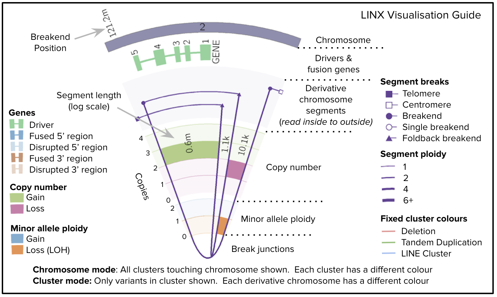
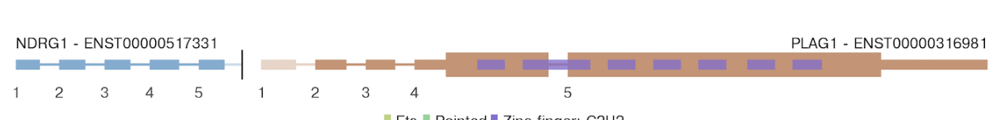
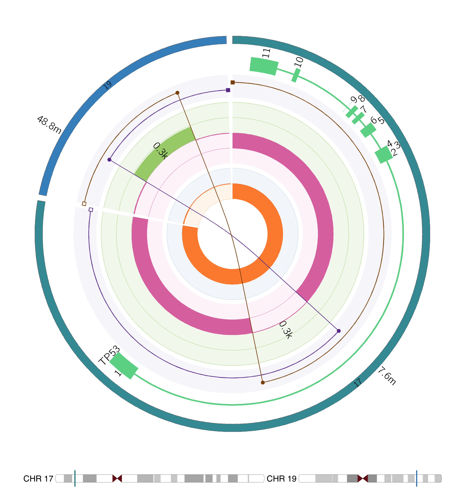

# LINX Visualisation

LINX provides functionality to present detailed visualisation of genomic rearrangements including genic impact in [CIRCOS](http://circos.ca/]format). 
LINX writes a set of 'VIS' files in a specific format which form the base data to generate the visualisation. 
The visualisation tool only depends on these files and so in principle any tool could provide SV & CN data in this format.

There are 3 components in the output of the LINX visualisation:

# Circos View

The CIRCOS view shows either the complete set of rearrangements in a cluster or set of clusters if 1 or more cluster ids are specified 
(‘cluster mode’) or all clusters that touch a chromosome if a chromosome is specified (‘chromosome mode’). 

The CIRCOS view demonstrated below has 6 tracks showing from innermost to outermost:
  - Break junctions
  - Minor allele ploidy profile
  - Copy number profile
  - Derivative chromosomes
  - Impacted genes (if any)
  - Affected chromosomes


<p align="center">
    
</p>

The scaling of both distances and ploidies in the figure has been modified to make the figure readable.
Specifically, the distances between each feature in the chart (either breakend or gene exon start or end) are modified to a log based scale,
so that the entire genomic rearrangement spanning millions of bases and multiple chromosomes can be viewed, but that local topology of 
regions with high densities of breakpoints can be introspected. 
Ploidy is set with a linear scale but is scaled down if the maximum cluster ploidy exceeds 6 or if the total density of events exceeds a 
certain maximum to ensure that even the most complex clusters can be introspected. Additionally, if the total number of breakends displayed 
exceeds **XX** then the break junctions become increasingly transparent such that other features on the plot don’t become obscured.

Another key feature of the CIRCOS plot is the ability to trace the derivative chromosome(s). 
Each segment in the 4th track represents a segment of the derivative chromosome and is linked on both ends either to a centromeric or 
telomeric end (marked with an open or closed square respective) or a breakend (marked with a track or triangle in the case of foldbacks). 
Each derivative chromosome can be traced continuously from one telomeric / centromeric end to another (or to a single breakend if one is 
reached) by following a continuous series of segments and beakends. To make this easier to follow, each time a new segment is connected on 
a chromosome the segment is offset outwards slightly. Hence the derivative chromosomes can be traced from the inside to the outside of the 
4th track of the diagram. A cluster may contain 1 or more derivative chromosomes. In cluster mode each derivative chromosome will be shown 
in a different colour for ease of viewing (with a maximum of 10 colours after which all derivative chromosomes are shown in black). 
In chromosome mode, derivative chromosomes will be shown in the same colours, but each cluster is shown in a different colour. 
Red and green are reserved for simple deletions and tandem duplications respectively. Since there may be many of these on a single 
chromosome, telomeric and centromeric connectors are not shown for these simple variant types. 
Light blue is also reserved for LINE clusters which can also be frequent in samples with highly deregulated LINE machinery. 

Most of the possible annotations are shown in the LINX visualisation guide. 
Additionally, 2 types of genomic regions which are frequently disrupted in tumor genomes are indicated using light grey shading on 
the copy number regions in the 3rd track. For known LINE source elements the green copy number section is shaded and for known 
fragile sites the red copy number section is shaded light grey. 


# Chromosome Range Panel

Since the CIRCOS only represents a part of the genome, the chromosome view is provided to indicate which parts of the genome is shown. 
Each of the chromosomes included in the cluster(s) shown is displayed. 
The part of the chromosome that is included in the figure is highlighted in the colour matching the colour used in the outer ring of the CIRCOS. 
The banding and location of the centromere on each chromosome is also shown.

An example of the chromosome view is shown below indicating the cluster includes a large section of chromosome 7 including the centromere 
and a small slither of chromosome 15 on the Q arm:

<p align="center">
    
</p>

# Fusion Panel

The fusion view is added for reportable fusions only in LINX. It’s purpose is to show the predicted structure of the fused gene. 
The fusion includes the fused segments of both the 5’ and 3’ partner in blue and red and always reads from left to right. 
The gene representation for each genes and follows the standard conventions of thick bands for coding regions, 
thinner bands for 5’ UTR and 3’ UTR exonic regions and thin lines to represent the intronic sections. 
Protein domains are shown in coloured bands across the exons which they include and are labeled in the accompanying legend. 
As with the CIRCOS view the lengths of exonic gene segments in the fusion view are scaled by a log scale to improve readability. 
The intronic segments are set to a fixed segment length regardless of the length. 

The fused gene is shown up to and including the breakend on either side that is connected either directly in the case of a simple fusion 
or via a chain in a chained fusion. If LINX predicts that one or more exons are skipped, then the skipped exonic segments and 
protein domain sections are faded. 

For example in the following TMPRSS2-ERG fusion, exons 3, 4 & 5 are faded and the LDL domain is also faded, indicating that LINX predicts 
these exons are skipped in order to make a viable in frame protein, despite the break end occuring after the 5th exon:

<p align="center">
    
</p>


A similar case can be seen in this example where the 5’UTR region of NDRG1 is fused upstream of the 1st exon in PLAG1. 
Since the 1st exon of a gene has no splice acceptor, LINX predicts the 1st exon is skipped and it is faded on the chart with the fusion 
connecting to the start of exon 2 which also begins in the 5’UTR region of PLAG1:

<p align="center">
    
</p>

Even when no exons are skipped, a protein domain may be partially disrupted if it extends to an exon the other side of the breakpoint. 
In the below example, you can see the SH2 protein domain extends before exon 16 and is faded and disrupted:

<p align="center">
    
</p>

Whilst fusions are normally intronic, rare exonic to exonic fusions do occur. The below figure shows a CIC-FOX04 example where the 2 exons
are directly fused:

<p align="center">
    
</p>


# Dependencies

LINX visualisation requires CIRCOS to be installed as well as a number of R dependencies that can be installed with the commands:
```
    install.packages("tidyr")
    install.packages("dplyr")
    install.packages("ggplot2")
    install.packages("cowplot")
    install.packages("magick") 
    
    library(BiocManager)
    BiocManager::install("Gviz")   
```

# Arguments
//TODO: max_distance_labels

## Relative Track Sizes

The relative sizes of the gene, segment and copy number tracks are controller with the following parameters:

Argument | Default | Description 
---|---|---
gene_relative_size| 0.3 | Size of gene track relative to segments and copy number alterations
segment_relative_size | 1 | Size of segment track relative to copy number alterations and genes
cna_relative_size | 2 | Size of gene copy number alteration relative to genes and segments


## Font Size

The following parameters control the font size. 

Argument | Default | Description 
---|---|---
min_label_size| 35 | Minimum size of labels in pixels
max_label_size | 40 | Maximum size of labels in pixels
max_distance_labels | 100 | Maximum allowed number of distance labels
max_gene_characters | 5 | Maximum allowed gene length before applying scaling

The label size scales linearly from the min to the max label size as an inverse function of the number of distance labels to be plotted. 
If the number of distance labels exceeds `max_distance_labels`, no distance labels will be shown and all labels will be sized with `min_label_size`.

The same label size will be applied genes unless there is a gene which exceeds `max_gene_characters` in length. In this case, all genes
will be scaled down to prevent the gene labels from going outside the gene track. Adjusting this parameter is best done in conjuction with
the `gene_relative_size` parameter.


## Chromosome Range Panel

Argument | Default | Description 
---|---|---
chr_range_height| 150 | Chromosome range row height in pixels
chr_range_columns| 6 | Maximum chromosomes per row


## Fusion Panel

Argument | Default | Description 
---|---|---
fusion_height| 250 | Height of each fusion in pixels
fusion_legend_rows| 1 | Number of rows in protein domain legend
fusion_legend_height_per_row| 35 | Height of each row in protein domain legend 

# Example Configurations

## Default

The default parameters are configured to produce an image that is suitable to be on a single page. 


## Smaller

The following figures were constructed with the parameters:
```


```

<p align="center">
    
    
    
    
</p>


## TMPRESS2-ERG

To accommodate the extra room required for the TMPRESS2 gene, this configuration increases the relative size of the gene track, decreases
the relative size of the segment track and increases the max number of characters in a gene before scaling: 

```
-gene_relative_size 0.6 -segment_relative_size 0.7 -cna_relative_size 2
-max_gene_characters 7
-min_line_size 3
```

<p align="center">
    
</p>