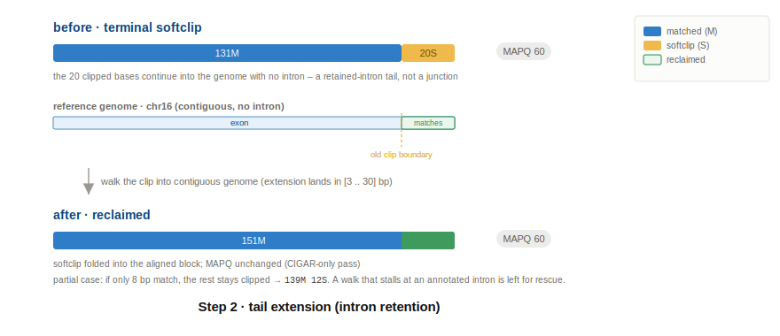
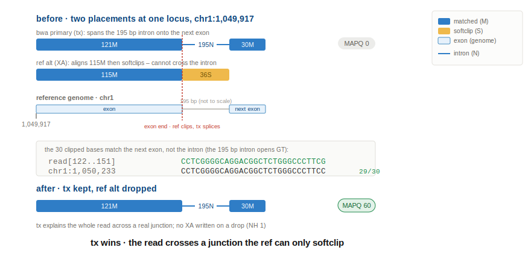
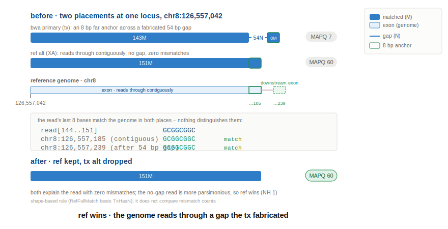
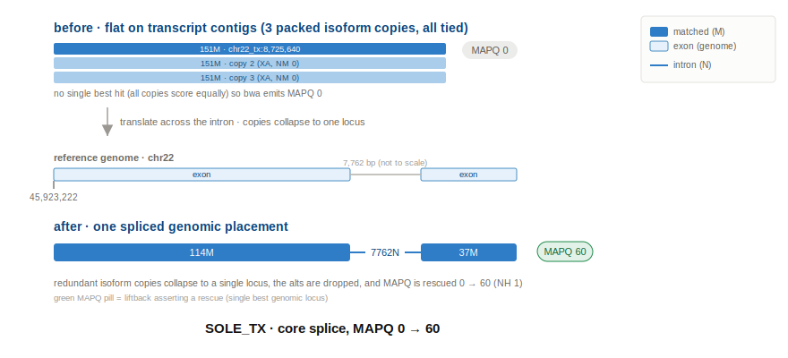
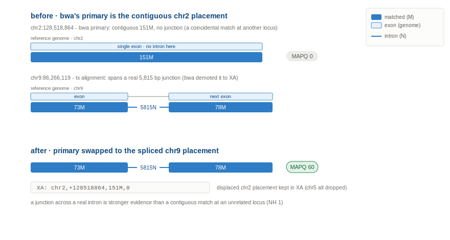
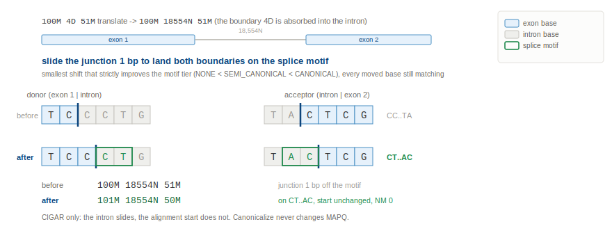

# TARS

**TARS** (Transcript Alignment for RNA Splicing) produces splice-aware RNA alignments using `bwa-mem2`. RNA reads
are aligned against the genome FASTA with annotated multi-exon transcript contigs (`*_tx`) appended. Liftback then
rewrites those transcript-contig alignments back to genomic coordinates, so the output is an ordinary genomic RNA BAM:
no `*_tx` in the header or on records, XA/SA/mate fields genomic, and spliced reads carried as `N` CIGAR ops.

## Contents

* [The RNA flow](#the-rna-flow)
* [Commands](#commands)
  + [Building transcript contigs](#building-transcript-contigs-splicefastabuilder)
  + [Running tars](#running-tars-tarsapplication)
  + [Output](#output)
* [Flags](#flags)
* [How a read gets lifted](#how-a-read-gets-lifted)
  + [Step 0: translate the transcript CIGAR to genome](#step-0-translate-the-transcript-cigar-to-genome)
  + [Step 1: terminal micro-junction collapse](#step-1-terminal-micro-junction-collapse)
  + [Step 2: tail extension](#step-2-tail-extension)
  + [Step 3: ref vs tx discriminator](#step-3-ref-vs-tx-discriminator)
  + [Step 4: rescue via supplementary](#step-4-rescue-via-supplementary)
  + [Step 5: canonicalize](#step-5-canonicalize)
* [Modifications done to each record](#modifications-done-to-each-record)
* [Edge cases](#edge-cases)
* [Constants reference](#constants-reference)
* [Tests](#tests)

## The RNA flow


1. **`SpliceFastaBuilder`** (offline, once per ensembl release) builds the transcript-contig FASTA and a sidecar TSV
   mapping packed transcript intervals to gene/transcript/exon spans.
2. Concatenate the transcript contigs onto the genome FASTA and re-index with `bwa-mem2`.
3. Align RNA reads with `bwa-mem2` against the combined FASTA. bwa's default output is **name-grouped** (each
   fragment's mates and supplementaries are contiguous, in FASTQ order). Feed it to liftback directly, no sort needed.
4. **`TarsApplication`** consumes that name-grouped BAM in a single pass, lifts each fragment to genomic coordinates, and writes a coord-sorted and indexed genomic BAM.
5. Feed the lifted BAM into REDUX for dedup, then ISOFOX.

## Commands

### Building transcript contigs (SpliceFastaBuilder)

```
java -cp tars.jar com.hartwig.hmftools.tars.fasta.SpliceFastaBuilder
    -ensembl_data_dir /ref_data/ensembl_data_cache/38/
    -ref_genome /path_to_fasta/genome.fasta
    -ref_genome_version V38
    -output_dir /path_to_output/
```

Outputs `ref_genome_v38_rna_contigs.fasta` and `ref_genome_v38_rna_contigs.rna_contigs_mappings.tsv`. Concatenate the
FASTA onto the genome FASTA and `bwa-mem2 index` the result before aligning.

### Running tars (TarsApplication)

```
java -jar tars.jar
    -sample ACTN01020030T
    -input_bam ACTN01020030T.bwa_tx.namegrouped.bam
    -ref_genome /path_to_fasta/genome_plus_tx.fasta
    -ref_genome_version V38
    -contig_sidecar /path_to/ref_genome_v38_rna_contigs.rna_contigs_mappings.tsv
    -rna_unmap_regions /ref_data/rna/38/rna_excluded_regions.38.tsv
    -bamtool /path_to_samtools/
    -output_dir /path_to_output/
    -threads 24
```

### Output

Named `<sample>.tars[.<output_id>][.<stage>].ext`. The BAM `ACTN01020030T.tars.bam` (+ `.bai`) is
coord-sorted and ready for REDUX, and the summary always writes to `ACTN01020030T.tars.summary.tsv`.

The summary is a long-format `Section / RowKey / ColumnKey / Count` TSV that on its own answers "what did liftback do",
so the per-record TSVs are rarely needed. Sections:

| Section             | What it carries                                                                          |
|---------------------|-----------------------------------------------------------------------------------------|
| `outcome`           | resolved primaries by `Outcome` (`REF` / `TX` / `UNRESOLVED`)                            |
| `feature_x_mapq`    | `DecidingFeature` x MAPQ tier                                                            |
| `feature_x_outcome` | swap vs drop per `DecidingFeature` (how often a contest moved the primary)               |
| `composition_x_mapq`| pre-drop alignment-set composition (ref-only / tx-only / both) x MAPQ tier               |
| `record_state`      | `RESOLVED` / `UNMAPPED` / `LIFT_FAILED` / `SUPPLEMENTARY` counts                         |
| `reads`             | `total`, `spliced_output` (N-cigar), `mapq_zero_in`, `mapq_rescued`                      |
| `pass_effect`       | per-pass work: rescue merged, tail-extend, collapse, canonicalize, over-cap unmap, excluded, low-AS drops |

The per-record `*.tars.records.tsv` / `*.tars.alignments.tsv` are written only with `-write_liftback_tsv` (a ~100GB
file - reach for it only when you need per-read detail the summary can't give). With `-output_id chr1_slice`
the token is inserted into every name: `ACTN01020030T.tars.chr1_slice.bam`, `ACTN01020030T.tars.summary.chr1_slice.tsv`.

## Flags

**Required**

| Flag               | Description                                                                  |
|--------------------|------------------------------------------------------------------------------|
| sample             | Sample ID. prefix to each output file (`<sample>.tars.*`)                  |
| input_bam          | bwa-mem2 output against the combined FASTA, **name-grouped** (not coord-sorted)|
| ref_genome         | The same combined genome + transcript FASTA used at alignment                 |
| ref_genome_version | `V37` or `V38`                                                                |
| contig_sidecar     | Contig sidecar TSV from `SpliceFastaBuilder` (`*.rna_contigs_mappings.tsv`)    |
| bamtool            | samtools path (used to decompress the input and sort + index output)          |
| output_dir         | Directory for the lifted BAM and summary                                      |

**Optional**

| Flag               | Default | Description                                                              |
|--------------------|---------|--------------------------------------------------------------------------|
| output_id          | (none)  | id inserted into every output name, e.g. `-output_id chr1_slice` -> `ACTN01020030T.tars.chr1_slice.bam` |
| rna_unmap_regions  | (none)  | TSV of curated regions (rRNA / 7SL / multi-map); reads lifting in are unmapped. TODO: link file |
| write_liftback_tsv | off     | Per-record debug TSVs; off by default (creates a ~100GB file)            |
| threads            | 1       | Worker threads; reads process in parallel per read-group (prod uses 32 threads) |
| log_level          | INFO    | `-log_debug` for DEBUG, or `-log_level DEBUG_2` for per-read liftback detail |

**Tuning thresholds**

| Flag                        | Default   | Description                                                       |
|-----------------------------|-----------|------------------------------------------------------------------|
| rescue_min_intron           | 21        | Min intron length for a primary+supp merge                       |
| rescue_max_intron           | 1000000   | Max intron length for a primary+supp merge                       |
| rescue_min_anchor_overhang  | 3         | Min matched bases each side of a merged junction                 |
| rescue_max_chain_depth      | 2         | Max supplementaries merged into one read (one per side)          |
| rescue_softclip_tolerance   | 5         | Primary/supp overlap tolerance when snapping to a junction       |
| rescue_max_boundary_shift   | 8         | Max over-extended bases trimmed when probing a boundary          |
| rescue_min_partial_match_run| 11        | Min exon-proximal matched run for a partial ref-verify rescue    |
| tail_min_softclip           | 3         | Min terminal softclip length to consider                         |
| tail_min_extension          | 3         | Min ref-matching bases converted to M                            |
| tail_max_extension          | 30        | Max bases walked into a softclip                                 |

Note: no `ensembl_data_dir` - liftback reads exon/junction annotation from the sidecar (only `SpliceFastaBuilder` needs ensembl).

## How a read gets lifted

Liftback translates each tx-contig alignment to genomic coordinates, reconciles every candidate cigar so the ref-vs-tx
choice is made on tested facts, picks the primary, then refines that primary. Execution order (each pass feeds the next):

```
translate every candidate (self + lifted XA alts)                         [Step 0]
  -> reconcile each candidate: collapse, then tail-extend                 [Steps 1 + 2]
  -> discriminate ref vs tx on the reconciled cigars                      [Step 3]
  -> rescue via supplementary: merge the primary with a supp              [Step 4]
  -> re-reconcile the merged primary: collapse, then tail-extend          [Steps 1 + 2, run again]
  -> canonicalize: slide the junction onto a splice motif                 [Step 5]
```

The numbered sections below follow this execution order. The spine is translate -> decide -> rescue; reconcile is the
connective pass that keeps it honest, not a fourth floating phase. Collapse and tail-extend (Steps 1-2) are the two
phases of one component, `TerminalReconciler`: a single `reconcile()` call runs collapse then tail-extend. It runs twice
- once per candidate before the discriminator (collapse on every candidate, tail-extend on the co-located alts, so
`RefSoftClipped` / `RefFullMatch` / `TxHasNCigar` are measured, not guessed), and once on the chosen primary after
rescue (where the primary's own tail-extend happens). The discriminator therefore always sees reconciled cigars. The
rule across the pipeline: every step that produces or changes a placement leaves its cigar reconciled, so canonicalize
(Step 5) is the final cigar polish on the winner only. The CIGAR examples below use a 5000 bp intron for illustration.
real intron lengths vary.

### Step 0: translate the transcript CIGAR to genome

`ContigTranslator` walks the transcript-contig CIGAR through the transcript's exons and inserts an `N` at each exon
boundary the read crosses. This is the core splice transform: a read aligned flat against a `*_tx` contig becomes a
spliced genomic read.

```
151M @ chr8_ENST.._tx translated to 90M5000N61M @ chr8
```

A read that sits entirely inside one exon crosses no boundary, so it lifts with its CIGAR unchanged (plain `M`, no `N`).

note: if the matched bases next to a new `N` are below the anchor floor AND adjacent to an existing softclip, they
become a softclip instead of `xN yM` (softclip-adjacent floor 3 bp, bare-anchor floor 1 bp). A flush terminal anchor
(no adjacent softclip) is not folded here - it is left for the Step 1 collapse pass, which scores it against the genome.


### Step 1: terminal micro-junction collapse

`TerminalReconciler` removes a fabricated tiny terminal anchor (< 8 bp) sitting across an intron when the
contiguous genome explains the tail at least as well as bwa's split. This is the collapse phase of the reconcile pass
(`tryCollapse`), run first; it fires on every candidate before the discriminator, and again on the merged primary after
rescue.

```
  in:   146M 2000N 5M         (5 bp terminal anchor across a "junction")
  contiguous genome matches straight through:
  ->    151M                  (the anchor was not a real junction)
```

The decision is a head-to-head bwa-mem score: anchor-on-the-far-exon vs the whole terminal window extended
contiguously. The score-maximising prefix is reclaimed into the near exon as `M`, the rest stays softclipped. A real
short junction (anchor scores strictly higher on the far exon than the contiguous walk) is kept.


### Step 2: tail extension

The tail-extend phase of the same `TerminalReconciler` pass (`tryExtend`). At candidate time it runs only on the
co-located alternative alignments (to measure the ref-vs-tx contest); the chosen primary's own tail-extend runs after
rescue, so a primary+supp merge still sees the original terminal softclip. Walk a terminal softclip into contiguous
genome with no `N` (intron retention). Softclip must be >= 3 bp, extension lands in [3 .. 30] bp.

```
  in:   131M 20S              (terminal clip that actually matches the genome)
  ->    151M                  (fully reclaimed)   or   139M 12S  (partial, 12 bp residual stays clipped)
```

Skipped when an annotated intron starts inside the window and the walk stalls short: that range belongs to rescue.



### Step 3: ref vs tx discriminator

bwa-mem2 aligns each read to a ref contig, a transcript (`tx`) contig, or both, and picks one as primary. The
discriminator decides whether to keep that primary or swap to a better candidate.

It runs on **reconciled** candidates: every alignment (the bwa primary plus each lifted XA alt) is first put through
Steps 1-2 (see [How a read gets lifted](#how-a-read-gets-lifted)), leaving one of three tested shapes - a contiguous
full match, a trusted `N` junction, or an unreclaimable residual softclip. Its `RefSoftClipped` / `RefFullMatch` /
`TxHasNCigar` inputs are therefore measured facts, not raw-bwa guesses: a ref softclip the genome explains contiguously
is reclaimed first, so it no longer masquerades as evidence for a tx junction.

Most reads (~95%) are no-contest and bwa's primary is kept as-is. The rest have either a ref and a tx alignment to
choose between (~2.3% contested) or several loci to weigh (~2.7% multi-locus); almost always the discriminator just
drops the losing alt, and an actual swap (moving a different placement into the primary fields) is rare (~0.1% of
primaries). An `N` counts as a real splice only with >= 8 matched (`M`) bases each side (`MIN_JUNCTION_ANCHOR`) - one
strong junction trusts the whole read.

The full decision tree - each branch is walked through in the subsections that follow:
```
loci >= 2 ?
|
+-- YES (multi-locus)
|     hasRef AND hasTx ?
|     |  YES:  TxHasNCigar AND NOT RefHasNCigar -> (TX,         JUNCTION_OVER_CONTIGUOUS)  [tx faithful; ref alts contiguous]
|     |        else                             -> (UNRESOLVED, MULTIMAPPER)             [genuine multimapper, no swap]
|     |  tx only                                -> (TX,         SOLE_TX)
|     |  ref only                               -> (REF,        SOLE_REF)
|
+-- NO (single locus)
      only ref                                  -> (REF,        SOLE_REF)
      only tx                                   -> (TX,         SOLE_TX)
      both ref and tx:
         same CIGAR and no N                    -> (REF,        CONCORDANT)         [no contest]
         TxHasNCigar AND RefSoftClipped         -> (TX,         JUNCTION)           *** TX WINS ***
         TxHasNCigar AND RefFullMatch           -> (REF,        REF_READS_THROUGH)  *** REF WINS ***
         TxSoftClipAtBoundary AND RefFullMatch  -> (REF,        REF_READS_THROUGH)  *** REF WINS ***
         otherwise                              -> (UNRESOLVED, AMBIGUOUS)          [no rule fires, no swap]

  TxHasNCigar = >=1 N with >= 8 matched bases each side    RefFullMatch = ref alt with no softclip
```
Both single-locus REF-wins scenarios - the tx alignment carrying an `N` junction, and the tx alignment only softclipping
at the boundary - resolve to `(REF, REF_READS_THROUGH)`; the `TxHasNCigar` / `TxSoftClipAtBoundary` flags distinguish them.

#### No-swap cases (~95% of primaries)

- `SOLE_REF`, outcome `REF` (~72.5%) - ref only, no tx match (one locus or multimapped): no change. Ref alts are
  already genomic, so they pass through with original coords and MAPQ; the discriminator does nothing. The only edits
  are liftback field hygiene: MD dropped, NM recomputed, NH added.

<details><summary>examples</summary>

`SOLE_REF` at a locus with no `*_tx` contig, so a tx hit is impossible:
```
bwa    chr3  181712551  MAPQ 60  151M   NM:0  MD:151  AS:151
tars   chr3  181712551  MAPQ 60  151M   NM:0  NH:1    AS:151     (placement untouched; MD dropped, NH added)
```
`SOLE_REF` at another single genomic locus:
```
bwa    chr7  55018929   MAPQ 60  151M   NM:0  MD:151  AS:151
tars   chr7  55018929   MAPQ 60  151M   NM:0  NH:1    AS:151
```
`SOLE_REF` (multimapped, so XS 146 near AS 151 caps MAPQ 48):
```
bwa    chr6  25999903   MAPQ 48  151M   NM:0  MD:151  AS:151  XS:146
       XA: chr19,-38631278,151M,1; chr2,+232423677,151M,2; chrX,+135406772,151M,3; chr17,-67326991,151M,5
tars   chr6  25999903   MAPQ 48  151M   NM:0  NH:1    AS:151          (ref alts lift to identical coords, MD dropped)
       XA: chr19,-38631278,151M,1; chr2,+232423677,151M,2; chrX,+135406772,151M,3; chr17,-67326991,151M,5
```
The alts all score lower (NM 1/2/3/5), so `NH:1`: NH counts only best-score genomic loci, not every XA entry.
</details>

- `SOLE_TX` (~12.8%) - tx only, one locus (the core splice case). A small subset map to several tx loci instead and
  stay multimappers (see Multi-locus and ambiguous below).

<details><summary>example</summary>

`SOLE_TX` at an exon-exon junction. bwa aligns the read flat against four packed transcript contigs (hence MAPQ 0, all
XA NM:0); liftback translates the match across the 200 bp annotated intron, sees the four copies collapse to a single
genomic locus, drops the redundant alts, and rescues MAPQ 0 -> 60:
```
bwa    chr19_tx  429610  MAPQ 0   151M          NM:0  AS:151  XS:151
       XA: chr19_tx,+436053,151M,0; chr19_tx,+432802,151M,0; chr19_tx,+444517,151M,0
tars   chr19     1010775  MAPQ 60  121M200N30M   NM:0  NH:1
```
</details>

- `CONCORDANT` (~9.7%) - ref and tx, same CIGAR, no N.

<details><summary>example</summary>

`CONCORDANT` at an exon interior. bwa keeps both a ref placement and one same-locus tx alt, identical `151M`
with no junction either side. The discriminator keeps the ref placement and drops the redundant tx alt; MAPQ 40 is
carried straight from bwa (it saw two equal-score hits, not a MAPQ-0 read, so no rescue bump):
```
bwa    chr19  1009433  MAPQ 40  151M   NM:0  MD:151  AS:151  XS:151
       XA: chr19_tx,-426990,151M,0
tars   chr19  1009433  MAPQ 40  151M   NM:0  NH:1                       (duplicate tx alt dropped, MD dropped)
```
</details>

#### Contested: ref vs tx (~2.3% of primaries)

In the contested cases the read has both a ref alignment and a tx alignment (at one locus, or at more
than one locus). The discriminator decides which is real. Usually bwa's primary is already the correct one, so it just
drops the losing alt and, when the read was a multimapper at MAPQ 0, rescues MAPQ to 60. Only in the minority where bwa
made the losing placement primary does it swap: the winner moves into the record's main fields. The displaced placement
is kept in the read's `XA` tag (`XA:Z:chrom,pos,CIGAR,NM;...`) only on a swap; on a drop it is removed.

**tx wins**: the read aligns across a junction on the tx contig; tx becomes (or stays) the primary.

- `JUNCTION` (~0.6%): tx spans the junction; the ref alignment softclips at the boundary instead
  of crossing it.

<details><summary>example</summary>

bwa's primary is the tx alignment at MAPQ 0; a softclipped ref alignment sits in its `XA`. tars keeps
the tx placement, drops the ref alt, and rescues MAPQ 0 -> 60:
```
bwa    chr1_tx  287432   MAPQ 0   151M                  (lifts to chr1:1049917 121M195N30M, NM3)
       XA: chr1,1049917,115M36S,0                       (ref alignment, softclipped at base 115)
       XA: chr1_tx,303234,151M,0                        (another tx contig, same lifted locus)
tars   chr1     1049917  MAPQ 60  121M195N30M   NH:1    (ref alt dropped; no XA)
```
The 30 bases past the clip match the next exon, not the intron:
```
read[122..151]           CCTCGGGGCAGGACGGCTCTGGGCCCTTCG
chr1:1050233 (next exon) CCTCGGGGCAGGACGGCTCTGGGCCCTTCC   (29/30; the 195 bp intron opens GT)
```
Two more, same shape across different intron sizes (bwa primary on a tx contig spans the junction; the softclipped
ref alt is dropped):
```
chr7:87193998   bwa 105M581N46M    ref alt 106M45S    tars 105M581N46M
chr1:226361973  bwa 111M1015N40M   ref alt 113M38S    tars 111M1015N40M
```
</details>



- `JUNCTION_OVER_CONTIGUOUS` (~1.7%): the tx alignment spans a junction; the ref alignments are contiguous (no junction)
  at one or more other loci.

<details><summary>example</summary>

bwa's primary is a contiguous ref alignment on chr2; the tx alignment on chr9 spans a junction. tars
swaps to the tx placement and keeps the displaced chr2 ref in `XA` (the chr5 ref alt is dropped):
```
bwa    chr2     128518864  MAPQ 60  151M              NM:0   (contiguous, no junction)
       XA: chr5,62776950,151M,6                              (another contiguous ref alignment)
       XA: chr9_tx,7038437,151M   ->  chr9:86266119 73M5815N78M
tars   chr9     86266119   MAPQ 60  73M5815N78M  NH:1   XA: chr2,+128518864,151M,0
```
</details>

**ref wins**: the genome explains the read contiguously with no gap; ref becomes (or stays) the primary and the tx alt
is dropped.

- `REF_READS_THROUGH` (<0.01%): the tx alignment carries an N junction, but the ref reads contiguously through
  the same span with no gap. The rarest category. By construction this is a single locus, so the tx far anchor is short
  (a long anchor across a real intron could not also match the genome contiguously). A full-length contiguous match over
  a short, possibly chance, anchor is the more parsimonious read, so ref is kept whenever it matches at least as cleanly.
  The rule is purely shape-based (`RefFullMatch` beats `TxHasN`); it does not compare mismatch counts, so the rare read
  whose short tx junction has fewer mismatches than the contiguous ref is still given to ref.

<details><summary>example</summary>

The tx alignment carries an 8 bp far anchor across a 54 bp gap; the ref reads through as a contiguous
151M. Both explain the read with zero mismatches, so tars keeps the contiguous ref and drops the tx alt:
```
bwa    chr8_tx  14092324  MAPQ 7   151M   ->  chr8:126557042 143M54N8M
       XA: chr8,126557042,151M,0                      (ref alignment, contiguous 151M, no gap)
tars   chr8     126557042 MAPQ 60  151M   NH:1        (tx alt dropped)
```
Why both fit: the read's last 8 bases match the genome at both the contiguous spot and the spliced exon, so the far
anchor fits either equally well. Nothing breaks the tie, so the no-gap read wins:
```
read [144..151]                       GCGGCGGC
chr8:126557185 (contiguous, ref)      GCGGCGGC
chr8:126557239 (after the 54 bp gap)  GCGGCGGC
```
</details>

- `REF_READS_THROUGH` (<0.01%): the tx alignment only keeps a tiny anchor past the boundary and never spans a
  real junction, while the ref reads through contiguously.

<details><summary>example</summary>

The tx alignment lifts to a fabricated 2 bp anchor across the intron; the ref reads through as a
contiguous 151M. tars keeps the ref placement and drops the tx alt:
```
bwa    chr2_tx  33945708  MAPQ 0   151M   ->  chr2:224557708 149M5337N2M
       XA: chr2,224557708,151M,0                      (ref alignment, contiguous 151M)
tars   chr2     224557708 MAPQ 60  151M   NH:1        (tx alt dropped)
```
</details>



Side note: how often a contest is an actual swap vs just dropping the losing alt (whole sample, derived from the
distribution table below as drop = records - swaps):

* `JUNCTION`: 2,779,734 drop / 20,456 swap
* `JUNCTION_OVER_CONTIGUOUS`: 7,393,896 drop / 434,900 swap
* `REF_READS_THROUGH`: 17,572 drop / 12,258 swap

All are drop-dominated - the discriminator usually just removes the losing alt - though `REF_READS_THROUGH` (the rarest)
swaps nearly as often as it drops.

#### Multi-locus and ambiguous (~2.7% of primaries, kept as-is)

The rest are reads the discriminator does not resolve with a ref-vs-tx rule: it keeps bwa's primary and its alts, and no
alignment is swapped. The standard MAPQ-rescue still runs, so a read with a single best-score locus is lifted to MAPQ 60
(NH 1), while a genuine multi-best-locus read keeps MAPQ 0 (NH > 1).

- `SOLE_TX` (part of the ~12.8% SOLE_TX above): the read has several tx placements at different loci and no ref to
  compare, so nothing picks a winner and it stays a multimapper.

<details><summary>example</summary>

Two tx placements ~150 bp apart, equal score, no ref alignment.
```
bwa    chr8_tx 53573  50S101M  MAPQ 0   ->  chr8:474935    (mate places at chr8:474786)
tars   chr8:474935 50S101M / chr8:474786 101M50S   MAPQ 0  NH:2    (both kept, no winner)
```
</details>

- `MULTIMAPPER` (~2.4%): multiple loci carrying both a ref and a tx alignment, with no clean splice signal to favour tx.
  bwa's primary is kept; when one locus is clearly best-scoring it resolves there, otherwise it stays a multimapper.

<details><summary>example</summary>

Read at chr11 (ref 151M, NM 2) with a tx alt on chr14 and several lower-scoring ref alts at other loci. chr11 is the
single best score, so the read resolves there and the rest stay in XA:
```
bwa    chr11  67226439  MAPQ 60  151M  NM:2     (best score among the alts)
       XA: chr14,97933211,151M,6; chr4,2522738,134M1D17M,7; chr6,167947330,138M13S,4; chr17,17198158,138M13S,5
tars   chr11  67226439  MAPQ 60  151M  NH:1     (best locus kept; lower-score alts retained in XA)
```
</details>

- `AMBIGUOUS` (~0.3%): a single locus with both a ref and a tx alignment whose CIGARs fit no rule (not identical,
  no real junction, no boundary softclip). bwa's primary is kept unchanged.

<details><summary>example</summary>

Here the ref reads through as 151M; the tx alt softclips (126M25S) but not at an annotated boundary, so it is
neither `CONCORDANT` nor a softclip/junction case. bwa's primary (the ref) is kept:
```
bwa    chr2  224556295  MAPQ 60  151M  (ref)    +    chr2_tx 126M25S  (softclip, not at a boundary)
tars   chr2  224556295  MAPQ 60  151M  NH:1     (bwa primary kept)
```
</details>

#### Performance

TODO: add a table of what testing showed - how the discriminator performs across the 1000-sample cohort.

#### Worked examples (full BAM records)

Real records from a production run (sample ACTN01020030T), shown before liftback (bwa-mem2 against the combined
genome + transcript-contig FASTA) and after. Each `raw` block is the SAM record trimmed to the columns that carry the
story; QNAME, RNEXT/PNEXT/TLEN, SEQ/QUAL, MD and RG are dropped and long `XA` lists truncated. A `*_tx` reference name
means the read aligned to a transcript contig; a plain `chrN` is genomic. Column order in every block:

    FLAG  RNAME  POS  MAPQ  CIGAR  tags (NM / AS / XS / NH / XA / SA)

**SOLE_TX - core splice, MAPQ 0 -> 60**

```
chr22_tx:8725640  151M  MAPQ 0      ->      chr22:45923222  114M7762N37M  MAPQ 60
```

The read aligns flat against one of three packed transcript contigs, all tied at MAPQ 0. Liftback translates the match
across the 7,762 bp intron, the three copies collapse to a single genomic locus, the redundant alts are dropped, and
MAPQ is rescued from 0 to 60.

<details><summary>raw</summary>

```
        FLAG  RNAME     POS       MAPQ  CIGAR         tags
before  83    chr22_tx  8725640   0     151M          NM:1 AS:146 XS:146  XA:chr22_tx,-8731128,151M,1; chr22_tx,-8728343,151M,1
after   83    chr22     45923222  60    114M7762N37M  NM:1 AS:146 NH:1    XS:A:-
```
</details>

**Swap (JUNCTION_OVER_CONTIGUOUS) - MAPQ 0 -> 60**

```
chrX:54809862  151M (contiguous)  MAPQ 0      ->      chrX:54809808  10M54N141M  MAPQ 60
```

bwa places the read as a flat, contiguous 151M (MAPQ 0, tied across transcript contigs), blind to the splice. Liftback
recognises the 54 bp junction, swaps to the spliced placement, drops the redundant alts, and rescues MAPQ.

<details><summary>raw</summary>

```
        FLAG  RNAME  POS        MAPQ  CIGAR        tags
before  147   chrX   54809862   0     151M         NM:1 AS:146 XS:146  XA:chrX_tx,-7027849,151M,1; +7 more
after   147   chrX   54809808   60    10M54N141M   NM:2 AS:146 NH:1    XS:A:+
```
</details>

**Ref wins - tx alt dropped, MAPQ unchanged (54)**

```
chr1:155188564  151M  MAPQ 54   + tx alt chr1_tx 109M42S      ->      chr1:155188564  151M  MAPQ 54   (tx alt dropped; placement unchanged)
```

The genome reads through contiguously (3 mismatches); the transcript alt only anchors 109M before softclipping, never
spanning a real junction. Ref is kept, the tx alt dropped, and MAPQ is carried through unchanged - this was never a
MAPQ-0 tie, so no rescue applies.

<details><summary>raw</summary>

```
        FLAG  RNAME  POS         MAPQ  CIGAR  tags
before  163   chr1   155188564   54    151M   NM:3 AS:136 XS:109  XA:chr1_tx,+28972326,109M42S,0
after   163   chr1   155188564   54    151M   NM:3 AS:136 NH:1
```
</details>





### Step 4: rescue via supplementary

Runs by default. bwa runs at a low score floor (`-T 19`), which surfaces short-anchor supplementary alignments. Rescue
merges a primary's terminal softclip with such a supplementary across a junction into one `M N M` primary and drops the
supplementary. A merge happens only when all of:

- the softclip and the supplementary are complementary (the supp covers the clipped tail)
- the implied intron length is within [21 .. 1,000,000]
- both sides of the junction keep an anchor overhang >= 3 bp
- the primary and supp coverage overlap
- at most 2 supplementaries are merged into one read (one per side, e.g. a middle exon clipped both ends)
- the junction snaps to an annotated junction within 5 bp, or to a splice motif (snap point picked by motif tier)

The merged primary's MAPQ is capped at 55.


### Step 5: canonicalize

`JunctionCanonicalizer` slides an intron up to 5 bp onto a higher splice-motif tier
(NONE < SEMI_CANONICAL < CANONICAL < ANNOTATED), choosing the smallest shift that strictly improves the tier with every
moved base still matching. CIGAR only: the intron position moves but the alignment start never does.

Once rescue picks the primary, `reconcileChosenPrimary` finalizes it in one step: it re-reconciles the chosen cigar
(collapse then tail-extend, Steps 1-2 again) and then canonicalizes. A primary already fully reconciled at candidate
time skips the work via the N-present / S-present guards, so this is winner-only polish, not a redundant third pass.



### Worked examples (full BAM records)

Real records from sample ACTN01020030T. Each pass operates on the **translated** CIGAR (the output of Step 0), so the
collapse and canonicalize examples show that intermediate as well as the before/after - they are otherwise invisible in
a plain bwa-vs-tars comparison. The intermediate line is from a `-log_level DEBUG_2` run.

**Rescue via supplementary - MAPQ 60 -> 55 (capped)**

```
chr22:45885973 32S113M6S (primary)  +  chr22:45885775 35M116S (supp)      ->      chr22:45885775  35M166N110M6S  MAPQ 55
```

bwa emits the read as a primary plus a short-anchor supplementary. Rescue merges them across the 166 bp intron into one
spliced primary and drops the supplementary. MAPQ is capped at 55 to flag a constructed alignment, not a bwa-native one.

<details><summary>raw</summary>

```
        FLAG  RNAME  POS        MAPQ  CIGAR          tags
before  97    chr22  45885973   60    32S113M6S      NM:0 AS:113  SA:chr22,45885775,+,35M116S,60,0       (primary)
before  2145  chr22  45885775   60    35M116S        NM:0 AS:35   SA:chr22,45885973,+,32S113M6S,60,0     (supp, FLAG 0x800)
after   97    chr22  45885775   55    35M166N110M6S  NM:0 AS:113 NH:1                                    (supp merged in, then dropped)
```
</details>

**Terminal micro-junction collapse - CIGAR only, MAPQ set by the discriminator**

```
chr22_tx:8732934  151M   --translate-->   chr22:45931220  150M18550N1M   --collapse-->   151M   MAPQ 60
```

Translation places a 1 bp anchor across an 18,550 bp "junction". The contiguous genome explains the tail at least as
well, so collapse reclaims it to a plain 151M. (MAPQ here moved 0 -> 60 via the single-locus rescue; the collapse pass
itself does not touch MAPQ.)

<details><summary>raw</summary>

```
        FLAG  RNAME     POS        MAPQ  CIGAR  tags
before  163   chr22_tx  8732934    0     151M   NM:0 AS:151 XS:151  XA: ...; chr22,+45931220,151M,0; ...
        intermediate: translated to 150M18550N1M, collapse reclaims it -> 151M   (DEBUG_2)
after   163   chr22     45931220   60    151M   NM:0 AS:151 NH:1
```
</details>

**Tail extension - CIGAR only, MAPQ unchanged**

```
chr16:22503853  27S116M8S  MAPQ 0      ->      chr16:22503826  143M8S  MAPQ 0
```

The 27 bp leading softclip matches contiguous genome, so it is walked back into the alignment (27S + 116M -> 143M);
the 8 bp trailing residual stays clipped. The read is a multimapper, so MAPQ stays 0 - tail extension never changes it.

<details><summary>raw</summary>

```
        FLAG  RNAME  POS        MAPQ  CIGAR      tags
before  99    chr16  22503853   0     27S116M8S  NM:13 AS:51 XS:53  XA: +38 entries
after   99    chr16  22503826   0     143M8S     NM:14 AS:51 NH:1   XA: +38 entries
```
</details>

**Canonicalize - CIGAR only, MAPQ set by the discriminator**

```
chr22_tx:8728628  100M4D51M   --translate-->   100M18554N51M   --canon-->   chr22:45931269  101M18554N50M  MAPQ 60
```

The boundary `4D` (a transcript-FASTA artefact) is absorbed into the intron during translation, then the junction
slides 1 bp onto the canonical splice motif. `NM` recomputes to 0 against the genome (the deletion was not real).

<details><summary>raw</summary>

```
        FLAG  RNAME     POS        MAPQ  CIGAR          tags
before  83    chr22_tx  8728628    0     100M4D51M      NM:4 AS:141 XS:141  XA:chr22_tx,-8725925,100M4D51M,4; ...
        intermediate: translated to 100M18554N51M, canonicalize slides -> 101M18554N50M   (DEBUG_2)
after   83    chr22     45931269   60    101M18554N50M  NM:0 AS:141 NH:1   XS:A:-
```
</details>

#### MAPQ summary

| scenario                          | MAPQ before | MAPQ after | why                                         |
|-----------------------------------|-------------|------------|---------------------------------------------|
| SOLE_TX                           | 0           | 60         | transcript contigs collapse to one genomic locus -> rescued |
| Swap (JUNCTION_OVER_CONTIGUOUS)     | 0           | 60         | the transcript junction placement is chosen -> rescued |
| Ref wins                          | 54          | 54         | ref was already primary, not a MAPQ-0 tie -> carried through |
| Rescue via supplementary          | 60          | 55         | a constructed primary+supp merge, capped    |
| Tail / Collapse / Canonicalize    | unchanged   | unchanged  | CIGAR-only passes; MAPQ is the discriminator's |

In short: 60 means liftback is asserting a rescue, 55 means a constructed merge, 0 means unmapped or genuinely
ambiguous, and any other value is bwa's own MAPQ carried through.

## Modifications done to each record

On a successful lift (`LiftBackRecordOps` / `MateFieldPatcher`):

1. Reference name, alignment start, CIGAR, strand and MAPQ are set to the resolved genomic placement.
2. XA rebuilt from scratch: every candidate (bwa primary + its bwa XA alts) is lifted to genomic coordinates, then the
   non-primary, non-dropped alts that don't overlap the primary's own span are written back as `chrom,±pos,CIGAR,NM`
   (bwa's XA format - it has no MAPQ field). SA rewritten to genomic; MC set to the mate's lifted CIGAR.
3. `XS:A:+/-` written only when the lifted CIGAR has an `N` **and** the transcript strand is known.
4. MD always dropped (never rebuilt); NM recomputed against the genomic reference.
5. `NH = max(numLoci, 1)`, counting distinct genomic loci among best-scoring alignments only, so one junction across
   many transcript contigs does not inflate it.
6. Mate fields patched: signed 5'-to-5' TLEN, mate coords, unmapped-mate parking.

**MAPQ** is carried from bwa and never raised by collapse / tail-extend / canonicalize. Liftback raises it to 60 only
when the read has a tx match (no tx evidence -> bwa's MAPQ is left alone) AND either the discriminator swapped to tx, or
the read resolved to a single genomic locus with input MAPQ 0 and no unresolved hidden tie. A primary+supp rescue merge
caps it at 55.

## Edge cases

These are the rare exits and refinements. On the whole-sample run the unmap/lift-fail exits below total 22,899
records, **0.004%** of all, but each prevents a specific class of wrong placement.

<details>
<summary>Over-XA-cap unmap (too many genomic loci)</summary>

bwa is run with `-h 75` (XA cap). A read mapping to more loci than the cap is emitted at MAPQ 0 with **no** XA (the alt
list is suppressed, not truncated). The over-cap rule unmaps such a primary: too many genomic places to trust.

```
condition = (inputMapq == 0 AND numXaAlts == 0 AND comp == REF_ONLY)
```

The `REF_ONLY` gate is load-bearing. A tx-contig primary can hit 75+ transcript contigs that all lift to **one**
genomic locus, so its suppressed XA must not be read as too many genomic places. Only a genomic
(REF_ONLY) primary is unmapped; TX_ONLY / REF_AND_TX lift normally. Keyed on the input state, not the post-lift MAPQ:
with no XA the resolver would otherwise see a single locus and rescue MAPQ to 60.
</details>

<details>
<summary>Excluded-region contamination (-rna_unmap_regions)</summary>

Curated rRNA / 7SL / acrocentric / multi-map contamination zones. A read lifting into one is contamination: the primary
is **unmapped** (kept, not dropped), a supplementary is **dropped**.

Checked **post-lift** on genomic coordinates, not pre-lift. A tx-contig read's input coords are `chrN_tx` and cannot be
tested against the genomic region list, and some excluded zones (acrocentric p-arms) are themselves in the
transcriptome, so contamination reaches them via tx contigs and is only visible once lifted. The primary is unmapped by
flipping its result to UNMAPPED (so the mate is coordinated via the cache); dropped supps have their SA entry removed
from the primary's SA tag.
</details>

<details>
<summary>AS floor unmap / drop (residual short-anchor noise)</summary>

bwa runs at `-T 19` to surface short-anchor supps for rescue. After liftback, records still below the default `-T 30`
AS floor that were not rescued/extended/collapsed are residual noise.

* `PRIMARY_AS_UNMAP_THRESHOLD = 30`: a primary still below 30 is **unmapped** (not dropped, to keep the pair + SA
intact). Gated on rescue running; AS is never recomputed, so post-processed primaries keep a stale-low AS and are exempt.
* `SUPP_AS_DROP_THRESHOLD = 30`: a supplementary in the [19, 30) AS band that survived rescue + tail-extend is **dropped**.
</details>

<details>
<summary>Flanking-deletion absorption in translation</summary>

A small `D` straddling an exon boundary is usually a tx-FASTA off-by-N artefact. `ContigTranslator` folds a
`D <= SPLICE_FLANKING_DELETION_MAX_BP (5)` into the intron `N`; a larger `D` (6+ bp) is preserved after the `N`. Bound
is inclusive.

```
90M 3D 61M  with the 3D straddling a boundary  ->  90M 5000N 61M    (3D absorbed)
90M 8D 61M                                     ->  90M 5000N 8D 61M (8D preserved)
```
</details>

<details>
<summary>LIFT_FAILED and anchor floors</summary>

* A position outside any transcript span (inter-transcript spacer, or past the contig end) -> LIFT_FAILED: read marked
unmapped, ref/start/CIGAR/MAPQ cleared, XA and SA stripped.
* A supplementary whose own lift failed is instead mirrored onto its primary's lifted coords, keeping the 0x800 flag.
* Terminal micro-anchors below the floors are folded into a softclip during translation only when adjacent to an
existing softclip: bare-anchor floor 1 bp, softclip-adjacent floor 3 bp. A flush terminal anchor (read ends on the
anchor, no softclip) is left for the Step 1 collapse pass, which scores it against the genome. (Both are distinct
from `MIN_JUNCTION_ANCHOR` = 8, the discriminator/collapse trust floor.)
* Read overhang past the first/last exon span is clamped to a leading/trailing softclip.
</details>

<details>
<summary>Hidden-tie MAPQ block</summary>

The single-locus MAPQ-0-to-60 rescue does **not** fire when there is an unresolved hidden tie: `XS == AS` on a ref-only
primary outside any annotated exon. That signals a genuine ambiguous placement, so the MAPQ stays at 0.
</details>

## Constants reference

The important ones (all in `TarsConstants`; the rescue/tail values are also tunable via the [flags](#flags) above):

| Constant                        | Value     | What it gates                                                      |
|---------------------------------|-----------|-------------------------------------------------------------------|
| `MIN_JUNCTION_ANCHOR`           | 8         | an `N` is trusted only with >= 8 matched bases on each side        |
| `SPLICE_FLANKING_DELETION_MAX_BP`| 5        | a `D <= 5` across an exon boundary is absorbed into the `N`        |
| `RESCUE_MAPQ`                   | 60        | MAPQ assigned on a discriminator swap or a rescued unique placement |
| `SUPP_RESCUE_MAPQ_CAP`          | 55        | ceiling on a primary+supp rescue merge (flags a constructed alignment) |
| `PRIMARY_AS_UNMAP_THRESHOLD`    | 30        | primary still below this AS after liftback is unmapped             |
| `SUPP_AS_DROP_THRESHOLD`        | 30        | supplementary still below this AS is dropped                       |
| `DEFAULT_MIN_INTRON_LENGTH`     | 21        | shortest intron a primary+supp rescue may bridge                  |
| `DEFAULT_MAX_INTRON_LENGTH`     | 1,000,000 | longest intron a rescue may bridge                                |
| `DEFAULT_MIN_ANCHOR_OVERHANG`   | 3         | matched bases needed each side of a merged junction               |
| `DEFAULT_MAX_CHAIN_DEPTH`       | 2         | max supplementaries merged into one read (one per side)           |
| `DEFAULT_MAX_EXTENSION`         | 30        | max bases a terminal softclip is walked into contiguous genome     |
| `DEFAULT_MAX_SHIFT`             | 5         | max bp an intron slides to reach a higher splice-motif tier        |

bwa-mem affine scoring used to re-score lifted boundaries: `MATCH / MISMATCH = +1 / -4`, `GAP_OPEN / GAP_EXTEND = -6 / -1`
(soft-clips not penalised). `NH = max(numLoci, 1)` (counts distinct genomic loci, not emitted records).

## Tests

End-to-end behaviour is pinned by `LiftBackEndToEndTest` (full per-group engine):

| Scenario                                       | What it pins                                                  |
|------------------------------------------------|--------------------------------------------------------------|
| exonSpanningReadLiftsToJunctionCigar           | tx read spanning two exons -> `M N M`, mate fields patched   |
| unliftableReadIsMarkedUnmapped                 | position past the contig end -> unmapped, mate flagged       |
| supplementarySaTagRewrittenToGenomicCoords     | split read; supp + SA lifted to genomic coords               |
| terminalSoftclipExtendedIntoContiguousGenome   | intron-retention tail walked into the genome (tail-extend)   |
| splitReadRescuedAcrossAnnotatedJunction        | primary softclip + short-anchor supp merged into one `M N M` |
| offMotifJunctionSlidToCanonical                | junction slid 2 bp onto a GT-AG motif (canonicalize)         |
| nativeGenomicReadPassesThroughUnchanged        | a read already on the genome is left untouched               |

Component layers below the engine: `LiftBackResolverTest` (categorize + resolved result), `SpliceLiftBackApplyTest`
(record mutation: CIGAR / XA / XS / NH / unmap), `LiftBackDiscriminatorTest` (full outcome/feature matrix + swap/drop),
`JunctionRescueResolverTest` (rescue merges), and the `TerminalReconciler` suites `TerminalReconcilerCollapseTest` /
`TerminalReconcilerTailExtendTest` (the collapse and tail-extend phases of the reconcile pass).
</content>
</invoke>
