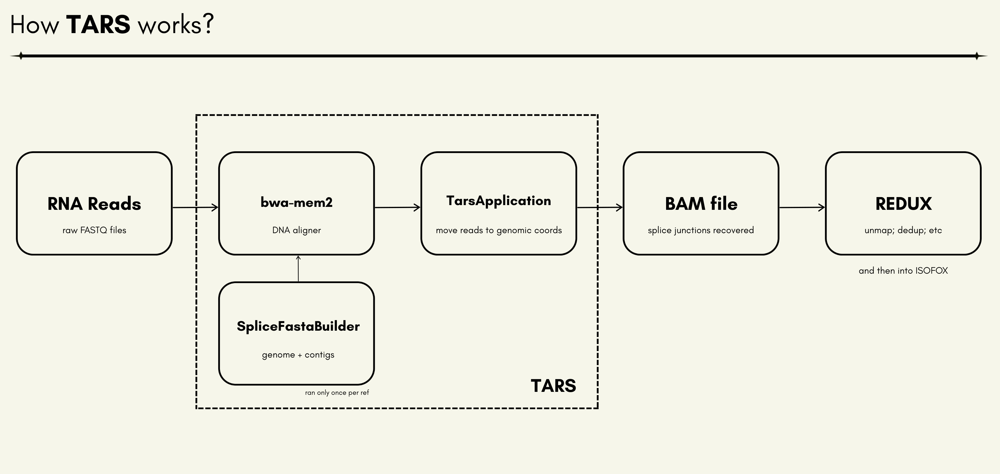
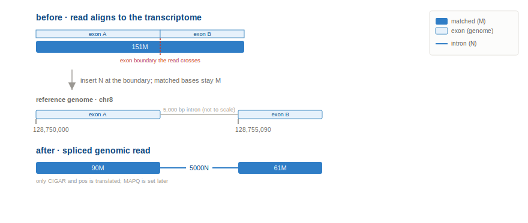
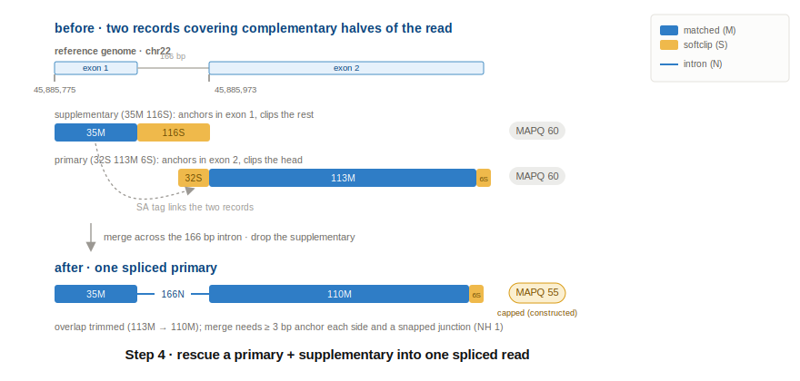

# TARS

**TARS** (Transcript Alignment for RNA Splicing) makes `bwa-mem2` splice-aware for RNA reads. TARS aligns the reads against the genome with the
transcriptome added using `bwa-mem2`, then rewrites the result back to genome coordinates. The output is an ordinary genomic RNA
BAM (no transcript contigs, spliced reads carried as `N` gaps) ready for REDUX and ISOFOX.

## Contents

* [What TARS does](#what-tars-does)
* [How to Run TARS](#how-to-run-tars)
* [What a read goes through](#what-a-read-goes-through)
    * [Step 0: Translate transcriptome alignments to reference genome](#step-0-translate-transcriptome-alignments-to-reference-genome)
    * [Step 1: Score short overhangs against the reference genome, collapse weak scoring ones](#step-1-score-short-overhangs-against-the-reference-genome-collapse-weak-scoring-ones)
    * [Step 2: Decide which alignments to keep for a read](#step-2-decide-which-alignments-to-keep-for-a-read)
    * [Step 3: Resolve supplementary records into splice junctions](#step-3-resolve-supplementary-records-into-splice-junctions)

## What TARS does

A normal genome aligner like `bwa-mem2` matches a read against one continuous stretch of genome. It has no idea where
introns are, so a read that jumps over one gets cut short or placed in the wrong spot.

TARS fixes this without changing the aligner:

1. **`SpliceFastaBuilder`** (run once per Ensembl release) concatenates each multi-exon transcript's exon sequences into
   a transcript contig (`*_tx`, introns removed); these contigs are the transcriptome. It also writes a sidecar TSV
   mapping each contig's intervals back to their genomic exon spans.
2. Append the transcriptome to the genome FASTA and index with `bwa-mem2`.
3. Align the RNA reads with `bwa-mem2` as usual. A read that jumps an intron now has a continuous place to land.
4. **`TarsApplication`** lifts each read back to its real genome position, marks the skipped intron as a gap (`N`), fixes
   things up (tags, mate info, confidence), and writes a sorted, indexed BAM.
5. Feed the new splice-aware records BAM file into REDUX (dedup), then ISOFOX.



## How to Run TARS

### Build the transcript reference (SpliceFastaBuilder)

```
java -cp tars.jar com.hartwig.hmftools.tars.fasta.SpliceFastaBuilder
    -ensembl_data_dir /ref_data/ensembl_data_cache/38/
    -ref_genome /path_to_fasta/genome.fasta
    -ref_genome_version V38
    -output_dir /path_to_output/
```

Two files are written:

* `ref_genome_v38_rna_contigs.fasta` - the transcript contigs.
* `ref_genome_v38_rna_contigs.rna_contigs_mappings.tsv` - the contig sidecar (intervals mapped back to genomic exon spans).

Concatenate the FASTA onto the genome FASTA and `bwa-mem2 index` the result before aligning.

### Run TARS (TarsApplication)

```
java -jar tars.jar
    -sample ACTN01020030T
    -input_bam ACTN01020030T.bwa_tx.namegrouped.bam
    -ref_genome /path_to_fasta/genome_plus_tx.fasta
    -ref_genome_version V38
    -contig_sidecar /path_to/ref_genome_v38_rna_contigs.rna_contigs_mappings.tsv
    -rna_unmap_regions /ref_data/rna/38/rna_excluded_regions.38.tsv
    -bamtool /path_to_samtools/
    -output_dir /path_to_output/
    -threads 24
```

### Output files

Every file is named `<sample>.tars.<...>`. Two are written by default:

* `<sample>.tars.bam` (+ `.bai`) - the lifted, coord-sorted genomic BAM, ready for REDUX.
* `<sample>.tars.summary.tsv` - a counts summary of what liftback did.

Optional:

* `-output_id chr1_slice` inserts the token into every name: `<sample>.tars.chr1_slice.bam`.
* `-write_liftback_tsv` writes per-record debug TSVs; off by default (~100GB; per-read detail the summary can't give).

### Flags

**Required**

| Flag               | Description                                                                  |
|--------------------|------------------------------------------------------------------------------|
| sample             | Sample ID. prefix to each output file (`<sample>.tars.*`)                  |
| input_bam          | bwa-mem2 output against the combined FASTA, **name-grouped** (not coord-sorted)|
| ref_genome         | The same combined genome + transcript FASTA used at alignment                 |
| ref_genome_version | `V37` or `V38`                                                                |
| contig_sidecar     | Contig sidecar TSV from `SpliceFastaBuilder` (`*.rna_contigs_mappings.tsv`)    |
| bamtool            | samtools path (used to decompress the input and sort + index output)          |
| output_dir         | Directory for the lifted BAM and summary file                                     |

**Optional**

| Flag               | Default | Description                                                              |
|--------------------|---------|--------------------------------------------------------------------------|
| output_id          | (none)  | id inserted into every output files |
| rna_unmap_regions  | (none)  | Curated excluded regions (rRNA / 7SL / multi-map zones) whose reads are removed from the lifted output; see [rna_excluded_regions.38.tsv](https://source.cloud.google.com/hmf-pipeline-development/common-resources-public/+/master:rna/38/rna_excluded_regions.38.tsv) |
| write_liftback_tsv | off     | Per-record debug TSVs; off by default (creates a `~100GB` file)            |
| threads            | 1       | Worker threads; reads process in parallel per read-group |
| log_level          | INFO    | `DEBUG` & `DEBUG2` are other levels |

**Tuning thresholds**

| Flag                            | Default   | Description                                                   |
|---------------------------------|-----------|---------------------------------------------------------------|
| supp_implied_min_intron_length  | 21        | Min implied intron length for a primary+supp merge            |
| supp_implied_max_intron_length  | 1000000   | Max implied intron length for a primary+supp merge            |

Note: no `ensembl_data_dir` - liftback reads exon/junction annotation from the sidecar (only `SpliceFastaBuilder` needs
ensembl).

### Upstream bwa-mem2 flags

Not tars config, but liftback depends on them.

| Setting | Default | What it is |
|---|---|---|
| `-T` | 19 | bwa-mem2 minimum alignment score to output; set below the default 30 to surface short-anchor supplementaries for supplementary resolve |
| `-h` | 75 | bwa-mem2 XA cap; maximum alternate loci listed per read before it is unmapped |

## What a read goes through

After bwa-mem2 alignment, a read that spans an exon boundary or has supplementaries around novel junctions is processed by
tars through these steps in order:

```
Step 0  Translate   lift every candidate (primary + XA alts) to genome coordinates
Step 1  Overhang    re-evaluate each overhang and collapse the weak scoring ones
Step 2  Decide      choose which alignments to keep as the primary and its XA alternates
Step 3  Merge       resolve supplementary records into splice junctions
```

### Step 0: Translate transcriptome alignments to reference genome

Every read's transcriptome alignment is translated to genomic coordinates, with introns re-inserted as `N` gaps / splice junctions.



### Step 1: Score short overhangs against the reference genome, collapse weak scoring ones

A short overhang (`<= 12M`) next to a splice junction at a read end is re-scored using bwa-mem2 style scoring against the
reference genome. There are 3 cases:

**1a.** With a soft clip: keep the junction if the overhang scores > 5; otherwise drop the `N` junction and walk the soft
clip onto the reference genome, leaving a contiguous alignment.



**1b.** With >1 splice junctions: keep the junction if the short overhang aligns positively (AS > 0), otherwise collapse
it only when the intronic reference AS > short overhang AS.



**1c.** With no soft clip and a single junction: not checked, no intervention.

### Step 2: Decide which alignments to keep for a read

A read can match the genome, the transcriptome, or both. When more than one alignment is present, TARS makes a decision
on which one to keep. On a confident placement it updates the record's CIGAR, pos & tags; otherwise the read is left untouched.

Majority of reads fall into these 3 categories that need no arbitration:

- Aligns to the reference genome only: read matches the genome and TARS passes it through untouched, unless it is
  MAPQ 0 with no XA (over bwa's `-h` cap, mapping to too many loci), which is unmapped.

- Aligns to a single transcriptome locus:

    - read matches multiple transcripts in the transcriptome, but with essentially the same CIGAR and one genomic spot.
    - TARS updates the relevant tags and places it back to genomic coordinates with `N` gaps / splice junctions.
    - includes the case where a ref alignment is present but at the same genomic locus and CIGAR.
    - unique mapping to the transcriptome, so `MAPQ` is bumped to 60.

- Multi-mapper: read aligns to several places with no clean winner. TARS leaves it multi-mapped with modified genomic
  alignments; multi-mapping to the transcriptome and/or intronic overlap keeps `MAPQ` below 60 (0 when fully tied), with
  all valid alternate alignments kept.

    - When bwa left the loci tied (`MAPQ 0`), the primary is picked at random among them, seeded by the read name, instead
      of always keeping bwa's, so tied reads do not all pile onto one locus. If bwa ranked the loci, its order stands.
    - A read that lifts to a single locus but has `XS == AS` carries an equal-scoring placement bwa did not report, so it
      is kept at `MAPQ 0` rather than bumped, unless a transcript match or an annotated exon confirms the placement.

#### The contested ref-vs-tx decisions

The real work is when a read has both a transcript (spliced, with an `N`) and a genomic alignment that disagree. The
transcript's junction wins unless the genome matches cleanly straight through it, in which case the `N` is the artifact:

- the genome is contiguous at another locus, or soft-clips at the boundary: it cannot cross the junction the transcript
  spans, so TARS keeps the spliced placement (swapping to it, or dropping the ref alt).
- the genome reads straight through the gap as a full match: the read did not splice here (unspliced pre-mRNA, retained
  intron, or DNA contamination), so TARS keeps the genomic placement and drops the transcript's `N`.



When no rule fires and bwa gave the placements no priority (`MAPQ 0`), the call is a coin-flip: TARS picks tx or ref at
random, seeded by the read name so runs stay reproducible, keeps the losing cigar in `XA`, and holds `MAPQ` at 0.

### Step 3: Resolve supplementary records into splice junctions

`bwa-mem2` is run with `-T 19`, allowing short-anchor supplementary alignments at junction sites (annotated or novel) to
be kept. Given the pre-requisites, TARS merges such a supplementary back into its primary with a splice junction and drops
the supplementary. The merge requires:

- the primary and supplementary are within reach and complementary to each other's soft clips
- the implied intron length is within [`supp_implied_min_intron_length`, `supp_implied_max_intron_length`]
- exactly one supplementary is within reach on that side, otherwise it is ambiguous and left unmerged

On a successful resolve, it's still ambiguous where the splice junction is. TARS attempts in this order:

1. an annotated boundary / known junction (Ensembl)
2. a canonical `GT-AG` splice motif, then semi-canonical
3. the mate's already-resolved junction
4. the midpoint of the ambiguous read range, rounded down
5. otherwise keep whatever was chosen

When several positions tie at the chosen tier, the pick is pseudo-random but seeded by the read, so an ambiguous
junction is distributed across its equal options yet stays reproducible run to run.

The merged primary's MAPQ is `max(primary, supplementary)`; if that is 0 it is bumped to 60.

