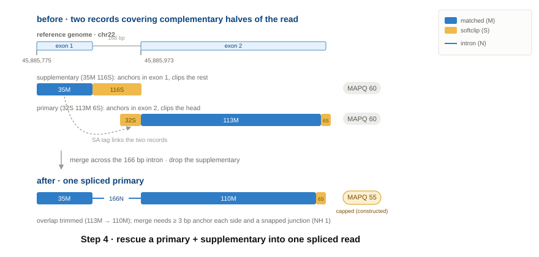

# TARS

**TARS** (Transcript Alignment for RNA Splicing) makes `bwa-mem2` splice-aware for RNA reads. TARS aligns the reads against the genome with the
transcriptome added using `bwa-mem2`, then rewrites the result back to genome coordinates. The output is an ordinary genomic RNA
BAM (no transcript contigs, spliced reads carried as `N` gaps) ready for REDUX and ISOFOX.

## Contents

* [What TARS does](#what-tars-does)
* [How to Run TARS](#how-to-run-tars)
* [What a read goes through](#what-a-read-goes-through)
    * [Step 0: Translate transcriptome alignments to reference genome](#step-0-translate-transcriptome-alignments-to-reference-genome)
    * [Step 1: Score short overhangs against the reference genome, collapse weak scoring ones](#step-1-score-short-overhangs-against-the-reference-genome-collapse-weak-scoring-ones)
    * [Step 2: Resolve supplementary records into splice junction candidates](#step-2-resolve-supplementary-records-into-splice-junction-candidates)
    * [Step 3: Decide which alignments to keep for a read](#step-3-decide-which-alignments-to-keep-for-a-read)

## What TARS does

A normal genome aligner like `bwa-mem2` matches a read against one continuous stretch of genome. It has no idea where
introns are, so a read that jumps over one gets cut short or placed in the wrong spot.

TARS fixes this without changing the aligner:

1. **`SpliceFastaBuilder`** (run once per Ensembl release) concatenates each multi-exon transcript's exon sequences into
   a transcript contig (`*_tx`, introns removed); these contigs are the transcriptome. It also writes a sidecar TSV
   mapping each contig's intervals back to their genomic exon spans.
2. Append the transcriptome to the genome FASTA and index with `bwa-mem2`.
3. Align the RNA reads with `bwa-mem2` as usual. A read that jumps an intron now has a continuous place to land.
4. **`TarsApplication`** lifts each read back to its real genome position, marks the skipped intron as a gap (`N`), fixes
   things up (tags, mate info, confidence), and writes a sorted, indexed BAM.
5. Feed the new splice-aware records BAM file into REDUX (dedup), then ISOFOX.


## How to Run TARS

### Build the transcript reference (SpliceFastaBuilder)

```
java -cp tars.jar com.hartwig.hmftools.tars.fasta.SpliceFastaBuilder
    -ensembl_data_dir /ref_data/ensembl_data_cache/38/
    -ref_genome /path_to_fasta/genome.fasta
    -ref_genome_version V38
    -output_dir /path_to_output/
```

Two files are written:

* `ref_genome_v38_rna_contigs.fasta` - the transcript contigs.
* `ref_genome_v38_rna_contigs.rna_contigs_mappings.tsv` - the contig sidecar (intervals mapped back to genomic exon spans).

Concatenate the FASTA onto the genome FASTA and `bwa-mem2 index` the result before aligning.

### Run TARS (TarsApplication)

```
java -jar tars.jar
    -sample COLO829T
    -input_bam COLO829T.bwa_tx.namegrouped.bam
    -ref_genome /path_to_fasta/genome_plus_tx.fasta
    -ref_genome_version V38
    -contig_sidecar /path_to/ref_genome_v38_rna_contigs.rna_contigs_mappings.tsv
    -rna_unmap_regions /ref_data/rna/38/rna_excluded_regions.38.tsv
    -bamtool /path_to_samtools/
    -output_dir /path_to_output/
    -threads 24
```

### Output files

Every file is named `<sample>.tars.<...>`. Two are written by default:

* `<sample>.tars.bam` (+ `.bai`) - the lifted, coord-sorted genomic BAM, ready for REDUX.
* `<sample>.tars.summary.tsv` - a counts summary of what liftback did.

Optional:

* `-output_id chr1_slice` inserts the token into every name: `<sample>.tars.chr1_slice.bam`.
* `-write_liftback_tsv` writes per-record debug TSVs; off by default (~100GB; per-read detail the summary can't give).

### Flags

**Required**

| Flag               | Description                                                                  |
|--------------------|------------------------------------------------------------------------------|
| sample             | Sample ID. prefix to each output file (`<sample>.tars.*`)                  |
| input_bam          | bwa-mem2 output against the combined FASTA, **name-grouped** (not coord-sorted)|
| ref_genome         | The same combined genome + transcript FASTA used at alignment                 |
| ref_genome_version | `V37` or `V38`                                                                |
| contig_sidecar     | Contig sidecar TSV from `SpliceFastaBuilder` (`*.rna_contigs_mappings.tsv`)    |
| bamtool            | samtools path (used to decompress the input and sort + index output)          |
| output_dir         | Directory for the lifted BAM and summary file                                     |

**Optional**

| Flag               | Default | Description                                                              |
|--------------------|---------|--------------------------------------------------------------------------|
| output_id          | (none)  | id inserted into every output files |
| rna_unmap_regions  | (none)  | Curated excluded regions (rRNA / 7SL / multi-map zones) whose reads are unmapped in the lifted output using REDUX SAM conventions; see [rna_excluded_regions.38.tsv](https://source.cloud.google.com/hmf-pipeline-development/common-resources-public/+/master:rna/38/rna_excluded_regions.38.tsv) |
| write_liftback_tsv | off     | Per-record debug TSVs; off by default (creates a `~100GB` file)            |
| threads            | 1       | Worker threads; reads process in parallel per read-group |

**Tuning thresholds**

| Flag                            | Default   | Description                                                   |
|---------------------------------|-----------|---------------------------------------------------------------|
| supp_implied_min_intron_length  | 21        | Min implied intron length for a primary+supp merge            |
| supp_implied_max_intron_length  | 1000000   | Max implied intron length for a primary+supp merge            |

Note: no `ensembl_data_dir` - liftback reads exon/junction annotation from the sidecar (only `SpliceFastaBuilder` needs
ensembl).

### Upstream bwa-mem2 flags

Not tars config, but liftback depends on them.

| Setting | Default | What it is |
|---|---|---|
| `-T` | 19 | bwa-mem2 minimum alignment score to output; set below the default 30 to surface short-anchor supplementaries for supplementary resolve |
| `-h` | 75 | bwa-mem2 XA cap; maximum alternate loci listed per read before it is unmapped |

## What a read goes through

After bwa-mem2 alignment, a read that spans an exon boundary or has supplementaries around novel junctions is processed by
tars through these steps in order:

```
Step 0  Translate   lift every candidate (primary + XA alts) to genome coordinates
Step 1  Overhang    re-evaluate each overhang and collapse the weak scoring ones
Step 2  Merge       try each lifted primary/XA candidate with all lifted supplementaries
Step 3  Decide      choose which alignments to keep as the primary and its XA alternates
```

### Step 0: Translate transcriptome alignments to reference genome

Every read's transcriptome alignment is translated to genomic coordinates, with introns re-inserted as `N` gaps / splice junctions.


### Step 1: Score short overhangs against the reference genome, collapse weak scoring ones

A short overhang (`<= 12M`) next to a splice junction at a read end is re-scored using bwa-mem2 style scoring against the
reference genome. There are 3 cases:

**1a.** With a soft clip: keep the junction if the overhang scores > 5; otherwise drop the `N` junction and walk the soft
clip onto the reference genome, leaving a contiguous alignment.



**1b.** With >1 splice junctions: keep the junction if the short overhang aligns positively (AS > 0), otherwise collapse
it only when the intronic reference AS > short overhang AS.



**1c.** With no soft clip and a single junction: not checked, no intervention.

### Step 2: Resolve supplementary records into splice junction candidates

`bwa-mem2` is run with `-T 19`, allowing short-anchor supplementary alignments at junction sites (annotated or novel) to
be kept. TARS passes all lifted supplementaries to each primary/XA candidate so the resolver can build a splice chain.
A successful merge becomes another placement candidate for the discriminator; if it wins, every absorbed supplementary
record is dropped.

The merge requires:

- the candidate and supplementary are within reach and complementary to each other's soft clips
- the implied intron length is within [`supp_implied_min_intron_length`, `supp_implied_max_intron_length`]
- exactly one supplementary is within reach on that side, otherwise it is ambiguous and left unmerged

On a successful resolve, it's still ambiguous where the splice junction is. TARS attempts in this order:

1. an annotated boundary / known junction (Ensembl)
2. a canonical `GT-AG` splice motif, then semi-canonical
3. the mate's already-resolved junction
4. the midpoint of the ambiguous read range, rounded down
5. otherwise keep whatever was chosen

When several positions tie at the chosen tier, the pick is pseudo-random but seeded by the read, so an ambiguous
junction is distributed across its equal options yet stays reproducible run to run.

### Step 3: Decide which alignments to keep for a read

A read now has its own alignment plus any `XA` alternate alignments: each a genomic (ref) or translated transcriptome
(tx) alignment, plus any supplementary-supported merge candidates. TARS picks one as the primary, keeps only the relevant
`XA`, and sets its `MAPQ`. Every read lands in one of three buckets:

- **B1. Ref only:** the read aligns only to the genome (ref); TARS passes it through untouched. One exception: a
  `MAPQ 0` read with no `XA` is unmapped, since a missing `XA` under bwa's `-h` cap means too many placements to report.

- **B2. Transcriptome locus:** one or more transcript contigs of the same gene lift to a single genomic locus with the
  same CIGAR. TARS places the read back with `N` gaps / introns and, as a unique placement, sets `MAPQ` to 60.

- **B3. Multi-mapper:** the read has more than one candidate (ref, tx, or both, at one locus or several). TARS picks one
  alignment as the primary by the following rules, in order, and the rest still-eligible placements are added to the `XA`
  tag:
    - **score:** the highest recomputed genome-space `bwa-mem` score wins outright
    - **score tie:** candidates tied on the top score are settled, in order, by:
        - **supplementary support:** a primary+supplementary merge beats unsupported placements
        - **mate proximity:** a locus on the mate's chromosome within a transcript span of the mate wins
        - **junction over soft clip:** at one locus, a spliced placement (`N` junction) beats a soft-clipped placement,
          the read bwa clipped rather than cross the intron
        - **random read-name seed:** a reproducible pseudo-random pick when neither of the above separates the tie

The merged primary's MAPQ is `max(primary, supplementary)`, bumped to 60 when the primary + supplementary pair maps to a
single locus (no competing alternative alignment).

Whenever TARS decides to unmap an alignment, it uses the same SAM field and tag transformation as REDUX, including the
original-coordinate `UM` tag and REDUX's paired-read coordinate handling.


