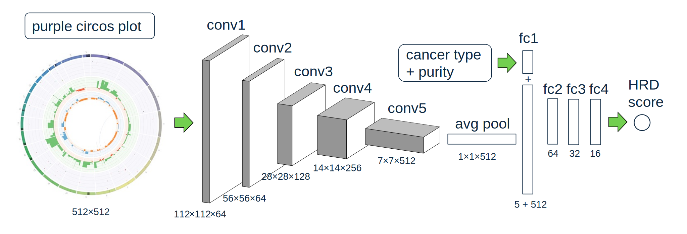

# vCHORD

vCHORD calculates homologous repair deficiency(HRD) score for panel samples. For WGS samples, please use 
instead. vCHORD employs a convolutional neural network model to predict HRD from  plots.

## Installation

To install, download the latest compiled jar file from the [download links](#version-history-and-download-links).
vCHORD requires Java 17+ to be installed.

## Usage

Arguments:

| Argument   | Description                                                                                |
|------------|--------------------------------------------------------------------------------------------|
| sample     | Name of the reference sample                                                               |
| output_dir | Path to the output directory. This directory will be created if it does not already exist. |
| purple_dir | Path to PURPLE output. This should correspond to the output_dir used in PURPLE             |
| model      | Path to the TorchScript model.                                                             |

Example Usage:

```
java -Xmx1G -jar v-chord.jar \
   -sample COLO829T \
   -purple_dir /path/to/COLO829/purple \
   -model /path/to/model_scripted.pt \
   -output_dir /path/to/COLO829/vchord \
   -log_debug
```

## Output

### vCHORD prediction file (\<sample\>.vchord.prediction.tsv)
The vCHORD prediction file is a TSV file with the following columns:

| Column                | Description                                          |
|-----------------------|------------------------------------------------------|
| sampleId              | Name of the sample                                   |
| breastCancerHrdScore  | HRD score if tumor type is breast cancer             |
| ovarianCancerHrdScore | HRD score if tumor type is ovarian cancer            |
| pancreaticCancerScore | HRD score if tumor type is pancreatic cancer         |
| prostateCancerScore   | HRD score if tumor type is prostate cancer           |
| otherCancerScore      | HRD score if tumor type is not one of the four types |

## Algorithm

vCHORD uses convolutional neural network. model is modified from resnet18[1]. We add dropout layers after each relu layer, and concat cancer type and purity as linear input
to the first fully connected layer. The model schematic is shown below:



### Model inputs
There are 3 inputs to vCHORD, they are
* Purple CIRCOS plot. See [purple CIRCOS](../purple/README.md#CIRCOS).
* Cancer type, one of [ breast, ovarian, pancreatic, prostate and other ].
* Purity of the sample.

### Model training

Command to train model:

```
python vchord_train.py \
   --sample_tsv=../sample_list.tsv \
   --purple_root=purple_output \
   --hrd_sample_duplication 7 \
   --epoch=400
```

It requires a sample tsv list with the following columns:

| Column               | Description                                          |
|----------------------|------------------------------------------------------|
| sampleId             | Name of the sample                                   |
| primaryTumorLocation | Primary tumor location                               |
| hrd                  | HRD score truth                                      |
| hrStatus             | HR_DEFICIENT or HR_PROFICIENT truth                  |

The `purple_root` input expects a directory that contains the purple output for each samples. It should have the following structure:

```markdown
purple_root
    ├── sample_id_1
    │   ├── sample_id_1.circos.png
    │   └── sample_id_1.purple.purity.tsv
    └── sample_id_2
        ├── sample_id_2.circos.png
        └── sample_id_2.purple.purity.tsv
```

The training script loads the purple circos plot and the purity from the purple_root directory.
After training, the script writes a file `model_scripted.pt`, that is the model that can be used for prediction.

### Training notes

* The model training does not work as well if the HRD and non HRD samples are not balanced. Use `hrd_sample_duplication` parameter
to ensure the HRD and non HRD sample numbers are similar.

## Version History and Download Links

## References
1. K. He, X. Zhang, S. Ren and J. Sun, "Deep Residual Learning for Image Recognition,"
  2016 IEEE Conference on Computer Vision and Pattern Recognition (CVPR), Las Vegas, NV, USA, 2016, pp. 770-778, doi: 10.1109/CVPR.2016.90.
